# 第一章：让玩家诞生


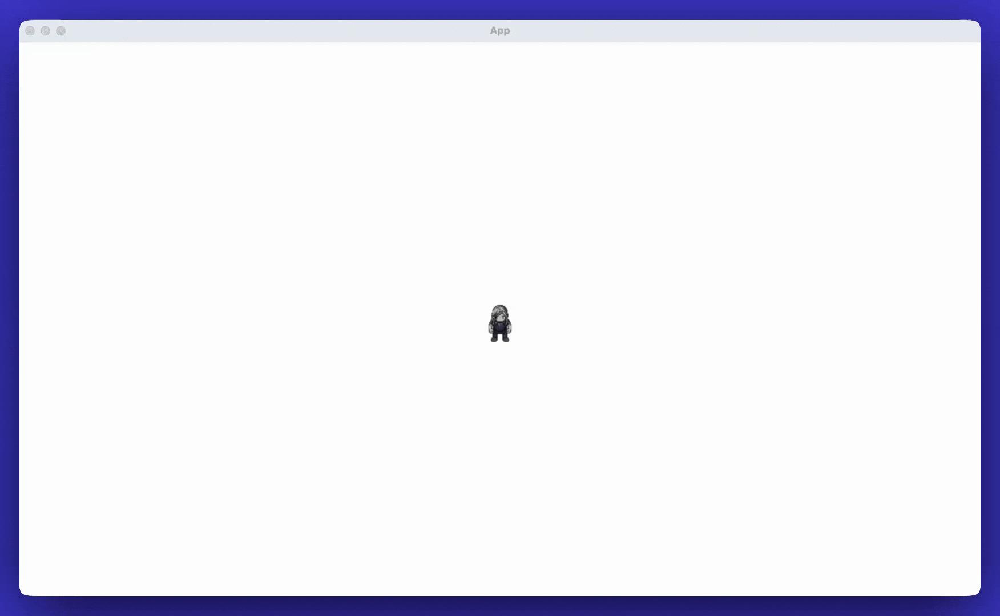

2025年9月16日

**关于 AI 辅助**
*是的，本章的写作过程中使用了 AI 辅助。我负责结构设计、技术决策、代码组织方式，并整理了一份学习者可能会遇到的问题列表。AI 帮助扩展了结构和解释，我全程进行了编辑。总的来说，每章我花了大约 20–25 小时进行编码和写作。如果任何部分有不当之处，请通过 [Reddit](https://www.reddit.com/r/bevy/) 或 [Discord](https://discord.com/invite/cD9qEsSjUH) 告诉我，我会进行修改。*

这是我写的 Rust-Bevy 教程系列《The Impatient Programmer's Guide to Bevy and Rust: Build a 2D Game from Scratch》的第一章。我将在这个系列中深入讲解 Bevy 和游戏开发，还会涉及由 AI 驱动的 NPC。[加入我们的社区](https://discord.com/invite/cD9qEsSjUH) 以获取本系列最新发布的通知。本章的源代码可在[此处获取](https://github.com/jamesfebin/ImpatientProgrammerBevyRust)。

以下是你在本教程结束时将能够实现的效果。

---

## 环境配置说明

如果你还没有安装 Rust，请按照[官方指南](https://www.rust-lang.org/tools/install)进行安装。

1.  创建一个新项目：

    ```
    cargo new bevy_game
    cd bevy_game
    ```

2.  打开 `Cargo.toml` 并添加 Bevy：

    ```
    [dependencies]
    bevy = "0.18"
    ```

我假设你已经具备任何一种编程语言（如 JavaScript 或 Python）的编程经验。

---

## 用系统思维思考

要构建一个允许玩家通过键盘输入移动的简单游戏，我们需要什么？

-   **世界系统**：创建一个玩家可以移动的游戏世界。
-   **输入系统**：监听键盘输入并将其转换为玩家移动。

我们在构建游戏时经常看到上述模式——即**创建/设置**的模式，以及**监听游戏状态变化并更新游戏世界实体**的模式。

-   **设置（Setup）**：生成具有不同行为的敌人，加载敌人精灵和动画，配置敌人生命值和伤害值。
-   **更新（Update）**：使敌人向玩家移动，检测敌人是否被子弹击中，移除已死亡的敌人并定时生成新敌人。

在 Bevy 的核心，我们拥有这种简单的**设置与更新系统**。这一基础模式正是 Bevy 既强大又易于理解的原因——一旦掌握了这个概念，用 Bevy 构建就会变得容易得多。


### 设置系统

想象一个名为 `setup` 的函数，它接受"commands"（命令）作为参数，并赋予你创建或生成任何你想要的东西的能力。Bevy 恰恰提供了这种能力。

```
// 伪代码，无法编译
fn setup(mut commands: Commands) {
	// 创建任何你想要的东西
	commands.spawn()
}
```

**什么是 `mut`？**

`mut` 是 mutate（可变）的缩写。在 Rust 中，我们需要显式声明打算改变某个值。默认情况下，Rust 将声明的值视为只读。`mut` 告诉 Rust 我们计划改变这个值。Rust 利用这一信息来防止一整类错误。

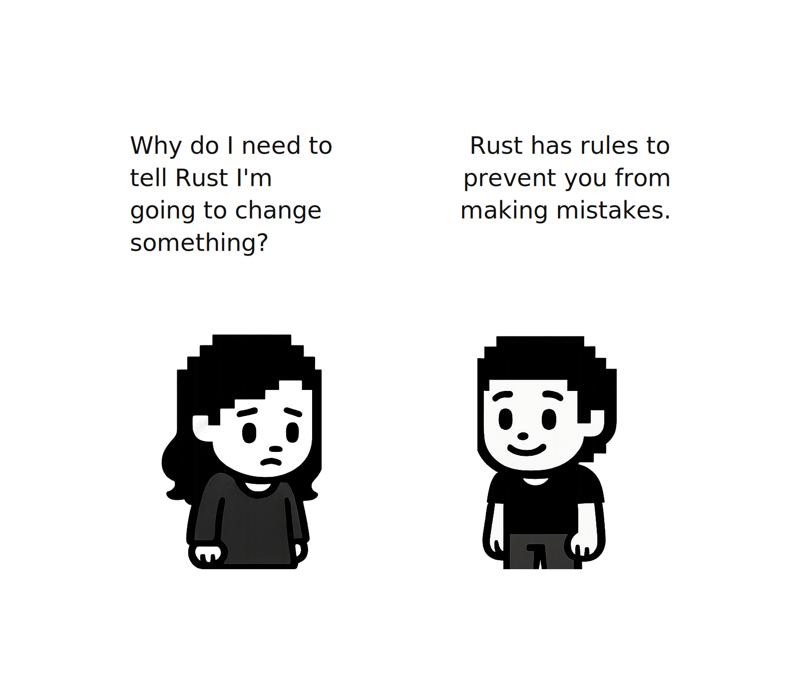

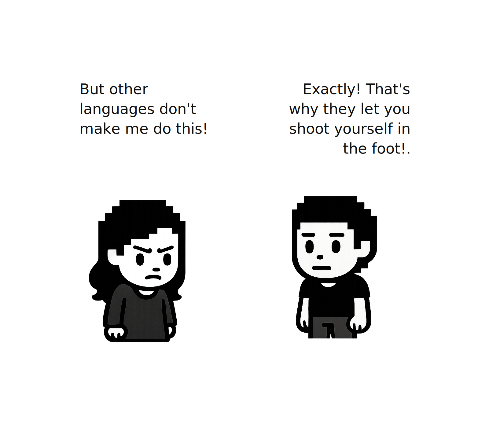

**那么这个 `mut commands: Commands` 又是什么？**

它来自 Bevy 库，允许你向游戏世界添加内容。Rust 喜欢显式类型，因此 `:Commands` 让编译器知道这个参数是 Bevy 的命令接口。如果跳过类型提示，Rust 就无法确定传入的是什么，从而阻止构建。

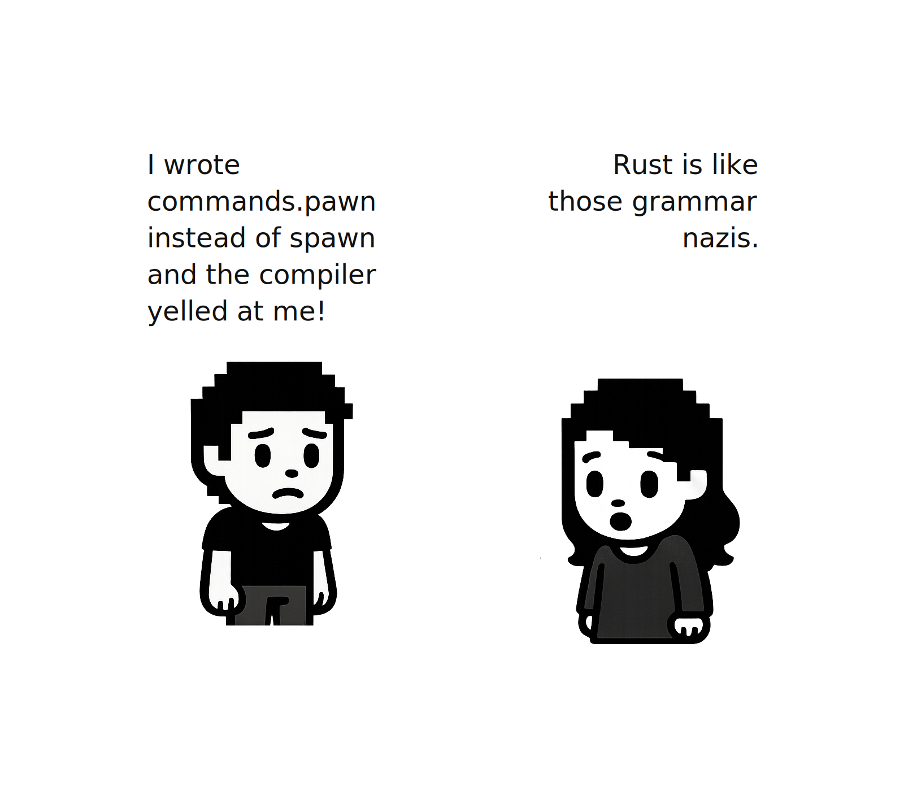

**什么是类型？**

类型告诉 Rust 你在处理什么类型的值——数字、文本、定时器、Bevy 命令等等。一旦编译器知道了类型，它就可以检查你对它执行的每个操作是否合理。

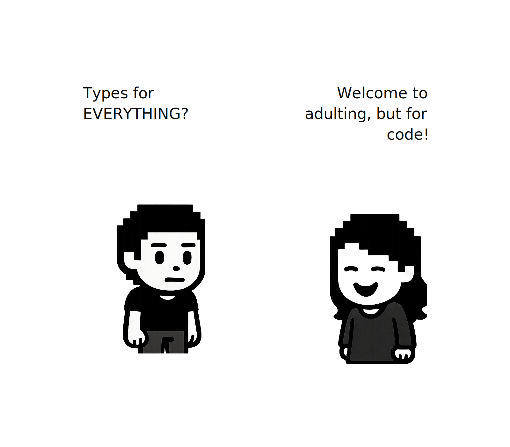

**这不也增加了工作量吗？**

它实际上可以防止错误并帮助你提升性能。例如，如果你试图将字符串与数字相加，编译器会在游戏运行之前阻止你。此外，知道了确切的类型，Rust 可以紧凑地打包数据。

一个 `Vec2` 只是两个数字，所以 Rust 恰好存储两个数字，没有多余的额外空间——当你有成千上万个游戏实体时，这有助于保持高效。这些特性让你的游戏内存效率更高。

当你在 JavaScript 或 Python 中创建一个 Vec2 对象时，你存储的不仅仅是两个数字。运行时还会添加类型元数据、属性信息和原型引用——将你简单的 8 字节数据结构变成了大约 48 字节的内存占用。

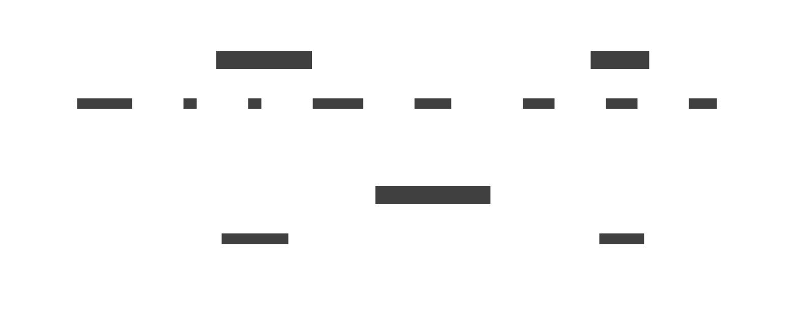

Rust 的类型系统在编译时工作。当你声明一个包含两个 `f32` 字段的 `Vec2` 结构体时，存储的就是这两个字段——恰好 8 字节，没有额外元数据。编译器已经知道了类型，因此不需要运行时类型信息。

对于 1000 个游戏实体，这种差异变得非常显著：

| 语言 | 内存使用 | 额外开销 |
|------|----------|----------|
| Rust | 8KB | 无 |
| 动态语言 | ~48KB+ | 6 倍开销 |

这不仅仅是内存使用的问题——更是性能问题。更小、可预测的内存布局意味着更好的 CPU 缓存利用率，这直接转化为更快的帧率，尤其是在每帧处理数千个实体的游戏中。编译器在游戏运行前就能捕获类型错误，而紧凑的内存打包则能让游戏保持高速运行。

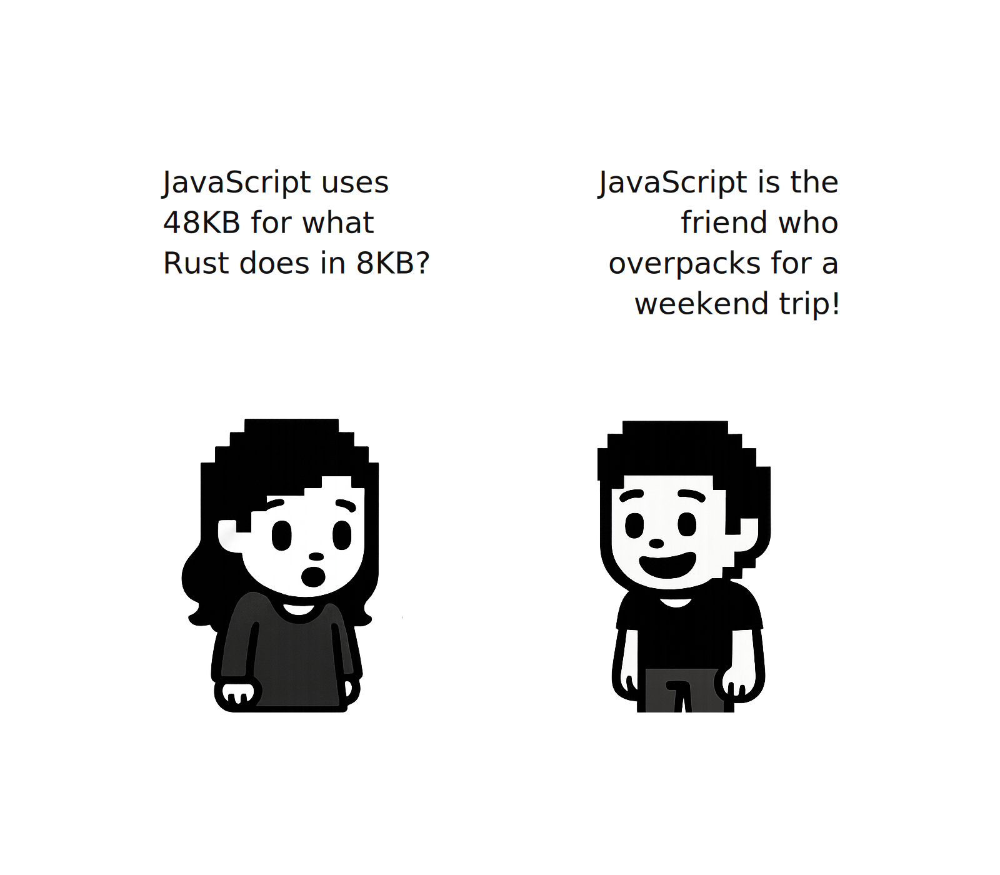

### 设置摄像机

**我们应该先设置什么？**

我们需要一个摄像机，因为没有摄像机，屏幕上什么都不会显示。世界可以在数据中存在，但由摄像机决定实际绘制什么。

```
// 伪代码，暂时不要使用
fn setup(mut commands: Commands) {
	commands.spawn(Camera2d)
}
```

**什么是 `Camera2d`？**

`Camera2d` 是 Bevy 内置的 2D 摄像机 Bundle。生成它，你就得到了一个可直接使用的 2D 场景视图。

**什么是 Bundle？**

Bundle 就是一组你经常一起生成的组件。例如，Bevy 自带一个 `SpriteBundle`，其中包含位置、纹理、颜色色调和可见性；生成该 Bundle 一次调用就能得到一个精灵实体。

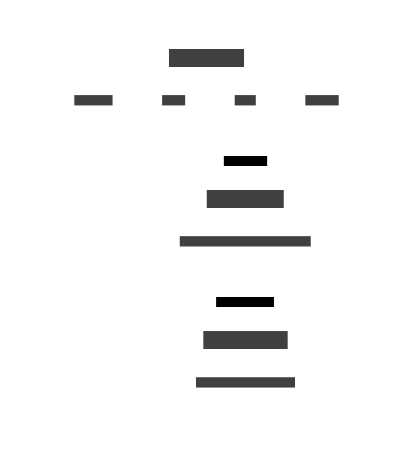

### 注册设置函数

我们需要将我们的 setup 函数注册到 Bevy 中，使其在启动（Startup）时被触发。

用以下代码更新你的 `src/main.rs`：

```
// 将你的 main.rs 替换为以下代码。
use bevy::prelude::*;

fn main() {
	App::new()
	.add_plugins(DefaultPlugins)
	.add_systems(Startup, setup)
	.run();
}

fn setup(mut commands: Commands) {
	commands.spawn(Camera2d);
}
```

**什么是 `bevy::prelude`？**

`bevy::prelude` 就像一个入门工具包，包含了你在构建游戏时经常用到的东西——`App`、`Commands`、组件、数学辅助工具等。

**什么是 `App::new()...`？**

`App::new()` 创建游戏应用程序，`add_plugins(DefaultPlugins)` 加载渲染、输入、音频和其他系统，`add_systems(Startup, setup)` 注册我们的启动函数，`run()` 将控制权交给 Bevy 的主循环。

**为什么要注册一个启动函数？它的作用是什么？**

启动系统（Startup systems）在第一帧之前运行一次。我们用它们来设置摄像机、玩家以及其他应该在窗口打开时立即存在的事物。

**什么是 Bevy 的主循环？**

启动之后，Bevy 进入主循环：它轮询输入、运行你的系统、更新世界并渲染一帧。这个循环会一直重复直到你退出游戏。

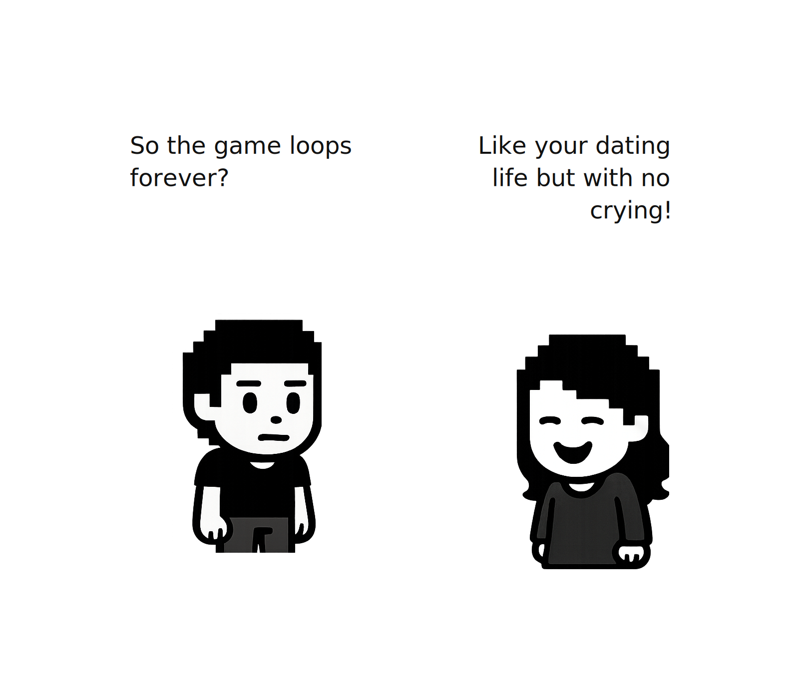

让我们运行它：

```
cargo run
```

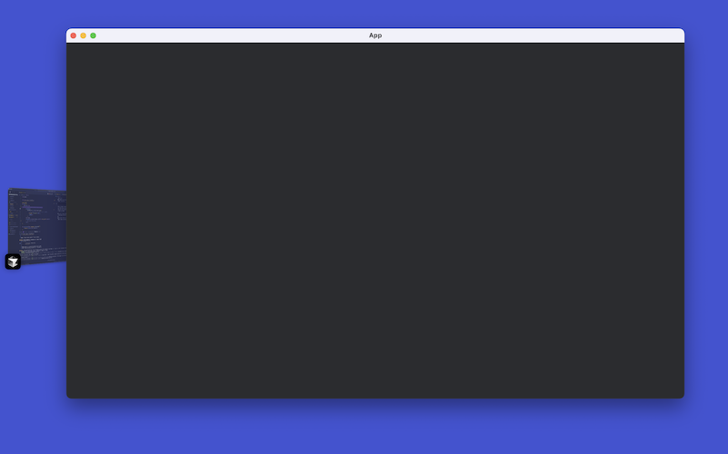

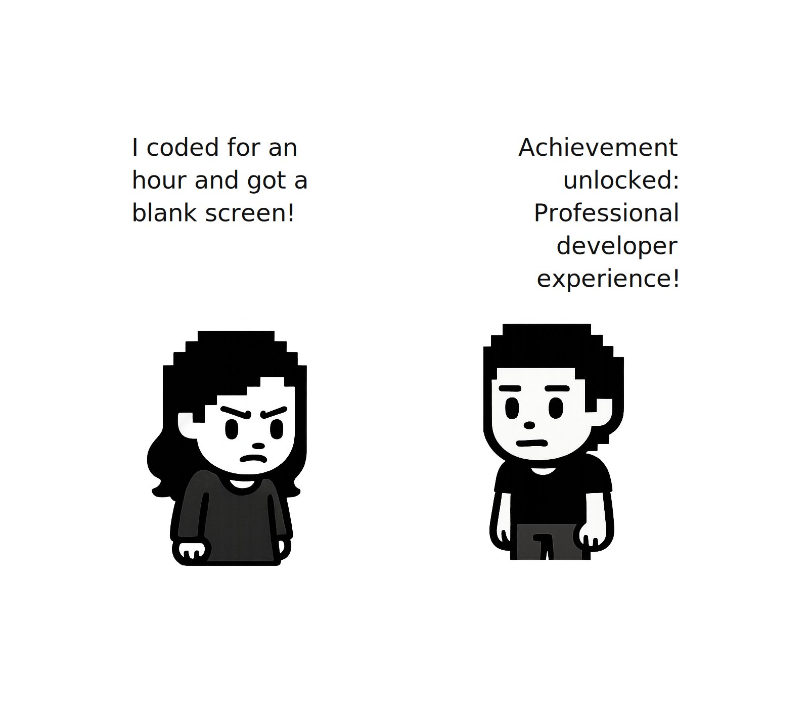

一个空白屏幕？是的，我们只设置了摄像机，现在让我们来添加玩家。

---

## 设置玩家

现在让我们来创建我们的玩家！还记得我们之前提到的**设置系统**和**更新系统**吗？在 Bevy 中，一切都是**实体（Entity）**，上面附着着**组件（Component）**，系统可以对它们进行操作。

可以把实体想象成一个唯一的 ID（就像身份证号码），而组件则是附着在它上面的数据。对于我们的玩家，我们需要诸如移动速度、生命值或特殊能力之类的组件。在 Rust 中，创建这些组件的完美方式是使用**结构体（struct）**。

`struct` 是 Rust 的核心构建块之一。它将相似的数据组合在一起。这里我们声明一个空的 `Player` 结构体，这样类型本身就可以作为一个标签（tag）附着到玩家实体上。以后我们可以添加玩家生命值等内容。

```
// 将此代码放在 main.rs 的 main 函数之前
#[derive(Component)]
struct Player;
```

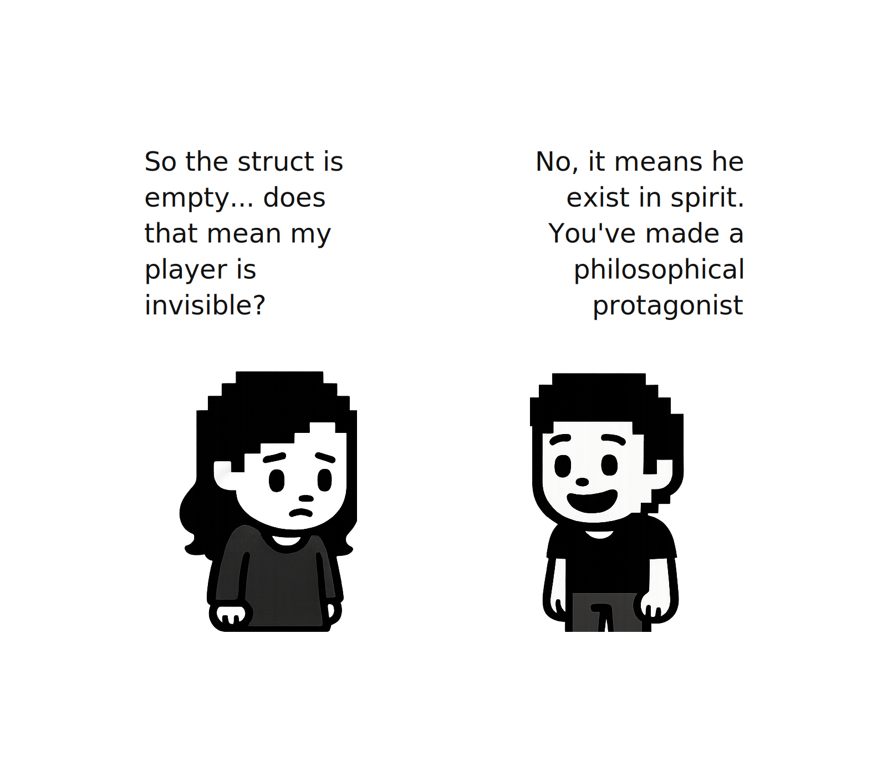

**为什么用标签？**

标签用于标记一个实体，以便后续查找。因为 `Player` 只附着在我们的英雄角色上，系统可以请求 Bevy"给我带有 Player 标签的实体"，然后只对该实体进行操作。

**这个 `#[derive(Component)]` 是什么？**

`derive` 告诉 Rust 将 Component 宏代码附加到该结构体上。宏是 Rust 为你生成预定义模板代码的方式。`#[derive(Component)]` 自动注入 Bevy 所需的样板代码，使其能够存储和查找 `Player` 实体，省去了我们在各处重复编写相同胶水代码的麻烦。我们将在本系列后面更详细地了解宏。这一刻，我们的玩家类型变成了一个组件。

**什么是组件，为什么玩家应该是一个组件？**

组件是附着在实体上的一块数据。位置、速度、生命值，甚至"这是玩家"这样的概念，都存在于组件中。通过将 `Player` 设为组件，我们可以稍后查询该实体，添加更多组件（如生命值或背包），并让 Bevy 的系统精确挑选出它们需要更新的实体。

目前，我们将使用 "@" 符号在屏幕上表示我们的角色。修改 setup 函数：

```
// 将 main.rs 中现有的 setup 函数替换为以下代码
fn setup(mut commands: Commands) {
    commands.spawn(Camera2d);	
    
    // 代码更新提示
    // 将以下行附加到你的 setup 函数中
    commands.spawn((
        Text2d::new("@"),
        TextFont {
            font_size: 12.0,	
            font: default(),
            ..default()
        },
        TextColor(Color::WHITE),
        Transform::from_translation(Vec3::ZERO),
        Player,
    ));
}
```

`commands.spawn(( ... ))` 接收这个元组并将其视为一组组件的 Bundle。这一个调用就添加了我们想要显示的文本、字体设置、颜色、位置以及标识该实体的 `Player` 标签。

**什么是元组（tuple）？**

元组是用圆括号括起来的有序值列表。Rust 会跟踪每个位置，因此 `(Text2d::new("@"), TextColor(Color::WHITE))` 并排放置两个值，而无需创建一个结构体。

**什么是实体？**

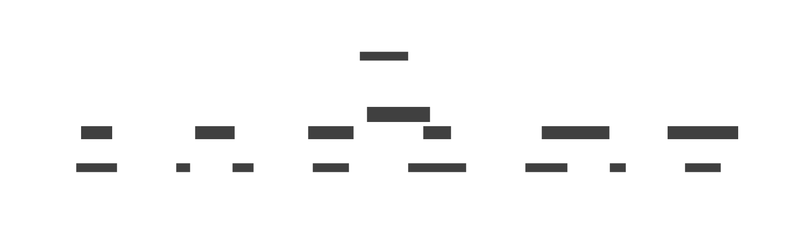

实体是 Bevy 用来将组件联系在一起的唯一 ID。它本身不包含数据，但一旦你向它附加了组件，这个 ID 就代表了游戏世界中的某个东西。

每个 Bundle 产生一个新的实体，带有唯一的 ID 和列出的组件，你可以这样想象：

| 实体 | 携带的组件 |
|------|------------|
| #42 | `Camera2d` |
| #43 | `Text2d("@")`、`TextFont`、`TextColor`、`Transform`、`Player` |

一旦命令队列被刷新，这些实体就存在于世界中，等待系统通过它们携带的标签（组件）来发现它们。我们稍后将利用这一点来实现移动、动画、攻击敌人等操作。

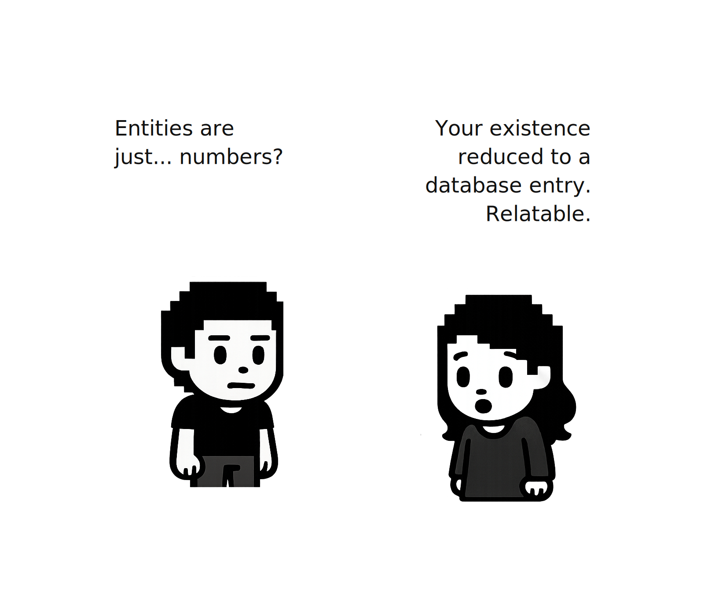

### 实现玩家移动

现在让我们为玩家移动创建一个**更新系统**！思考一下移动玩家需要什么：

1.  **键盘输入**——要知道按下了哪些键
2.  **时间**——使移动平滑，不受帧率影响
3.  **玩家位置**——实际移动玩家

在其他游戏引擎中，你需要花时间手动将这些系统连接起来。但这就是 Bevy 的神奇之处——你只需在函数参数中声明你需要什么，Bevy 就会自动提供！

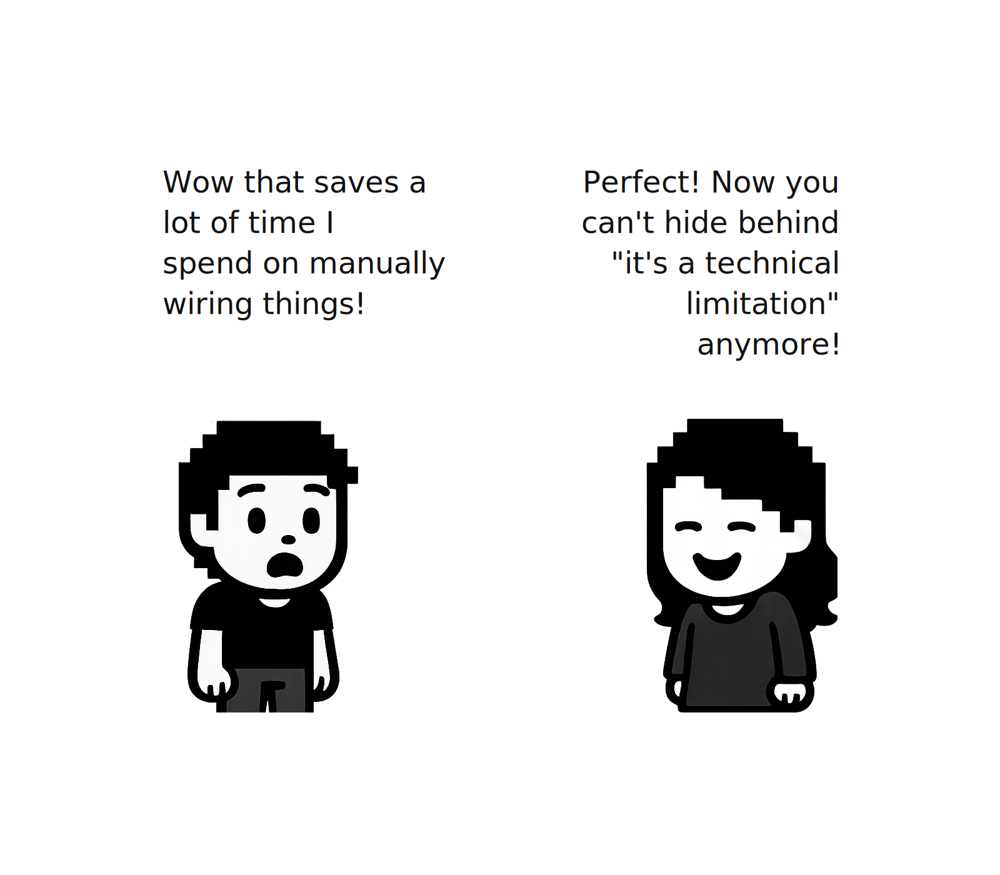

让我们编写移动玩家函数：

```
// 将此代码附加到 main.rs
fn move_player(
    // "Bevy，给我键盘输入"
    input: Res<ButtonInput<KeyCode>>,           
    // "Bevy，给我游戏计时器"
    time: Res<Time>,                            
    // "Bevy，给我玩家的位置"
    mut player_transform: Single<&mut Transform, With<Player>>, 
) {
    let mut direction = Vec2::ZERO;
    if input.pressed(KeyCode::ArrowLeft) {
        direction.x -= 1.0;
    }
    if input.pressed(KeyCode::ArrowRight) {
        direction.x += 1.0;
    }
    if input.pressed(KeyCode::ArrowUp) {
        direction.y += 1.0;
    }
    if input.pressed(KeyCode::ArrowDown) {
        direction.y -= 1.0;
    }

    if direction != Vec2::ZERO {
        let speed = 300.0; // 像素/秒
        let delta = direction.normalize() * speed * time.delta_secs();
        player_transform.translation.x += delta.x;
        player_transform.translation.y += delta.y;
    }
}
```

**什么是 `Res`？**

`Res` 即资源（Resources），是游戏全局的信息片段，不依附于任何单个实体。例如，`Res<Time>` 提供了游戏的主时钟，这样每个系统都能读取到相同的"距上一帧的时间"值。

**解释一下 `Single<&mut Transform, With<Player>>`？**

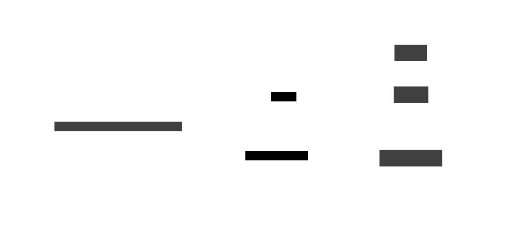

`Single<&mut Transform, With<Player>>` 要求 Bevy 提供恰好一个同时带有 `Transform` 组件和 `Player` 标签的实体。`&mut Transform` 部分表示我们打算修改这个变换（即玩家位置）（还记得我们在 setup 函数中添加了 transform 组件）。如果存在多个玩家，这个提取器会报错——这非常适合单人英雄游戏。

**什么是 `Vec2::ZERO`？**

`Vec2::ZERO` 是一个二维向量，两个值都设为零：`Vec2 { x: 0.0, y: 0.0 }`。我们在读取键盘输入之前用它作为起始方向。

**这个 `KeyCode::...` 模式是什么？**

`KeyCode::ArrowLeft`、`KeyCode::ArrowRight` 等是枚举（enum）值（我们将在后面介绍枚举），代表键盘上的特定按键。检查 `input.pressed(KeyCode::ArrowLeft)` 就是询问 Bevy 在当前帧中该键是否被按住。

我们忽略零方向，这样当没有按键按下时玩家保持静止。一旦有了输入，`normalize()` 将向量长度归一化为 1，这样对角线移动不会比直线移动更快。`speed` 表示每秒移动多少像素，`time.delta_secs()` 返回帧时间——即自上一帧以来的秒数——将它们相乘就得到了本次更新应该移动的距离。最后将位移增量加到玩家的 transform translation 上，从而在屏幕上移动精灵。

### 注册移动系统

```
// 更新 main 函数
fn main() {
    App::new()
        .add_plugins(DefaultPlugins)
        .add_systems(Startup, setup)
        .add_systems(Update, move_player) // 行更新提示
        .run();
}
```

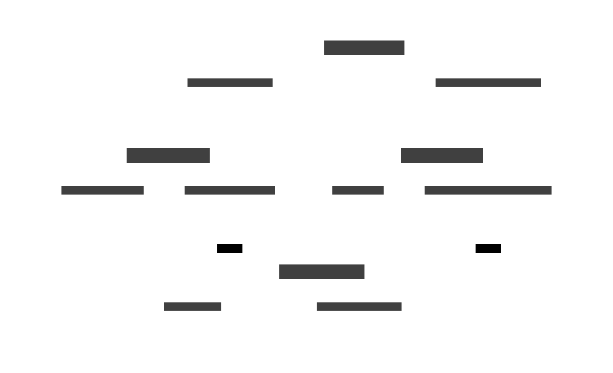

**为什么 `move_player` 被添加为 Update？Update 是什么？**

`move_player` 每帧运行，因此我们将其接入 `Update` 调度。`Update` 是 Bevy 内置的阶段，在启动完成后，每个游戏循环触发一次。

**所以 system 就是我们希望 Bevy 在特定时间执行的函数，比如初始设置时或每次游戏循环更新时？**

完全正确。系统（System）就是一个 Rust 函数，你把它交给 Bevy，并附上一张便条写着"在 Startup 时运行我"或"在每个 Update 时执行我"，引擎就会忠实地执行。

让我们运行它。

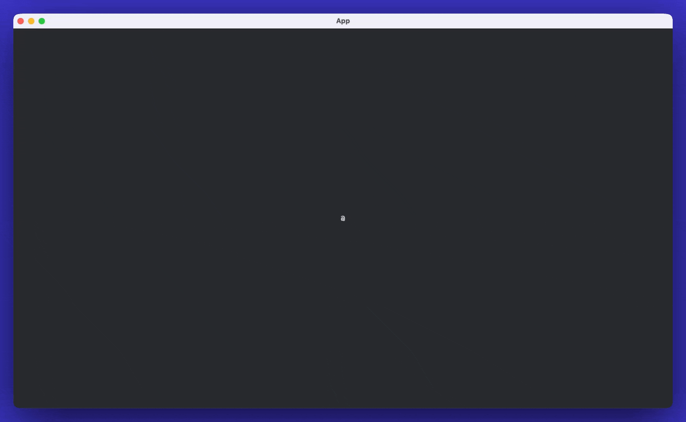

---

## 添加精灵图形

我们将使用 Universal LPC SpriteSheet Generator 来为我们的角色增添个性。你可以通过[此链接](https://liberatedpixelcup.github.io/Universal-LPC-Spritesheet-Character-Generator/#?body=Body_color_light&head=Human_male_light)混合搭配身体部位、衣物和颜色，并导出完整的精灵表。

对于这个项目，精灵表已包含在[仓库](https://github.com/jamesfebin/ImpatientProgrammerBevyRust)中。将提供的图像文件放入 `src/assets` 目录，这样 Bevy 在游戏运行时就能找到它们。你需要在 `src` 文件夹内创建 `assets` 目录。

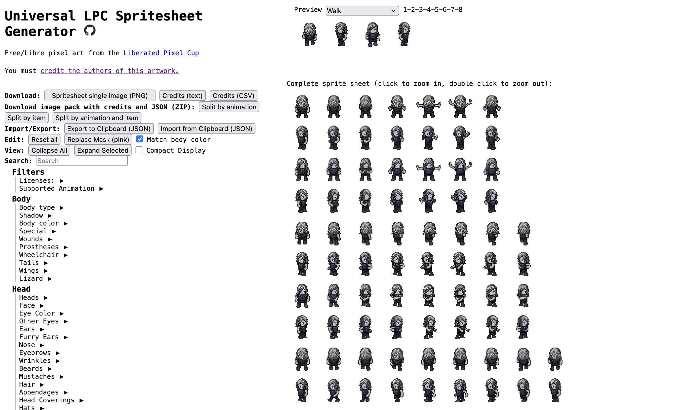

### 重构代码

我们需要添加更多代码，全部放在 main.rs 中会变得难以阅读和理解。

将你的 main.rs 文件更新为以下内容，同时创建另一个文件 `player.rs`。

`mod player;` 引入了 `player.rs` 模块，使我们的主文件保持精简。像这样拆分代码可以更容易地扩展项目，而不会让一个文件处理所有事情。

```
// main.rs
use bevy::prelude::*;

mod player;

fn main() {
    App::new()
        .insert_resource(ClearColor(Color::WHITE)) // 我们将背景色更新为白色
        .add_plugins(
            DefaultPlugins.set(AssetPlugin {
                // 本项目中的资源文件位于 `src/assets`
                file_path: "src/assets".into(),
                ..default()
            }),
        )
        .add_systems(Startup, setup_camera)
        .run();
}

fn setup_camera(mut commands: Commands) {
    commands.spawn(Camera2d);
}
```

`.insert_resource(ClearColor(Color::WHITE))` 将一个全局设置注入应用，使每一帧都以白色背景开始。

`AssetPlugin` 是 Bevy 用于加载纹理、音频和其他资源的加载器。我们修改了它的 `file_path`，使其查找 `src/assets` 目录，也就是我们精灵文件的存放位置。

### 构建玩家模块

现在我们已经有了基本的应用结构，是时候让我们的角色活起来了！我们将创建一个专门的 `player.rs` 模块来处理与玩家相关的所有事务。这使代码保持组织有序，也便于将来添加更多功能。

这个模块将包含所有使玩家移动、动画化以及与世界交互的常量、组件和系统。

在 `player.rs` 中添加以下代码：

```
// player.rs
use bevy::prelude::*;

// 图集常量
const TILE_SIZE: u32 = 64; // 64x64 的图块
const WALK_FRAMES: usize = 9; // 每行走行 9 列
const MOVE_SPEED: f32 = 140.0; // 像素/秒
const ANIM_DT: f32 = 0.1; // 每帧秒数（约 10 FPS）

#[derive(Component)]
struct Player; // 从 main.rs 移到这里
```

这些常量为我们重复用于精灵表和移动计算的数字赋予了有意义的名称：图块大小、每行帧数、行走速度以及动画推进速度。将 `Player` 标记移到这里，将所有玩家特定类型放在一个模块中。

### 定义玩家方向

```
// 将以下代码行附加到 player.rs
#[derive(Component, Debug, Clone, Copy, PartialEq, Eq)]
enum Facing {
    Up,
    Left,
    Down,
    Right,
}
```

**什么是枚举（enum）？**

枚举列出了一组允许的值。我们的角色只面向四个方向，因此 `Facing` 枚举将这些选项集中在一个地方。

**为什么不能在这里使用结构体？**

使用结构体需要一堆布尔值，比如 `facing_up: true`、`facing_left: false`，而且你还得保持它们同步。这很复杂。枚举保证了你只能选择其中一个方向。

**何时决定使用枚举还是结构体？**

当你需要多个字段时使用结构体，比如带有 `x` 和 `y` 的位置，或带有生命值和耐力的玩家属性。当你从一个列表中选择一个选项时使用枚举，比如玩家使用的工具（剑、弓、法杖）或当前激活的菜单界面。

**添加 Debug、Clone、Copy、PartialEq、Eq 这些宏的目的是什么？**

`Debug` 允许我们打印方向以进行日志记录，`Clone` 和 `Copy` 使复制该值变得简单，`PartialEq`/`Eq` 允许我们在比较方向时进行相等性检查。

**为什么不能通过简单的赋值来复制，为什么要添加这些宏？**

默认情况下，Rust 移动（move）值而不是复制（copy）它们，因此编译器要求你主动选择加入。派生 `Copy`（以及辅助的 `Clone`）表示"这个值复制成本很低，尽管复制吧"。`PartialEq` 和 `Eq` 允许我们直接比较两个方向，这正是我们检测玩家何时改变方向的方式。

**你说 Rust 移动值而不是复制，是什么意思？**

当你赋值大多数 Rust 值时，旧变量就不再拥有该值——或者说"失效"了。添加 `Copy` 后，两个变量都保持有效。

**为什么旧变量在赋值后会不再拥有该值或失效？**

Rust 强制要求每个值有且只有一个所有者，以便安全地释放内存。我们将在后续章节中详细讲解所有权规则和借用。

**这有点超出我的理解范围了！**

是的，不用担心，我们还有很多章节要学习，随着你逐步深入，我们会解决这个问题的。现在不理解这些概念也没关系。

### 动画系统组件

当我们有一个包含多帧的精灵表（比如我们的 9 帧行走动画）时，我们需要一种方法来控制这些帧的播放速度。没有时间控制，我们的角色要么冻结在一帧上，要么帧切换快得像一团模糊！

可以把它想象成一本翻页书——如果你翻页太慢，动画看起来很卡顿；如果你翻得太快，就看不清发生了什么。`AnimationTimer` 让我们能够精确控制这个时序，确保角色行走动画以恰到好处的速度平滑而自然地播放。

`AnimationTimer` 包装了 Bevy 的 `Timer`，这样每个玩家实体都知道何时前进到下一帧动画。每次滴答代表一个时间片；一旦计时器达到其间隔，我们就切换到精灵表中的下一个精灵。

```
// 将以下代码行附加到 player.rs
#[derive(Component, Deref, DerefMut)]
struct AnimationTimer(Timer);

#[derive(Component)]
struct AnimationState {
    facing: Facing,
    moving: bool,
    was_moving: bool,
}
```

**Deref 和 DerefMut 宏是做什么的？**

`Deref` 允许我们的包装器在读取时"假装"是内部的 `Timer`，`DerefMut` 在写入时同理。这意味着我们可以直接在 `AnimationTimer` 上调用 `timer.tick(time.delta())`，而无需先手动取出内部值。

**所以我们是在给 Timer 重命名为 AnimationTimer？**

我们是在包装 Timer，而不是重命名它。可以把 `AnimationTimer` 想象成一个小盒子，里面装着一个 `Timer`，外加一个标签写着"这个属于玩家动画"。当我们生成玩家时，我们创建一个新的 `Timer` 并把它放进那个盒子里，这样每个玩家都可以有自己的计时器——如果我们需要多个英雄的话。

**所以它是 AnimationTimer 的一个实例？**

是的，`AnimationTimer` 是一个元组结构体，包含一个 `Timer`。我们在生成玩家时构建一个，这样每个实体都可以携带自己的计时器数据。这种模式在你希望为现有类型附加额外含义，而又不想编写全新 API 时经常出现。

`AnimationState` 记录玩家面向的方向、是否正在移动，以及是否刚刚开始或停止移动。系统读取这些信息来选择动画行，并在移动状态改变时重置帧。

### 生成玩家

我们通过 `AssetServer` 加载精灵表，创建一个纹理图集布局（texture atlas layout）让 Bevy 知道网格结构，然后为面向下方的英雄选择起始帧。接着，我们生成一个带有精灵组件、原点位置变换、标记组件以及驱动动画的计时器的实体。

```
// 将以下代码行附加到 player.rs
fn spawn_player(
    mut commands: Commands,
    asset_server: Res<AssetServer>,
    mut atlas_layouts: ResMut<Assets<TextureAtlasLayout>>,
) {
    // 加载精灵表并构建网格布局：64x64 的图块，9 列，12 行
    let texture = asset_server.load("male_spritesheet.png");
    let layout = atlas_layouts.add(TextureAtlasLayout::from_grid(
        UVec2::splat(TILE_SIZE),
        WALK_FRAMES as u32, // 行走帧使用的列数
        12,                  // 至少 12 行可用
        None,
        None,
    ));

    // 初始面向下方（朝向玩家），使用该行的第一帧（空闲帧）
    let facing = Facing::Down;
    let start_index = atlas_index_for(facing, 0);

    commands.spawn((
        Sprite::from_atlas_image(
            texture,
            TextureAtlas {
                layout,
                index: start_index,
            },
        ),
        Transform::from_translation(Vec3::ZERO),
        Player,
        AnimationState { facing, moving: false, was_moving: false },
        AnimationTimer(Timer::from_seconds(ANIM_DT, TimerMode::Repeating)),
    ));
}
```

`AnimationState { facing, moving: false, was_moving: false }` 设置初始方向并标记角色当前处于空闲状态，且上一帧也是空闲状态。

`AnimationTimer(Timer::from_seconds(ANIM_DT, TimerMode::Repeating))` 创建一个重复运行的秒表，每 `ANIM_DT` 秒触发一次以推进精灵表。

**什么是 `AssetServer`？**

`AssetServer` 是 Bevy 的文件加载器和管理器，负责处理游戏资源（如图片、音频和 3D 模型）的加载和缓存。

当你调用 `asset_server.load("path/to/sprite.png")` 时，它并不会立即将文件加载到内存中。相反，它返回一个句柄（handle），你可以稍后使用它。这称为"惰性加载"——实际的文件加载在后台进行，Bevy 会在加载完成时通知你。

这种方法的效率体现在：

-   多个实体可以共享同一个精灵，而无需多次加载
-   资源只在真正需要时才被加载
-   Bevy 可以优化和批量加载资源以获得更好的性能
-   如果资源加载失败，不会导致整个游戏崩溃

在我们的例子中，`asset_server.load("sprites/player.png")` 请求精灵表并返回一个句柄以跟踪其加载状态。

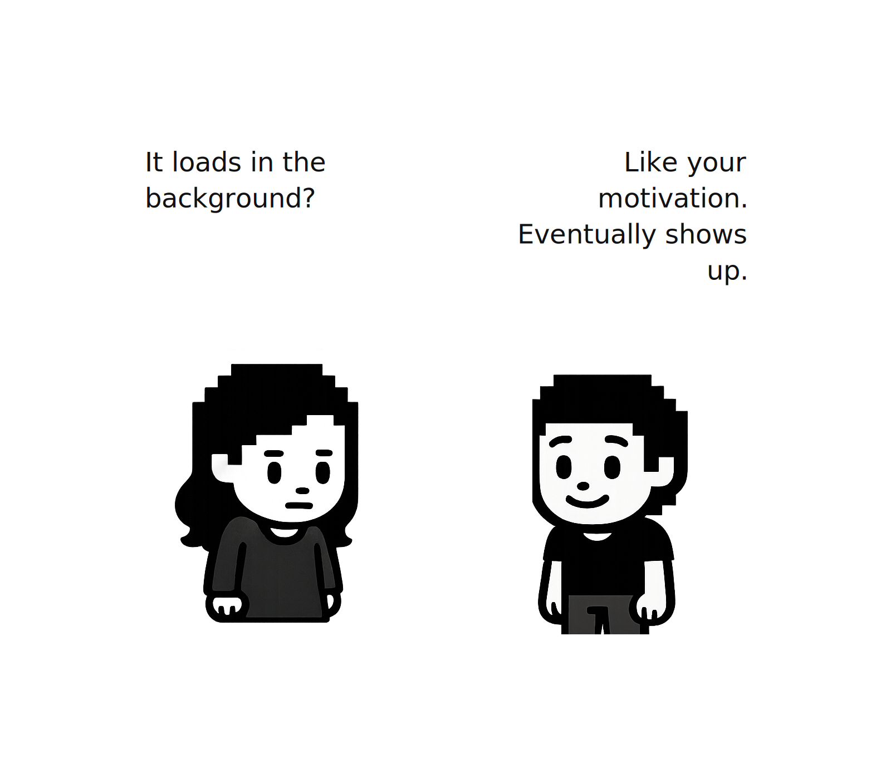

### 移动系统

现在我们的玩家已经生成了所有必要的组件，我们需要更新现有的移动系统，以跟踪玩家面向的方向。这对动画系统来说至关重要，因为它需要知道使用精灵表的哪一行——每个方向（上、下、左、右）对应精灵图集中的不同行。

这个更新后的系统将检测移动方向，并相应地更新 `AnimationState`，从而使我们的动画系统能够为每个方向的行走动画选择正确的精灵行。

```
// 将以下代码行附加到 player.rs
fn move_player(
    input: Res<ButtonInput<KeyCode>>,
    time: Res<Time>,
    mut player: Query<(&mut Transform, &mut AnimationState), With<Player>>,
) {
    let Ok((mut transform, mut anim)) = player.single_mut() else {
        return;
    };

    let mut direction = Vec2::ZERO;
    if input.pressed(KeyCode::ArrowLeft) {
        direction.x -= 1.0;
    }
    if input.pressed(KeyCode::ArrowRight) {
        direction.x += 1.0;
    }
    if input.pressed(KeyCode::ArrowUp) {
        direction.y += 1.0;
    }
    if input.pressed(KeyCode::ArrowDown) {
        direction.y -= 1.0;
    }

    if direction != Vec2::ZERO {
        let delta = direction.normalize() * MOVE_SPEED * time.delta_secs();
        transform.translation.x += delta.x;
        transform.translation.y += delta.y;
        anim.moving = true;

        // 根据主导方向更新面向
        if direction.x.abs() > direction.y.abs() {
            anim.facing = if direction.x > 0.0 { Facing::Right } else { Facing::Left };
        } else {
            anim.facing = if direction.y > 0.0 { Facing::Up } else { Facing::Down };
        }
    } else {
        anim.moving = false;
    }
}
```

这个查询要求 Bevy 提供带有 `Player` 标签的单个实体，并赋予我们对其 `Transform` 和 `AnimationState` 的可变访问。我们从按下的键构建方向向量，进行归一化以防止对角线移动更快，然后按速度 × 帧时间移动玩家。面向逻辑比较水平和垂直方向上的强度，以决定精灵应该面向哪个方向。我们记录玩家当前是否在移动，以便后续系统能够检测到移动何时开始或停止。

### 动画实现

现在所有部件都已就位——我们的玩家可以向不同方向移动，我们也在跟踪他们面向的方向。最后一块是实际更新精灵帧以产生行走动画的动画系统。

这个系统从我们的移动系统中获取方向信息，并使用动画计时器以正确的速度循环播放精灵帧。它处理了当玩家改变方向时在不同动画行之间切换的复杂逻辑，并确保行走和空闲状态之间的平滑过渡。

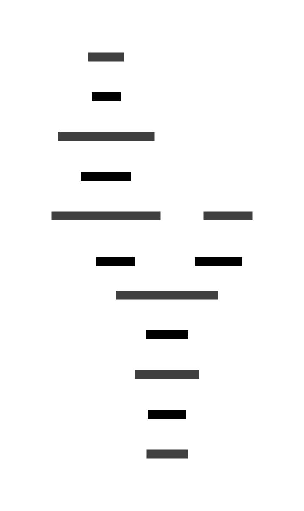

```
// 将以下代码行附加到 player.rs
fn animate_player(
    time: Res<Time>,
    mut query: Query<(&mut AnimationState, &mut AnimationTimer, &mut Sprite), With<Player>>,
) {
    let Ok((mut anim, mut timer, mut sprite)) = query.single_mut() else {
        return;
    };

    let atlas = match sprite.texture_atlas.as_mut() {
        Some(a) => a,
        None => return,
    };

    // 计算目标行和当前在图集中的位置（在 9 列行中的列/行位置）
    let target_row = row_zero_based(anim.facing);
    let mut current_col = atlas.index % WALK_FRAMES;
    let mut current_row = atlas.index / WALK_FRAMES;

    // 如果面向方向改变了（或者我们不在行走行上），跳转到目标行的第一帧
    if current_row != target_row {
        atlas.index = row_start_index(anim.facing);
        current_col = 0;
        current_row = target_row;
        timer.reset();
    }

    let just_started = anim.moving && !anim.was_moving;
    let just_stopped = !anim.moving && anim.was_moving;

    if anim.moving {
        if just_started {
            // 在按键或移动开始时，立即前进一帧以获得可见的反馈
            let row_start = row_start_index(anim.facing);
            let next_col = (current_col + 1) % WALK_FRAMES;
            atlas.index = row_start + next_col;
            // 重新启动计时器，使下一次前进使用完整的间隔
            timer.reset();
        } else {
            // 持续移动：根据计时器的节奏前进
            timer.tick(time.delta());
            if timer.just_finished() {
                let row_start = row_start_index(anim.facing);
                let next_col = (current_col + 1) % WALK_FRAMES;
                atlas.index = row_start + next_col;
            }
        }
    } else if just_stopped {
        // 不在移动：保持当前帧以避免跳跃。在切换到空闲时重置计时器。
        timer.reset();
    }

    // 更新先前的移动状态
    anim.was_moving = anim.moving;
}

// 返回给定面向行的起始图集索引
fn row_start_index(facing: Facing) -> usize {
    row_zero_based(facing) * WALK_FRAMES
}

fn atlas_index_for(facing: Facing, frame_in_row: usize) -> usize {
    row_start_index(facing) + frame_in_row.min(WALK_FRAMES - 1)
}

fn row_zero_based(facing: Facing) -> usize {
    match facing {
        Facing::Up => 8,
        Facing::Left => 9,
        Facing::Down => 10,
        Facing::Right => 11,
    }
}
```

`let Ok((mut anim, mut timer, mut sprite)) = query.single_mut() else { return; };` 同时检查结果并为我们需要的部分命名。如果查询成功，代码绑定 `anim`、`timer` 和 `sprite`，以便我们稍后使用。如果失败（没有玩家，或不止一个玩家），我们进入 `else` 分支并立即退出。Rust 使用 `Result` 类型来实现这一点：`Ok` 表示"查询恰好返回一个结果"，`Err` 表示"查询的某些条件不匹配"。

之后，我们在 `Option` 上进行 `match` 匹配，这是 Rust"可能有一个值"的类型。`Some(atlas)` 表示纹理图集存在，我们可以修改它；`None` 表示它尚未加载，因此我们跳过并让下一帧重试。这与检查映射或缓存时使用的模式相同：仅在查找返回内容时才使用该值。

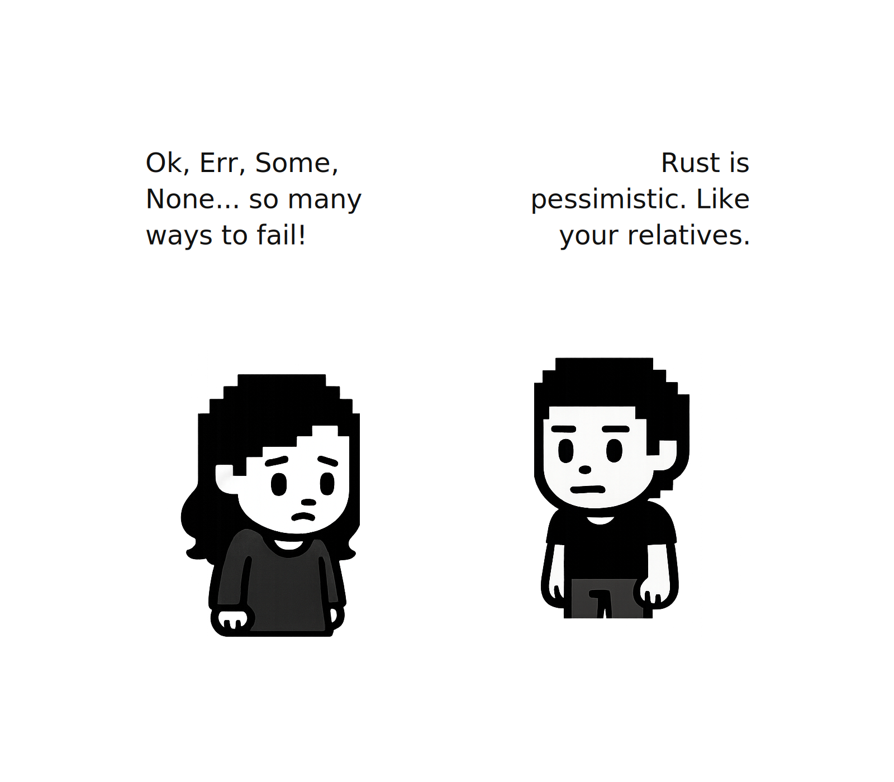

`animate_player` 获取玩家的动画状态、计时器和精灵句柄。它确定图集中与当前面向匹配的行，在方向改变时跳转到该行，并使用计时器以稳定的速度逐列前进。当移动停止时，我们重置计时器，使动画停留在最后显示的那一帧上。辅助函数将面向映射到正确的行和帧索引，使数学运算保持可读性。

### 创建玩家插件

```
// 将以下代码行附加到 player.rs
pub struct PlayerPlugin;

impl Plugin for PlayerPlugin {
    fn build(&self, app: &mut App) {
        app.add_systems(Startup, spawn_player)
            .add_systems(Update, (move_player, animate_player));
    }
}
```

`PlayerPlugin` 是以插件形式呈现的"玩家模块"。在 Bevy 中，插件只是一个知道如何注册系统、资源和资产的结构体。通过为 `PlayerPlugin` 实现 `Plugin` trait，我们为 Bevy 提供了一份清单：当这个插件被添加到应用中时，执行内部代码来设置玩家功能所需的一切。这使 `main.rs` 不会变成玩家特定调用的一团乱麻。

`build` 方法就是这张清单。Bevy 将一个可变的 `App` 引用传给我们，我们挂载上关心的系统。`spawn_player` 被安排在 `Startup` 中，这样精灵在游戏启动时立即出现。`move_player` 和 `animate_player` 被放入 `Update` 调度，这样它们每帧执行——以同步方式处理输入和动画。通过在这里声明所有内容，将 `PlayerPlugin` 放入 `App::new()` 会自动连接整个玩家流程。

**所以这个 build 函数是一个内建的结构，我必须按此编写？**

是的。`Plugin` trait 规定"任何插件必须提供一个 `build(&self, app: &mut App)` 函数"。我们实现了这个 trait，因此 Rust 期望我们提供函数体。Bevy 在加载插件时会调用这个方法，这就是为什么我们在其中添加所有系统。

**什么是 trait？**

trait 是一个契约，描述了一个类型必须提供哪些方法。Bevy 的 `Plugin` trait 说"给我一个 `build` 函数，以便我注册你的系统"。通过为 `PlayerPlugin` 实现该 trait，我们接入了 Bevy 的启动过程并注入了自己的设置代码。trait 让不同的类型可以共享行为——`PlayerPlugin` 的行为就像任何其他 Bevy 插件一样，但它安装的是我们玩家专属的系统。

### 最终集成

```
// 更新 main.rs 中的 main 函数

use crate::player::PlayerPlugin;

fn main() {
    App::new()
        .insert_resource(ClearColor(Color::WHITE))
        .add_plugins(
            DefaultPlugins.set(AssetPlugin {
                file_path: "src/assets".into(),
                ..default()
            }),
        )
        .add_systems(Startup, setup_camera)
        .add_plugins(PlayerPlugin) // 更新此行
        .run();
}
```

让我们运行它。

```
cargo run
```


---
---

## 📂 查看本章源码

完整源代码可在 GitHub 查看：
[https://github.com/jamesfebin/ImpatientProgrammerBevyRust/tree/main/chapter1](https://github.com/jamesfebin/ImpatientProgrammerBevyRust/tree/main/chapter1)
