# 第二章：让世界诞生


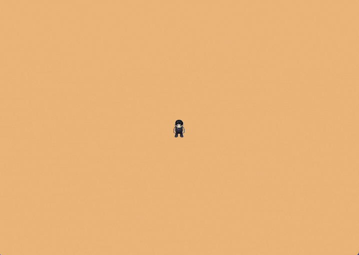

Oct 11, 2025

**关于 AI 辅助**  
*是的，本章写作过程中使用了 AI 辅助。我负责结构设计、技术决策、方法选择、代码组织方式，并整理了一份学习者可能会提出的问题列表。AI 帮助扩展了结构和解释内容，并由我进行了全程编辑。总的来说，我在每一章上花费了大约 20-25 小时，包括编码和写作。如果任何部分有不妥之处，请在 [Reddit](https://www.reddit.com/r/bevy/) 或 [Discord](https://discord.com/invite/cD9qEsSjUH) 上告诉我，我会进行改进。*

通过本教程，你将构建一个程序化生成的游戏世界，包含分层地形、水域和道具。

> **前置条件**：这是我们的 Bevy 教程系列的第 2 章。在开始之前，请先完成[第 1 章：让玩家存在](https://aibodh.com/posts/bevy-rust-game-development-chapter-1/)，或者从[此仓库](https://github.com/jamesfebin/ImpatientProgrammerBevyRust)克隆第 1 章的代码。

**在开始之前：** *我一直在不断改进本教程，让你的学习之旅更加愉快。你的反馈很重要——请通过 [Reddit](https://www.reddit.com/r/bevy/comments/1o3y2hr/the_impatient_programmers_guide_to_bevy_and_rust/)/[Discord](https://discord.com/invite/cD9qEsSjUH)/[LinkedIn](https://www.linkedin.com/posts/febinjohnjames_chapter-2-let-there-be-a-world-continuing-activity-7382797407824039936-WXFD) 分享你的困惑、问题或建议。喜欢吗？请告诉我哪些部分对你有帮助！让我们一起让 Rust 和 Bevy 的游戏开发对每个人都更加友好。*

## 过程生成（Procedural Generation）

我尊重那些手工制作瓦片来构建游戏世界的艺术家们。但我属于急躁/懒惰的那一类人。

经过一番探索，我遇到了过程生成。

我完全没想到其中的复杂性。我差点就要放弃了，但因为前一章读者们的评论和留言，我坚持了下来。三天前，顿悟降临了，所有的碎片都拼凑在了一起。

基本上，这就像自动拼图一样。为了解决这个问题，让我们再次用系统思维来思考。

**我们需要什么来程序化生成游戏世界？**

1.  瓦片集（Tileset）。
2.  瓦片的插槽（Sockets），因为只有兼容的瓦片才能拼接在一起。
3.  兼容性规则。
4.  使用这些组件来生成连贯世界的魔法算法。

**这个魔法算法是如何工作的？**

这个"魔法算法"有一个名字：波函数坍缩（Wave Function Collapse，WFC）。理解它的最简单方式是用一个小型的数独游戏。思路相同：选择有效选项最少的格子，填入一个值，更新相邻格子，然后重复。如果某个选择导致死胡同，就撤销这次猜测并尝试下一个选项。

**小型 4×4 数独**

让我们一步步来解决，始终关注约束最多的格子。

**初始谜题：** 我们需要按照数独规则填入空单元格（用点标记）。

```
?  .  2  .
.  3  .  .
.  .  .  1
4  .  .  .
```

**第 1 步 — 找到约束最多的格子：**  
让我们分析左上角的 2×2 方块：

-   第 1 行已有：2
-   第 1 列已有：4
-   左上角方块已有：3
-   可用数字：1, 2, 3, 4
-   排除：2（行中）、4（列中）、3（方块中）
-   **只剩下 1！**

```
1  .  2  .
.  3  .  .
.  .  .  1
4  .  .  .
```

**传播效应：** 现在我们放置了 1，可以从以下位置排除 1：

-   第 1 行：✓（已完成）
-   第 1 列：✓（已完成）
-   左上角 2×2 方块：✓（已完成）

这使得其他格子更加受限！

**第 2 步 — 下一个约束最多的格子：**  
现在让我们找到选项最少的下一个格子。

```
1  ?  2  .
.  3  .  .
.  .  .  1
4  .  .  .
```

**对该位置的分析：**

-   第 1 行已有：1, 2
-   第 2 列已有：3
-   左上角方块已有：1, 3
-   可用数字：1, 2, 3, 4
-   排除：1（行中）、2（行中）、3（列和方块中）
-   **只剩下 4！**

```
1  4  2  .
.  3  .  .
.  .  .  1
4  .  .  .
```

**关键洞察**  
这就是约束传播（constraint propagation）的本质！每次放置都会立即减少相邻格子的选项，使谜题逐渐变得更易解。

我们继续这个过程：选择约束最多的格子 → 放置唯一可能的值 → 传播约束 → 重复。

如果某个格子的可能性变为零，我们就遇到了矛盾——在数独中，你需要回溯并尝试不同的值。


**对于我们的基于瓦片的世界：** 想象每个网格单元格是一个数独单元格，但我们要放置的不是数字，而是瓦片。

然后我们制定有效连接的规则：

-   **规则 1**：水域中心瓦片在所有边上连接其他水域瓦片
-   **规则 2**：水域边缘瓦片有两种边——朝向水面的边连接其他水域瓦片，朝向陆地的边连接岸边

算法使用这些规则确保瓦片正确拼接，形成连贯的水域和自然的海岸线。

让我们看看实际效果：

 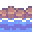 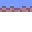 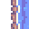 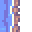

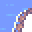 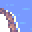 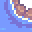 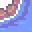

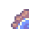 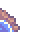 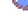 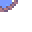

**第 1 步 - 初始网格**

```
?  ?  ?  ?
?  ?  ?  ?
```

我们从空网格开始，每个单元格都可能容纳任何瓦片。`?` 符号代表"叠加态"——每个单元格包含所有可能的瓦片，直到我们开始通过算法约束它们。

**第 2 步 - 首次放置**

```
?  ?  ?  ?
?  💧  ?  ?
```

算法首先放置初始的水域中心瓦片。根据**规则 1**，这个中心瓦片在所有边上都需要其他水域瓦片。这立即约束了相邻的单元格——它们必须是能连接到中心的水域瓦片。

**第 3 步 - 传播约束**

```
?  🌊  🌊  ?
?  💧  💧  ?
```

约束传播开始！算法放置更多中心瓦片来扩展水域区域。顶部的边缘瓦片遵循**规则 2**——它们的下方（朝向水面）连接到中心瓦片，而上方（朝向陆地）将连接到岸边。

**第 4 步 - 最终结果**

```
🏞️  🌊  🌊  🏞️
🌊  💧  💧  🌊
```

算法通过填充适当的边界瓦片来完成。注意我们的规则如何创造完美的连接——中心瓦片（**规则 1**）在所有边上都是水域，而边缘和角落瓦片（**规则 2**）的朝向水面边向内连接，朝向陆地面连接到岸边，形成了连贯的地形。

这展示了波函数坍缩算法的核心步骤：

1.  **找到约束最多的单元格**——有效瓦片选项最少的那个
2.  **放置一个插槽与相邻格子兼容的瓦片**
3.  **传播约束**——这次放置立即减少了周围单元格的有效选项
4.  **重复**直到网格完成

当我们遇到死胡同时（某个单元格没有有效瓦片），我们的实现采用比数独更简单的方法：不回溯之前的选择，而是使用新的随机种子重新开始（有重试次数限制），并再次运行整个过程，直到生成有效地图。

**你说的"新的随机种子"是什么意思？**

"随机种子"是一个起始数字，控制算法将遵循哪个"随机"序列。相同的种子 = 每次相同的瓦片放置顺序。当我们遇到死胡同时，不进行回溯，而是生成一个新的随机种子并重新开始——这给了我们一个完全不同的瓦片选择序列。

**配置这种随机性能帮我们自定义地图吗？**

是的！算法的随机性来自于它选择单元格和瓦片的顺序，我们可以控制这一点来影响最终结果。通过调整随机种子或选择策略，我们可以：

-   **偏向特定模式**——更重地加权某些瓦片以创建特定的地形类型。
-   **控制大小和复杂度**——影响我们是得到小池塘还是大湖泊。
-   **创建可预测的变化**——使用相同的种子获得一致的结果，或使用不同的种子获得多样性。

同一套瓦片集可以生成无尽变化的连贯地形，从小池塘到复杂的树枝状河流系统，只需调整随机概率配置。

虽然波函数坍缩很强大，但它也有局限性。

-   **无法控制大型结构**——WFC 专注于瓦片兼容性，因此不会自动创建"一个大湖"或"山脉"这样的大模式。
-   **可能卡住**——复杂的规则可能导致没有有效瓦片剩余的情况，需要重新启动。
-   **性能取决于复杂度**——更多的瓦片类型和更严格的规则会增加计算时间和失败率。
-   **需要仔细设计规则**——设计不佳的兼容性规则可能导致不真实或破碎的地形。

我们将在后面的章节中解决这些限制。现在，我们将专注于构建游戏世界的一个功能部分，这将成为构建更大游戏世界的基础。

## 从理论到实现（From Theory to Implementation）

现在我们理解了波函数坍缩的工作原理——约束传播、插槽兼容性和瓦片放置逻辑。是时候将这些知识转化为实际可运行的代码了。

**实现的现实：**

从头构建一个 WFC 算法是复杂的。你需要实现：

-   跨整个网格的约束传播
-   遇到死胡同时的回溯
-   用于跟踪可能性的高效数据结构
-   网格坐标管理
-   具有适当概率权重的随机选择

在我们接触到游戏特定部分（如精灵、规则和世界设计）之前，这已经是大量的算法复杂性了。

**我们的方法：**

与其重新发明轮子，我们将使用一个处理 WFC 算法内部细节的库。这让我们专注于游戏独特的部分：瓦片、规则、世界美学。我们定义**要什么**；库来解决**如何实现**。

## 设置工具包（Setting Up Our Toolkit）

让我们将过程生成库添加到项目中。我们将使用 `bevy_procedural_tilemaps` [crate](https://crates.io/crates/bevy_procedural_tilemaps)，这是我通过 fork `ghx_proc_gen` [库](https://crates.io/crates/ghx_proc_gen)构建的。我创建这个 fork 主要是为了确保与最新 Bevy 的兼容性并简化本教程。

如果你需要高级功能，请查看原作者 Gilles Henaux 的原始 `ghx_proc_gen` [crate](https://crates.io/crates/ghx_proc_gen)，它包含 3D 功能和调试工具。

希望你正在跟进第一章的代码。这是[源代码](https://github.com/jamesfebin/ImpatientProgrammerBevyRust)。

用 `bevy_procedural_tilemaps` crate 更新你的 `Cargo.toml`。

```toml
[package]
name = "bevy_game"
version = "0.1.0"
edition = "2024"

[dependencies]
bevy = "0.18" // 行更新提醒
bevy_procedural_tilemaps = "0.2.0" // 行更新提醒
```

## Bevy 过程化瓦片地图（Bevy Procedural Tilemaps）

`bevy_procedural_tilemaps` 库处理生成连贯的、基于规则的世界的复杂逻辑。

**库处理的内容**

库负责过程生成的**算法复杂性**：

-   **规则处理**：将我们的游戏规则转换为库的内部格式
-   **生成器创建**：用我们的配置构建过程生成引擎
-   **约束求解**：根据规则确定哪些瓦片可以放在哪里
-   **网格管理**：处理 2D 网格系统和坐标变换
-   **实体生成**：创建 Bevy 实体并正确定位它们

**我们需要提供的内容**

我们需要为库提供所需的**游戏特定信息**：

-   **精灵定义**：每种瓦片类型使用哪些精灵
-   **兼容性规则**：哪些瓦片可以彼此相邻放置
-   **生成配置**：我们特定游戏世界的模式和约束
-   **资源数据**：精灵信息、定位和自定义组件

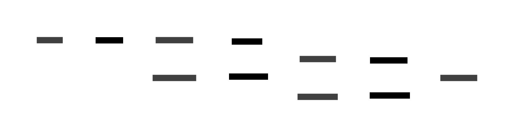

现在我们理解了过程生成系统的工作原理，让我们构建地图模块。

**重要说明**

与第 1 章不同，在第 1 章中你可以立即看到结果，过程生成需要做一些基础工作。你需要先创建资源加载器、瓦片生成基础设施，然后才能看到生成的世界。

回报在你完成草地层时到来，那时你已经学会了完整的模式。添加水域和道具只是使用不同的精灵和连接规则的重复工作。在此过程中，你将理解适用于任何 Rust 项目的 Rust 概念（生命周期、trait 约束、闭包）。

**如果在第一次阅读时感觉概念不清楚，不要放弃。这在过程生成中是正常的。重新阅读令人困惑的部分，尝试代码，理解会逐渐浮现。精通来自于动手实践，而不是第一次就完美理解。**

## 地图模块（The Map Module）

我们将在 `src` 文件夹内创建一个专用的 `map` 文件夹，用于存放所有世界生成逻辑。

**为什么要为地图生成创建一个单独的文件夹？**

地图系统需要多个组件协同工作。世界生成涉及：

-   **资源管理**——加载和组织数百个瓦片图像。
-   **规则定义**——不同地形类型之间的兼容性规则。
-   **网格设置**——配置地图尺寸和坐标系统。

试图将所有逻辑塞进一个文件会导致文件变得庞大且难以导航。

```
src/
├── main.rs
├── player.rs
└── map/
    ├── mod.rs
    ├── assets.rs
```

**什么是 `mod.rs`**

`mod.rs` 文件是 Rust 声明文件夹中存在哪些模块的方式。它就像是地图模块的"目录"。将以下行添加到你的 `mod.rs` 中。

```rust
// src/map/mod.rs
pub mod assets;   // 将 assets.rs 暴露为模块
```

**为什么特指 `mod.rs`？**

这是 Rust 的约定，当你创建一个文件夹时，Rust 会查找 `mod.rs` 来理解模块结构。

### 创建 SpawnableAsset

让我们在 `map` 文件夹内创建 `assets.rs` 文件。这将是我们世界中生成精灵的基础。

`bevy_procedural_tilemaps` 库需要知道**在每个生成位置实际放置什么**。

它需要以下详细信息：

1.  使用瓦片地图图集中的哪个精灵？
2.  具体定位在哪里？
3.  添加哪些组件（碰撞、物理等）？

库期望我们以非常特定的格式提供这些信息。而为游戏中的每种瓦片类型（草地、泥土、树木、岩石、水等）都这样做会导致大量重复代码。

这就是 `SpawnableAsset` 的作用。它是我们的**抽象层**，帮助你避免不必要的样板代码。

```rust
// src/map/assets.rs

use bevy::{prelude::*, sprite::Anchor};
use bevy_procedural_tilemaps::prelude::*;

#[derive(Clone)]
pub struct SpawnableAsset {
    /// 瓦片地图图集中精灵的名称
    sprite_name: &'static str,
    /// 网格坐标偏移（用于多瓦片对象）
    grid_offset: GridDelta,
    /// 世界坐标偏移（精细定位）
    offset: Vec3,
    /// 添加自定义组件的函数（如碰撞、物理等）
    components_spawner: fn(&mut EntityCommands),
}
```

**SpawnableAsset 结构体**

`SpawnableAsset` 结构体包含在世界中生成瓦片所需的所有信息。`sprite_name` 字段为精灵指定一个名称（如 "grass"、"tree"、"rock"）。

`grid_offset` 用于跨越多个瓦片的对象——它是瓦片网格本身的定位。

例如，下面的树资源需要四个瓦片：

 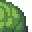 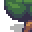 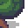

**网格偏移**

| 树的部分 | 网格偏移 | 描述 |
|---------|---------|------|
| 左下 | `(0, 0)` | 保持在原始位置 |
| 右下 | `(1, 0)` | 向右移动一个瓦片 |
| 左上 | `(0, 1)` | 向上移动一个瓦片 |
| 右上 | `(1, 1)` | 向右上方各移动一个瓦片 |

而 `offset` 字段则用于在瓦片内微调位置——比如将岩石稍微向左移动，或确保树干在瓦片空间中完美居中。

让我们看看 `offset` 如何与岩石定位配合：

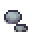 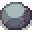 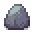

**偏移**

| 岩石 | 偏移 | 描述 |
|-----|------|------|
| 岩石 1 | `(0, 0)` | 在瓦片中居中 |
| 岩石 2 | `(-8, -6)` | 稍微向左和向上移动 |
| 岩石 3 | `(6, 5)` | 稍微向右和向下移动 |

最后，`components_spawner` 是一个函数，用于添加自定义行为，如碰撞、物理或其他游戏机制。

**为什么精灵名称定义为 `&'static str`？**

让我们逐部分解析 `&'static str`，以理解为什么在精灵名称中使用它。

`&` 符号表示"引用到"——不创建文本的新副本，只记录原始文本的位置。

`'static` 是一个特殊的生命周期标注，告诉 Rust"这段文本将在你的游戏整个持续期间存在"。当你在代码中直接编写 `"grass"` 时，Rust 会在构建时将其编译到你的游戏文件中。它始终存在，从游戏启动到关闭。

**什么是生命周期，`'static` 又与之有何关系？**

**生命周期**是 Rust 跟踪数据在内存中存活时间的方式。Rust 需要知道何时使用数据是安全的，以及数据何时可能被删除。

大多数数据具有有限的生命周期。例如：

-   局部变量只在函数运行期间存活
-   函数参数只在函数执行期间存活
-   在循环中创建的数据可能在循环结束时被删除

但有些数据永远存在——比如嵌入到程序中的字符串字面量。`'static` 生命周期意味着"此数据在程序的整个持续期间存活"——它永远不会被删除。

这对我们的精灵名称来说很完美，因为它们在源代码中是硬编码的（如 `"grass"`、`"tree"`、`"rock"`），在程序运行时永远不会改变或删除。Rust 可以安全地让我们在代码中的任何地方使用这些引用，因为它知道数据将始终存在。

**什么是字符串字面量？**

字符串字面量是你在代码中直接写在引号中的文本：`"grass"`、`"dirt"`、`"tree"`。

**为什么 Rust 需要知道何时使用数据是安全的？其他语言似乎不关心这个问题。**

大多数语言（如 C、C++、Java、Python）以不同方式处理内存安全：

-   **C/C++**：根本不跟踪生命周期——你可能意外使用已删除的数据，导致崩溃或安全漏洞
-   **Java/Python/C#**：使用垃圾回收——运行时自动删除未使用的数据，但这会增加开销和不可预测的暂停
-   **Rust**：在编译时跟踪生命周期——在没有运行时开销的情况下防止崩溃

**其他语言的问题**

```rust
// 伪代码警告，请勿使用
// 这在 C++ 中会崩溃或导致未定义行为
let sprite_name = {
    let temp = "grass";
    &temp  // temp 在这里被删除！
};
println!("{}", sprite_name); // 崩溃！使用了已删除的数据
```

**Rust 防止了这种情况**
Rust 的编译器分析你的代码并说："嘿，你正在尝试使用可能已被删除的数据。我不会让你编译这个不安全的代码。" 这在你游戏运行之前就捕获了 bug。

**`str` 是 String 数据类型吗？**

不完全是。`str` 表示文本数据，称为**字符串切片**，但你只能通过引用如 `&str`（存储在别处的文本的视图）来使用它。`String` 是你拥有并可以修改的文本。我们的精灵名称如 "grass" 被编译到程序中，所以 `&str` 只是指向该文本而不复制它——比使用 `String` 高效得多。

`&'static str` 的意思是"一个引用（`&`），指向一个字符串切片（`str`），该切片在程序的整个持续期间存活（`'static`）。" 这给了我们所有优点：内存效率（无需复制）、性能（直接访问）和安全性（Rust 知道数据将始终有效）。

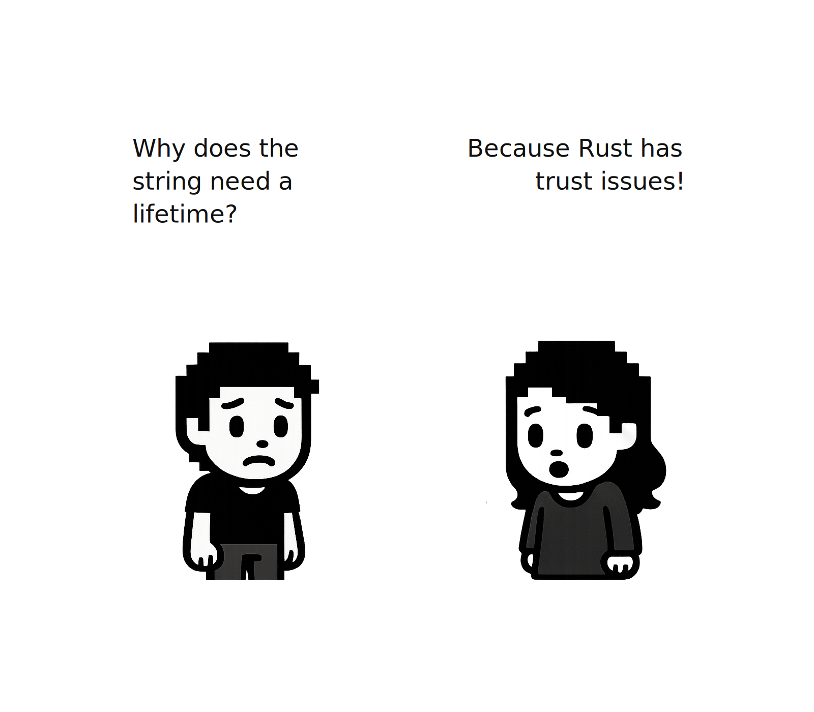

**什么是 `GridDelta`？**

`GridDelta` 是一个表示网格坐标中移动的结构体。它指定"在每个方向上移动多少个瓦片"。例如，`GridDelta::new(1, 0, 0)` 表示"向右移动一个瓦片"，而 `GridDelta::new(0, 1, 0)` 表示"向上移动一个瓦片"。它用于定位多瓦片对象，比如我们之前在网格偏移中提到的那个由多个瓦片组成的树精灵。

**为什么 `components_spawner` 定义为 `fn(&mut EntityCommands)`？**

这是一个函数指针，接受 `EntityCommands` 的可变引用（Bevy 向实体添加组件的方式）。查看 `assets.rs` 中的代码，我们可以看到它默认为一个什么都不做的空函数。

函数指针允许我们自定义每个生成的实体添加哪些组件。例如，树精灵可能需要用于物理的碰撞组件，而装饰性花朵可能只需要基本的渲染组件。每个精灵可以有自己的自定义组件集，而不影响其他组件。

**为什么我们需要 `EntityCommands` 的可变引用？**

是的！在 Rust 中，当你想要修改某些东西时，需要可变引用（`&mut`）。`EntityCommands` 需要是可变的，因为它用于在实体上添加、删除或修改组件。

现在让我们为 `SpawnableAsset` 结构体添加一些有用的方法，以便更容易地创建和配置精灵资源。

将以下代码附加到同一个 `assets.rs` 文件中。

```rust
// src/map/assets.rs
impl SpawnableAsset {
    pub fn new(sprite_name: &'static str) -> Self {
        Self {
            sprite_name,
            grid_offset: GridDelta::new(0, 0, 0),
            offset: Vec3::ZERO,
            components_spawner: |_| {}, // 默认：无额外组件
        }
    }

    pub fn with_grid_offset(mut self, offset: GridDelta) -> Self {
        self.grid_offset = offset;
        self
    }
}
```

**什么是 `-> Self`？**

在 Rust 中，你必须指定函数的返回类型（不像某些语言可以推断它）。`-> Self` 告诉编译器函数返回的确切类型，这有助于在编译时捕获错误。`Self` 表示"该方法所属的同一个结构体类型"——所以这里 `Self` 指的是 `SpawnableAsset`。

**什么是 `|_| {}`？**

这是一个什么都不做的闭包（匿名函数）。`|_|` 表示"接受一个参数但忽略它"（下划线表示我们不使用该参数），而 `{}` 是一个空的函数体。

我们需要这个是因为我们的 `SpawnableAsset` 结构体需要一个 `components_spawner` 字段（正如我们在结构体定义中看到的），但对于基本精灵，我们不想添加任何自定义组件。这个空闭包作为一个"什么都不做"的默认值。我们将在后面的章节中学习如何使用这个字段来添加自定义组件，但现在它只是一个满足结构体要求的占位符。

**什么是闭包？你说的匿名函数是什么意思？**

闭包是一个可以从其周围环境"捕获"变量的函数。匿名函数意味着它没有名字——你在需要的地方内联定义它，而不是像 `fn my_function()` 那样单独声明。

**使用示例**

```rust
// 伪代码警告，请勿使用
let mut player_health = 100;

// 这个闭包通过可变引用捕获 'player_health'
let mut take_damage = || {
    player_health -= 25;  // 修改原始变量
    player_health
};

// 闭包可以修改原始变量
take_damage();  // player_health 现在是 75
take_damage();  // player_health 现在是 50
```

**为什么在这里使用闭包？**

在我们的 `SpawnableAsset` 结构体中，闭包可以让每个精灵在生成时具有自定义行为。例如，树可能需要碰撞组件，而装饰性花朵可能需要不同的组件。闭包可以捕获游戏状态和配置，为每种精灵类型自定义生成行为。

**为什么这些函数最后一行没有分号？**

在 Rust 中，函数中的最后一个表达式会自动返回，无需 `return` 关键字或分号。这使得指定要返回的值更加容易——只需写出要返回的表达式，Rust 会处理其余部分。这是 Rust 使代码更简洁的方式。

**为什么不能直接操作或检索 `grid_offset`？**

`GridDelta` 的字段是私有的（它们没有 `pub` 关键字），这意味着只能在定义 `GridDelta` 的模块内部访问它们。这被称为"封装"——它防止开发者通过直接修改结构体数据而犯错，这可能会破坏内部逻辑。我们提供了公共方法 `with_grid_offset()` 来安全地修改它，同时保持结构体的完整性。

现在我们理解了如何用 `SpawnableAsset` 定义精灵，**如何在游戏中加载和使用这些精灵？**

### 加载精灵资源（Loading Sprite Assets）

我们的游戏使用**精灵图集（sprite atlas）**——一个包含所有精灵的大图像。Bevy 需要知道每个精灵在这个图像中的位置，我们需要避免多次重新加载同一个图像。

在 `src/assets` 文件夹中创建一个 `tile_layers` 文件夹，并将 `tilemap.png` 放入其中，你可以从这个 [GitHub 仓库](https://github.com/jamesfebin/ImpatientProgrammerBevyRust)获取它。

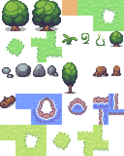

本示例中使用的瓦片地图资源基于 George Bailey 在 OpenGameArt 上以 CC-BY 4.0 许可证提供的 [16x16 Game Assets](https://opengameart.org/content/16x16-game-assets)。**然而，要跟随本教程，请使用本章 [GitHub 仓库](https://github.com/jamesfebin/ImpatientProgrammerBevyRust)提供的 tilemap.png。**

现在在 `src/map` 文件夹内创建一个 `tilemap.rs` 文件。当你在 map 文件夹内添加文件时，确保在 `mod.rs` 中添加 `pub mod tilemap;` 行进行注册。

这就是我们的瓦片地图定义——它作为一个"地图"，告诉 Bevy 图集中每个精灵的坐标。

```rust
// src/map/tilemap.rs
use bevy::math::{URect, UVec2};

pub struct TilemapSprite {
    pub name: &'static str,
    pub pixel_x: u32,
    pub pixel_y: u32,
}

pub struct TilemapDefinition {
    pub tile_width: u32,
    pub tile_height: u32,
    pub atlas_width: u32,
    pub atlas_height: u32,
    pub sprites: &'static [TilemapSprite],
}
```

`TilemapSprite` 结构体表示图集中的一个精灵。它存储精灵的名称（如 "dirt" 或 "green_grass"）及其在图集图像中的精确像素坐标。

`TilemapDefinition` 结构体作为 Bevy 用来理解如何将图集图像切割成单个精灵的"蓝图"。

1.  **`tile_width` 和 `tile_height`**——每个精灵有多大（在我们的例子中，32×32 像素）
2.  **`atlas_width` 和 `atlas_height`**——整个精灵图集图像的总尺寸（包含所有精灵的大图像）
3.  **`sprites`**——图集中所有精灵的列表，每个都有名称和位置

虽然我们的瓦片地图存储了精灵名称和像素坐标，但 Bevy 的纹理图集系统需要数字索引和矩形区域。这些方法执行必要的转换。

将以下代码附加到你的 `tilemap.rs` 中。

```rust
// src/map/tilemap.rs

impl TilemapDefinition {
    pub const fn tile_size(&self) -> UVec2 {
        UVec2::new(self.tile_width, self.tile_height)
    }

    pub const fn atlas_size(&self) -> UVec2 {
        UVec2::new(self.atlas_width, self.atlas_height)
    }

    pub fn sprite_index(&self, name: &str) -> Option<usize> {
        self.sprites.iter().position(|sprite| sprite.name == name)
    }

    pub fn sprite_rect(&self, index: usize) -> URect {
        let sprite = &self.sprites[index];
        let min = UVec2::new(sprite.pixel_x, sprite.pixel_y);
        URect::from_corners(min, min + self.tile_size())
    }
}
```

`tile_size()` 方法将瓦片尺寸转换为 `UVec2`（无符号二维向量），Bevy 使用它进行尺寸计算。类似地，`atlas_size()` 以 `UVec2` 形式提供整个图集尺寸，Bevy 使用它来创建纹理图集布局。

`sprite_index()` 方法帮助按名称查找精灵。当我们想要渲染一个 "dirt" 瓦片时，此方法搜索精灵数组并返回该精灵的索引位置。

最后，`sprite_rect()` 接受一个精灵索引并计算图集中包含该精灵的确切矩形区域。它使用 `URect`（无符号矩形）定义边界，Bevy 的纹理图集系统需要它来知道要显示大图像的哪一部分。

现在让我们使用瓦片地图定义来添加第一个精灵——泥土瓦片。

### 添加泥土瓦片（Adding the Dirt Tile）

让我们从简单的泥土瓦片开始，测试瓦片地图系统。泥土瓦片位于 256x320 图集图像的像素坐标 (128, 0) 处。随着构建游戏世界，我们稍后会添加更多精灵。

将此代码附加到 `tilemap.rs` 中。

```rust
// src/map/tilemap.rs
pub const TILEMAP: TilemapDefinition = TilemapDefinition {
    tile_width: 32,
    tile_height: 32,
    atlas_width: 256,
    atlas_height: 320,
    sprites: &[
        TilemapSprite {
            name: "dirt",
            pixel_x: 128,
            pixel_y: 0,
        },
    ]
};
```

注意我们使用的是一个 const 定义——这意味着所有精灵元数据在编译时就确定了。

### 连接瓦片地图到资源加载（Connecting the Tilemap to Asset Loading）

现在我们已经定义了瓦片地图和精灵，需要将其连接到 `assets.rs` 中的资源加载系统。

让我们更新 `assets.rs` 中的导入，引入 `TILEMAP` 定义：

```rust
// src/map/assets.rs
use bevy::prelude::*;
use bevy_procedural_tilemaps::prelude::*;
use crate::map::tilemap::TILEMAP; // <--- 行更新提醒
```

导入到位后，我们现在可以构建三个关键函数，它们为过程化渲染系统提供支持：

1.  `TilemapHandles`——保存加载的图集和布局数据的容器
2.  `prepare_tilemap_handles`——从磁盘加载图集图像，并创建定义每个精灵矩形区域的纹理图集布局
3.  `load_assets`——将精灵名称转换为准备渲染的 `Sprite` 数据结构

让我们逐步构建这些。

### 创建 TilemapHandles 结构体

首先，我们需要一种保存图集图像及其布局引用的方式。将以下代码附加到你的 `assets.rs` 中：

```rust
// src/map/assets.rs
#[derive(Clone)]
pub struct TilemapHandles {
    pub image: Handle<Image>,
    pub layout: Handle<TextureAtlasLayout>,
}

impl TilemapHandles {
    pub fn sprite(&self, atlas_index: usize) -> Sprite {
        Sprite::from_atlas_image(
            self.image.clone(),
            TextureAtlas::from(self.layout.clone()).with_index(atlas_index),
        )
    }
}
```

`TilemapHandles` 结构体是两个句柄的容器：`image` 指向加载的精灵表文件，而 `layout` 指向告诉 Bevy 如何将图像切割成单个精灵的图集布局。

`sprite(atlas_index)` 方法是一个便利函数，通过将图像和布局与特定索引结合，创建一个可渲染的 `Sprite`。例如，如果泥土瓦片在索引 0 处，调用 `tilemap_handles.sprite(0)` 会给我们一个配置好的 `Sprite`，仅显示图集中的泥土瓦片。

### 从磁盘加载图集（Loading the Atlas from Disk）

现在创建实际加载图集图像文件并设置布局的函数。我们将使用之前定义的 `TILEMAP`。

```rust
// src/map/assets.rs
pub fn prepare_tilemap_handles(
    asset_server: &Res<AssetServer>,
    atlas_layouts: &mut ResMut<Assets<TextureAtlasLayout>>,
    assets_directory: &str,
    tilemap_file: &str,
) -> TilemapHandles {
    let image = asset_server.load::<Image>(format!("{assets_directory}/{tilemap_file}"));
    let mut layout = TextureAtlasLayout::new_empty(TILEMAP.atlas_size());
    for index in 0..TILEMAP.sprites.len() {
        layout.add_texture(TILEMAP.sprite_rect(index));
    }
    let layout = atlas_layouts.add(layout);

    TilemapHandles { image, layout }
}
```

**分解说明：**

1.  **加载图像**：`asset_server.load()` 从磁盘请求图集图像文件
2.  **创建空白布局**：`TextureAtlasLayout::new_empty(TILEMAP.atlas_size())` 创建匹配 256x320 图集的布局
3.  **注册每个精灵**：循环遍历 `TILEMAP` 中的所有精灵，使用 `TILEMAP.sprite_rect(index)` 获取每个精灵的坐标并将其添加到布局中
4.  **存储并返回**：布局被添加到 Bevy 的资源系统中，并返回包含两个句柄的 `TilemapHandles`

这就是 `TILEMAP.atlas_size()` 和 `TILEMAP.sprite_rect()` 发挥作用的地方——它们告诉 Bevy 如何精确切割图集图像！

此函数将图集加载到内存并设置布局结构，但它实际上并没有生成游戏世界。我们只是在准备过程生成器稍后创建地图时将使用的工具。

### 将精灵名称转换为可渲染的 Sprite（Converting Sprite Names to Renderable Sprites）

最后，我们需要一种将精灵名称（如 "dirt"）转换为可渲染的 `Sprite` 对象的方法。

```rust
// src/map/assets.rs
pub fn load_assets(
    tilemap_handles: &TilemapHandles,
    assets_definitions: Vec<Vec<SpawnableAsset>>,
) -> ModelsAssets<Sprite> {
    let mut models_assets = ModelsAssets::<Sprite>::new();
    for (model_index, assets) in assets_definitions.into_iter().enumerate() {
        for asset_def in assets {
            let SpawnableAsset {
                sprite_name,
                grid_offset,
                offset,
                components_spawner,
            } = asset_def;

            let Some(atlas_index) = TILEMAP.sprite_index(sprite_name) else {
                panic!("未知图集精灵 '{}'", sprite_name);
            };

            models_assets.add(
                model_index,
                ModelAsset {
                    assets_bundle: tilemap_handles.sprite(atlas_index),
                    grid_offset,
                    world_offset: offset,
                    spawn_commands: components_spawner,
                },
            )
        }
    }
    models_assets
}
```

**为什么有两层循环？**

有些瓦片很简单，只需要一个精灵（如泥土）。其他则很复杂，需要多个精灵（如需要 4 个部分的树）。

外层循环说"对于每种类型的瓦片"，内层循环说"对于该瓦片需要的每个精灵"。

让我们逐步看看加载泥土瓦片时会发生什么：

-   我们有：`SpawnableAsset { sprite_name: "dirt", ... }`
-   函数询问 `TILEMAP`："'dirt' 在哪里？" → `TILEMAP` 回答："索引 0"
-   然后询问 `TilemapHandles`："给我索引 0 的 Sprite" → 返回一个 Sprite 对象
-   最后，它将所有内容与定位信息打包在一起并存储

**最终数据是什么样子的？**

`load_assets` 完成后，我们在内存中有一组 `ModelAsset` 对象。以下是几个瓦片的数据结构：

| 模型 | 字段 | 值 | 含义 |
|------|------|-----|------|
| 泥土 | assets_bundle | Sprite(atlas_index: 0) | 指向图集中的泥土精灵 |
| | grid_offset | (0, 0, 0) | 不需要网格偏移 |
| | world_offset | (0, 0, 0) | 不需要世界偏移 |
| 树（底部） | assets_bundle | Sprite(atlas_index: 31) | 指向树底部精灵 |
| | grid_offset | (0, 0, 0) | 放置在基础位置 |
| | world_offset | (0, 0, 0) | 居中 |
| 树（顶部） | assets_bundle | Sprite(atlas_index: 30) | 指向树顶部精灵 |
| | grid_offset | (0, 1, 0) | 从底部向上一个瓦片 |
| | world_offset | (0, 0, 0) | 居中 |

**重要提示：这些只是内存中的数据结构——屏幕上还没有绘制任何东西！实际的渲染稍后由过程生成器使用这些准备好的 ModelAsset 对象来生成实体。**

**干得漂亮！你已经完成了基础层——精灵、瓦片地图和资源加载。现在我们有了视觉片段（资源），但生成器如何知道哪些瓦片可以彼此相邻放置？这就是模型和插槽的作用！**

## 从瓦片到模型（From Tiles to Models）

你已经理解了瓦片——像草地、泥土和水这样的独立视觉片段。现在我们需要通过给这些瓦片添加插槽（sockets）并定义连接规则来构建模型，这样生成器就能计算出有效的放置位置。

### 模型如何暴露插槽（How Models Expose Sockets）

模型暴露插槽——每条边上的标记连接点。让我们看看一个绿色草地模型如何在不同方向上暴露插槽。

**水平面（x 和 y 方向）**

```
             ↑
         up (y_pos)
      grass.material
             ↓

←  left (x_neg)     →  right (x_pos)
   grass.material       grass.material
        ←  GREENGRASS  →

             ↑
        up (y_pos)
      grass.material
             ↓
```

在 3D 中，我们还有 z 方向（上下层）：

```
         ↑  z_pos (layer_up)
            grass.layer_up
         ↓

←  x_neg      →  x_pos
   grass.material   grass.material
        ←  GREENGRASS  →

↑  z_neg (layer_down)  ↓
   grass.layer_down
```

每个边都有一个命名插槽，带有特定的连接类型。`grass.material` 插槽确保同一层上的水平兼容性，而 `grass.layer_up` 和 `grass.layer_down` 处理垂直堆叠。

### 插槽结构体（Socket Structs）

这是一个组织这些插槽的便捷结构体。每种地形类型都有自己专用的插槽结构体：

```rust
// src/map/sockets.rs
use bevy_procedural_tilemaps::prelude::*;

pub struct DirtLayerSockets {
    pub layer_up: Socket,
    pub layer_down: Socket,
    pub material: Socket,
}

pub struct GrassLayerSockets {
    pub layer_up: Socket,
    pub layer_down: Socket,
    pub material: Socket,
    pub void_and_grass: Socket,
    pub grass_and_void: Socket,
    pub grass_fill_up: Socket,
}

pub struct YellowGrassLayerSockets {
    pub layer_up: Socket,
    pub layer_down: Socket,
    pub yellow_grass_fill_down: Socket,
}

pub struct WaterLayerSockets {
    pub layer_up: Socket,
    pub layer_down: Socket,
    pub material: Socket,
    pub void_and_water: Socket,
    pub water_and_void: Socket,
    pub ground_up: Socket,
}

pub struct PropsLayerSockets {
    pub layer_up: Socket,
    pub layer_down: Socket,
    pub props_down: Socket,
    pub big_tree_1_base: Socket,
    pub big_tree_2_base: Socket,
}

pub struct TerrainSockets {
    pub dirt: DirtLayerSockets,
    pub void: Socket,
    pub grass: GrassLayerSockets,
    pub yellow_grass: YellowGrassLayerSockets,
    pub water: WaterLayerSockets,
    pub props: PropsLayerSockets,
}
```

以及创建插槽的函数：

```rust
// src/map/sockets.rs
pub fn create_sockets(socket_collection: &mut SocketCollection) -> TerrainSockets {
    let mut new_socket = || -> Socket { socket_collection.create() };

    let sockets = TerrainSockets {
        dirt: DirtLayerSockets {
            layer_up: new_socket(),
            material: new_socket(),
            layer_down: new_socket(),
        },
        void: new_socket(),
        grass: GrassLayerSockets {
            layer_up: new_socket(),
            material: new_socket(),
            layer_down: new_socket(),
            void_and_grass: new_socket(),
            grass_and_void: new_socket(),
            grass_fill_up: new_socket(),
        },
        yellow_grass: YellowGrassLayerSockets {
            layer_up: new_socket(),
            layer_down: new_socket(),
            yellow_grass_fill_down: new_socket(),
        },
        water: WaterLayerSockets {
            layer_up: new_socket(),
            layer_down: new_socket(),
            material: new_socket(),
            void_and_water: new_socket(),
            water_and_void: new_socket(),
            ground_up: new_socket(),
        },
        props: PropsLayerSockets {
            layer_up: new_socket(),
            layer_down: new_socket(),
            props_down: new_socket(),
            big_tree_1_base: new_socket(),
            big_tree_2_base: new_socket(),
        },
    };
    sockets
}
```

`create_sockets` 函数接受一个 `SocketCollection` 并创建所有插槽实例。`new_socket` 闭包是一个辅助函数，调用 `socket_collection.create()` 来生成唯一的插槽 ID。每个插槽获得一个唯一标识符，WFC 算法用它来跟踪兼容性规则。

## TerrainModelBuilder

我们将使用一个名为 `TerrainModelBuilder` 的辅助工具，确保在构建世界时模型和精灵正确配对。

```rust
// src/map/models.rs
use bevy_procedural_tilemaps::prelude::*;
use crate::map::assets::SpawnableAsset;

/// 确保模型声明及其资源绑定保持对齐的实用包装器。
pub struct TerrainModelBuilder {
    pub models: ModelCollection<Cartesian3D>,
    pub assets: Vec<Vec<SpawnableAsset>>,
}
```

### 构建方法

```rust
// src/map/models.rs
impl TerrainModelBuilder {
    pub fn new() -> Self {
        Self {
            models: ModelCollection::new(),
            assets: Vec::new(),
        }
    }

    pub fn create_model<T>(
        &mut self,
        template: T,
        assets: Vec<SpawnableAsset>,
    ) -> &mut Model<Cartesian3D>
    where
        T: Into<ModelTemplate<Cartesian3D>>,
    {
        let model_ref = self.models.create(template);
        self.assets.push(assets);
        model_ref
    }

    pub fn into_parts(self) -> (Vec<Vec<SpawnableAsset>>, ModelCollection<Cartesian3D>) {
        (self.assets, self.models)
    }
}
```

`create_model()` 方法同时接受插槽定义和对应的精灵，然后将它们以相同的索引添加到各自的集合中。

最后，`into_parts()` 在你完成构建后将构建器拆分为独立的集合，这样资源可以发送到渲染器，模型可以发送到 WFC 生成器。

## 构建规则（Building Rules）

现在让我们创建实际的规则，将插槽和模型联系起来以生成地形。

```rust
// src/map/rules.rs
use crate::map::assets::SpawnableAsset;
use crate::map::models::TerrainModelBuilder;
use crate::map::sockets::*;
use bevy_procedural_tilemaps::prelude::*;
```

### 构建泥土层（Building the Dirt Layer）

```rust
// src/map/rules.rs
fn build_dirt_layer(
    terrain_model_builder: &mut TerrainModelBuilder,
    terrain_sockets: &TerrainSockets,
    socket_collection: &mut SocketCollection,
) {
    terrain_model_builder
        .create_model(
            SocketsCartesian3D::Simple {
                x_pos: terrain_sockets.dirt.material,
                x_neg: terrain_sockets.dirt.material,
                z_pos: terrain_sockets.dirt.layer_up,
                z_neg: terrain_sockets.dirt.layer_down,
                y_pos: terrain_sockets.dirt.material,
                y_neg: terrain_sockets.dirt.material,
            },
            vec![SpawnableAsset::new("dirt")],
        )
        .with_weight(20.);

    socket_collection.add_connections(vec![(
        terrain_sockets.dirt.material,
        vec![terrain_sockets.dirt.material],
    )]);
}
```

`SocketsCartesian3D::Simple` 变体表示一个在所有六个方向上使用相同材质插槽的简单瓦片。通过 `.with_weight(20.)`，我们告诉生成器泥土瓦片的选择权重为 20。

`add_connections` 调用注册兼容性规则：`dirt.material` 插槽与其他 `dirt.material` 插槽兼容。

### 构建草地层（Building the Grass Layer）

草地层更复杂，因为它有多种瓦片类型（中心、边缘、角落）和旋转。

```rust
// src/map/rules.rs
fn build_grass_layer(
    terrain_model_builder: &mut TerrainModelBuilder,
    terrain_sockets: &TerrainSockets,
    socket_collection: &mut SocketCollection,
) {
    // 草地中心
    terrain_model_builder
        .create_model(
            SocketsCartesian3D::Simple {
                x_pos: terrain_sockets.grass.material,
                x_neg: terrain_sockets.grass.material,
                z_pos: terrain_sockets.grass.layer_up,
                z_neg: terrain_sockets.grass.layer_down,
                y_pos: terrain_sockets.grass.material,
                y_neg: terrain_sockets.grass.material,
            },
            vec![SpawnableAsset::new("green_grass")],
        )
        .with_weight(80.);

    // 草地上边缘
    terrain_model_builder
        .create_model(
            SocketsCartesian3D::Simple {
                x_pos: terrain_sockets.grass.material,
                x_neg: terrain_sockets.grass.material,
                z_pos: terrain_sockets.grass.layer_up,
                z_neg: terrain_sockets.grass.layer_down,
                y_pos: terrain_sockets.grass.void_and_grass,
                y_neg: terrain_sockets.grass.material,
            },
            vec![SpawnableAsset::new("green_grass_side_b")],
        )
        .with_weight(10.);

    // 带旋转的草地上边缘
    terrain_model_builder
        .create_model(
            SocketsCartesian3D::Simple {
                x_pos: terrain_sockets.grass.material,
                x_neg: terrain_sockets.grass.material,
                z_pos: terrain_sockets.grass.layer_up,
                z_neg: terrain_sockets.grass.layer_down,
                y_pos: terrain_sockets.grass.void_and_grass,
                y_neg: terrain_sockets.grass.material,
            }
            .rotated(ModelRotation::Rot180, Direction::ZForward),
            vec![SpawnableAsset::new("green_grass_side_t")],
        )
        .with_weight(10.);

    // 更多旋转瓦片...
    terrain_model_builder
        .create_model(
            SocketsCartesian3D::Simple {
                x_pos: terrain_sockets.grass.material,
                x_neg: terrain_sockets.grass.material,
                z_pos: terrain_sockets.grass.layer_up,
                z_neg: terrain_sockets.grass.layer_down,
                y_pos: terrain_sockets.grass.void_and_grass,
                y_neg: terrain_sockets.grass.material,
            }
            .rotated(ModelRotation::Rot90, Direction::ZForward),
            vec![SpawnableAsset::new("green_grass_side_r")],
        )
        .with_weight(10.);

    // 旋转 270 度
    terrain_model_builder
        .create_model(
            SocketsCartesian3D::Simple {
                x_pos: terrain_sockets.grass.material,
                x_neg: terrain_sockets.grass.material,
                z_pos: terrain_sockets.grass.layer_up,
                z_neg: terrain_sockets.grass.layer_down,
                y_pos: terrain_sockets.grass.void_and_grass,
                y_neg: terrain_sockets.grass.material,
            }
            .rotated(ModelRotation::Rot270, Direction::ZForward),
            vec![SpawnableAsset::new("green_grass_side_l")],
        )
        .with_weight(10.);

    // 添加连接规则
    socket_collection.add_rotated_connection(
        terrain_sockets.dirt.layer_up,
        vec![terrain_sockets.grass.layer_down],
    );

    socket_collection.add_connections(vec![
        (terrain_sockets.void, vec![terrain_sockets.void]),
        (
            terrain_sockets.grass.material,
            vec![terrain_sockets.grass.material],
        ),
        (
            terrain_sockets.grass.void_and_grass,
            vec![terrain_sockets.void, terrain_sockets.grass.material],
        ),
    ]);
}
```

### 构建世界函数（The build_world Function）

将所有内容整合在一起：

```rust
// src/map/rules.rs
pub fn build_world() -> (
    Vec<Vec<SpawnableAsset>>,
    ModelCollection<Cartesian3D>,
    SocketCollection,
) {
    let mut socket_collection = SocketCollection::new();
    let terrain_sockets = create_sockets(&mut socket_collection);

    let mut terrain_model_builder = TerrainModelBuilder::new();

    // 构建泥土层
    build_dirt_layer(
        &mut terrain_model_builder,
        &terrain_sockets,
        &mut socket_collection,
    );

    // 构建草地层
    build_grass_layer(
        &mut terrain_model_builder,
        &terrain_sockets,
        &mut socket_collection,
    );

    let (assets, models) = terrain_model_builder.into_parts();

    (assets, models, socket_collection)
}
```

### 添加黄草层

黄草地层遵循与绿草地层相同的模式，但使用不同的精灵和插槽：

```rust
// src/map/rules.rs
fn build_yellow_grass_layer(
    terrain_model_builder: &mut TerrainModelBuilder,
    terrain_sockets: &TerrainSockets,
    socket_collection: &mut SocketCollection,
) {
    // 黄草中心
    terrain_model_builder
        .create_model(
            SocketsCartesian3D::Simple {
                x_pos: terrain_sockets.yellow_grass.material,
                x_neg: terrain_sockets.yellow_grass.material,
                z_pos: terrain_sockets.yellow_grass.layer_up,
                z_neg: terrain_sockets.yellow_grass.layer_down,
                y_pos: terrain_sockets.yellow_grass.material,
                y_neg: terrain_sockets.yellow_grass.material,
            },
            vec![SpawnableAsset::new("yellow_grass")],
        )
        .with_weight(80.);

    // 黄草地上边缘
    terrain_model_builder
        .create_model(
            SocketsCartesian3D::Simple {
                x_pos: terrain_sockets.yellow_grass.material,
                x_neg: terrain_sockets.yellow_grass.material,
                z_pos: terrain_sockets.yellow_grass.layer_up,
                z_neg: terrain_sockets.yellow_grass.layer_down,
                y_pos: terrain_sockets.void,
                y_neg: terrain_sockets.void,
            },
            vec![SpawnableAsset::new("yellow_grass_side_b")],
        )
        .with_weight(10.);

    // 此处添加更多旋转变体...

    // 添加连接规则
    socket_collection.add_connections(vec![
        (
            terrain_sockets.yellow_grass.material,
            vec![terrain_sockets.yellow_grass.material],
        ),
        (
            terrain_sockets.grass.void_and_grass,
            vec![terrain_sockets.void, terrain_sockets.grass.material],
        ),
    ]);
}
```

### 添加水域层

水域层使用与草地类似的模式——它创建带有平滑边缘的斑块。水域与黄草位于同一层级，但使用非常低的权重，因此它只是偶尔出现，形成湖泊和池塘。

```rust
// src/map/rules.rs
pub fn build_water_layer(
    terrain_model_builder: &mut TerrainModelBuilder,
    terrain_sockets: &TerrainSockets,
    socket_collection: &mut SocketCollection,
) {
    // 空白模型——代表无水区域
    terrain_model_builder.create_model(
        SocketsCartesian3D::Multiple {
            x_pos: vec![terrain_sockets.void],
            x_neg: vec![terrain_sockets.void],
            z_pos: vec![
                terrain_sockets.water.layer_up,
                terrain_sockets.water.ground_up,
            ],
            z_neg: vec![terrain_sockets.water.layer_down],
            y_pos: vec![terrain_sockets.void],
            y_neg: vec![terrain_sockets.void],
        },
        Vec::new(),
    );

    // 水域中心
    const WATER_WEIGHT: f32 = 0.02;
    terrain_model_builder
        .create_model(
            SocketsCartesian3D::Simple {
                x_pos: terrain_sockets.water.material,
                x_neg: terrain_sockets.water.material,
                z_pos: terrain_sockets.water.layer_up,
                z_neg: terrain_sockets.water.layer_down,
                y_pos: terrain_sockets.water.material,
                y_neg: terrain_sockets.water.material,
            },
            vec![SpawnableAsset::new("water")],
        )
        .with_weight(10. * WATER_WEIGHT);

    // 外角模板
    let water_corner_out = SocketsCartesian3D::Simple {
        x_pos: terrain_sockets.water.void_and_water,
        x_neg: terrain_sockets.void,
        z_pos: terrain_sockets.water.layer_up,
        z_neg: terrain_sockets.water.layer_down,
        y_pos: terrain_sockets.void,
        y_neg: terrain_sockets.water.water_and_void,
    }
    .to_template()
    .with_weight(WATER_WEIGHT);

    // 内角模板
    let water_corner_in = SocketsCartesian3D::Simple {
        x_pos: terrain_sockets.water.water_and_void,
        x_neg: terrain_sockets.water.material,
        z_pos: terrain_sockets.water.layer_up,
        z_neg: terrain_sockets.water.layer_down,
        y_pos: terrain_sockets.water.material,
        y_neg: terrain_sockets.water.void_and_water,
    }
    .to_template()
    .with_weight(WATER_WEIGHT);

    // 侧边模板
    let water_side = SocketsCartesian3D::Simple {
        x_pos: terrain_sockets.water.void_and_water,
        x_neg: terrain_sockets.water.water_and_void,
        z_pos: terrain_sockets.water.layer_up,
        z_neg: terrain_sockets.water.layer_down,
        y_pos: terrain_sockets.void,
        y_neg: terrain_sockets.water.material,
    }
    .to_template()
    .with_weight(WATER_WEIGHT);

    // 创建四个方向的旋转变体（外角、内角、侧边）...
    // 外角旋转
    terrain_model_builder.create_model(
        water_corner_out.clone(),
        vec![SpawnableAsset::new("water_corner_out_tl")],
    );
    terrain_model_builder.create_model(
        water_corner_out.rotated(ModelRotation::Rot90, Direction::ZForward),
        vec![SpawnableAsset::new("water_corner_out_bl")],
    );
    terrain_model_builder.create_model(
        water_corner_out.rotated(ModelRotation::Rot180, Direction::ZForward),
        vec![SpawnableAsset::new("water_corner_out_br")],
    );
    terrain_model_builder.create_model(
        water_corner_out.rotated(ModelRotation::Rot270, Direction::ZForward),
        vec![SpawnableAsset::new("water_corner_out_tr")],
    );

    // 内角旋转
    terrain_model_builder.create_model(
        water_corner_in.clone(),
        vec![SpawnableAsset::new("water_corner_in_tl")],
    );
    terrain_model_builder.create_model(
        water_corner_in.rotated(ModelRotation::Rot90, Direction::ZForward),
        vec![SpawnableAsset::new("water_corner_in_bl")],
    );
    terrain_model_builder.create_model(
        water_corner_in.rotated(ModelRotation::Rot180, Direction::ZForward),
        vec![SpawnableAsset::new("water_corner_in_br")],
    );
    terrain_model_builder.create_model(
        water_corner_in.rotated(ModelRotation::Rot270, Direction::ZForward),
        vec![SpawnableAsset::new("water_corner_in_tr")],
    );

    // 侧边旋转
    terrain_model_builder.create_model(
        water_side.clone(),
        vec![SpawnableAsset::new("water_side_t")],
    );
    terrain_model_builder.create_model(
        water_side.rotated(ModelRotation::Rot90, Direction::ZForward),
        vec![SpawnableAsset::new("water_side_l")],
    );
    terrain_model_builder.create_model(
        water_side.rotated(ModelRotation::Rot180, Direction::ZForward),
        vec![SpawnableAsset::new("water_side_b")],
    );
    terrain_model_builder.create_model(
        water_side.rotated(ModelRotation::Rot270, Direction::ZForward),
        vec![SpawnableAsset::new("water_side_r")],
    );

    // 添加连接规则
    socket_collection.add_connections(vec![
        (
            terrain_sockets.water.material,
            vec![terrain_sockets.water.material],
        ),
        (
            terrain_sockets.water.water_and_void,
            vec![terrain_sockets.water.void_and_water],
        ),
    ]);

    // 连接水域层到黄草层
    socket_collection.add_rotated_connection(
        terrain_sockets.yellow_grass.layer_up,
        vec![terrain_sockets.water.layer_down],
    );
}
```

**关于水域的关键点：**

-   **低权重值**——`WATER_WEIGHT: f32 = 0.02`，使水域出现频率较低，形成零星的水体而非覆盖一切
-   **多个 z_pos 选项**——空白模型有两个 z_pos 选项：`water.layer_up`（另一个水域层）和 `water.ground_up`（道具可以在此放置）
-   **与草地相同的模式**——水域使用与草地相同的模板和旋转方法，展示了 WFC 模式如何扩展到不同的地形类型

### 添加道具层

道具是为世界注入生机的最终层！树木、岩石、植物和树桩应仅出现在陆地上，而非水域中。

此层位于 Z 堆栈的顶部，并使用特殊的连接规则确保道具仅在坚实的地面上生成。它还包括多瓦片对象，如横跨多个网格位置的大树。

```rust
// src/map/rules.rs
pub fn build_props_layer(
    terrain_model_builder: &mut TerrainModelBuilder,
    terrain_sockets: &TerrainSockets,
    socket_collection: &mut SocketCollection,
) {
    // 空白模型——代表无道具区域
    terrain_model_builder.create_model(
        SocketsCartesian3D::Multiple {
            x_pos: vec![terrain_sockets.void],
            x_neg: vec![terrain_sockets.void],
            z_pos: vec![terrain_sockets.props.layer_up],
            z_neg: vec![terrain_sockets.props.layer_down],
            y_pos: vec![terrain_sockets.void],
            y_neg: vec![terrain_sockets.void],
        },
        Vec::new(),
    );

    // 不同类型道具的权重常量
    const PROPS_WEIGHT: f32 = 0.025;
    const ROCKS_WEIGHT: f32 = 0.008;
    const PLANTS_WEIGHT: f32 = 0.025;
    const STUMPS_WEIGHT: f32 = 0.012;

    // 基础道具模板——单瓦片道具
    let prop = SocketsCartesian3D::Simple {
        x_pos: terrain_sockets.void,
        x_neg: terrain_sockets.void,
        z_pos: terrain_sockets.props.layer_up,
        z_neg: terrain_sockets.props.props_down,
        y_pos: terrain_sockets.void,
        y_neg: terrain_sockets.void,
    }
    .to_template()
    .with_weight(PROPS_WEIGHT);

    // 用不同权重创建不同道具类型
    let plant_prop = prop.clone().with_weight(PLANTS_WEIGHT);
    let stump_prop = prop.clone().with_weight(STUMPS_WEIGHT);
    let rock_prop = prop.clone().with_weight(ROCKS_WEIGHT);

    // 小树（2 瓦片高）
    terrain_model_builder.create_model(
        plant_prop.clone(),
        vec![
            SpawnableAsset::new("small_tree_bottom"),
            SpawnableAsset::new("small_tree_top").with_grid_offset(GridDelta::new(0, 1, 0)),
        ],
    );

    // 大树 1（2x2 瓦片）
    terrain_model_builder
        .create_model(
            SocketsCartesian3D::Simple {
                x_pos: terrain_sockets.props.big_tree_1_base,
                x_neg: terrain_sockets.void,
                z_pos: terrain_sockets.props.layer_up,
                z_neg: terrain_sockets.props.props_down,
                y_pos: terrain_sockets.void,
                y_neg: terrain_sockets.void,
            },
            vec![
                SpawnableAsset::new("big_tree_1_bl"),
                SpawnableAsset::new("big_tree_1_tl").with_grid_offset(GridDelta::new(0, 1, 0)),
            ],
        )
        .with_weight(PROPS_WEIGHT);

    terrain_model_builder
        .create_model(
            SocketsCartesian3D::Simple {
                x_pos: terrain_sockets.void,
                x_neg: terrain_sockets.props.big_tree_1_base,
                z_pos: terrain_sockets.props.layer_up,
                z_neg: terrain_sockets.props.props_down,
                y_pos: terrain_sockets.void,
                y_neg: terrain_sockets.void,
            },
            vec![
                SpawnableAsset::new("big_tree_1_br"),
                SpawnableAsset::new("big_tree_1_tr").with_grid_offset(GridDelta::new(0, 1, 0)),
            ],
        )
        .with_weight(PROPS_WEIGHT);

    // 大树 2（2x2 瓦片）
    terrain_model_builder
        .create_model(
            SocketsCartesian3D::Simple {
                x_pos: terrain_sockets.props.big_tree_2_base,
                x_neg: terrain_sockets.void,
                z_pos: terrain_sockets.props.layer_up,
                z_neg: terrain_sockets.props.props_down,
                y_pos: terrain_sockets.void,
                y_neg: terrain_sockets.void,
            },
            vec![
                SpawnableAsset::new("big_tree_2_bl"),
                SpawnableAsset::new("big_tree_2_tl").with_grid_offset(GridDelta::new(0, 1, 0)),
            ],
        )
        .with_weight(PROPS_WEIGHT);

    terrain_model_builder
        .create_model(
            SocketsCartesian3D::Simple {
                x_pos: terrain_sockets.void,
                x_neg: terrain_sockets.props.big_tree_2_base,
                z_pos: terrain_sockets.props.layer_up,
                z_neg: terrain_sockets.props.props_down,
                y_pos: terrain_sockets.void,
                y_neg: terrain_sockets.void,
            },
            vec![
                SpawnableAsset::new("big_tree_2_br"),
                SpawnableAsset::new("big_tree_2_tr").with_grid_offset(GridDelta::new(0, 1, 0)),
            ],
        )
        .with_weight(PROPS_WEIGHT);

    // 树桩
    terrain_model_builder.create_model(
        stump_prop.clone(),
        vec![SpawnableAsset::new("tree_stump_1")],
    );
    terrain_model_builder.create_model(
        stump_prop.clone(),
        vec![SpawnableAsset::new("tree_stump_2")],
    );
    terrain_model_builder.create_model(
        stump_prop.clone(),
        vec![SpawnableAsset::new("tree_stump_3")],
    );

    // 岩石
    terrain_model_builder.create_model(rock_prop.clone(), vec![SpawnableAsset::new("rock_1")]);
    terrain_model_builder.create_model(rock_prop.clone(), vec![SpawnableAsset::new("rock_2")]);
    terrain_model_builder.create_model(rock_prop.clone(), vec![SpawnableAsset::new("rock_3")]);
    terrain_model_builder.create_model(rock_prop.clone(), vec![SpawnableAsset::new("rock_4")]);

    // 植物
    terrain_model_builder.create_model(plant_prop.clone(), vec![SpawnableAsset::new("plant_1")]);
    terrain_model_builder.create_model(plant_prop.clone(), vec![SpawnableAsset::new("plant_2")]);
    terrain_model_builder.create_model(plant_prop.clone(), vec![SpawnableAsset::new("plant_3")]);
    terrain_model_builder.create_model(plant_prop.clone(), vec![SpawnableAsset::new("plant_4")]);

    // 添加连接规则
    socket_collection.add_connections(vec![
        (
            terrain_sockets.props.big_tree_1_base,
            vec![terrain_sockets.props.big_tree_1_base],
        ),
        (
            terrain_sockets.props.big_tree_2_base,
            vec![terrain_sockets.props.big_tree_2_base],
        ),
    ]);

    // 连接道具层到水域层
    socket_collection
        .add_rotated_connection(
            terrain_sockets.water.layer_up,
            vec![terrain_sockets.props.layer_down],
        )
        .add_rotated_connection(
            terrain_sockets.props.props_down,
            vec![terrain_sockets.water.ground_up],
        );
}
```

**关于道具的关键点：**

-   **多瓦片对象**——大树使用 `GridDelta::new(0, 1, 0)` 将上半部分向上放置一个瓦片
-   **权重系统**——不同类型的道具具有不同的生成概率（岩石比植物更稀有）
-   **仅陆地规则**——`props_down` 连接到 `water.ground_up`，确保道具永远不会在水域中生成
-   **基础插槽**——大树使用特殊的基础插槽连接左右两半

### 更新 build_world

现在将所有层添加到 `build_world`：

```rust
// src/map/rules.rs
pub fn build_world() -> (
    Vec<Vec<SpawnableAsset>>,
    ModelCollection<Cartesian3D>,
    SocketCollection,
) {
    let mut socket_collection = SocketCollection::new();
    let terrain_sockets = create_sockets(&mut socket_collection);

    let mut terrain_model_builder = TerrainModelBuilder::new();

    build_dirt_layer(&mut terrain_model_builder, &terrain_sockets, &mut socket_collection);
    build_grass_layer(&mut terrain_model_builder, &terrain_sockets, &mut socket_collection);
    build_yellow_grass_layer(&mut terrain_model_builder, &terrain_sockets, &mut socket_collection);
    build_water_layer(&mut terrain_model_builder, &terrain_sockets, &mut socket_collection);
    build_props_layer(&mut terrain_model_builder, &terrain_sockets, &mut socket_collection);

    let (assets, models) = terrain_model_builder.into_parts();

    (assets, models, socket_collection)
}
```

## 更新地图模块（Updating the Map Module）

我们需要通过添加新文件来更新 `src/map/mod.rs`：

```rust
// src/map/mod.rs
pub mod assets;
pub mod tilemap;
pub mod sockets;
pub mod models;
pub mod rules;
```

## 创建生成器（Creating the Generator）

现在我们有了资源、模型和规则，让我们创建 `src/map/generate.rs`，将所有内容整合到实际的生成器中。

```rust
// src/map/generate.rs
use bevy::prelude::*;
use bevy_procedural_tilemaps::prelude::*;
use crate::map::assets::*;
use crate::map::rules::build_world;

pub const GRID_X: u32 = 25;
pub const GRID_Y: u32 = 18;

const ASSETS_PATH: &str = "tile_layers";
const TILEMAP_FILE: &str = "tilemap.png";
pub const TILE_SIZE: f32 = 32.;
const NODE_SIZE: Vec3 = Vec3::new(TILE_SIZE, TILE_SIZE, 1.);
const ASSETS_SCALE: Vec3 = Vec3::ONE;
const GRID_Z: u32 = 5;

pub fn map_pixel_dimensions() -> Vec2 {
    Vec2::new(TILE_SIZE * GRID_X as f32, TILE_SIZE * GRID_Y as f32)
}

pub fn setup_generator(
    mut commands: Commands,
    asset_server: Res<AssetServer>,
    mut atlas_layouts: ResMut<Assets<TextureAtlasLayout>>,
) {
    let (assets_definitions, models, socket_collection) = build_world();

    let rules = RulesBuilder::new_cartesian_3d(models, socket_collection)
        .with_rotation_axis(Direction::ZForward)
        .build()
        .unwrap();

    let grid = CartesianGrid::new_cartesian_3d(GRID_X, GRID_Y, GRID_Z, false, false, false);

    let gen_builder = GeneratorBuilder::new()
        .with_rules(rules)
        .with_grid(grid.clone())
        .with_rng(RngMode::RandomSeed)
        .with_node_heuristic(NodeSelectionHeuristic::MinimumRemainingValue)
        .with_model_heuristic(ModelSelectionHeuristic::WeightedProbability);

    let generator = gen_builder.build().unwrap();

    let tilemap_handles =
        prepare_tilemap_handles(&asset_server, &mut atlas_layouts, ASSETS_PATH, TILEMAP_FILE);
    let models_assets = load_assets(&tilemap_handles, assets_definitions);

    commands.spawn((
        Transform::from_translation(Vec3 {
            x: -TILE_SIZE * grid.size_x() as f32 / 2.,
            y: -TILE_SIZE * grid.size_y() as f32 / 2.,
            z: 0.,
        }),
        grid,
        generator,
        NodesSpawner::new(models_assets, NODE_SIZE, ASSETS_SCALE).with_z_offset_from_y(true),
    ));
}
```

注意 `setup_generator` 被添加为一个 Bevy 启动系统。它使用 `build_world()` 获取资源、模型和插槽集合，使用 `RulesBuilder` 构建规则（启用 Z 轴旋转），创建网格和生成器，并为 `ProcGenSimplePlugin` 生成一个包含生成器的实体。

## 整合到 main.rs（Integrating into main.rs）

最后，更新 `src/map/mod.rs` 以包含所有模块，并将地图生成系统添加到 `main.rs` 中。

```rust
// src/map/mod.rs
pub mod generate;
pub mod assets;
pub mod models;
pub mod rules;
pub mod sockets;
pub mod tilemap;
```

```rust
// src/main.rs
mod map;
mod player;

use bevy::{
    prelude::*,
    window::{Window, WindowPlugin, WindowResolution},
};
use bevy_procedural_tilemaps::prelude::*;
use crate::map::generate::{map_pixel_dimensions, setup_generator};
use crate::player::PlayerPlugin;

fn main() {
    let map_size = map_pixel_dimensions();

    App::new()
        .insert_resource(ClearColor(Color::WHITE))
        .add_plugins(
            DefaultPlugins
                .set(AssetPlugin {
                    file_path: "src/assets".into(),
                    ..default()
                })
                .set(WindowPlugin {
                    primary_window: Some(Window {
                        resolution: WindowResolution::new(map_size.x as u32, map_size.y as u32),
                        resizable: false,
                        ..default()
                    }),
                    ..default()
                })
                .set(ImagePlugin::default_nearest()),
        )
        .add_plugins(ProcGenSimplePlugin::<Cartesian3D, Sprite>::default())
        .add_systems(Startup, (setup_camera, setup_generator))
        .add_plugins(PlayerPlugin)
        .run();
}

fn setup_camera(mut commands: Commands) {
    commands.spawn(Camera2d);
}
```

另外，记得更新 `player.rs`，添加 `PLAYER_Z: f32 = 20.0;` 并将 Transform 更新为 `Transform::from_translation(Vec3::new(0., 0., PLAYER_Z)).with_scale(Vec3::splat(0.8))`。

同时在 `Cargo.toml` 中启用 `bevy_procedural_tilemaps` 的相应功能：

```toml
[dependencies]
bevy = "0.18"
bevy_procedural_tilemaps = { version = "0.2.0", features = ["simple-plugin", "default-bundle-inserters"] }
```

## 扩展瓦片地图（Growing the Tilemap）

随着添加更多层，你需要向 `TILEMAP` 添加更多精灵定义。以下是完整的精灵列表，涵盖所有地形类型：

```rust
// src/map/tilemap.rs
pub const TILEMAP: TilemapDefinition = TilemapDefinition {
    tile_width: 32,
    tile_height: 32,
    atlas_width: 256,
    atlas_height: 320,
    sprites: &[
        // 泥土
        TilemapSprite { name: "dirt", pixel_x: 128, pixel_y: 0 },
        // 草地（像素 y: 0-32）
        TilemapSprite { name: "green_grass", pixel_x: 0, pixel_y: 0 },
        TilemapSprite { name: "green_grass_corner_in_tl", pixel_x: 32, pixel_y: 0 },
        TilemapSprite { name: "green_grass_corner_in_tr", pixel_x: 64, pixel_y: 0 },
        TilemapSprite { name: "green_grass_corner_in_bl", pixel_x: 32, pixel_y: 32 },
        TilemapSprite { name: "green_grass_corner_in_br", pixel_x: 64, pixel_y: 32 },
        TilemapSprite { name: "green_grass_corner_out_tl", pixel_x: 96, pixel_y: 0 },
        TilemapSprite { name: "green_grass_corner_out_tr", pixel_x: 128, pixel_y: 0 },
        TilemapSprite { name: "green_grass_corner_out_bl", pixel_x: 96, pixel_y: 32 },
        TilemapSprite { name: "green_grass_corner_out_br", pixel_x: 128, pixel_y: 32 },
        TilemapSprite { name: "green_grass_side_t", pixel_x: 160, pixel_y: 0 },
        TilemapSprite { name: "green_grass_side_r", pixel_x: 192, pixel_y: 0 },
        TilemapSprite { name: "green_grass_side_b", pixel_x: 224, pixel_y: 0 },
        TilemapSprite { name: "green_grass_side_l", pixel_x: 160, pixel_y: 32 },
        // 黄草（像素 y: 256-288）
        TilemapSprite { name: "yellow_grass", pixel_x: 0, pixel_y: 256 },
        TilemapSprite { name: "yellow_grass_corner_in_tl", pixel_x: 32, pixel_y: 256 },
        TilemapSprite { name: "yellow_grass_corner_in_tr", pixel_x: 64, pixel_y: 256 },
        TilemapSprite { name: "yellow_grass_corner_in_bl", pixel_x: 32, pixel_y: 288 },
        TilemapSprite { name: "yellow_grass_corner_in_br", pixel_x: 64, pixel_y: 288 },
        TilemapSprite { name: "yellow_grass_corner_out_tl", pixel_x: 96, pixel_y: 256 },
        TilemapSprite { name: "yellow_grass_corner_out_tr", pixel_x: 128, pixel_y: 256 },
        TilemapSprite { name: "yellow_grass_corner_out_bl", pixel_x: 96, pixel_y: 288 },
        TilemapSprite { name: "yellow_grass_corner_out_br", pixel_x: 128, pixel_y: 288 },
        TilemapSprite { name: "yellow_grass_side_t", pixel_x: 160, pixel_y: 256 },
        TilemapSprite { name: "yellow_grass_side_r", pixel_x: 192, pixel_y: 256 },
        TilemapSprite { name: "yellow_grass_side_l", pixel_x: 160, pixel_y: 288 },
        TilemapSprite { name: "yellow_grass_side_b", pixel_x: 192, pixel_y: 288 },
        // 水域（像素 y: 192-224）
        TilemapSprite { name: "water", pixel_x: 32, pixel_y: 192 },
        TilemapSprite { name: "water_corner_in_tl", pixel_x: 64, pixel_y: 192 },
        TilemapSprite { name: "water_corner_in_tr", pixel_x: 96, pixel_y: 192 },
        TilemapSprite { name: "water_corner_in_bl", pixel_x: 64, pixel_y: 224 },
        TilemapSprite { name: "water_corner_in_br", pixel_x: 96, pixel_y: 224 },
        TilemapSprite { name: "water_corner_out_tl", pixel_x: 128, pixel_y: 192 },
        TilemapSprite { name: "water_corner_out_tr", pixel_x: 160, pixel_y: 192 },
        TilemapSprite { name: "water_corner_out_bl", pixel_x: 128, pixel_y: 224 },
        TilemapSprite { name: "water_corner_out_br", pixel_x: 160, pixel_y: 224 },
        TilemapSprite { name: "water_side_t", pixel_x: 192, pixel_y: 192 },
        TilemapSprite { name: "water_side_r", pixel_x: 224, pixel_y: 192 },
        TilemapSprite { name: "water_side_l", pixel_x: 192, pixel_y: 224 },
        TilemapSprite { name: "water_side_b", pixel_x: 224, pixel_y: 224 },
        // 道具
        TilemapSprite { name: "big_tree_1_tl", pixel_x: 0, pixel_y: 0 },
        TilemapSprite { name: "big_tree_1_tr", pixel_x: 32, pixel_y: 0 },
        TilemapSprite { name: "big_tree_1_bl", pixel_x: 0, pixel_y: 32 },
        TilemapSprite { name: "big_tree_1_br", pixel_x: 32, pixel_y: 32 },
        TilemapSprite { name: "big_tree_2_tl", pixel_x: 64, pixel_y: 0 },
        TilemapSprite { name: "big_tree_2_tr", pixel_x: 96, pixel_y: 0 },
        TilemapSprite { name: "big_tree_2_bl", pixel_x: 64, pixel_y: 32 },
        TilemapSprite { name: "big_tree_2_br", pixel_x: 96, pixel_y: 32 },
        TilemapSprite { name: "plant_1", pixel_x: 128, pixel_y: 64 },
        TilemapSprite { name: "plant_2", pixel_x: 160, pixel_y: 64 },
        TilemapSprite { name: "plant_3", pixel_x: 192, pixel_y: 64 },
        TilemapSprite { name: "plant_4", pixel_x: 224, pixel_y: 64 },
        TilemapSprite { name: "rock_1", pixel_x: 0, pixel_y: 128 },
        TilemapSprite { name: "rock_2", pixel_x: 32, pixel_y: 128 },
        TilemapSprite { name: "rock_3", pixel_x: 64, pixel_y: 128 },
        TilemapSprite { name: "rock_4", pixel_x: 96, pixel_y: 128 },
        TilemapSprite { name: "small_tree_top", pixel_x: 128, pixel_y: 128 },
        TilemapSprite { name: "small_tree_bottom", pixel_x: 128, pixel_y: 160 },
        TilemapSprite { name: "tree_stump_1", pixel_x: 192, pixel_y: 128 },
        TilemapSprite { name: "tree_stump_2", pixel_x: 224, pixel_y: 128 },
        TilemapSprite { name: "tree_stump_3", pixel_x: 0, pixel_y: 192 },
    ],
};
```

## 用种子控制随机性（Controlling Randomness with Seeds）

```rust
// 使用特定种子以获得可重复的结果
.with_rng_mode(RngMode::Seeded(42))

// 或使用真正的随机性
.with_rng_mode(RngMode::Random)

// 使用种子序列（用于调试）
.with_rng_mode(RngMode::Seeded(rand::random()))
```

相同的种子 + 相同的规则 = 每次生成相同的地图。这对于调试和分享特定世界生成非常有用。

## 等等，还有一件事！（Wait, Just one more thing!）

试试修改 `rules.rs` 中的水权重：

```rust
const WATER_WEIGHT: f32 = 0.07;
```

现在运行你的游戏：

```bash
cargo run
```

哇！仅通过一个简单的修改，你就能够改变世界，使其拥有更多的水域！这展示了过程生成的力量——通过调整几个数字，你可以创造出完全不同的地形。

试试为不同层实验不同的权重值，看看你能如何戏剧性地改变你的世界。

另外请注意，我们的玩家目前可以在水上行走。我们将在接下来的章节中处理碰撞检测，并探讨构建更大地图的方法。

## 最终结果（Final Result）

运行 `cargo run` 后，你将看到一个完整的过程化世界，其中包含：

-   **泥土基础层**——地基
-   **绿色草地斑块**——具有平滑的边缘和角落
-   **黄色草地变体**——堆叠在绿色草地上
-   **水域**——创造湖泊和池塘
-   **道具**——仅出现在陆地上的树木、岩石和植物

这展示了 WFC 在仅使用几条简单规则的情况下，创建连贯、自然外观游戏世界的能力。

## 结论（Conclusion）

恭喜！在本章中，你使用 Rust 和 Bevy 通过波函数坍缩构建了一个完整的过程化世界生成系统。

**你学到了什么：**

-   **波函数坍缩（WFC）** 如何通过约束传播和插槽兼容性生成连贯的世界
-   如何定义**精灵图集**和**瓦片地图定义**来组织游戏资源
-   如何创建 **SpawnableAsset 系统**来抽象瓦片生成
-   如何设计**插槽和模型**用于基于规则的地形生成
-   如何构建**分层地形**（泥土、草地、黄草、水域）
-   如何通过**旋转变体**和**加权随机选择**添加多样性
-   如何配置**WFC 生成器**并控制其行为
-   如何将过程生成与 Bevy 的 ECS 架构**集成**

**接下来是什么？**

在第 3 章中，我们将为玩家添加移动和交互，引入更高级的 Bevy 概念，如状态管理、输入处理和相机控制。你将看到一个活生生的世界，你的玩家可以穿越程序生成的地形。

与此同时，这里有一些你可以尝试的练习：

1.  **调整权重**——改变 `with_weight()` 值，看看地形分布如何变化
2.  **添加新瓦片**——在精灵图集中添加更多瓦片并创建新的规则
3.  **修改网格大小**——尝试不同的网格尺寸，从 `16x16x4` 开始
4.  **尝试不同的种子**——看看不同的随机种子如何产生完全不同的世界
5.  **添加自定义道具**——创建具有自己生成规则的新道具瓦片

如果在任何一步遇到问题，请查看 [GitHub 仓库](https://github.com/jamesfebin/ImpatientProgrammerBevyRust)或加入 [Discord 社区](https://discord.com/invite/cD9qEsSjUH)寻求帮助。

*记住：掌握来自于动手实践。不要害怕尝试代码——最好的学习方式就是边做边学！*
---

## 📂 查看本章源码

完整源代码可在 GitHub 查看：
[https://github.com/jamesfebin/ImpatientProgrammerBevyRust/tree/main/chapter2](https://github.com/jamesfebin/ImpatientProgrammerBevyRust/tree/main/chapter2)
