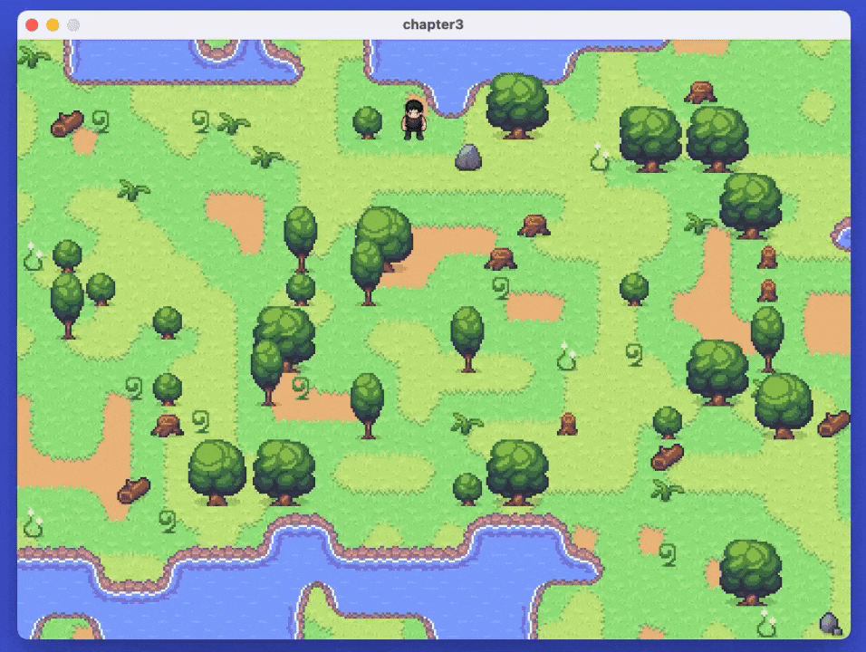
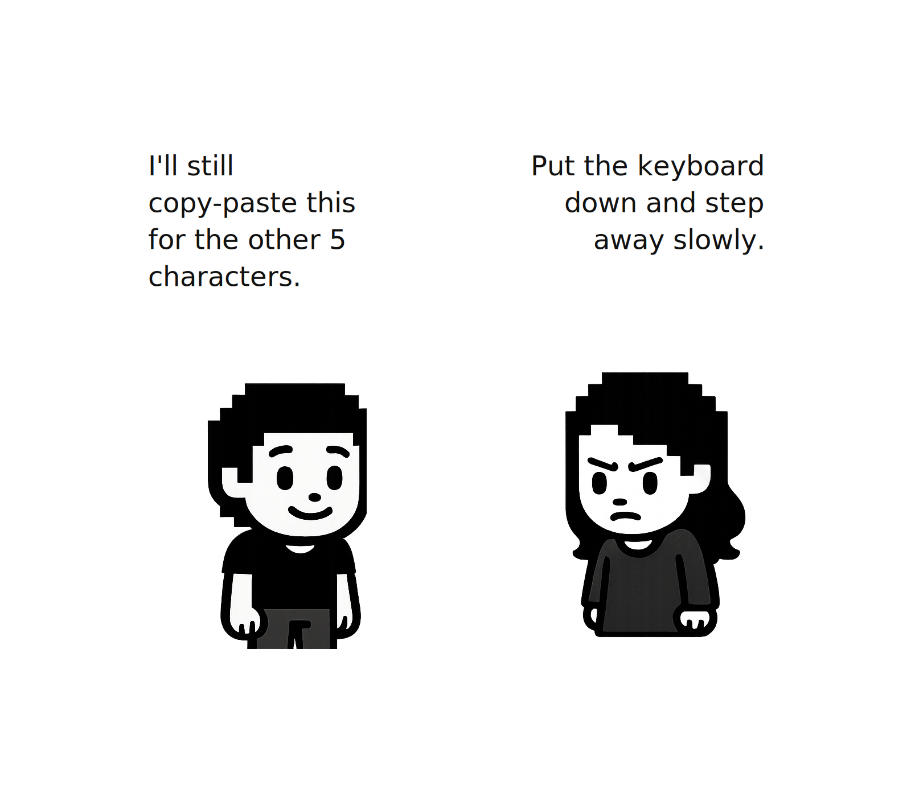
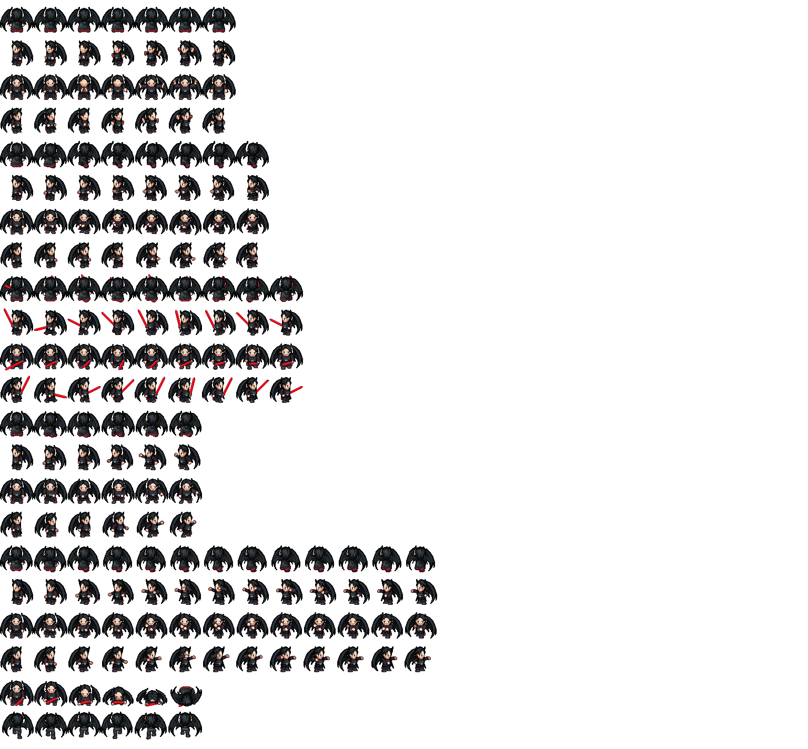
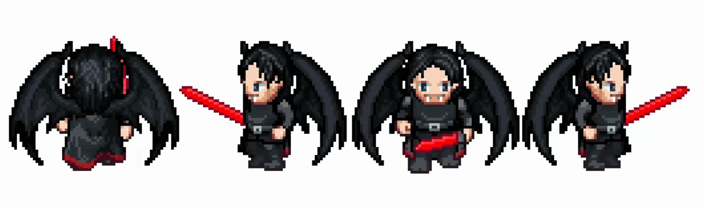
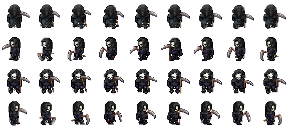
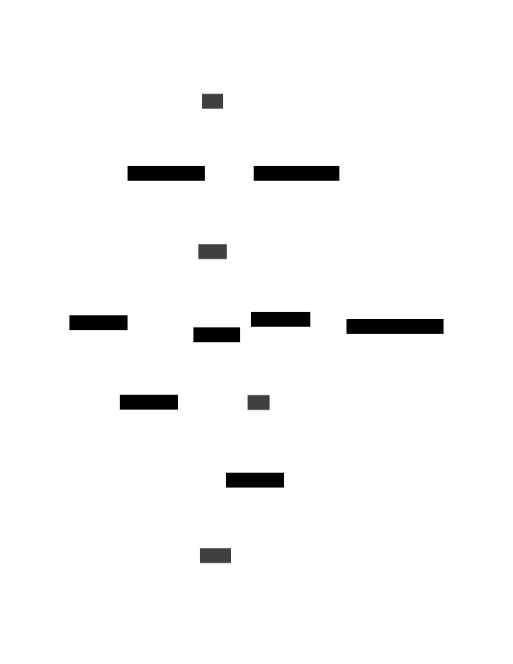
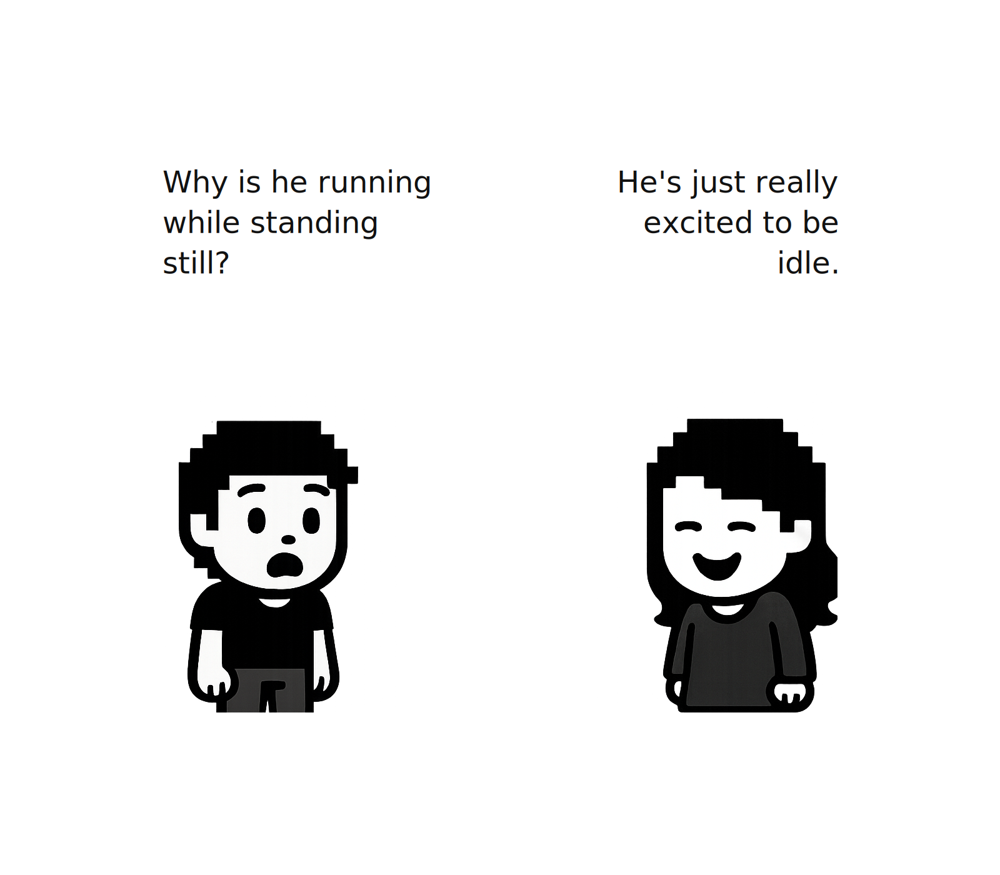
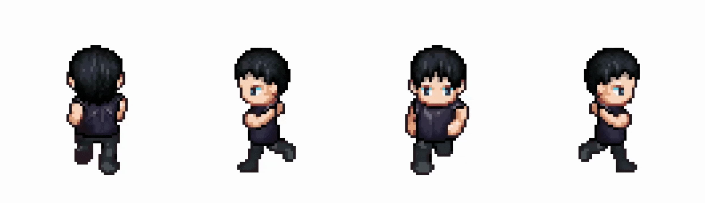
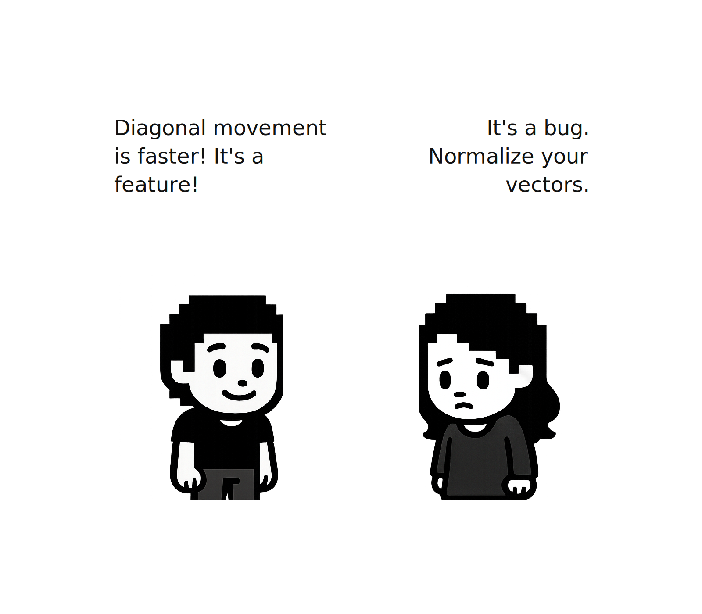
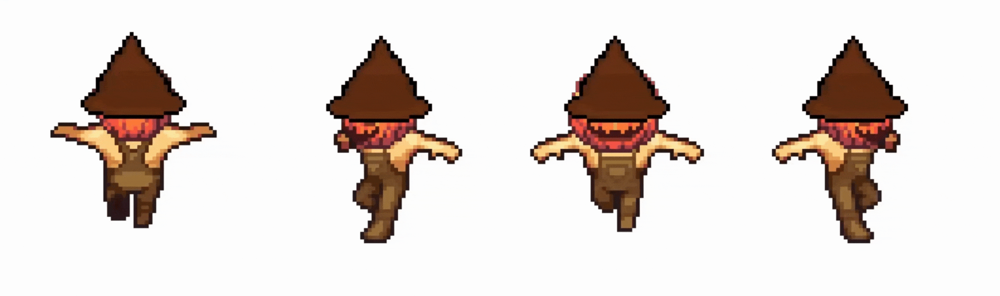

# 第三章：让数据流动




Nov 19, 2025

---

**关于 AI 辅助**  
*是的，本章的写作中使用了 AI 辅助。我负责结构设计、技术决策、方法选择、代码组织方式，并整理了一份学习者可能提出的问题清单。AI 帮助扩展了结构和解释内容，我全程进行了编辑。总的来说，我在每章上花费了大约 20-25 小时，包括编码和写作。如果任何部分感觉不对劲，请通过 [Reddit](https://www.reddit.com/r/bevy/) 或 [Discord](https://discord.com/invite/cD9qEsSjUH) 告诉我，我会进行改进。*

我本应在万圣节发布这一章，但我的代码太吓人了，总是自己跑掉。🎃 现在我们已经调试好了机器里的幽灵，让我们开始吧！

在本教程结束时，你将拥有一个灵活、数据驱动的角色系统，支持角色切换、多种动画类型（行走、奔跑、跳跃），所有配置都通过数据文件管理。

> **前置条件**：这是我们的 Bevy 教程系列的第三章。加入我们的 [社区](https://discord.com/invite/cD9qEsSjUH) 获取新版本的更新通知。在开始之前，请先完成 [第一章：让角色出现](/posts/bevy-rust-game-development-chapter-1/) 和 [第二章：让世界出现](/posts/bevy-rust-game-development-chapter-2/)，或者从 [此仓库](https://github.com/jamesfebin/ImpatientProgrammerBevyRust) 克隆第二章的代码来继续学习。

**在开始之前：** *我一直在努力改进这个教程，让你的学习之旅更加愉快。你的反馈很重要——请在 [Reddit](https://www.reddit.com/r/rust/comments/1p46n9c/the_impatient_programmers_guide_to_bevy_and_rust/)/[Discord](https://discord.com/invite/cD9qEsSjUH)/[LinkedIn](https://www.linkedin.com/posts/febinjohnjames_chapter-3-let-the-data-flow-continuing-activity-7397051447600664576-C3Bd/) 上分享你的困惑、问题或建议。喜欢吗？请告诉我哪些地方对你有帮助！让我们一起让 Rust 和 Bevy 的游戏开发变得更易于上手。*

## 硬编码角色的问题

在第一章中，我们构建了一个带移动和动画功能的角色，但**所有内容都是硬编码且高度耦合的**。

```rust
// 伪代码警告，请勿使用
// 来自第一章 player.rs - 所有内容都是硬编码的！
const TILE_SIZE ... = 64;        // ← 硬编码的精灵大小
const WALK_FRAMES ... = 9;      // ← 硬编码的帧数
const MOVE_SPEED ... = 140.0;    // ← 硬编码的移动速度
const ANIM_DT ... = 0.1;         // ← 硬编码的动画定时
```

### 维护噩梦

让我们看看添加第二个角色时会发生什么。你需要复制所有内容：

```rust
// 伪代码警告，请勿使用
// 第一个角色
const WARRIOR_TILE_SIZE ... = 64;
const WARRIOR_WALK_FRAMES ... = 9;
const WARRIOR_MOVE_SPEED ... = 140.0;

fn spawn_warrior(...) { /* 50 行代码 */ }
fn animate_warrior(...) { /* 80 行动画逻辑 */ }
fn warrior_row_zero_based(...) { /* 行映射 */ }

// 第二个角色 - 复制所有代码
const MAGE_TILE_SIZE ... = 64;
const MAGE_WALK_FRAMES ... = 6;
const MAGE_MOVE_SPEED ... = 100.0;

fn spawn_mage(...) { /* 50 行完全相同的代码 */ }
fn animate_mage(...) { /* 80 行完全相同的动画逻辑 */ }
fn mage_row_zero_based(...) { /* 不同的行映射 */ }
```

现在想象你在动画系统中发现了一个 bug。你需要在以下每个函数中修复它：

- `animate_warrior()`
- `animate_mage()`
- `animate_rogue()`
- `animate_paladin()`
- ……以及另外 6 个角色函数

漏掉一个？那个角色就坏了。想要添加"跳跃"动画？更新 10 个函数。想要改变移动方式？触及每个角色的代码。

这就是你想要避免的复制粘贴维护噩梦。



### 数据驱动设计

解决方案在于**数据导向编程**，这是一种将**事物是什么（数据）与事物做什么（行为）分离开来**的设计方法。

与其将角色属性与特定角色的代码紧密耦合，我们这样做：

**1. 将数据与代码分离**

将角色属性移到一个外部 `.ron` 配置文件中：

```ron
// characters.ron，所有角色都在一个文件中！
(
    characters: [
        (
            name: "Warrior",
            base_move_speed: 140.0,
            max_health: 150.0,
            animations: {...}
        ),
        (
            name: "Mage",
            base_move_speed: 100.0,
            max_health: 80.0,
            animations: {...}
        ),
    ]
)
```

**什么是 `.ron` 文件？**

RON 代表 **Rusty Object Notation**，是一种类似于 JSON 但专为 Rust 设计的数据格式。它人类可读，支持 Rust 类型如元组和结构体，并允许注释。可以把它想象成让 Rust 开发者感觉原生自然的 JSON。

| JSON | RON |
|------|-----|
| 每个键都需要引号 | 简单标识符可省略引号 |
| 不支持注释 | 支持行内和多行注释，直接在数据中编写文档 |
| 尾随逗号导致语法错误 | 允许尾随逗号 |
| 仅限于 JavaScript 类型 | 原生 Rust 类型（元组、结构体、枚举），与你的代码一致 |

RON 消除了 JSON 的冗余，同时添加了 Rust 开发者需要的功能，使其成为游戏配置的理想选择。

**2. 编写操作数据的系统**

构建适用于**任何**角色数据的通用系统：

```rust
// 伪代码警告，请勿使用
// 之前：代码 + 数据混杂在一起
fn animate_warrior(...) { /* 硬编码的战士逻辑 */ }
fn animate_mage(...) { /* 硬编码的法师逻辑 */ }

// 之后：操作数据的灵活系统
fn animate_characters(...) { 
    // 读取角色数据并相应地进行动画处理
    // 适用于战士、法师、盗贼或任何未来的角色！
}
```

**分离的好处**

当数据与代码分离时，同一个动画系统会自动适应任何角色。

修复 bug？**一个地方**。修改动画速度或帧数？**更新数据文件，无需修改代码**。切换角色？**从文件中加载不同的数据**。

但好处远不止于维护。这种分离还带来了硬编码值难以甚至无法实现的强大能力。

你可以从网络服务器运行时加载角色，实现可下载内容和实时游戏更新，而无需重新分发整个游戏二进制文件。

玩家可以通过简单地编辑 `.ron` 文件来创建自己的自定义角色，为用户生成内容打开大门。

**本章我们将构建的内容：**

虽然数据驱动的方法开启了所有这些可能性，但我们将从基础开始：

1. **创建和加载外部 `.ron` 文件**，包含所有角色数据
2. **通用动画系统**，适用于任何角色
3. **运行时角色切换**，使用数字键（1-6）
4. **每个角色多种动画类型**（行走、奔跑、跳跃）

准备好构建这个数据驱动的角色系统了吗？让我们开始吧！

## 设置角色模块

从[仓库](https://github.com/jamesfebin/ImpatientProgrammerBevyRust/tree/main/chapter3/src/assets)中找到第三章的项目文件，并将这些精灵表复制到你的项目的 `src/assets/` 目录中：

```
male_spritesheet.png
female_spritesheet.png
crimson_count_spritesheet.png
graveyard_reaper_spritesheet.png
lantern_warden_spritesheet.png
starlit_oracle_spritesheet.png
```



### 角色模式

`characters.ron` 中的每个条目都遵循相同的结构：

- `name`：在日志/UI 中显示的标识符。
- `max_health`、`base_move_speed`、`run_speed_multiplier`：游戏属性。
- `texture_path`：要加载的精灵表。
- `tile_size`：每帧的宽度/高度（像素）。
- `atlas_columns`：精灵表网格中的列数。
- `animations`：映射表，键为 `AnimationType`（`Walk`、`Run`、`Jump`），值为：
  - `start_row`：精灵表网格中的行号，从顶部开始从 0 计数。
  - `frame_count`：该动画的帧数。
  - `frame_time`：每帧的秒数。
  - `directional`：当精灵表包含该动画的四个方向行（上、左、下、右）垂直堆叠时为 `true`。如果为 `false`，Bevy 无论面朝方向都使用同一行。

创建一个 `src/assets/characters/` 文件夹，从[仓库](https://github.com/jamesfebin/ImpatientProgrammerBevyRust/blob/main/chapter3/src/assets/characters/characters.ron)复制 `characters.ron` 文件并放入该文件夹。它包含了全部 6 个角色的数据。

### 设置配置

有了数据文件后，我们需要能够读取它并生成角色的代码。我们将用新的 `characters` 模块替换第一章的 `player.rs`。

因此删除 `src/player.rs`，并从 `main.rs` 中移除 `mod player;` 和 `PlayerPlugin` 的使用。

创建一个新文件夹 `src/characters/`，并在其中创建文件 `config.rs`。

```
characters/
├── config.rs
```

首先我们需要定义哪些动画类型是可能的。目前我们只支持 `Walk`、`Run` 和 `Jump` 动画。`AnimationDefinition` 捕获了每个动画在精灵表中的位置、有多少帧以及播放速度。

```rust
// characters/config.rs
use bevy::prelude::*;
use serde::{Deserialize, Serialize};
use std::collections::HashMap;

#[derive(Debug, Clone, Copy, PartialEq, Eq, Hash, Serialize, Deserialize)]
pub enum AnimationType {
    Walk,
    Run,
    Jump
}

#[derive(Debug, Clone, Serialize, Deserialize)]
pub struct AnimationDefinition {
    pub start_row: usize,
    pub frame_count: usize,
    pub frame_time: f32,
    pub directional: bool, // true = 4 行（每个方向一行），false = 1 行
}
```

**`Hash`、`Serialize` 和 `Deserialize` 是什么？**  
`Hash` 让我们可以将 `AnimationType` 用作 `HashMap` 的键，这样检索 `AnimationType::Run` 的设置就只是字典查询。`Serialize` 和 `Deserialize` 允许 Rust 在加载或保存角色数据时自动将这些结构体转换为 `.ron` 文本（以及反向转换）。

有了动画模式之后，我们可以定义 `CharacterEntry`，这个资产将从 `characters.ron` 加载。它把角色属性、精灵元数据和动画映射表捆绑在一起，这样每个系统都可以从单个结构体记录中获取所需信息。

将以下代码追加到 `characters/config.rs`：

```rust
// 追加到 characters/config.rs
#[derive(Component, Asset, TypePath, Debug, Clone, Serialize, Deserialize)]
pub struct CharacterEntry {
    pub name: String,
    pub max_health: f32,
    pub base_move_speed: f32,
    pub run_speed_multiplier: f32,
    pub texture_path: String,
    pub tile_size: u32,
    pub atlas_columns: usize,
    pub animations: HashMap<AnimationType, AnimationDefinition>,
}

impl CharacterEntry {
    pub fn calculate_max_animation_row(&self) -> usize {
        self.animations
            .values()
            .map(|def| if def.directional { def.start_row + 3 } else { def.start_row })
            .max()
            .unwrap_or(0)
    }
}

#[derive(Asset, TypePath, Debug, Clone, Serialize, Deserialize)]
pub struct CharactersList {
    pub characters: Vec<CharacterEntry>,
}
```

`calculate_max_animation_row` 辅助方法检查每个动画定义，以确定纹理图集需要多少行。

像 `Walk` 这样的方向性动画通常占用四行堆叠（上、左、下、右），而其他动画（比如攀爬动画）可能只需要单行而不管面朝方向。这个辅助方法保持这些差异的数据驱动性，使图集加载代码保持通用。

**`self.animations` 是在依次调用多个函数吗？**  
是的！这叫做**方法链**。每个函数按顺序执行：首先 `.values()` 从 HashMap 中获取所有动画定义，然后 `.map()` 转换每一个，最后 `.max()` 找到最大值。它们从上到下依次执行。

**map 是做什么的，map 里面是一个闭包吗？**  
`map` 转换集合中的每个元素。是的，`|def|` 是一个**闭包**，正如我们在前一章中学到的。它接收每个动画定义（`def`）并计算其最大行：如果动画是方向性的（4 行），则返回 `start_row + 3`；否则只返回 `start_row`。可以把它理解为"对每个动画，计算它的结束行"。

**`unwrap_or` 是什么？**  
`max()` 返回一个 `Option<usize>`，如果有动画则可能是 `Some(number)`，如果 HashMap 为空则是 `None`。`unwrap_or(0)` 的意思是"如果你得到了数字，就给我数字；如果你得到了 `None`，就用 `0` 代替。"这防止了当角色没有定义动画时程序崩溃。

`CharactersList` 将所有 `CharacterEntry` 配置组合成一个可加载的资产，这样 Bevy 可以从一个 JSON/RON 文件中读取每个角色的数据，而不是加载多个单独的文件。

**使用 `Asset`、`TypePath` 宏的目的是什么？**  
`Asset` 只是告诉 Bevy"这个结构体是你可以从磁盘加载并存储在资源服务器中的内容。"`TypePath` 为类型赋予 Bevy 一个唯一名称，这样它以后就能确切地知道你请求的是哪个资产。它们共同将 `CharacterEntry`/`CharactersList` 转变为头等可加载数据，就像纹理或音频文件已经支持的方式一样。

**`HashMap<AnimationType, AnimationDefinition>` 是做什么的？**  
每个角色需要不同的定时和精灵行来处理 `Walk`、`Run`、`Jump` 等。`HashMap` 就是一个查找表，键为 `AnimationType`，所以当动画系统请求 `AnimationType::Run` 时，它能立即收到对应的 `AnimationDefinition`（起始行、帧数、帧速度、方向标志）。

现在我们有了存储角色信息的数据结构，需要一个系统来使其生动起来。

## 动画引擎

在这里我们将构建动画引擎来解释我们的数据结构。

创建一个新文件 `src/characters/animation.rs`。这将存放让精灵生动起来的逻辑。

```
characters/
├── config.rs
├── animation.rs  <- 创建此文件
```

我们的动画引擎需要帮助我们完成以下工作：

1. **方向追踪**：当角色向右移动时，你希望他们面朝右。当他们向上移动时，应该面朝上。我们需要一个将移动转换为面朝方向的系统。
2. **状态管理**：我们需要知道*何时*切换动画。玩家刚刚开始奔跑？刚刚停止？刚刚跳跃？这些转换时刻就是我们需要重置动画的时机。
3. **帧计算**：给定角色的当前状态（"向左奔跑"），我们现在应该显示精灵表中的哪一帧？

让我们逐个构建。

### 方向追踪



当玩家按下方向键时，我们会得到一个速度向量，比如向右移动的 `Vec2 { x: 1.0, y: 0.0 }`。但我们的精灵表不理解向量——它有专门的行对应上、下、左、右动画。

我们需要将"朝这个方向移动"翻译为"显示精灵的这一特定行"。这就是 `Facing` 枚举的作用。

将以下代码添加到 `src/characters/animation.rs`：

```rust
// src/characters/animation.rs
use bevy::prelude::*;
use serde::{Deserialize, Serialize};
use crate::characters::config::{CharacterEntry, AnimationType};

// 默认动画定时（10 FPS = 每帧 0.1 秒）
pub const DEFAULT_ANIMATION_FRAME_TIME: f32 = 0.1;

#[derive(Debug, Clone, Copy, PartialEq, Eq, Hash, Serialize, Deserialize)]
pub enum Facing {
    Up,
    Left,
    Down,
    Right,
}

impl Facing {
    // 将速度向量转换为离散方向
    pub fn from_direction(direction: Vec2) -> Self {
        if direction.x.abs() > direction.y.abs() {
            if direction.x > 0.0 { Facing::Right } else { Facing::Left }
        } else {
            if direction.y > 0.0 { Facing::Up } else { Facing::Down }
        }
    }
    
    // 辅助方法：将方向映射到行偏移 (0, 1, 2, 3)
    fn direction_index(self) -> usize {
        match self {
            Facing::Up => 0,
            Facing::Left => 1,
            Facing::Down => 2,
            Facing::Right => 3,
        }
    }
}
```

**将移动转换为面朝方向**

`from_direction` 函数接收一个速度向量并判断哪个方向占主导。如果玩家斜向移动（x 和 y 都不为零），我们选择较强的分量。主要向右，略带向上？面朝右。主要向上，略带向右？面朝上。这确保了你的角色在游戏过程中始终面向最相关的方向。

**将方向映射到精灵行**

我们的精灵表遵循一个约定。对于像"行走"这样的方向性动画，行的组织方式为：

- 第 0 行：向上行走
- 第 1 行：向左行走
- 第 2 行：向下行走
- 第 3 行：向右行走

`direction_index` 函数将我们的 `Facing` 枚举转换为这些行偏移（0, 1, 2, 3）。所以当我们知道玩家面朝 `Down` 并且我们想播放从第 8 行开始的"行走"动画时，我们计算：`8 + Facing::Down.direction_index()` = `8 + 2` = 第 10 行。这就是图集中"向下行走"帧所在的位置。



### 追踪动画状态

我们需要知道*何时*切换动画。如果你的角色从静止过渡到奔跑，我们需要检测到那个时刻并从第 0 帧重新开始动画。否则，奔跑动画可能从中途开始，看起来不连贯。

我们需要这些组件来追踪动画的*当前*状态。

- **`AnimationController`**：它知道我们*想要*播放什么动画（例如，"奔跑"）以及我们面朝哪个方向。
- **`AnimationState`**：它追踪我们是在移动还是跳跃，更重要的是，上一帧我们是否在移动。这有助于我们检测状态*变化*（比如开始奔跑），从而重置动画定时器。
- **`AnimationTimer`**：控制帧更新的速度。

将这些组件添加到 `src/characters/animation.rs`：

```rust
// 追加到 src/characters/animation.rs
// 保存动画配置的组件
#[derive(Component)]
pub struct AnimationController {
    pub current_animation: AnimationType,
    pub facing: Facing,
}

impl Default for AnimationController {
    fn default() -> Self {
        Self {
            current_animation: AnimationType::Walk,
            facing: Facing::Down,
        }
    }
}

#[derive(Component, Default)]
pub struct AnimationState {
    pub is_moving: bool,
    pub was_moving: bool,
    pub is_jumping: bool,
    pub was_jumping: bool,
}

#[derive(Component, Deref, DerefMut)]
pub struct AnimationTimer(pub Timer);
```

*你可能注意到我们使用了布尔标志位（`is_moving`、`was_moving`、`is_jumping`、`was_jumping`）来追踪动画状态。虽然这对我们当前的简单情况有效，但它并不是管理状态转换的最佳方法。随着你的游戏变得更加复杂（添加攻击、闪避、攀爬等），管理所有这些布尔组合将变得容易出错且难以维护。*

*在第四章中，我们将学习**状态机设计模式**，它提供了一种更清晰、更可扩展的方式来处理状态转换。*

*现在，我们使用这种更简单的方法，以便专注于理解动画系统的基础知识。*

### 帧计算

现在我们知道*要播放哪个*动画（行走、奔跑、跳跃）以及*角色面朝哪个*方向。但是如何将其转化为"现在从纹理图集中显示第 47 帧"呢？

把精灵表想象成一个编号网格，从左到右、从上到下读取。如果"向下行走"在第 2 行且网格有 12 列，那么该动画的第一帧在位置 24（因为我们跳过了前 2 行：2 × 12 = 24）。如果动画有 6 帧，我们将循环经过位置 24, 25, 26, 27, 28, 29，然后回到 24。

我们将创建一个 `AnimationClip` 结构体来为我们处理这个计算。

```rust
// 追加到 src/characters/animation.rs
// 运行时动画片段辅助
#[derive(Clone, Copy)]
pub struct AnimationClip {
    first: usize,
    last: usize,
}

impl AnimationClip {
    pub fn new(row: usize, frame_count: usize, atlas_columns: usize) -> Self {
        let first = row * atlas_columns;
        Self {
            first,
            last: first + frame_count - 1,
        }
    }
    
    pub fn start(self) -> usize {
        self.first
    }
    
    // 检查某一帧索引是否属于此片段
    pub fn contains(self, index: usize) -> bool {
        (self.first..=self.last).contains(&index)
    }
    
    // 计算下一帧，到达末尾时循环回到起点
    pub fn next(self, index: usize) -> usize {
        if index >= self.last {
            self.first
        } else {
            index + 1
        }
    }
    
    // 检查动画是否已完成（用于非循环动画，如跳跃）
    pub fn is_complete(self, current_index: usize, timer_finished: bool) -> bool {
        current_index >= self.last && timer_finished
    }
}
```

`AnimationClip` 结构体只存储两个数字：特定动画序列的 `first` 和 `last` 帧索引。`new` 方法根据行号、帧数和图集宽度计算这些索引。

`start` 方法返回动画开始的帧索引。`contains` 方法检查给定的帧索引是否属于此片段（用于检测我们是否误入了错误的动画）。`next` 方法前进到下一帧，到达末尾时自动循环回起点。

`is_complete` 方法检查是否已到达最后一帧且定时器已结束——这对于像跳跃这样的非循环动画至关重要，我们需要知道何时过渡回行走。

**将片段连接到控制器**

现在我们有了表示帧范围的方法，需要将其连接到 `AnimationController`。记住，控制器知道*要播放什么*动画（"奔跑"）以及*我们面朝哪个*方向（"左"）。我们将添加一个辅助方法，将此信息与角色的配置数据结合，生成正确的 `AnimationClip`。

现在我们可以向 `AnimationController` 添加一个方法，以便根据角色的配置轻松获取当前片段：

```rust
// 追加到 src/characters/animation.rs
impl AnimationController {
    pub fn get_clip(&self, config: &CharacterEntry) -> Option<AnimationClip> {
        // 1. 获取定义（例如 "Walk" 数据）
        let def = config.animations.get(&self.current_animation)?;
        
        // 2. 根据面朝方向计算实际行号
        let row = if def.directional {
            def.start_row + self.facing.direction_index()
        } else {
            def.start_row
        };
        
        // 3. 创建片段
        Some(AnimationClip::new(row, def.frame_count, config.atlas_columns))
    }
}
```

### 动画角色

最后，将所有内容串联起来的系统。这个系统每帧运行，执行以下操作：

1. 检查动画是否发生变化（例如，开始移动）。
2. 如果发生变化，重置定时器和帧索引。
3. 如果没有变化，推进定时器并前进帧。

```rust
// 追加到 src/characters/animation.rs
// 通用动画系统 - 适用于所有实体
pub fn animate_characters(
    time: Res<Time>,
    mut query: Query<(
        &AnimationController,
        &AnimationState,
        &mut AnimationTimer,
        &mut Sprite,
        &CharacterEntry,
    )>,
) {
    for (animated, state, mut timer, mut sprite, config) in query.iter_mut() {
        
        let Some(atlas) = sprite.texture_atlas.as_mut() else { continue; };
        
        // 获取当前状态/方向对应的正确片段
        let Some(clip) = animated.get_clip(config) else { continue; };
        
        // 获取定时信息
        let Some(anim_def) = config.animations.get(&animated.current_animation) else { continue; };
        
        // 安全措施：如果由于某种原因我们落在了片段外的帧上，重置
        if !clip.contains(atlas.index) {
            atlas.index = clip.start();
            timer.0.reset();
        }
        
        // 检测状态变化
        let just_started_moving = state.is_moving && !state.was_moving;
        let just_stopped_moving = !state.is_moving && state.was_moving;
        let just_started_jumping = state.is_jumping && !state.was_jumping;
        let just_stopped_jumping = !state.is_jumping && state.was_jumping;
        
        let should_animate = state.is_jumping || state.is_moving;
        let animation_changed = just_started_moving || just_started_jumping 
                              || just_stopped_moving || just_stopped_jumping;
        
        if animation_changed {
            // 重置动画
            atlas.index = clip.start();
            timer.0.set_duration(std::time::Duration::from_secs_f32(anim_def.frame_time));
            timer.0.reset();
        } else if should_animate {
            // 推进动画
            timer.tick(time.delta());
            if timer.just_finished() {
                atlas.index = clip.next(atlas.index);
            }
        } else {
            // 闲置时（没有移动或跳跃），停留在第 0 帧
            if atlas.index != clip.start() {
                atlas.index = clip.start();
            }
        }
    }
}

// 辅助方法：在帧结束时更新 "was_moving" 标志
pub fn update_animation_flags(mut query: Query<&mut AnimationState>) {
    for mut state in query.iter_mut() {
        state.was_moving = state.is_moving;
        state.was_jumping = state.is_jumping;
    }
}
```

**动画系统如何工作**

动画系统有三个分支处理不同的场景：

1. **动画发生变化**（开始/停止移动或跳跃）：重置到第 0 帧，并更新新动画的定时器持续时间。
2. **应该动画**（正在主动移动或跳跃）：推进定时器并在帧之间前进。
3. **闲置状态**（静止站立）：确保停留在第 0 帧，即中立站姿。

**为什么状态变化检测很重要**

第一个分支依赖于检测状态变化的*精确时刻*。`is_moving` 告诉我们当前状态（"我现在在移动吗？"），而 `was_moving` 告诉我们上一帧的状态（"上一帧我在移动吗？"）。当 `is_moving` 为真但 `was_moving` 为假时，我们就知道玩家*刚刚*按下了移动键。

这种检测对于平滑过渡至关重要。没有它，动画会从离开的地方继续播放。想象一下你的角色的行走循环在第 5 帧，然后你按下跳跃——不重置的话，跳跃动画会从第 5 帧开始而不是第 0 帧，看起来像是坏了。

第三个分支（闲置状态）处理不同的情况：当玩家*停止*移动时，我们过渡到行走动画，但需要确保显示闲置姿势（第 0 帧），而不是行走循环停止时的任何帧。





**为什么我们需要 `update_animation_flags`？**  
我们需要 `update_animation_flags` 在所有逻辑*之后*运行，这样在*下一*帧中，`was_moving` 才能正确反映上一帧的状态。这使我们能够检测到状态变化的精确时刻。

## 移动系统



我们的动画引擎可以显示正确的帧，但它需要知道*玩家在做什么*。我们之前构建的 `AnimationController` 存储了当前的动画状态（"我正在向左奔跑"），但需要某种东西来根据玩家输入*更新*该状态。这就是移动系统的用武之地。它读取键盘输入，移动角色，并告诉 `AnimationController` 播放哪个动画。

创建一个新文件 `src/characters/movement.rs`：

```
characters/
├── config.rs
├── animation.rs
├── movement.rs  <- 创建此文件
```

移动系统有三个职责：

1. **输入读取**：将方向键按下转换为方向向量
2. **移动计算**：应用速度和增量时间，平滑移动角色
3. **动画协调**：告诉动画系统何时在行走、奔跑和跳跃之间切换

下面是我们的实现方式：

### 读取玩家输入

当玩家按下方向键时，我们需要将这些离散的按键转换为连续的方向向量。如果他们同时按下上和右，我们希望得到 `Vec2 { x: 1.0, y: 1.0 }` 来实现斜向移动。

将以下代码添加到 `src/characters/movement.rs`：

```rust
// src/characters/movement.rs
use bevy::prelude::*;
use crate::characters::animation::*;
use crate::characters::config::{CharacterEntry, AnimationType};

/// 读取方向输入并返回方向向量
fn read_movement_input(input: &ButtonInput<KeyCode>) -> Vec2 {
    const MOVEMENT_KEYS: [(KeyCode, Vec2); 4] = [
        (KeyCode::ArrowLeft, Vec2::NEG_X),
        (KeyCode::ArrowRight, Vec2::X),
        (KeyCode::ArrowUp, Vec2::Y),
        (KeyCode::ArrowDown, Vec2::NEG_Y),
    ];
    
    MOVEMENT_KEYS.iter()
        .filter(|(key, _)| input.pressed(*key))
        .map(|(_, dir)| *dir)
        .sum()
}
```

**这里发生了什么？**

我们定义了一个常量数组，将每个方向键映射到其方向向量。`Vec2::NEG_X` 表示"负 X 方向"（左），`Vec2::X` 表示"正 X 方向"（右），依此类推。

然后我们遍历所有四个键，筛选出当前被按下的键，提取它们的方向向量，然后求和。如果上和右同时按下，我们会得到 `Vec2::Y + Vec2::X` = `Vec2 { x: 1.0, y: 1.0 }`。

**`(keys, _)` 和 `(_, dir)` 中的 `_` 是什么？**

`_`（下划线）是 Rust 在模式匹配中的"我不在乎"占位符。在解构元组时，使用 `_` 来忽略你不需要的值：

- 在 `(key, _)` 中：我们只需要 `key` 来检查它是否被按下，所以用 `_` 忽略方向
- 在 `(_, dir)` 中：我们只需要 `dir`（方向向量），所以用 `_` 忽略键

这比命名未使用的变量如 `(key, _unused_dir)` 或 `(_unused_key, dir)` 更可读。Rust 的编译器也知道这些值是被有意忽略的，所以你不会收到未使用变量的警告。

### 计算移动速度

不同的角色以不同的速度移动。男性角色可能较慢，而女性角色较快。我们还需要支持奔跑（按住 Shift）。

添加这个辅助函数：

```rust
// 追加到 src/characters/movement.rs
/// 根据角色配置和奔跑状态计算移动速度
fn calculate_movement_speed(character: &CharacterEntry, is_running: bool) -> f32 {
    if is_running {
        character.base_move_speed * character.run_speed_multiplier
    } else {
        character.base_move_speed
    }
}
```

这从我们的数据文件中读取角色的 `base_move_speed`，如果玩家按住 Shift，则乘以 `run_speed_multiplier`。所有速度值都是数据驱动的——没有硬编码常量！

### 玩家标记

我们需要一种方法来标识哪个实体是玩家。我们将使用一个简单的标记组件：

```rust
// 追加到 src/characters/movement.rs
/// 玩家实体的标记组件
#[derive(Component)]
pub struct Player;
```

这个组件没有数据，只是一个标签。当我们生成玩家实体时，我们会附加这个组件。然后我们的移动系统可以查询带有 `Player` 的实体来找到玩家。我们在第一章中已经学习过这个了。

### 移动系统

现在我们将所有内容串联起来。这个系统每帧运行，读取输入，计算移动，并更新动画状态：

```rust
// 追加到 src/characters/movement.rs
/// 处理玩家移动输入并更新变换/动画
pub fn move_player(
    input: Res<ButtonInput<KeyCode>>,
    time: Res<Time>,
    mut query: Query<(
        &mut Transform, 
        &mut AnimationController,
        &mut AnimationState,
        &CharacterEntry,
    ), With<Player>>,
) {
    let Ok((mut transform, mut animated, mut state, character)) = query.single_mut() else {
        return;
    };
    
    let direction = read_movement_input(&input);
    
    // 检查跳跃输入（空格键）
    if input.just_pressed(KeyCode::Space) {
        state.is_jumping = true;
        animated.current_animation = AnimationType::Jump;
    }
    
    // 检查是否在奔跑
    let is_running = input.pressed(KeyCode::ShiftLeft) || input.pressed(KeyCode::ShiftRight);
    
    // 处理移动
    if direction != Vec2::ZERO {
        let move_speed = calculate_movement_speed(character, is_running);
        let delta = direction.normalize() * move_speed * time.delta_secs();
        transform.translation += delta.extend(0.0);
        
        animated.facing = Facing::from_direction(direction);
        
        // 仅在非跳跃时更新动画
        if !state.is_jumping {
            state.is_moving = true;
            animated.current_animation = if is_running {
                AnimationType::Run
            } else {
                AnimationType::Walk
            };
        }
    } else if !state.is_jumping {
        state.is_moving = false;
        animated.current_animation = AnimationType::Walk;
    }
}
```

**逐一解析：**

1. **查询玩家**：`With<Player>` 过滤出只有 `Player` 组件的实体。`single_mut()` 获取唯一的玩家实体。
2. **读取输入**：从方向键获取方向向量。
3. **处理跳跃**：如果刚刚按下空格，设置 `is_jumping` 并切换到跳跃动画。
4. **检查奔跑**：是否按下了任意 Shift 键？
5. **移动角色**：如果有输入，归一化方向（使斜向移动不会更快），乘以速度和增量时间，然后更新变换。



6. **更新面朝方向**：使用我们的 `Facing::from_direction` 辅助方法确定面朝方向。
7. **更新动画**：如果不在跳跃，根据是否按住 Shift 设置动画为奔跑或行走。

### 处理跳跃完成



跳跃动画是特殊的，它们有开始和结束。与行走或奔跑不同（它们会永远循环），跳跃播放一次后我们需要返回闲置状态。

添加这个系统：

```rust
// 追加到 src/characters/movement.rs
/// 监视跳跃动画完成并重置状态
pub fn update_jump_state(
    mut query: Query<(
        &mut AnimationController,
        &mut AnimationState,
        &AnimationTimer,
        &Sprite,
        &CharacterEntry,
    ), With<Player>>,
) {
    for (mut animated, mut state, timer, sprite, config) in query.iter_mut() {
        if !state.is_jumping {
            continue;
        }
        
        let Some(atlas) = sprite.texture_atlas.as_ref() else {
            continue;
        };
        
        let Some(clip) = animated.get_clip(config) else {
            continue;
        };
        
        // 检查跳跃动画是否已完成
        if clip.is_complete(atlas.index, timer.just_finished()) {
            state.is_jumping = false;
            animated.current_animation = AnimationType::Walk;
        }
    }
}
```

这个系统检查跳跃动画是否已达到最后一帧且定时器已结束（使用我们之前在 `AnimationClip` 中定义的 `is_complete` 方法）。如果是，它将 `is_jumping` 重置为 false 并切换回行走动画。玩家随后可以正常移动。

**`.as_ref()` 是什么？**

在动画系统中，我们使用了 `.as_mut()` 来获取纹理图集的可变引用，以便更改帧索引。在这里，我们只需要*读取*当前帧索引，而不是修改它。`.as_ref()` 方法将 `Option<TextureAtlas>` 转换为 `Option<&TextureAtlas>`，给我们一个只读引用。

## 生成角色

我们有动画、移动和数据结构，但屏幕上还没有实际的角色！生成系统负责：

1. 加载 `characters.ron` 文件
2. 创建具有所有必要组件的玩家实体
3. 从精灵表设置纹理图集
4. 允许使用数字键（1-6）在运行时切换角色

创建一个新文件 `src/characters/spawn.rs`：

```
characters/
├── config.rs
├── animation.rs
├── movement.rs
├── spawn.rs  <- 创建此文件
```

### 角色管理的资源

我们需要两个资源：一个用于追踪当前激活的角色，另一个用于持有对已加载角色数据文件的引用。

将以下代码添加到 `src/characters/spawn.rs`：

```rust
// src/characters/spawn.rs
use bevy::prelude::*;
use crate::characters::animation::*;
use crate::characters::config::{CharacterEntry, CharactersList};
use crate::characters::movement::Player;

const PLAYER_SCALE: f32 = 0.8;
const PLAYER_Z_POSITION: f32 = 20.0;

#[derive(Resource, Default)]
pub struct CurrentCharacterIndex {
    pub index: usize,
}

#[derive(Resource)]
pub struct CharactersListResource {
    pub handle: Handle<CharactersList>,
}
```

**这些资源是做什么用的？**

- `CurrentCharacterIndex`：追踪当前激活的角色（0 = 第一个角色，1 = 第二个，等等）
- `CharactersListResource`：存储指向已加载的 `characters.ron` 文件的句柄。句柄就像是对 Bevy 正在加载或已加载的资产的引用。

**如何决定使用资源还是组件？**

对属于特定实体的数据使用**组件**（如玩家的生命值、位置或动画状态）。对不绑定到任何特定实体的全局数据使用**资源**（如当前关卡编号、游戏设置，或者在我们的例子中，哪个角色是激活的）。可以这样理解：如果你会问"这个数据属于哪个实体？"而答案是"所有实体"或"没有实体"，那么它很可能是一个**资源**。


**`Default` 宏是什么？**

`Default` 派生宏自动实现了 `Default` trait，为结构体提供默认值。对于 `usize`，Rust 的默认值是 0。当你稍后在章节中使用 `init_resource::<CurrentCharacterIndex>()` 时，Bevy 内部会调用 `CurrentCharacterIndex::default()`，它会创建 `CurrentCharacterIndex { index: 0 }`。

这等效于手动编写：

```rust
// 伪代码警告，请勿使用
impl Default for CurrentCharacterIndex {
    fn default() -> Self {
        Self { index: 0 }
    }
}
```

但是派生宏为我们做了这些！不同的类型有不同的默认值：`bool` → `false`，`String` → `""`，`Option<T>` → `None`，等等。

### 创建纹理图集布局

还记得我们讨论过精灵表是帧的网格吗？Bevy 不会自动知道一帧在哪里结束、另一帧在哪里开始。我们需要给它指示："每帧是 64×64 像素，有 12 列和 8 行。"这就是纹理图集布局的作用——它就像一张地图，告诉 Bevy 如何在精灵表中导航。

这个辅助函数创建了那张地图：

```rust
// 追加到 src/characters/spawn.rs
/// 为角色创建纹理图集布局
fn create_character_atlas_layout(
    atlas_layouts: &mut ResMut<Assets<TextureAtlasLayout>>,
    character_entry: &CharacterEntry,
) -> Handle<TextureAtlasLayout> {
    let max_row = character_entry.calculate_max_animation_row();
    atlas_layouts.add(TextureAtlasLayout::from_grid(
        UVec2::splat(character_entry.tile_size),
        character_entry.atlas_columns as u32,
        (max_row + 1) as u32,
        None,
        None,
    ))
}
```

逐一解析：

- `calculate_max_animation_row()`：我们之前在 `CharacterEntry` 中定义的。它根据所有动画计算出精灵表需要多少行。
- `UVec2::splat(tile_size)`：创建一个二维向量，其中 x 和 y 都是图块大小（例如，每帧 64×64 像素）。
- `from_grid(...)`：告诉 Bevy"这个纹理是一个网格，有 X 列和 Y 行，每个单元格是这个大小。"

### 生成玩家实体

现在我们来生成玩家。但有一个问题：从磁盘加载文件需要时间。我们不能等 `characters.ron` 加载完成后再创建玩家实体——那会在启动时冻结游戏。

所以我们采用两阶段方法：立即创建一个"占位"实体，然后在数据加载完成后填充详细信息。

**阶段 1：创建实体**

```rust
// 追加到 src/characters/spawn.rs
pub fn spawn_player(
    mut commands: Commands,
    asset_server: Res<AssetServer>,
    mut character_index: ResMut<CurrentCharacterIndex>,
) {
    // 加载角色列表
    let characters_list_handle: Handle<CharactersList> = asset_server.load("characters/characters.ron");
    
    // 将句柄存储在资源中
    commands.insert_resource(CharactersListResource {
        handle: characters_list_handle,
    });
    
    // 初始化为第一个角色
    character_index.index = 0;
    
    // 生成玩家实体（将在资产加载后初始化）
    commands.spawn((
        Player,
        Transform::from_translation(Vec3::new(0.0, 0.0, PLAYER_Z_POSITION))
            .with_scale(Vec3::splat(PLAYER_SCALE)),
        Sprite::default(),
    ));
}
```

这个系统在启动时运行一次。它加载 `characters.ron` 文件，将句柄存储在资源中，然后生成一个只有 `Player` 标记、`Transform` 和空 `Sprite` 的玩家实体。我们还不能完全初始化它，因为资产仍在加载中。

**为什么不立即加载所有内容？**

Bevy 中的资产加载是异步的。当你调用 `asset_server.load()` 时，Bevy 开始在后台加载文件。可能需要几帧（或更长时间，对于大文件）。我们需要等到它准备就绪。

**阶段 2：加载完成后初始化**

```rust
// 追加到 src/characters/spawn.rs
pub fn initialize_player_character(
    mut commands: Commands,
    asset_server: Res<AssetServer>,
    mut atlas_layouts: ResMut<Assets<TextureAtlasLayout>>,
    characters_lists: Res<Assets<CharactersList>>,
    character_index: Res<CurrentCharacterIndex>,
    characters_list_res: Option<Res<CharactersListResource>>,
    mut query: Query<Entity, (With<Player>, Without<AnimationController>)>,
) {
    let Some(characters_list_res) = characters_list_res else {
        return;
    };
    
    for entity in query.iter_mut() {
        let Some(characters_list) = characters_lists.get(&characters_list_res.handle) else {
            continue;
        };
        
        if character_index.index >= characters_list.characters.len() {
            continue;
        };
        
        let character_entry = &characters_list.characters[character_index.index];
        let texture = asset_server.load(&character_entry.texture_path);
        let layout = create_character_atlas_layout(&mut atlas_layouts, character_entry);
        
        let sprite = Sprite::from_atlas_image(
            texture,
            TextureAtlas {
                layout,
                index: 0,
            },
        );
        
        commands.entity(entity).insert((
            AnimationController::default(),
            AnimationState::default(),
            AnimationTimer(Timer::from_seconds(DEFAULT_ANIMATION_FRAME_TIME, TimerMode::Repeating)),
            character_entry.clone(),
            sprite,
        ));
    }
}
```

在阶段 1 中，我们开始在后台加载 `characters.ron`。但我们不知道它何时会完成——可能是下一帧，也可能是 10 帧之后。

这个系统每帧运行，检查："文件加载好了吗？是否有玩家实体仍需要初始化？"

查询条件 `(With<Player>, Without<AnimationController>)` 会找到已存在但尚未完全设置的玩家实体。一旦文件加载完成，`characters_lists.get()` 返回成功，我们终于可以添加所有动画组件了。

我们获取角色数据，加载其纹理，创建图集布局，并插入所有必要的组件。

### 角色切换

我们数据驱动系统最酷的功能之一：按数字键在运行时切换角色！

```rust
// 追加到 src/characters/spawn.rs
pub fn switch_character(
    input: Res<ButtonInput<KeyCode>>,
    mut character_index: ResMut<CurrentCharacterIndex>,
    characters_lists: Res<Assets<CharactersList>>,
    characters_list_res: Option<Res<CharactersListResource>>,
    mut query: Query<(
        &mut CharacterEntry,
        &mut Sprite,
    ), With<Player>>,
    mut atlas_layouts: ResMut<Assets<TextureAtlasLayout>>,
    asset_server: Res<AssetServer>,
) {
    // 将数字键映射到索引
    const DIGIT_KEYS: [KeyCode; 9] = [
        KeyCode::Digit1, KeyCode::Digit2, KeyCode::Digit3,
        KeyCode::Digit4, KeyCode::Digit5, KeyCode::Digit6,
        KeyCode::Digit7, KeyCode::Digit8, KeyCode::Digit9,
    ];
    
    // 找出按下了哪个数字键
    let new_index = DIGIT_KEYS.iter()
        .position(|&key| input.just_pressed(key));
    
    let Some(new_index) = new_index else {
        return;
    };
    
    let Some(characters_list_res) = characters_list_res else {
        return;
    };
    
    let Some(characters_list) = characters_lists.get(&characters_list_res.handle) else {
        return;
    };
    
    if new_index >= characters_list.characters.len() {
        return;
    }
    
    // 更新角色索引
    character_index.index = new_index;
    
    // 更新玩家实体
    let Ok((mut current_entry, mut sprite)) = query.single_mut() else {
        return;
    };
    
    let character_entry = &characters_list.characters[new_index];
    
    // 更新角色条目
    *current_entry = character_entry.clone();
    
    // 用新纹理更新精灵
    let texture = asset_server.load(&character_entry.texture_path);
    let layout = create_character_atlas_layout(&mut atlas_layouts, character_entry);
    *sprite = Sprite::from_atlas_image(
        texture,
        TextureAtlas {
            layout,
            index: 0,
        },
    );
}
```

**工作原理：**

1. **检测按键**：检查是否有数字键（1-9）刚刚被按下。
2. **验证索引**：确保索引在范围内（我们有 6 个角色，所以键 1-6 可用）。
3. **更新资源**：将 `character_index.index` 设置为新值。
4. **替换角色**：用新角色的数据替换 `CharacterEntry` 组件。
5. **更新精灵**：加载新角色的纹理并创建新的图集布局。

这就是我们数据驱动设计的回报！还记得在第一章中，添加第二个角色意味着要复制所有动画和移动代码吗？在这里，我们只需交换数据。动画系统不关心它是在动画男性角色还是猩红伯爵，它只读取 `CharacterEntry` 组件并完成其工作。移动系统也是如此：它从新角色的数据中读取 `base_move_speed` 和 `run_speed_multiplier`。无需修改代码。

**`.position()` 是如何工作的？**

这个迭代器方法搜索数组并返回条件为真的第一个元素的索引。闭包 `|&key| input.just_pressed(key)` 检查每个键："这个键刚刚被按下了吗？"如果玩家按下 Digit3，`.position()` 返回 `Some(2)`（因为 Digit3 在数组中的索引是 2）。如果没有按下数字键，则返回 `None`。它类似于 `filter` 操作。

**`*current_entry` 中的 `*` 是什么？**

`*` 是解引用运算符。`current_entry` 是一个可变引用（`&mut CharacterEntry`），而不是实际数据。要修改它指向的数据，我们需要用 `*` 解引用。可以这样理解：`current_entry` 是指向盒子的指针，`*current_entry` 是盒子的内容。我们是在替换内容，而不是指针。

## 整合所有内容

我们已经构建了所有的模块：动画、移动、生成和角色切换。现在我们需要将它们打包成一个插件并集成到游戏中。

### 添加 RON 资产加载器

首先，我们需要添加依赖项，使 Bevy 能够加载 `.ron` 文件并序列化/反序列化我们的数据结构。打开 `Cargo.toml` 并在 `[dependencies]` 部分添加以下内容：

```toml
bevy_common_assets = { version = "0.15.0-rc.1", features = ["ron"] }
serde = { version = "1.0", features = ["derive"] }
```

`bevy_common_assets` crate 提供了常用文件格式的资产加载器。我们使用 `ron` 功能来加载我们的 `characters.ron` 文件。带有 `derive` 功能的 `serde` crate 允许我们在结构体上使用 `#[derive(Serialize, Deserialize)]`，我们在 `config.rs` 和 `animation.rs` 中使用过。

### 创建角色插件

创建 `src/characters/mod.rs`：

```rust
// src/characters/mod.rs
pub mod animation;
pub mod config;
pub mod movement;
pub mod spawn;

use bevy::prelude::*;
use bevy_common_assets::ron::RonAssetPlugin;
use config::CharactersList;

pub struct CharactersPlugin;

impl Plugin for CharactersPlugin {
    fn build(&self, app: &mut App) {
        app.add_plugins(RonAssetPlugin::<CharactersList>::new(&["characters.ron"]))
            .init_resource::<spawn::CurrentCharacterIndex>()
            .add_systems(Startup, spawn::spawn_player)
            .add_systems(Update, (
                spawn::initialize_player_character,
                spawn::switch_character,
                movement::move_player,
                movement::update_jump_state,
                animation::animate_characters,
                animation::update_animation_flags,
            ));
    }
}
```

逐一解析：

- **模块声明**：`pub mod animation;` 等使我们的子模块可被访问。
- **RonAssetPlugin**：为我们的 `CharactersList` 类型注册 `.ron` 文件加载器。
- **init_resource**：用默认值（0）创建 `CurrentCharacterIndex` 资源。
- **启动系统**：`spawn_player` 在游戏启动时运行一次。
- **更新系统**：所有其他系统每帧运行。

**为什么我们把 `initialize_player_character` 放在 Update 而不是 Startup？它岂不是每帧都在初始化角色？**

问得好！这个系统确实每帧都运行，但它并不是每帧都初始化角色。看一下查询条件：`Query<Entity, (With<Player>, Without<AnimationController>)>`。这只会匹配那些还没有 `AnimationController` 的玩家实体。

一旦我们添加了 `AnimationController` 组件（在系统内部发生），该实体就不再匹配查询条件，因此系统在后续帧中什么也不做。这是一个自我终止的系统——它持续运行直到找到并初始化未初始化的玩家，然后实际上变成了空操作。

我们不能把它放在 Startup 中，因为当 Startup 运行时 `characters.ron` 文件可能还没有加载完成。通过把它放在 Update 中，它每帧都在检查："文件加载了吗？有没有未初始化的玩家？"一旦两个条件都满足，它就初始化玩家，然后停止执行任何操作。

### 接入游戏

现在我们将插件连接到主游戏。打开 `src/main.rs` 并在顶部添加模块声明：

```rust
// 更新 src/main.rs 中的代码行
mod map;
mod characters;  // 添加这一行
```

然后将插件添加到你的应用中：

```rust
// 更新 src/main.rs 中的代码行
fn main() {
    let map_size = map_pixel_dimensions();
    App::new()
        .insert_resource(ClearColor(Color::WHITE))
        .add_plugins(
            DefaultPlugins
                .set(AssetPlugin {
                    file_path: "src/assets".into(),
                    ..default()
                })
                .set(WindowPlugin {
                    primary_window: Some(Window {
                        resolution: WindowResolution::new(map_size.x as u32, map_size.y as u32),
                        resizable: false,
                        ..default()
                    }),
                    ..default()
                })
                .set(ImagePlugin::default_nearest()),
        )
        .add_plugins(ProcGenSimplePlugin::<Cartesian3D, Sprite>::default())
        .add_plugins(characters::CharactersPlugin)  // 添加这一行
        .add_systems(Startup, (setup_camera, setup_generator))
        .run();
}
```

大功告成！用 `cargo run` 运行你的游戏，你应该会看到角色出现在屏幕上。按方向键移动，按住 Shift 奔跑，按空格跳跃，按数字键 1-6 切换角色！
---

## 📂 查看本章源码

完整源代码可在 GitHub 查看：
[https://github.com/jamesfebin/ImpatientProgrammerBevyRust/tree/main/chapter3](https://github.com/jamesfebin/ImpatientProgrammerBevyRust/tree/main/chapter3)
