# 第四章：让碰撞发生


> **关于AI辅助**  
> *是的，本章写作过程中使用了AI辅助。我负责结构、技术决策、方法、代码组织方式，并整理了学习者可能遇到的问题列表。AI帮助扩展了结构和解释，我全程进行了编辑。总体而言，每章我在编码和写作上投入了约20-25小时。如果任何部分有问题，请在[Reddit](https://www.reddit.com/r/bevy/)或[Discord](https://discord.com/invite/cD9qEsSjUH)上告诉我，我会进行修改。*

到本章结束时，你的玩家将能够正确地与世界交互，不再能穿过树木、水域或岩石。我们将实现z轴排序，使玩家可以走到物体后面，为你的2D游戏赋予真正的深度感。此外，你还将构建一个碰撞调试可视化工具。

> **前置条件**：这是我们的Bevy教程系列的第四章。[加入我们的社区](https://discord.com/invite/cD9qEsSjUH)获取新章节发布通知。开始之前，请先完成[第一章：让玩家出现](/posts/bevy-rust-game-development-chapter-1/)、[第二章：让世界出现](/posts/bevy-rust-game-development-chapter-2/)和[第三章：让数据流动](/posts/bevy-rust-game-development-chapter-3/)，或者从[此仓库](https://github.com/jamesfebin/ImpatientProgrammerBevyRust)克隆第三章的代码来继续学习。

**开始之前：** *我一直在努力改进本教程，让你的学习之旅更加愉快。你的反馈很重要——在[Reddit](https://www.reddit.com/r/bevy/)/[Discord](https://discord.com/invite/cD9qEsSjUH)/[LinkedIn](https://www.linkedin.com/in/febinjohnjames)上分享你的困惑、问题或建议吧。喜欢它？请告诉我哪些地方做得好！让我们一起让Rust和Bevy的游戏开发对每个人来说都更加平易近人。*

## 系统在不该运行的时候运行

在第三章中，我们构建了一个从`.ron`文件加载精灵数据的角色系统。但在初始化处理方式上存在一个问题。

`spawn_player`系统在启动时运行一次。它生成玩家实体并开始加载角色数据文件。到目前为止一切顺利。

但`initialize_player_character`**每一帧**都在运行，检查资源是否加载完成：

我们有一个**轮询模式**，反复检查某件事是否就绪：

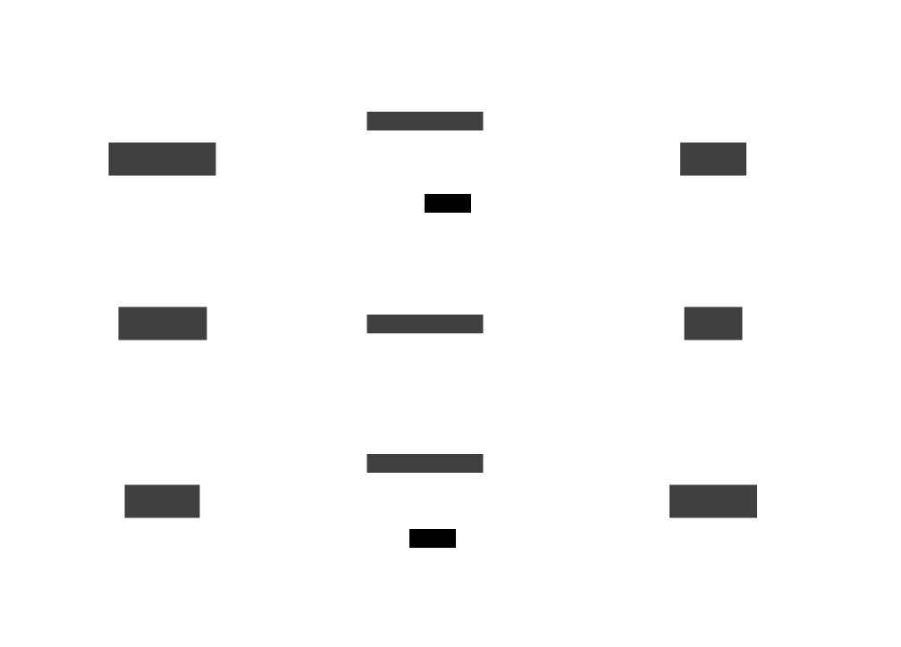

该系统**每一帧都在永远运行**——加载过程中进行浪费的检查，一次有用的执行，然后是无限的无操作，导致性能浪费、代码混乱，并使代码难以扩展。

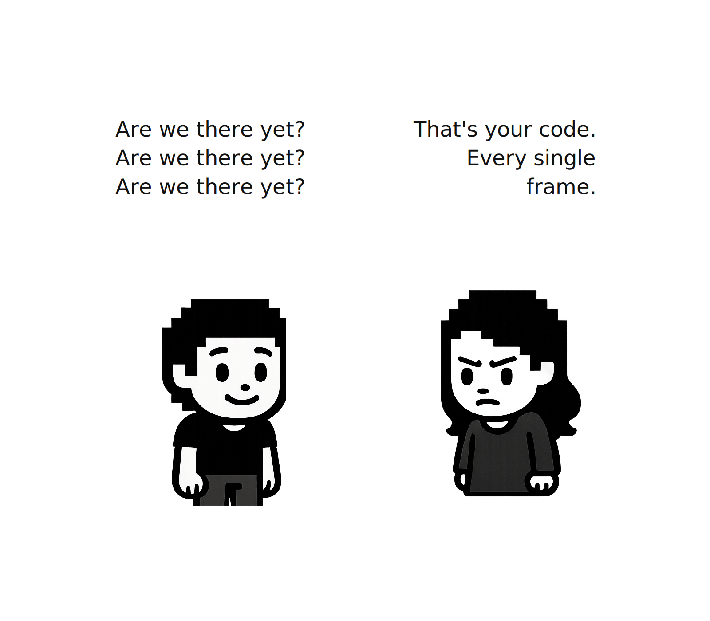

### 只在需要时运行的系统

我们用来触发系统的`Startup`和`Update`是**调度**（schedules）——Bevy组织系统运行时间的方式。`Startup`在启动时运行一次，`Update`每帧运行。

但如果我们需要的系统是在*特定时刻*运行呢？不是每帧，也不只是在启动时，而是在某些事情发生时精确地运行——比如资源加载完成时，或者玩家暂停游戏时。

### 基于状态的调度

解决方案是将我们的游戏组织成不同的**阶段**。我们称这些阶段为**状态**（states）：`Loading`（加载中）、`Playing`（游戏中）和`Paused`（已暂停）。每个状态代表游戏的一种不同模式。

当游戏从一个状态转换到另一个状态时（比如从`Loading`到`Playing`），Bevy提供了恰好运行一次的特殊调度：

- **OnEnter** - 进入一个状态时运行
- **OnExit** - 离开一个状态时运行

这就是我们消除轮询的方法。不再让`initialize_player_character`每帧检查"资源加载完了吗？"，而是将其附加到`OnExit(Loading)`。当资源加载完成并且我们离开`Loading`状态时，Bevy恰好运行它一次。

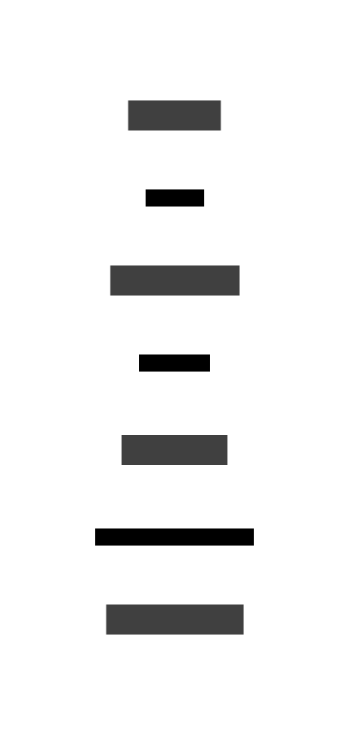

## 实现游戏状态

让我们构建一个带有加载屏幕和游戏暂停功能的状态管理模块。在`src`文件夹内创建`state`文件夹。

### 定义游戏状态

**我们需要哪些状态？**

想想你的游戏生命周期。现在，当游戏启动时：

1. 资源需要时间从磁盘加载
2. 加载完成后，游戏开始
3. 玩家可能想要暂停

这是三个不同的阶段，每个阶段需要不同的系统：

- **Loading（加载中）**：显示加载屏幕，检查资源是否就绪，不运行游戏逻辑
- **Playing（游戏中）**：运行移动/动画，隐藏加载屏幕，允许暂停
- **Paused（已暂停）**：显示暂停菜单，停止游戏逻辑，允许取消暂停

让我们将这些定义为枚举：

创建`src/state/game_state.rs`：

```rust
// src/state/game_state.rs
use bevy::prelude::*;

#[derive(States, Default, Debug, Clone, Copy, PartialEq, Eq, Hash)]
pub enum GameState {
    #[default]
    Loading,
    Playing,
    Paused,
}
```

**`States`宏是什么？**

`#[derive(States)]`宏实现了`States` trait，它告诉Bevy：

- 这个枚举表示游戏阶段，一次只能有一个阶段处于活动状态
- Bevy应该跟踪哪个状态是活动的
- 系统可以被门控，只在特定状态下运行
- 状态转换应触发OnEnter/OnExit调度

`#[default]`属性标记游戏在哪个状态启动。在这里，Bevy将状态初始化为默认值（在我们的例子中是`Loading`）。

### 加载屏幕

让我们创建一个带有全屏深色背景和动态"Loading..."文本的加载屏幕。

创建`src/state/loading.rs`

```rust
// src/state/loading.rs
use bevy::prelude::*;

#[derive(Component)]
pub struct LoadingScreen;

#[derive(Component)]
pub struct LoadingText;

pub fn spawn_loading_screen(mut commands: Commands) {
    commands.spawn((
        LoadingScreen,
        Node {
            width: Val::Percent(100.0),
            height: Val::Percent(100.0),
            justify_content: JustifyContent::Center,
            align_items: AlignItems::Center,
            ..default()
        },
        BackgroundColor(Color::srgb(0.1, 0.1, 0.15)),
    )).with_children(|parent| {
        parent.spawn((
            LoadingText,
            Text::new("Loading..."),
            TextFont {
                font_size: 48.0,
                ..default()
            },
            TextColor(Color::WHITE),
        ));
    });
    
    info!("Loading screen spawned");
}
```

**这里发生了什么：**

- `LoadingScreen`和`LoadingText`是标记组件，用于标识我们的UI实体
- `Node`创建一个全屏容器（100%宽度和高度）
- `justify_content`和`align_items`居中意味着文本出现在中间
- `.with_children()`将文本生成为背景的子元素

现在将动画函数追加到同一文件：

```rust
// Append to src/state/loading.rs
pub fn animate_loading(
    time: Res<Time>,
    mut query: Query<&mut Text, With<LoadingText>>,
) {
    for mut text in query.iter_mut() {
        let dots = (time.elapsed_secs() * 2.0) as usize % 4;
        **text = format!("Loading{}", ".".repeat(dots));
    }
}
```

这对文本进行动画："Loading" → "Loading." → "Loading.." → "Loading…"（在0-3个点之间循环）。

**`**text`是什么，这就像双重解引用吗？**

是的！当我们调用`.iter_mut()`时，Bevy将我们的`&mut Text`包装在一个跟踪变化的特殊类型中。第一个`*`解包得到`&mut Text`，第二个`*`解引用引用以到达我们可以修改的实际`Text`值。

最后，追加销毁函数：

```rust
// Append to src/state/loading.rs
pub fn despawn_loading_screen(
    mut commands: Commands,
    query: Query<Entity, With<LoadingScreen>>,
) {
    for entity in query.iter() {
        commands.entity(entity).despawn();
    }
    
    info!("Loading screen despawned");
}
```

**为什么要销毁？**

当我们转换到Playing状态时，加载屏幕应该消失。如果不销毁，UI实体将永远留在世界中，占用内存并渲染在游戏之上。`.despawn()`函数移除加载屏幕实体。由于`LoadingText`是一个子元素（通过`.with_children()`），Bevy会自动移除它。

### 暂停菜单

现在让我们创建一个暂停菜单，当玩家按下Escape时显示一个半透明覆盖层和"PAUSED"文本，再次按下时隐藏。

创建`src/state/pause.rs`：

```rust
// src/state/pause.rs
use bevy::prelude::*;

#[derive(Component)]
pub struct PauseMenu;

pub fn spawn_pause_menu(mut commands: Commands) {
    commands.spawn((
        PauseMenu,
        Node {
            width: Val::Percent(100.0),
            height: Val::Percent(100.0),
            justify_content: JustifyContent::Center,
            align_items: AlignItems::Center,
            ..default()
        },
        BackgroundColor(Color::srgba(0.0, 0.0, 0.0, 0.7)),
    )).with_children(|parent| {
        parent.spawn((
            Text::new("PAUSED\n\nPress ESC to resume"),
            TextFont {
                font_size: 36.0,
                ..default()
            },
            TextColor(Color::WHITE),
            TextLayout::new_with_justify(Justify::Center),
        ));
    });
    
    info!("Pause menu spawned");
}

pub fn despawn_pause_menu(
    mut commands: Commands,
    query: Query<Entity, With<PauseMenu>>,
) {
    for entity in query.iter() {
        commands.entity(entity).despawn();
    }
    
    info!("Pause menu despawned");
}
```

### State插件

现在我们将创建`StatePlugin`，将一切连接在一起。我们将逐步构建它。

创建`src/state/mod.rs`。

```rust
// src/state/mod.rs
mod game_state;
mod loading;
mod pause;

use bevy::prelude::*;
use crate::characters::spawn::CharactersListResource;
use crate::characters::config::CharactersList;

pub use game_state::GameState;

pub struct StatePlugin;

impl Plugin for StatePlugin {
    fn build(&self, app: &mut App) {
        app
            .init_state::<GameState>()
            
            // Loading state systems
            .add_systems(OnEnter(GameState::Loading), loading::spawn_loading_screen)
            .add_systems(Update, (
                check_assets_loaded,
                loading::animate_loading,
            ).run_if(in_state(GameState::Loading)))
            .add_systems(OnExit(GameState::Loading), (
                loading::despawn_loading_screen,
                crate::characters::spawn::initialize_player_character,
            ))
                // Pause state systems
            .add_systems(OnEnter(GameState::Paused), pause::spawn_pause_menu)
            .add_systems(OnExit(GameState::Paused), pause::despawn_pause_menu)
            
            // Pause toggle (works in Playing or Paused states)
            .add_systems(Update, 
                toggle_pause.run_if(in_state(GameState::Playing).or(in_state(GameState::Paused)))
            );
    }
}

fn check_assets_loaded(
    characters_list_res: Option<Res<CharactersListResource>>,
    characters_lists: Res<Assets<CharactersList>>,
    mut next_state: ResMut<NextState<GameState>>,
) {
    let Some(res) = characters_list_res else {
        return;
    };
    
    if characters_lists.get(&res.handle).is_some() {
        info!("Assets loaded, transitioning to Playing!");
        next_state.set(GameState::Playing);
    }
}

fn toggle_pause(
    input: Res<ButtonInput<KeyCode>>,
    current_state: Res<State<GameState>>,
    mut next_state: ResMut<NextState<GameState>>,
) {
    if input.just_pressed(KeyCode::Escape) {
        match current_state.get() {
            GameState::Playing => {
                info!("Game paused");
                next_state.set(GameState::Paused);
            }
            GameState::Paused => {
                info!("Game resumed");
                next_state.set(GameState::Playing);
            }
            _ => {}
        }
    }
}
```

**这里发生了什么？**

我们首先告诉Bevy跟踪我们自定义的`GameState`枚举。

当游戏启动并进入`Loading`状态时，`OnEnter(GameState::Loading)`运行`spawn_loading_screen`一次，显示加载UI。

在Loading状态下，`Update.run_if(in_state(GameState::Loading))`运行两个系统——一个检查资源是否加载完成，另一个对加载文本进行动画。

一旦资源加载完成，`check_assets_loaded`请求转换到`Playing`状态。当这种情况发生时，`OnExit(GameState::Loading)`触发，运行两个系统——清理加载UI和初始化玩家。现在玩家初始化只能发生一次，因为退出加载状态是一次性事件。

对于暂停，我们在`OnEnter(GameState::Paused)`和`OnExit(GameState::Paused)`上添加了系统来显示和隐藏暂停菜单。`toggle_pause`函数监听Escape键并在`Playing`和`Paused`状态之间切换。

我们的`StatePlugin`现在协调整个游戏流程。`Loading`状态处理带有视觉反馈的资源加载，`Playing`状态将运行游戏系统。在本章后面，我们将把游戏系统门控在只在`Playing`状态下运行，这将在暂停时冻结游戏。这种设计的美妙之处在于系统自动附加到状态转换上——无需轮询，没有浪费的帧。一切都在需要时精确运行。

现在打开`src/characters/mod.rs`并从Update调度中移除`initialize_player_character`。因为我们已经通过`StatePlugin`添加了它。

```rust
// src/characters/mod.rs
impl Plugin for CharactersPlugin {
    fn build(&self, app: &mut App) {
        app.add_plugins(RonAssetPlugin::<CharactersList>::new(&["characters.ron"]))
            .init_resource::<spawn::CurrentCharacterIndex>()
            .add_systems(Startup, spawn::spawn_player)
            // REMOVE initialize_player_character from here!
            // It now runs in StatePlugin's OnExit(Loading)
            .add_systems(Update, (
                spawn::switch_character,
                movement::move_player,
                movement::update_jump_state,
                animation::animate_characters,
                animation::update_animation_flags,
            ));
    }
}
```

### 集成StatePlugin

在`src/main.rs`中添加状态模块和插件：

```rust
// src/main.rs
mod characters;
mod map;
mod state;  // Add this
```

**重要**：在`CharactersPlugin`**之前**添加`StatePlugin`，以便状态系统在角色系统尝试使用它之前完成初始化。

```rust
// Add state plugin inside main function of src/main.rs
        // Previous code as it is
        .add_plugins(ProcGenSimplePlugin::<Cartesian3D, Sprite>::default())
        .add_plugins(state::StatePlugin)  // Add BEFORE CharactersPlugin!
        .add_plugins(characters::CharactersPlugin)
        .add_systems(Startup, setup_camera)
        .run();
```

运行你的游戏：

```rust
cargo run
```

你可能看不到加载屏幕（资源加载很快，但你可以手动添加延迟）。游戏启动后，你的角色出现，准备移动。按Escape切换暂停覆盖层。请注意，此时游戏在暂停时仍会在后台继续运行，我们将在本章后面通过将游戏系统门控在只在`Playing`状态下运行来修复这个问题。

## 角色的状态模式

我们刚刚使用状态来控制我们的*游戏流程*（`Loading` → `Playing` → `Paused`）。现在让我们将同样的模式应用于其他方面：*角色行为*。

看看我们的`AnimationState`组件：

```rust
// Pseudo code, don't use
#[derive(Component, Default)]
pub struct AnimationState {
    pub is_moving: bool,
    pub was_moving: bool,
    pub is_jumping: bool,
    pub was_jumping: bool,
}
```

四个布尔值跟踪两条信息：角色*现在*在做什么以及*上一帧*在做什么。我们需要`was_moving`和`was_jumping`来检测像"刚刚开始跳跃"或"刚刚停止移动"这样的转换。

这对动画有帮助，但它存在问题。

### 太多布尔标志了

如果我们添加跑步呢？我们需要：

```rust
// Pseudo code, don't use
pub is_running: bool,
pub was_running: bool,
```

攻击呢？

```rust
// Pseudo code, don't use
pub is_attacking: bool,
pub was_attacking: bool,
```

很快我们的组件就会被布尔值淹没，而我们的动画系统会被转换逻辑淹没：

```rust
// Pseudo code, don't use
let just_started_moving = state.is_moving && !state.was_moving;
let just_stopped_moving = !state.is_moving && state.was_moving;
let just_started_jumping = state.is_jumping && !state.was_jumping;
let just_stopped_jumping = !state.is_jumping && state.was_jumping;
let just_started_running = state.is_running && !state.was_running;
// ... it keeps growing
```

更糟的是，如果`is_moving`和`is_jumping`同时为true怎么办？或者`is_running`和`is_attacking`？布尔标志不能防止不可能的状态。

开发者可能会意外地同时设置两个标志，或者在设置另一个时忘记清除一个。你的动画系统随后必须决定：哪个标志获胜？你最终会编写优先级逻辑，而当优先级在系统间不一致时，错误就会悄然而至。

### 状态模式解决方案

还记得`GameState`是如何工作的吗？我们定义了一个包含`Loading`、`Playing`和`Paused`的枚举，Bevy跟踪我们处于哪个状态。我们可以将同样的想法应用于角色：定义一个可能状态的枚举，让当前状态决定行为。

```rust
// Pseudo code, don't use
#[derive(Component, Debug, Clone, Copy, PartialEq, Eq, Default)]
pub enum CharacterState {
    #[default]
    Idle,
    Walking,
    Running,
    Jumping,
}
```

一个角色一次只能处于*一种*状态。不再有不可能的组合。不再有布尔运算。

### 为什么这样更好

**1. 不可能的状态变得不可能了：**

使用枚举，编译器强制角色处于恰好一种状态：

```rust
// Pseudo code, don't use
// With booleans: you can do this (but shouldn't!)
is_walking = true;
is_jumping = true;  // Now both are true - invalid!

// With enum: you can't have both true
let state = CharacterState::Walking;
// state is Walking. To jump, you must replace it:
let state = CharacterState::Jumping;  // Now it's only Jumping
```

变量持有一个值。你不可能同时处于Walking和Jumping状态。这种方法被称为*使非法状态不可表示*（making illegal states unrepresentable），这是类型驱动开发中的关键原则。与其编写代码检查无效组合，不如设计你的类型使无效组合根本无法存在。

**2. Bevy为我们检测变化：**

还记得手动跟踪`was_moving`和`was_jumping`吗？那是手工完成的变化检测。Bevy内置了此功能。当你使用`Changed<CharacterState>`时，Bevy只在实际状态发生变化时运行你的代码。

你的动画更新系统只在角色在状态之间转换时运行。你的音效系统只在进入新状态时运行。代码更少，错误更少，我们将在本章后面使用这个功能。

**3. 动画选择变成一个简单的match：**

使用枚举，选择正确的动画非常直接。你匹配当前状态，每个状态映射到恰好一个动画。没有歧义，没有优先级逻辑，没有"如果两个标志都为true怎么办？"的困境。

```rust
// Pseudo code, don't use
let new_animation = match state {
    CharacterState::Idle | CharacterState::Walking => AnimationType::Walk,
    CharacterState::Running => AnimationType::Run,
    CharacterState::Jumping => AnimationType::Jump,
};
```

如果你忘记处理某个状态，编译器会警告你。如果你后来向枚举添加了新状态，每个match语句都会变成编译错误，直到你处理了新情况。编译器迫使你考虑所有可能性。

现在让我们付诸实践，实现`CharacterState`。

## 实现角色状态

创建一个新文件`src/characters/state.rs`：

```rust
characters/
├── config.rs
├── animation.rs
├── movement.rs
├── mod.rs
├── spawn.rs
├── state.rs  ← Create this
```

### CharacterState枚举

我们需要一个枚举，表示角色可能处于的所有状态：

```rust
// src/characters/state.rs
use bevy::prelude::*;

/// Character states. Only one can be active at a time.
#[derive(Component, Debug, Clone, Copy, PartialEq, Eq, Default)]
pub enum CharacterState {
    #[default]
    Idle,
    Walking,
    Running,
    Jumping,
}
```

### 使用方法查询状态

之前，我们解释了布尔标志如何产生无效组合。我们不分别跟踪`is_jumping`和`was_jumping`标志，而是有了一个单一的`CharacterState`。但我们仍然需要回答像"这个角色现在能跳跃吗？"这样的问题。

这就是这些查询方法的作用。它们让我们能够询问关于当前状态的问题，而无需维护单独的标志变量：

```rust
// Append to src/characters/state.rs
impl CharacterState {
    /// Check if this is a grounded state (can jump from here)
    pub fn is_grounded(&self) -> bool {
        matches!(self, CharacterState::Idle | CharacterState::Walking | CharacterState::Running)
    }
}
```

这个方法取代了跳跃控制的布尔标志逻辑。不再跟踪`is_jumping`标志并手动检查它，我们查询状态。逻辑很简单：你只能在接地时跳跃（Idle、Walking或Running）。你不能在已经处于Jumping状态时跳跃。

**`matches!`是什么？**

`matches!`宏检查一个值是否匹配某个模式。`matches!(self, CharacterState::Idle)`如果`self`是`Idle`则返回`true`，否则返回`false`。`|`表示"或"，所以`matches!(self, CharacterState::Walking | CharacterState::Running)`检查它是Walking还是Running。

## 动画重构

现在我们将重构`animation.rs`以使用我们新的基于状态的方法。同时，让我们也清理一个代码组织问题：目前，`AnimationController`同时存储了当前动画类型和朝向方向。但这些由不同的系统拥有——朝向决定方向，动画决定剪辑。将它们分开使每个系统的职责更清晰。

首先，创建一个新文件`src/characters/facing.rs`。通过使`Facing`成为自己的组件，移动系统拥有方向更新，而动画系统专注于精灵动画。

```rust
// src/characters/facing.rs
use bevy::prelude::*;

/// The direction a character is facing.
/// Separate from movement - character can face one way while moving another.
#[derive(Component, Debug, Clone, Copy, PartialEq, Eq, Default)]
pub enum Facing {
    Up,
    Left,
    #[default]
    Down,
    Right,
}

impl Facing {
    pub fn from_velocity(velocity: Vec2) -> Self {
        if velocity.x.abs() > velocity.y.abs() {
            if velocity.x > 0.0 { Facing::Right } else { Facing::Left }
        } else {
            if velocity.y > 0.0 { Facing::Up } else { Facing::Down }
        }
    }
    
    /// Helper to map direction to row offset (0, 1, 2, 3)
    pub(crate) fn direction_index(self) -> usize {
        match self {
            Facing::Up => 0,
            Facing::Left => 1,
            Facing::Down => 2,
            Facing::Right => 3,
        }
    }
}
```

在`src/characters/mod.rs`中公开`state`和`facing`：

```rust
// src/characters/mod.rs
pub mod config;
pub mod animation;
pub mod movement;
pub mod state; // Add this line
pub mod facing;  // Add this line
```

打开`src/characters/animation.rs`。我们将逐部分更新它。

首先，删除旧的`Facing`枚举和`AnimationState`结构体。我们将使用`CharacterState`代替。

```rust
// src/characters/animation.rs - Delete the following sections 

// DELETE this (Facing moved to facing.rs)
pub enum Facing { ... }
impl Facing { ... }

// DELETE this (AnimationState replaced by CharacterState)
pub struct AnimationState {
    pub is_moving: bool,
    ...
}
```

从`AnimationController`中移除`facing`，因为它现在是一个单独的组件。同时为`AnimationController`派生`Default`宏。

```rust
// src/characters/animation.rs - Update AnimationController
#[derive(Component, Default)] // Line update alert
pub struct AnimationController {
    pub current_animation: AnimationType,
    // Facing is removed now, line update alert
}
```

你还需要删除旧的`AnimationController`的手动`Default`实现。之前，它看起来像这样：

```rust
// DELETE the following old implementation from src/characters/animation.rs
impl Default for AnimationController {
    fn default() -> Self {
        Self {
            current_animation: AnimationType::Walk,
            facing: Facing::Down, 
        }
    }
}
```

完全删除它。由于`AnimationController`现在只有一个字段（`current_animation`），我们需要`AnimationType`有一个默认值。给`AnimationType`添加`#[derive(Default)]`并将`Walk`标记为默认值：

```rust
// src/characters/config.rs - Set default animation type to Walk
#[derive(Debug, Clone, Copy, PartialEq, Eq, Hash, Serialize, Deserialize, Default)] // Line update alert
pub enum AnimationType {
    #[default] // Line update alert
    Walk,
    Run,
    Jump
}
```

现在更新文件顶部的导入。让我们添加`CharacterState`和`Facing`的导入。

```rust
// src/characters/animation.rs - Update imports
use bevy::prelude::*;
use crate::characters::config::{CharacterEntry, AnimationType};
use crate::characters::state::CharacterState; // Line update alert
use crate::characters::facing::Facing; // Line update alert
```

由于我们将`Facing`移出了`AnimationController`，`get_clip`不能再访问`self.facing`。我们需要将facing作为参数传入。这实际上更清晰：方法现在显式声明了它需要的数据：

```rust
// src/characters/animation.rs - Update get_clip signature
impl AnimationController {
    /// Get the animation clip for the current animation and facing direction.
    /// `facing` is passed in since it's now a separate component.
    pub fn get_clip(&self, config: &CharacterEntry, facing: Facing) -> Option<AnimationClip> {
        let def = config.animations.get(&self.current_animation)?;
        
        let row = if def.directional {
            def.start_row + facing.direction_index()
        } else {
            def.start_row
        };
        
        Some(AnimationClip::new(row, def.frame_count, config.atlas_columns))
    }
}
```

**删除update_animation_flags**

我们不再需要这个函数，因为我们将使用`Changed<CharacterState>`而不是手动跟踪。

```rust
// src/characters/animation.rs - DELETE this entire function
pub fn update_animation_flags(...) { ... }
```

### 替换动画系统

这就是状态模式真正发挥价值的地方。旧的`animate_characters`函数使用布尔标志手动跟踪状态变化。有了`CharacterState`，Bevy的`Changed`过滤器自动为我们完成这项工作。

完全删除`animate_characters`。

```rust
// src/characters/animation.rs - DELETE this entire function
pub fn animate_characters(...) { ... }
```

我们将编写一个响应状态变化的系统（使用`Changed<CharacterState>`），以及另一个执行动画播放的系统。这种分离意味着状态变化逻辑只在需要时运行，而不是每帧都运行。

**系统1：处理角色状态变化**

这个系统只在`CharacterState`变化时运行，使用Bevy的`Changed`过滤器。触发时，它更新动画类型，以便播放系统知道要播放哪个动画。

```rust
// src/characters/animation.rs - Add this new function
pub fn on_state_change_update_animation(
    mut query: Query<
        (&CharacterState, &mut AnimationController, &mut AnimationTimer),
        Changed<CharacterState>
    >,
) {
    for (state, mut controller, mut timer) in query.iter_mut() {
        // Select animation based on new state
        let new_animation = match state {
            CharacterState::Idle | CharacterState::Walking => AnimationType::Walk,
            CharacterState::Running => AnimationType::Run,
            CharacterState::Jumping => AnimationType::Jump,
        };
        
        // Only update and reset timer if animation actually changed
        if controller.current_animation != new_animation {
            controller.current_animation = new_animation;
            timer.0.reset();
        }
    }
}
```

**`Changed<CharacterState>`是什么？**

这就是我们之前讨论的变化检测！查询只返回`CharacterState`自上一帧以来发生变化的实体。无需手动跟踪。

**如果`Changed`已经过滤了，为什么还要检查`controller.current_animation != new_animation`？**

因为多个状态可以映射到同一个动画。看看match：`Idle`和`Walking`都使用`AnimationType::Walk`。如果玩家从`Idle`转换到`Walking`，`Changed<CharacterState>`会触发（状态变化了），但动画类型仍然是`Walk`。没有这个守卫，我们会重置计时器并导致视觉卡顿，即使我们在播放同一个动画。

**系统2：动画播放**

第一个系统在状态变化时选择*哪个*动画播放，而这个系统处理逐帧播放。它们共同形成一个完整的动画管线：状态变化设置动画，这个系统保持其运行。

```rust
// src/characters/animation.rs - Add this new function
pub fn animations_playback(
    time: Res<Time>,
    mut query: Query<(
        &CharacterState,
        &Facing,
        &AnimationController,
        &mut AnimationTimer,
        &mut Sprite,
        &CharacterEntry,
    )>,
) {
    for (state, facing, controller, mut timer, mut sprite, config) in query.iter_mut() {
        // Don't animate when idle
        if *state == CharacterState::Idle {
            // Ensure idle sprite is at frame 0
            if let Some(atlas) = sprite.texture_atlas.as_mut() {
                if let Some(clip) = controller.get_clip(config, *facing) {
                    if atlas.index != clip.start() {
                        atlas.index = clip.start();
                    }
                }
            }
            continue;
        }
        
        let Some(atlas) = sprite.texture_atlas.as_mut() else { continue; };
        let Some(clip) = controller.get_clip(config, *facing) else { continue; };
        let Some(anim_def) = config.animations.get(&controller.current_animation) else { continue; };
        
        // Safety: If we somehow ended up on a frame outside our clip, reset.
        if !clip.contains(atlas.index) {
            atlas.index = clip.start();
            timer.0.reset();
        }
        
        // Update timer duration if needed
        let expected_duration = std::time::Duration::from_secs_f32(anim_def.frame_time);
        if timer.0.duration() != expected_duration {
            timer.0.set_duration(expected_duration);
        }
        
        // Advance animation
        timer.tick(time.delta());
        if timer.just_finished() {
            atlas.index = clip.next(atlas.index);
        }
    }
}
```

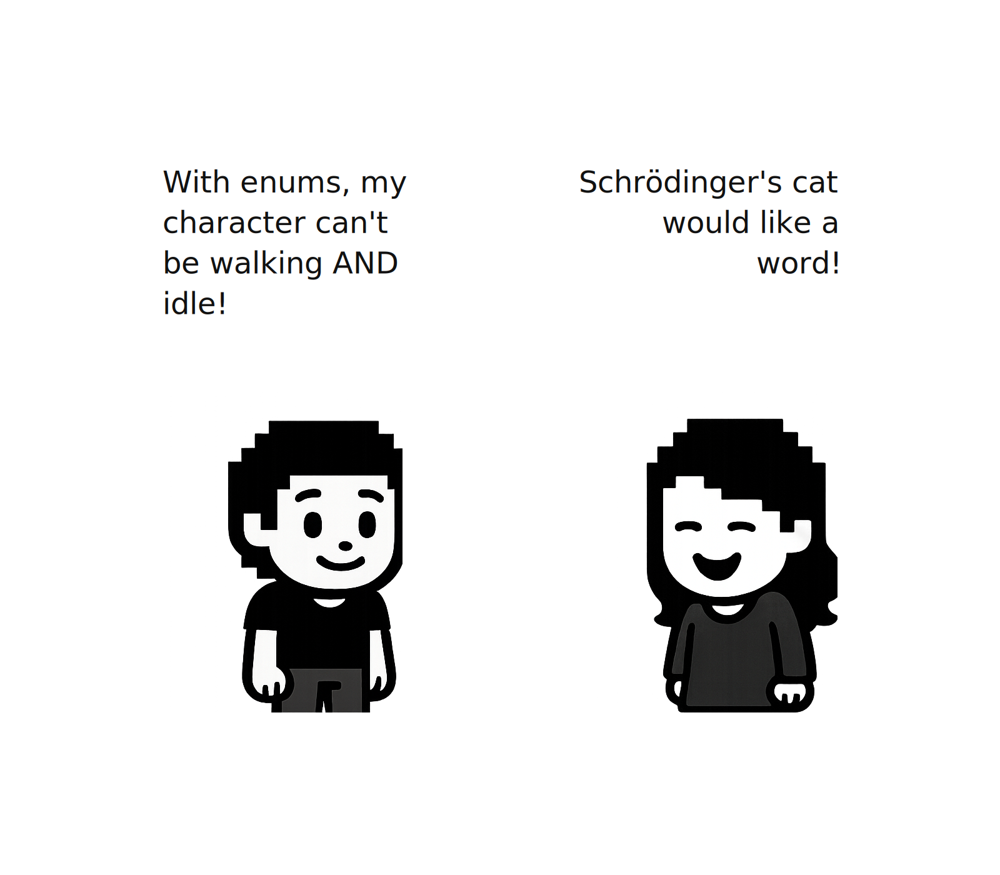

## 完成基于状态的重构

我们已经更新了动画系统，使用`CharacterState`而不是布尔标志。但`CharacterState`在哪里被设置？现在，我们的`movement.rs`仍然使用旧的方法，直接修改`Transform`并在`AnimationState`中设置布尔标志。我们需要重构它以使用我们新的基于状态的设计。

看看当前的`movement.rs`。它同时做三件事：

- 读取输入（方向键、shift、空格）
- 在屏幕上移动角色
- 使用布尔标志决定播放哪个动画

这种关注点混合在以前是有意义的，但现在我们有了`CharacterState`，我们可以分离这些职责。我们将把`movement.rs`拆分为：

- **input.rs** - 读取键盘输入并决定角色应该做什么
- **physics.rs** - 处理基于速度移动角色

这种分离意味着我们刚刚构建的动画系统将自动工作。当输入改变`CharacterState`时，我们的`on_state_change_update_animation`系统会做出反应。当输入设置`Velocity`时，我们的物理系统移动实体。每个部分专注于一项工作。

创建`src/characters/physics.rs`：

```rust
// src/characters/physics.rs
use bevy::prelude::*;
use super::{state::CharacterState, config::CharacterEntry};

/// Linear velocity in world units per second.
/// Systems that want to move an entity modify this.
/// A physics system reads this to update Transform.
#[derive(Component, Debug, Clone, Copy, Default, Deref, DerefMut)]
pub struct Velocity(pub Vec2);

impl Velocity {
    pub const ZERO: Self = Self(Vec2::ZERO);
    
    pub fn is_moving(&self) -> bool {
        self.0 != Vec2::ZERO
    }
}
```

现在添加基于状态的速度计算：

```rust
// Append to src/characters/physics.rs

/// Calculate velocity based on character state, direction, and configuration.
pub fn calculate_velocity(
    state: CharacterState,
    direction: Vec2,
    character: &CharacterEntry,
) -> Velocity {
    match state {
        CharacterState::Idle => Velocity::ZERO,
        CharacterState::Jumping => Velocity::ZERO,  // No movement during jump
        CharacterState::Walking => {
            Velocity(direction.normalize_or_zero() * character.base_move_speed)
        }
        CharacterState::Running => {
            Velocity(direction.normalize_or_zero() * character.base_move_speed * character.run_speed_multiplier)
        }
    }
}
```

注意`CharacterState`如何直接决定速度。没有布尔标志，没有关于`is_jumping && !is_moving`的条件判断。状态告诉我们所需的一切。

最后，添加实际移动角色的系统。它读取速度并更新角色在屏幕上的位置：

```rust
// Append to src/characters/physics.rs

/// Applies velocity to transform. Pure physics, no game logic.
pub fn apply_velocity(
    time: Res<Time>,
    mut query: Query<(&Velocity, &mut Transform)>,
) {
    for (velocity, mut transform) in query.iter_mut() {
        if velocity.is_moving() {
            transform.translation += velocity.0.extend(0.0) * time.delta_secs();
        }
    }
}
```

这个系统对输入、角色或状态一无所知。它只是基于速度移动物体。给任何带有`Velocity`和`Transform`的实体添加这个，它就会自动移动。

### 重构玩家输入

现在是拆分`movement.rs`的第二部分。我们有物理系统处理"如何移动"的部分。现在我们需要输入处理来处理"玩家想做什么"的部分。

这就是我们将一切连接在一起的地方。输入系统将：

- 读取键盘输入
- 更新`CharacterState`（这会通过`Changed<CharacterState>`触发我们的动画系统）
- 设置`Velocity`（我们的物理系统用它来移动实体）

创建`src/characters/input.rs`。这取代了`movement.rs`中输入处理的部分。

```rust
// src/characters/input.rs
use bevy::prelude::*;
use super::{
    state::CharacterState,
    physics::Velocity,
    facing::Facing,
    config::CharacterEntry,
    animation::{AnimationController, AnimationTimer},
};

#[derive(Component)]
pub struct Player;
```

我们将`Player`标记组件移到这里，因为输入处理是玩家特有的。

```rust
// Append to src/characters/input.rs

/// Read directional input and return a direction vector
fn read_movement_input(input: &ButtonInput<KeyCode>) -> Vec2 {
    const MOVEMENT_KEYS: [(KeyCode, Vec2); 4] = [
        (KeyCode::ArrowLeft, Vec2::NEG_X),
        (KeyCode::ArrowRight, Vec2::X),
        (KeyCode::ArrowUp, Vec2::Y),
        (KeyCode::ArrowDown, Vec2::NEG_Y),
    ];
    
    MOVEMENT_KEYS.iter()
        .filter(|(key, _)| input.pressed(*key))
        .map(|(_, dir)| *dir)
        .sum()
}
```

这和之前一样的输入读取，只是隔离到了自己的函数中。

### 状态机逻辑

现在我们需要基于输入决定角色应该处于什么状态。还记得我们之前说的"状态告诉我们所需的一切"吗？这就是我们将原始输入转换为有意义的状态转换的地方。

不再有分散的`if`语句设置布尔标志（`is_moving = true`，`is_jumping = true`），我们有一个返回新状态的函数：

```rust
// Append to src/characters/input.rs

fn determine_new_state(
    current: CharacterState,
    direction: Vec2,
    is_running: bool,
    wants_jump: bool,
) -> CharacterState {
    match current {
        // Can't transition out of jumping until it completes
        CharacterState::Jumping => CharacterState::Jumping,
        
        // Jump takes priority when grounded
        _ if wants_jump && current.is_grounded() => CharacterState::Jumping,
        
        // Movement states
        _ if direction != Vec2::ZERO => {
            if is_running { CharacterState::Running } else { CharacterState::Walking }
        }
        
        // Default to idle
        _ => CharacterState::Idle,
    }
}
```

**这种在`match`中使用`if`条件的奇怪模式是什么？**

这被称为*match守卫*（match guard）。语法`_ if condition =>`表示"匹配任何东西，但仅当这个条件也为真时。"它结合了模式匹配和布尔逻辑。

**为什么在这里使用它？**

我们需要检查两件事：我们当前处于什么状态，以及玩家在做什么（移动、跳跃等）。Match守卫让我们在一条干净的表达式中处理两者。`_`表示"上面尚未匹配的任何状态"，而`if`添加额外的条件。

当你需要匹配一个事物但同时也要检查不属于枚举本身的其它事物时，可以使用这种模式。

好了，新方法将所有状态转换逻辑放在一个函数中。你可以从上到下阅读并理解优先级。

### 主输入处理程序

我们已经构建了辅助函数：`read_movement_input`读取按键，`determine_new_state`决定状态。现在我们需要将两者连接起来并实际更新实体组件的主系统。

这是旧`movement.rs`中`move_player`函数的新版本。它不再直接修改`Transform`和`AnimationController`，而是更新`CharacterState`、`Velocity`和`Facing`。其他系统对这些变化做出反应：动画系统响应`Changed<CharacterState>`，物理系统读取`Velocity`来移动实体。

该函数分四个步骤工作：

- **读取输入** - 检查哪些键被按下（方向箭头、shift键跑步、空格键跳跃）
- **更新朝向** - 如果在移动，更新朝向方向，使角色看向他们前进的方向
- **确定新状态** - 使用状态机基于当前状态和输入找出下一个状态
- **计算速度** - 基于新状态，计算移动的速度和方向

```rust
// Append to src/characters/input.rs

/// Reads player input and updates movement-related components.
pub fn handle_player_input(
    input: Res<ButtonInput<KeyCode>>,
    mut query: Query<(
        &mut CharacterState,
        &mut Velocity,
        &mut Facing,
        &CharacterEntry,
    ), With<Player>>,
) {
    let Ok((mut state, mut velocity, mut facing, character)) = query.single_mut() else {
        return;
    };
    
    // Step 1: Read what keys are pressed
    let direction = read_movement_input(&input);
    let is_running = input.pressed(KeyCode::ShiftLeft) || input.pressed(KeyCode::ShiftRight);
    let wants_jump = input.just_pressed(KeyCode::Space);
    
    // Step 2: Update facing direction (which way the character looks)
    if direction != Vec2::ZERO {
        let new_facing = Facing::from_velocity(direction);
        if *facing != new_facing {
            *facing = new_facing;
        }
    }
    
    // Step 3: Use our state machine to determine the new state
    // This calls the determine_new_state function we wrote earlier
    let new_state = determine_new_state(*state, direction, is_running, wants_jump);
    if *state != new_state {
        *state = new_state;  // This triggers Changed!
    }
    
    // Step 4: Calculate velocity based on state
    // Idle and Jumping = no movement, Walking/Running = movement
    *velocity = super::physics::calculate_velocity(*state, direction, character);
}
```

### 处理跳跃完成

我们的主输入处理程序没有覆盖一个边界情况。看看`determine_new_state`，当角色处于`Jumping`状态时，它保持`Jumping`。但跳跃如何结束呢？

与行走或跑步（它们在释放按键时结束）不同，跳跃需要完成其动画后才能转换回idle。我们需要一个单独的系统来监视这个：

```rust
// Append to src/characters/input.rs

/// Checks if jump animation completed and transitions back to idle
pub fn update_jump_state(
    mut query: Query<(
        &mut CharacterState,
        &Facing,
        &AnimationController,
        &AnimationTimer,
        &Sprite,
        &CharacterEntry,
    ), With<Player>>,
) {
    let Ok((mut state, facing, controller, timer, sprite, config)) = query.single_mut() else {
        return;
    };
    
    // Only check if currently jumping
    if *state != CharacterState::Jumping {
        return;
    }
    
    let Some(atlas) = sprite.texture_atlas.as_ref() else {
        return;
    };
    
    let Some(clip) = controller.get_clip(config, *facing) else {
        return;
    };
    
    // Check if jump animation has completed
    if clip.is_complete(atlas.index, timer.just_finished()) {
        *state = CharacterState::Idle;
    }
}
```

这个系统只有在玩家跳跃时才运行有意义的逻辑。它使用`clip.is_complete()`检查动画是否完成，然后转换到Idle。状态变化触发我们的`on_state_change_update_animation`系统，该系统将动画更新为Walk。

在更新`mod.rs`之前，我们需要更新`spawn.rs`。我们将`Player`移到了`input.rs`，并且我们的新系统期望实体具有`CharacterState`、`Velocity`和`Facing`组件。

更新`src/characters/spawn.rs`顶部的导入：

```rust
// src/characters/spawn.rs - Update imports
use bevy::prelude::*;
use crate::characters::animation::*;
use crate::characters::config::{CharacterEntry, CharactersList};
use crate::characters::input::Player;  // Changed from movement::Player
use crate::characters::state::CharacterState;  // Line update alert
use crate::characters::physics::Velocity;  // Line update alert
use crate::characters::facing::Facing;  // Line update alert
```

然后在`initialize_player_character`中，更新附加到玩家实体的组件。

```rust
// src/characters/spawn.rs - Inside initialize_player_character
// Update commands.entity(entity).insert((...)) function call
// Remove the line  AnimationState::default(), and add the following lines:
commands.entity(entity).insert((
    AnimationController::default(),
    CharacterState::default(),   // Line update alert
    Velocity::default(),         // Line update alert  
    Facing::default(),           // Line update alert
    AnimationTimer(Timer::from_seconds(DEFAULT_ANIMATION_FRAME_TIME, TimerMode::Repeating)),
    character_entry.clone(),
    sprite,
));
```

现在玩家实体拥有我们重构的系统所需的所有组件：`CharacterState`供动画系统响应，`Velocity`供物理系统读取，以及`Facing`供精灵方向使用。

### 连接新系统

更新`src/characters/mod.rs`以包含新模块：

```rust
// src/characters/mod.rs - Update module declarations
pub mod animation;
pub mod config;
pub mod facing;     // Line update alert
pub mod input;      // Line update alert
pub mod physics;    // Line update alert
pub mod spawn;
pub mod state;      // Line update alert

// DELETE this line:
// pub mod movement;

use crate::state::GameState;
```

现在更新系统注册。删除旧系统并添加新系统：

```rust
// src/characters/mod.rs - DELETE these old systems from add_systems
movement::move_player,           // DELETE
movement::update_jump_state,     // DELETE
animation::animate_characters,   // DELETE
animation::update_animation_flags, // DELETE
```

用我们的新系统替换它们。注意我们使用`.chain()`来确保它们按顺序运行，并使用`.run_if(in_state(GameState::Playing))`使它们只在游戏运行时执行。**这就是我们实际实现暂停冻结行为的地方**——当游戏处于`Paused`状态时，这些系统不会运行，从而冻结所有角色的移动和动画：

```rust
// src/characters/mod.rs - Add new systems
.add_systems(Update, (
    input::handle_player_input,
    spawn::switch_character,
    input::update_jump_state,
    animation::on_state_change_update_animation,
    physics::apply_velocity,
    animation::animations_playback,
).chain().run_if(in_state(GameState::Playing)));
```

`.chain()`确保系统按顺序运行。输入设置状态和速度，动画响应状态变化，物理移动实体，动画播放对角色进行动画。

## 构建碰撞系统

现在我们的角色可以走到任何地方，甚至穿过树木和进入水中。我们需要一个碰撞系统来防止移动到障碍物中。

我们的方法很简单：世界中的每个图块都有一个*类型*（草地、水域、树木等），每个类型要么是可通行的，要么是不可通行的。当玩家试图移动时，我们检查目标位置是否可通行。如果不可通行，我们阻止移动。

### 定义图块类型

首先，我们需要分类我们世界中存在哪些种类的图块。创建`src/collision/tile_type.rs`：

```rust
// src/collision/tile_type.rs
use bevy::prelude::*;

/// Tile types for collision detection.
/// Each type has different walkability and collision behavior.
#[derive(Debug, Clone, Copy, PartialEq, Eq, Hash, Default)]
pub enum TileType {
    // Walkable terrain
    #[default]
    Empty,
    Dirt,
    Grass,
    YellowGrass,
    Shore,  // Water edges (walkable)
    // Non-walkable obstacles
    Water,
    Tree,
    Rock,
}
```

现在添加检查可通行性的方法：

```rust
// Append to src/collision/tile_type.rs
impl TileType {
    /// Check if this tile type allows movement through it.
    pub fn is_walkable(&self) -> bool {
        !matches!(self, TileType::Water | TileType::Tree | TileType::Rock)
    }

    /// Get the collision adjustment for this tile type.
    /// Positive = push player away, negative = allow corner cutting.
    pub fn collision_adjustment(&self) -> f32 {
        match self {
            TileType::Tree | TileType::Rock => -0.2,  // Allow cutting corners
            _ => 0.0,
        }
    }
}
```

注意我们如何定义可通行性：我们不是列出所有**可**通行的，而是列出什么**不可**通行。这意味着新图块类型默认是可通行的——这是一个更安全的选择，因为忘记添加图块会使它可通行，而不是创建隐形墙壁。

**`collision_adjustment`是什么？**

某些图块感觉上更适合调整碰撞。负值（如树木和岩石的-0.2）让玩家更自然地切角，而不是被边缘卡住。正值会将玩家推离图块。

我们还需要一个标记组件来将图块类型信息附加到实体上：

```rust
// Append to src/collision/tile_type.rs

/// Component to mark entities with their collision type.
/// Attached to tiles during map generation.
#[derive(Component, Debug, Clone)]
pub struct TileMarker {
    pub tile_type: TileType,
}

impl TileMarker {
    pub fn new(tile_type: TileType) -> Self {
        Self { tile_type }
    }
}
```

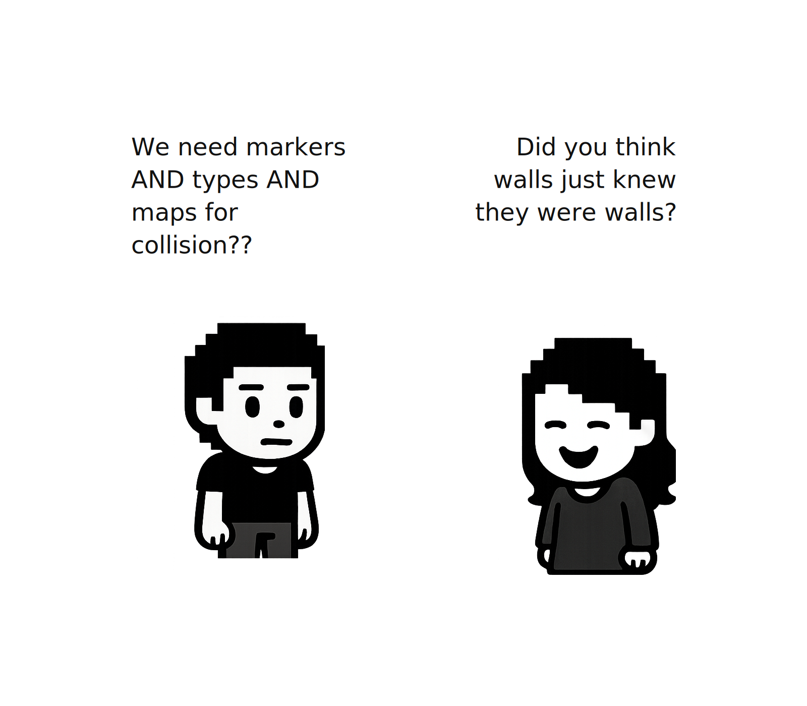

### 碰撞地图

每帧当玩家试图移动时，我们需要快速回答"他们能移动到那里吗？"。每帧检查世界中的每棵树和水图块会很慢。相反，我们一次性构建一个查找表：一个每个格子都知道自己是否可通行的网格。

这是一个4x3小区域的碰撞地图的样子：

| Collision Map (4x3 grid) | | | |
|---|---|---|---|
| Grass | Water | Water | Grass |
| Grass | Grass | Tree | Grass |
| Grass | Dirt | Dirt | Rock |

| | |
|---|---|
| ✅ walkable | ❌ blocked |

这就是`CollisionMap`。当关卡加载时，我们扫描所有图块并记录它们的类型。在游戏过程中，检查"位置(x, y)是否可通行？"只是一个数组查找。

创建`src/collision/map.rs`：

```rust
// src/collision/map.rs
use bevy::prelude::*;
use super::TileType;

/// Collision map resource that stores walkability information.
/// Provides efficient spatial queries for movement validation.
#[derive(Resource)]
pub struct CollisionMap {
    /// Flat array of tile types (row-major order)
    tiles: Vec<TileType>,
    /// Grid dimensions
    width: i32,
    height: i32,
    /// Size of each tile in world units
    tile_size: f32,
    /// World position of grid origin (bottom-left corner)
    origin_x: f32,
    origin_y: f32,
}
```

我们将图块存储在一个扁平的`Vec`中而不是2D数组中，以获得更好的性能。

**为什么用扁平数组？**

在内存中，我们将上面的网格按行展开成一个单一的数组：

```
1D Array (how it's stored)
┌─────┬──────┬──────┬──────┬──────┬──────┬──────┬──────┬──────┬───────┬───────┬───────┐
│ 0   │ 1    │ 2    │ 3    │ 4    │ 5    │ 6    │ 7    │ 8    │ 9     │ 10    │ 11    │
├─────┼──────┼──────┼──────┼──────┼──────┼──────┼──────┼──────┼───────┼───────┼───────┤
│Grass│ Dirt │ Dirt │ Rock │Grass │Grass │ Tree │Grass │Grass │ Water │ Water │Grass │
└─────┴──────┴──────┴──────┴──────┴──────┴──────┴──────┴──────┴───────┴───────┴───────┘
Row 0 (indices 0-3) → Row 1 (indices 4-7) → Row 2 (indices 8-11)
```

所有12个图块在内存中相邻排列。当你访问索引6（Tree）时，索引7和8很可能已经加载到快速内存中了。而2D数组（`Vec<Vec<T>>`）分别存储每一行，可能会更慢。

**为什么存储原点？**

在Bevy中，默认相机将(0, 0)放置在屏幕中心。如果我们将一个4x4的图块网格居中，每个图块在哪里？

我们的网格使用**图块坐标**：左下角的图块是(0, 0)，它右边的图块是(1, 0)，依此类推。

```
Tile Grid (each tile = 32px)
   32  ┌─────┬─────┬─────┬─────┐
       │0,3  │1,3  │2,3  │3,3  │
    0  ├─────┼─────┼─────┼─────┤
       │0,2  │1,2  │2,2  │3,2  │
  -32  ├─────┼─────┼─────┼─────┤
       │0,1  │1,1  │2,1  │3,1  │
  -64  ├─────┼─────┼─────┼─────┤
       │0,0  │1,0  │2,0  │3,0  │
       └─────┴─────┴─────┴─────┘
       -64   -32    0    32
       ← screen X (pixels) / ↑ screen Y (pixels)
       
       ● origin (tile 0,0)
       ╳ screen center
       ◆ player
```

网格宽4个图块 × 每个图块32像素 = 总共128像素。要居中，我们向左移动一半：128 ÷ 2 = 64像素。所以网格的左下角（图块0,0）位于屏幕位置**(-64, -64)**。这就是**原点**。

屏幕中心(0, 0)落在图块(2, 2)内部，而不是图块(0, 0)！

现在玩家站在屏幕位置(-32, 0)。是哪个图块？

- **使用原点**：`(-32 - (-64)) / 32 = 1`，`(0 - (-64)) / 32 = 2` → 图块 (1, 2) ✓
- **不使用原点**：`(-32) / 32 = -1`，`(0) / 32 = 0` → 图块 (-1, 0) **（错误的图块！）**

这就是为什么我们的`CollisionMap`存储原点。让我们实现带有自动处理此转换的方法的结构体。

构造函数创建一个填满`TileType::Empty`的空地图。我们还需要两个内部辅助函数：

- `xy_to_idx`将2D坐标如(3, 7)转换为单个数字用于数组访问，因为图块存储在1D数组中。
- `in_bounds`检查坐标是否在网格内，这有双重作用：它防止访问无效内存，并将地图外的任何东西视为"已阻挡"以用于碰撞目的。

```rust
// Append to src/collision/map.rs
impl CollisionMap {
    /// Create a new collision map with specified dimensions and origin.
    pub fn new(width: i32, height: i32, tile_size: f32, origin_x: f32, origin_y: f32) -> Self {
        let size = (width * height) as usize;
        Self {
            tiles: vec![TileType::Empty; size],
            width,
            height,
            tile_size,
            origin_x,
            origin_y,
        }
    }

    /// Convert 2D grid coordinates to 1D array index.
    #[inline]
    fn xy_to_idx(&self, x: i32, y: i32) -> usize {
        (y * self.width + x) as usize
    }

    /// Check if grid coordinates are within bounds.
    #[inline]
    pub fn in_bounds(&self, x: i32, y: i32) -> bool {
        x >= 0 && x < self.width && y >= 0 && y < self.height
    }
}
```

玩家在屏幕位置如(150.5, -32.0)移动。我们需要将这些转换为图块坐标如(4, -1)来检查碰撞。这就是下面两个函数的作用。

**`#[inline]`是什么？**

这提示编译器这些小的、频繁调用的函数应该被内联（直接复制到调用函数中），而不是作为单独的函数调用。

```rust
// Append to src/collision/map.rs
// Add this inside impl CollisionMap {

    // ... earlier functions inside impl CollisionMap 

    /// Convert world position to grid coordinates.
    pub fn world_to_grid(&self, world_pos: Vec2) -> IVec2 {
        let grid_x = ((world_pos.x - self.origin_x) / self.tile_size).floor() as i32;
        let grid_y = ((world_pos.y - self.origin_y) / self.tile_size).floor() as i32;
        IVec2::new(grid_x, grid_y)
    }

    /// Convert grid coordinates to world position (tile center).
    pub fn grid_to_world(&self, grid_x: i32, grid_y: i32) -> Vec2 {
        Vec2::new(
            self.origin_x + (grid_x as f32 + 0.5) * self.tile_size,
            self.origin_y + (grid_y as f32 + 0.5) * self.tile_size,
        )
    }
```

**理解`grid_to_world`**

这个函数与`world_to_grid`相反：它接受图块坐标如(3, 7)并将其转换回世界位置。

注意代码中的`+ 0.5`——这返回图块的**中心**而不是其角落。如果图块(3, 7)跨越像素96-127，加上0.5得到中心在像素112：

```rust
origin_x + (grid_x * tile_size)        // ← This gives the left edge (96)
origin_x + (grid_x + 0.5) * tile_size  // ← This gives the center (112)
```

这很有用，因为当你在Bevy中生成一个精灵时，默认情况下它的`Transform`位置代表其中心点。所以`grid_to_world`给出了将实体放置在其图块视觉中心的确切位置。

现在添加图块访问方法。它们的配合方式如下：

- `set_tile`在构建地图时使用（在关卡加载期间，我们扫描每个图块并调用`set_tile`）
- `get_tile`在图块坐标处检索图块类型
- `is_walkable`询问**我能在图块(3, 7)上走吗？** 它调用`get_tile`，然后检查该图块类型是否可通行
- `is_world_pos_walkable`是同样的问题，但从屏幕位置(150, -32)开始。它转换为图块坐标，然后调用`is_walkable`

在实践中，圆形碰撞代码在内部使用这些方法。你很少直接调用它们。

```rust
// Append to src/collision/map.rs
// Add this inside impl CollisionMap {

    // ... earlier functions inside impl CollisionMap 

    /// Get the tile type at grid coordinates.
    pub fn get_tile(&self, x: i32, y: i32) -> Option<TileType> {
        if self.in_bounds(x, y) {
            Some(self.tiles[self.xy_to_idx(x, y)])
        } else {
            None
        }
    }

    /// Set a tile at grid coordinates.
    pub fn set_tile(&mut self, x: i32, y: i32, tile_type: TileType) {
        if self.in_bounds(x, y) {
            let idx = self.xy_to_idx(x, y);
            self.tiles[idx] = tile_type;
        }
    }

    /// Check if a grid position is walkable.
    pub fn is_walkable(&self, x: i32, y: i32) -> bool {
        self.get_tile(x, y).map_or(false, |t| t.is_walkable())
    }

    /// Check if a world position is walkable.
    pub fn is_world_pos_walkable(&self, world_pos: Vec2) -> bool {
        let grid_pos = self.world_to_grid(world_pos);
        self.is_walkable(grid_pos.x, grid_pos.y)
    }
```

### 圆形碰撞

上述方法检查一个**点**是否可通行。但我们的角色不是一个点，他们有一个身体！如果我们只检查玩家的中心位置，他们可能会重叠墙壁。

我们将玩家的碰撞区域建模为以其中心为圆心的圆。要检查一个圆是否与图块（矩形）碰撞，我们需要解决一个问题：**如何测试一个圆是否与一个矩形重叠？**

技巧是找到矩形上离圆心最近的点。如果该点在圆内（距离小于半径），它们就重叠。

```rust
// Append to src/collision/map.rs
// Add this inside impl CollisionMap {

    // ... earlier functions inside impl CollisionMap 

    /// Check if a circle intersects with a tile's bounding box.
    fn circle_intersects_tile(&self, center: Vec2, radius: f32, gx: i32, gy: i32) -> bool {
        // Tile bounding box
        let tile_min = Vec2::new(
            self.origin_x + gx as f32 * self.tile_size,
            self.origin_y + gy as f32 * self.tile_size,
        );
        let tile_max = tile_min + Vec2::splat(self.tile_size);

        // Find closest point on tile to circle center
        let closest = Vec2::new(
            center.x.clamp(tile_min.x, tile_max.x),
            center.y.clamp(tile_min.y, tile_max.y),
        );

        // Check if closest point is within radius
        center.distance_squared(closest) < radius * radius
    }
```

有了`circle_intersects_tile`准备就绪，我们可以构建`is_circle_clear`。但首先，我们需要防止玩家走出地图边缘。

```rust
// Append to src/collision/map.rs
// Add this inside impl CollisionMap {

    // ... earlier functions inside impl CollisionMap 
    /// Check if a position with radius is within map bounds.
    fn is_within_bounds(&self, center: Vec2, radius: f32) -> bool {
        let left = self.origin_x;
        let right = self.origin_x + self.width as f32 * self.tile_size;
        let bottom = self.origin_y;
        let top = self.origin_y + self.height as f32 * self.tile_size;

        center.x - radius >= left
            && center.x + radius < right
            && center.y - radius >= bottom
            && center.y + radius < top
    }
```

现在主要的碰撞检查。

```rust
// Append to src/collision/map.rs
// Add this inside impl CollisionMap {

    // ... earlier functions inside impl CollisionMap 

    /// Check if a circle at the given world position is clear of obstacles.
    pub fn is_circle_clear(&self, center: Vec2, radius: f32) -> bool {
        // Early bounds check
        if !self.is_within_bounds(center, radius) {
            return false;
        }

        // Point collision if no radius
        if radius <= 0.0 {
            return self.is_world_pos_walkable(center);
        }

        // Find grid cells that could overlap the circle
        let min_gx = ((center.x - radius - self.origin_x) / self.tile_size).floor() as i32;
        let max_gx = ((center.x + radius - self.origin_x) / self.tile_size).floor() as i32;
        let min_gy = ((center.y - radius - self.origin_y) / self.tile_size).floor() as i32;
        let max_gy = ((center.y + radius - self.origin_y) / self.tile_size).floor() as i32;

        for gy in min_gy..=max_gy {
            for gx in min_gx..=max_gx {
                if !self.in_bounds(gx, gy) {
                    return false;  // Out of bounds = blocked
                }

                if let Some(tile) = self.get_tile(gx, gy) {
                    if !tile.is_walkable() {
                        // Apply tile-specific collision adjustment
                        let effective_radius = radius + tile.collision_adjustment() * self.tile_size;
                        
                        if self.circle_intersects_tile(center, effective_radius, gx, gy) {
                            return false;
                        }
                    }
                }
            }
        }
        true
    }
```

`is_circle_clear`的工作原理如下：

- 如果圆在地图边界外，提前退出（`is_within_bounds`）
- 找到圆可能接触的所有网格单元格（基于圆的边界）
- 对于每个不可通行的图块，使用`circle_intersects_tile`检查重叠
- 应用`collision_adjustment()`以允许在某些图块上切角

注意`is_circle_clear`构建在我们创建的所有函数之上：`in_bounds`、`get_tile`、`is_walkable`、`is_within_bounds`和`circle_intersects_tile`。每一层都构建在前一层之上。

### 扫描碰撞

我们现在可以使用`is_circle_clear`检查一个位置是否有效。但有一个问题：如果玩家在一帧内移动得足够快，他们可能会跳过薄墙。目标位置的碰撞检查会通过，但他们直接穿过了障碍物。

`sweep_circle`通过在从起点到终点的**整个路径**上进行检查来解决这个问题。它沿着小步长重复使用`is_circle_clear`，确保我们捕捉到路径上的任何碰撞：

```rust
// Append to src/collision/map.rs
// Add this inside impl CollisionMap {

    // ... earlier functions inside impl CollisionMap 

    /// Perform swept circle movement with axis-sliding.
    /// Returns the furthest valid position the circle can reach.
    pub fn sweep_circle(&self, start: Vec2, end: Vec2, radius: f32) -> Vec2 {
        let delta = end - start;
        
        // No movement needed
        if delta.length() < 0.001 {
            return start;
        }

        // Step size (quarter tile for smooth collision)
        let max_step = self.tile_size * 0.25;
        let steps = (delta.length() / max_step).ceil().max(1.0) as i32;
        let step_vec = delta / steps as f32;

        let mut pos = start;
        for _ in 0..steps {
            let candidate = pos + step_vec;

            if self.is_circle_clear(candidate, radius) {
                pos = candidate;
            } else {
                // Try sliding along X axis only
                let try_x = Vec2::new(candidate.x, pos.y);
                if self.is_circle_clear(try_x, radius) {
                    pos = try_x;
                    continue;
                }

                // Try sliding along Y axis only
                let try_y = Vec2::new(pos.x, candidate.y);
                if self.is_circle_clear(try_y, radius) {
                    pos = try_y;
                    continue;
                }

                // Completely blocked
                break;
            }
        }
        pos
    }
```

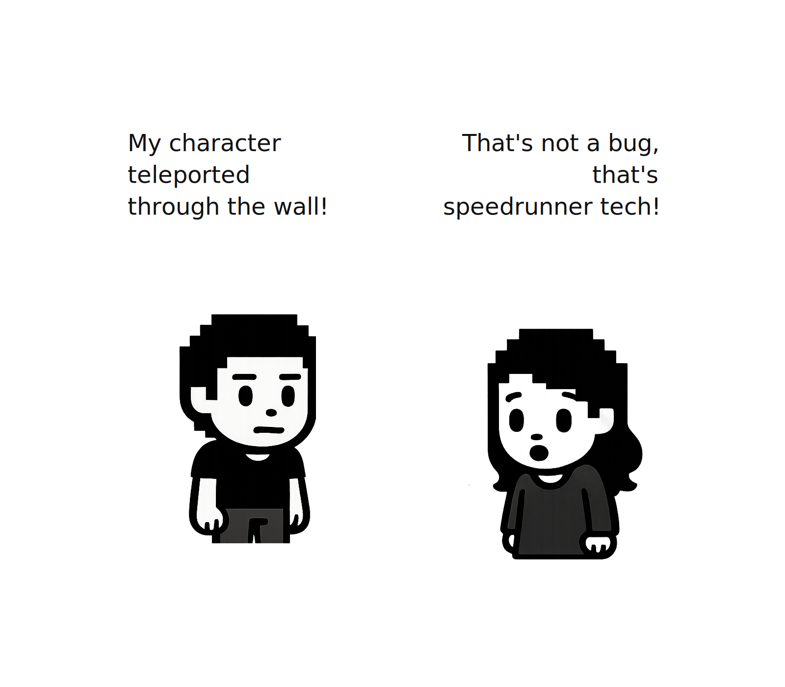

我们很快将致力于一个功能来可视化调试碰撞。我们需要以下辅助函数来计算碰撞地图。`#[cfg(debug_assertions)]`属性意味着这些只存在于调试构建中，它们在发布构建中被完全移除：

```rust
// Append to src/collision/map.rs
// Add this inside impl CollisionMap {

    // ... earlier functions inside impl CollisionMap 
    #[cfg(debug_assertions)]
    pub fn width(&self) -> i32 { self.width }
    
    #[cfg(debug_assertions)]
    pub fn height(&self) -> i32 { self.height }
    
    #[cfg(debug_assertions)]
    pub fn tile_size(&self) -> f32 { self.tile_size }
    
    #[cfg(debug_assertions)]
    pub fn origin(&self) -> Vec2 { Vec2::new(self.origin_x, self.origin_y) }
```

### 构建碰撞地图

我们有`CollisionMap`数据结构，但它什么时候被填充？我们需要一个系统，在WFC生成之后扫描所有图块并构建碰撞地图。

创建`src/collision/systems.rs`：

碰撞地图应该只在图块生成后构建一次。我们需要一种方法来跟踪这个。一个简单的布尔资源就能完成这项工作：它开始时为`false`，一旦我们构建了地图，就将其翻转为`true`。

我们使用`run_if(resource_equals(CollisionMapBuilt(false)))`向Bevy调度器注册这个资源，这意味着构建系统在地图构建后甚至不会运行。

```rust
// src/collision/systems.rs
use bevy::prelude::*;
use std::collections::{HashMap, hash_map::Entry};

use super::{CollisionMap, TileMarker, TileType};
use crate::config::map::{TILE_SIZE, GRID_X, GRID_Y};

/// Resource to track if collision map has been built.
#[derive(Resource, Default, PartialEq, Eq)]
pub struct CollisionMapBuilt(pub bool);
```

现在构建地图的主系统。这是我们写过的最长的函数，所以在看代码之前，让我们先理解它的作用。

该系统通过查询图块来检测WFC是否已完成——如果还不存在图块，则提前退出。一旦图块存在，它：

1. **计算网格原点**——我们的地图在屏幕上居中，所以网格的左下角不在(0, 0)处。我们需要找出它实际的位置。
2. **扫描所有图块**——每个图块实体有一个`Transform`（它在世界中的位置）和一个`TileMarker`（它是什么类型的图块）。我们遍历每个图块并读取两者。
3. **处理重叠的图块**——我们的WFC生成器可以在彼此之上放置图块。例如，一个树精灵在相同的(x, y)位置但更高的Z（深度）处位于草地上。对于碰撞，我们只关心最顶层的图块：如果草地上有一棵树，玩家与树碰撞。
4. **跟踪边界**——我们跟踪最左、最右、最上和最下的图块坐标。从这些中，我们计算`CollisionMap`的尺寸。
5. **创建并填充CollisionMap**——使用我们之前构建的`world_to_grid`逻辑，将每个图块的世界位置转换为图块坐标并调用`set_tile`来记录其类型。
6. **后处理**——最后，我们运行海岸线转换，将湖泊边缘的水图块转换为可通行的海岸图块。这给玩家在水边界带来更好的体验。

```rust
// Append to src/collision/systems.rs

/// System that builds the collision map from spawned tiles.
/// Handles multi-layer maps by keeping only the TOPMOST tile at each (x,y).
pub fn build_collision_map(
    mut commands: Commands,
    mut built: ResMut<CollisionMapBuilt>,
    tile_query: Query<(&TileMarker, &Transform)>,
) {
    // Need at least one tile to proceed
    let mut tile_iter = tile_query.iter();
    let Some((first_marker, first_transform)) = tile_iter.next() else {
        return; // WFC hasn't generated tiles yet
    };

    // Calculate grid origin (centered map)
    let grid_origin_x = -TILE_SIZE * GRID_X as f32 / 2.0;
    let grid_origin_y = -TILE_SIZE * GRID_Y as f32 / 2.0;

    // Track bounds and layer info
    let (mut min_x, mut max_x) = (i32::MAX, i32::MIN);
    let (mut min_y, mut max_y) = (i32::MAX, i32::MIN);
    let mut layer_tracker: HashMap<(i32, i32), (TileType, f32)> = HashMap::new();
    let mut tile_count: usize = 0;

    // Process all tiles, keeping only the topmost at each position
    let mut process_tile = |marker: &TileMarker, transform: &Transform| {
        tile_count += 1;

        let world_x = transform.translation.x;
        let world_y = transform.translation.y;
        let world_z = transform.translation.z;
        
        let grid_x = ((world_x - grid_origin_x) / TILE_SIZE).floor() as i32;
        let grid_y = ((world_y - grid_origin_y) / TILE_SIZE).floor() as i32;

        min_x = min_x.min(grid_x);
        max_x = max_x.max(grid_x);
        min_y = min_y.min(grid_y);
        max_y = max_y.max(grid_y);

        // Keep only the topmost layer (highest Z)
        match layer_tracker.entry((grid_x, grid_y)) {
            Entry::Occupied(mut entry) => {
                if world_z > entry.get().1 {
                    *entry.get_mut() = (marker.tile_type, world_z);
                }
            }
            Entry::Vacant(entry) => {
                entry.insert((marker.tile_type, world_z));
            }
        }
    };

    // Process first tile and remaining
    process_tile(first_marker, first_transform);
    for (marker, transform) in tile_iter {
        process_tile(marker, transform);
    }

    // Calculate actual dimensions
    let actual_width = (max_x - min_x + 1) as i32;
    let actual_height = (max_y - min_y + 1) as i32;

    // Create the collision map
    let mut map = CollisionMap::new(
        actual_width,
        actual_height,
        TILE_SIZE,
        grid_origin_x,
        grid_origin_y,
    );

    // Populate the map from layer tracker
    for ((grid_x, grid_y), (tile_type, _z)) in layer_tracker.iter() {
        // Convert world grid to local array coordinates
        let local_x = grid_x - min_x;
        let local_y = grid_y - min_y;
        map.set_tile(local_x, local_y, *tile_type);
    }

    // Post-processing: Convert water edges to shore
    convert_water_edges_to_shore(&mut map);
    // Insert as resource and mark built
    commands.insert_resource(map);
    built.0 = true;
}
```

### 海岸线转换

想象一下你游戏中的一个湖。水域图块完全阻挡移动，但湖边边缘呢？如果玩家走到草地边缘的水边，他们应该能够靠近水线，而不是在一个完整的图块之外就停住。

海岸线转换通过找到接触可通行地形的水域图块并将其标记为`Shore`来解决这个问题。海岸线图块是可通行的（记住我们之前的`TileType::Shore`），所以玩家可以一直走到水边，同时仍然被湖中央的深水阻挡。

算法很简单：扫描每个图块，找到水域图块，检查它们的8个邻居，如果任一邻居是可通行的，将此水域图块标记为海岸线。

```rust
// Append to src/collision/systems.rs

/// Convert water tiles adjacent to walkable tiles into shore tiles.
fn convert_water_edges_to_shore(map: &mut CollisionMap) {
    let mut shores = Vec::new();

    // Find water tiles that touch walkable tiles
    for y in 0..map.height() {
        for x in 0..map.width() {
            if map.get_tile(x, y) != Some(TileType::Water) {
                continue;
            }

            // Check 8 neighbors
            let neighbors = [
                (x - 1, y),     (x + 1, y),     // left, right
                (x, y - 1),     (x, y + 1),     // down, up
                (x - 1, y - 1), (x + 1, y - 1), // bottom corners
                (x - 1, y + 1), (x + 1, y + 1), // top corners
            ];

            for (nx, ny) in neighbors {
                if map.is_walkable(nx, ny) {
                    shores.push((x, y));
                    break;
                }
            }
        }
    }

    for (x, y) in shores {
        map.set_tile(x, y, TileType::Shore);
    }
}
```

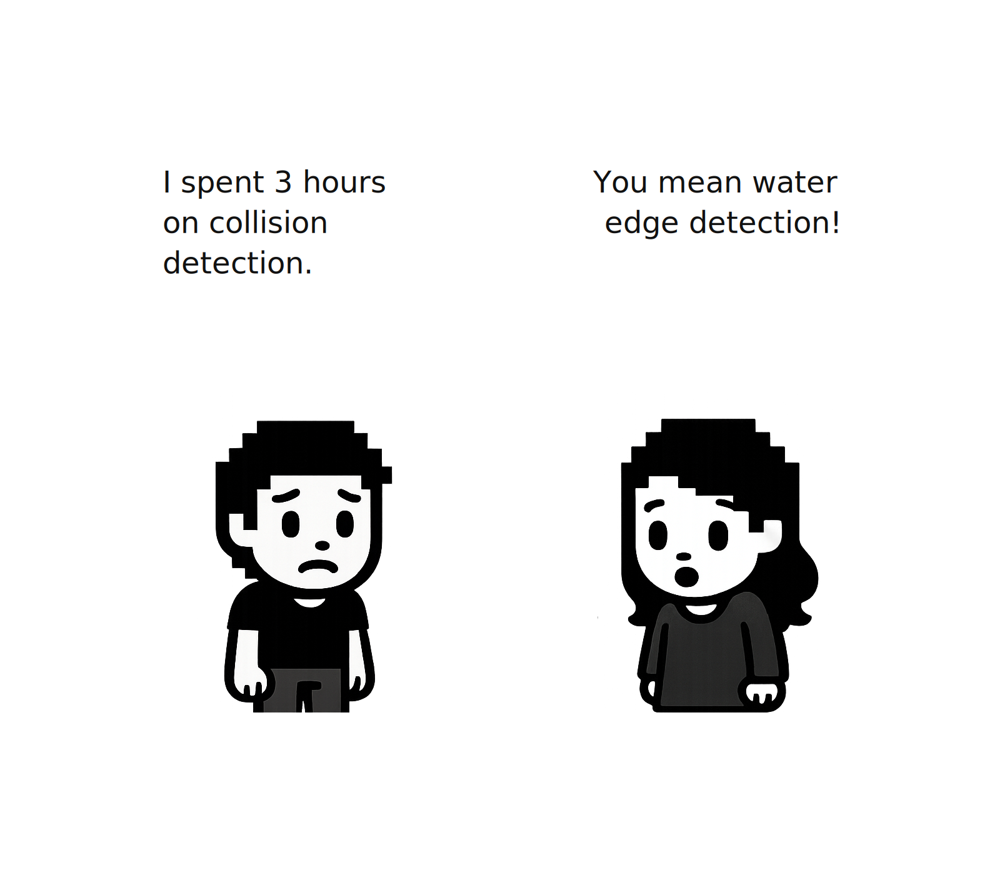

### 调试可视化

当碰撞不起作用时，你需要看到正在发生的事情。玩家的碰撞体在正确的位置吗？图块标记正确吗？可视化调试使这些问题变得明显。

我们将创建一个调试叠加层：

- 可通行图块显示为绿色，已阻挡的显示为红色
- 绘制玩家的碰撞圆
- 高亮显示玩家所在的网格单元格
- 仅存在于调试构建中（发布构建中移除）

创建`src/collision/debug.rs`：

```rust
// src/collision/debug.rs
use bevy::prelude::*;
use super::CollisionMap;
use crate::characters::input::Player;
use crate::characters::collider::Collider;

/// Resource to toggle debug visualization.
#[derive(Resource, Default)]
pub struct DebugCollisionEnabled(pub bool);
```

这个`DebugCollisionEnabled`资源控制是否激活调试绘制。我们开始时关闭它，让玩家可以用按键切换。

```rust
// Append to src/collision/debug.rs

/// Toggle collision debug visualization with F3 key.
pub fn toggle_debug_collision(
    keyboard: Res<ButtonInput<KeyCode>>,
    mut debug_enabled: ResMut<DebugCollisionEnabled>,
) {
    if keyboard.just_pressed(KeyCode::F3) {
        debug_enabled.0 = !debug_enabled.0;
        if debug_enabled.0 {
            info!("🔍 Collision debug ENABLED (F3 to toggle)");
        } else {
            info!("Collision debug disabled");
        }
    }
}
```

**为什么用`debug_enabled.0`而不是直接用`debug_enabled`？**

我们的`DebugCollisionEnabled`是一个"元组结构体"——一个包装单个值的结构体。`.0`访问其内部第一个（也是唯一的）字段。这种模式在Rust中很常见，用于创建类型安全的包装器：我们不是传递原始`bool`，而是将其包装在一个具名类型中，使代码意图更加清晰。

我们使用F3作为键盘快捷键来在游戏过程中切换调试覆盖层的开和关。

**`Gizmos`是什么？**

Gizmos是Bevy内置的用于绘制调试形状（如线条、圆形和矩形）的工具。与普通精灵不同，gizmos只持续一帧并自动消失。这使它们非常适合调试可视化：你每帧绘制你需要的内容，当你停止绘制时，它们就消失了。

```rust
// Append to src/collision/debug.rs

/// Draw colored rectangles over tiles showing walkability.
pub fn debug_draw_collision(
    map: Option<Res<CollisionMap>>,
    debug_enabled: Res<DebugCollisionEnabled>,
    mut gizmos: Gizmos,
) {
    if !debug_enabled.0 {
        return;
    }

    let Some(map) = map else { return };

    let tile_size = map.tile_size();
    let origin = map.origin();

    // Draw each tile
    for y in 0..map.height() {
        for x in 0..map.width() {
            let world_pos = Vec2::new(
                origin.x + (x as f32 + 0.5) * tile_size,
                origin.y + (y as f32 + 0.5) * tile_size,
            );

            let color = if map.is_walkable(x, y) {
                Color::srgba(0.0, 1.0, 0.0, 0.25)  // Green, 25% opacity
            } else {
                Color::srgba(1.0, 0.0, 0.0, 0.4)   // Red, 40% opacity
            };

            gizmos.rect_2d(
                world_pos,
                Vec2::splat(tile_size * 0.9),
                color,
            );
        }
    }
}
```

这会遍历每个图块并绘制一个彩色矩形：绿色表示可通行，红色表示已阻挡。0.9的乘数使每个矩形比图块稍小，以便你可以看到网格线。

接下来，我们可视化玩家的碰撞体：

```rust
// Append to src/collision/debug.rs

/// Draw player position and collider visualization.
pub fn debug_player_position(
    player_query: Query<(&Transform, &Collider), With<Player>>,
    map: Option<Res<CollisionMap>>,
    debug_enabled: Res<DebugCollisionEnabled>,
    mut gizmos: Gizmos,
) {
    if !debug_enabled.0 {
        return;
    }

    let Some(map) = map else { return };
    let Ok((transform, collider)) = player_query.single() else { return };

    let center = transform.translation.truncate();
    
    // Get actual collider position
    let collider_pos = collider.world_position(transform);
    let grid = map.world_to_grid(collider_pos);

    // Draw line from center to collider (shows offset)
    gizmos.line_2d(center, collider_pos, Color::srgba(1.0, 1.0, 0.0, 0.5));

    // Draw actual collider circle
    gizmos.circle_2d(collider_pos, collider.radius, Color::srgb(0.0, 1.0, 1.0));

    // Draw current grid cell outline
    if map.in_bounds(grid.x, grid.y) {
        let cell_center = map.grid_to_world(grid.x, grid.y);
        gizmos.rect_2d(
            cell_center,
            Vec2::splat(map.tile_size()),
            Color::srgb(1.0, 1.0, 0.0),
        );

        // Draw red X if on unwalkable tile
        if !map.is_walkable(grid.x, grid.y) {
            let offset = 15.0;
            gizmos.line_2d(
                collider_pos + Vec2::new(-offset, -offset),
                collider_pos + Vec2::new(offset, offset),
                Color::srgb(1.0, 0.0, 0.0),
            );
            gizmos.line_2d(
                collider_pos + Vec2::new(-offset, offset),
                collider_pos + Vec2::new(offset, -offset),
                Color::srgb(1.0, 0.0, 0.0),
            );
        }
    }
}
```

这绘制：

- **青色圆圈** - 玩家的碰撞半径
- **黄色矩形** - 玩家所在的网格单元格
- **红色X** - 如果玩家不知何故在不可通行的图块上时出现

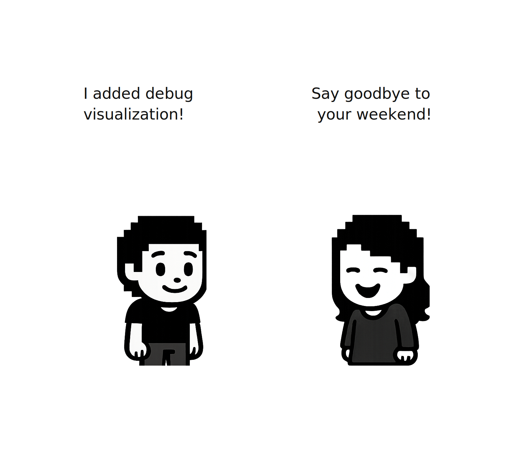

### 连接一切：碰撞模块

现在我们在`src/collision/mod.rs`中将一切连接起来。这个文件声明了我们的子模块，重新导出公共类型，并定义了`CollisionPlugin`。

```rust
// src/collision/mod.rs
mod tile_type;
mod map;
mod systems;

#[cfg(debug_assertions)]
mod debug;

use bevy::prelude::*;
use crate::state::GameState;

// Re-export commonly used types
pub use tile_type::{TileType, TileMarker};
pub use map::CollisionMap;
pub use systems::CollisionMapBuilt;

#[cfg(debug_assertions)]
pub use debug::DebugCollisionEnabled;
```

`pub use`行使这些类型对其他模块可用。其他代码无需写`collision::tile_type::TileType`，而可以直接使用`collision::TileType`。

现在是用Bevy注册所有东西的插件：

```rust
// Append to src/collision/mod.rs

/// Plugin for collision detection functionality
pub struct CollisionPlugin;

impl Plugin for CollisionPlugin {
    fn build(&self, app: &mut App) {
        app.init_resource::<CollisionMapBuilt>()
            .add_systems(
                Update,
                systems::build_collision_map
                    .run_if(resource_equals(CollisionMapBuilt(false)))
                    .run_if(in_state(GameState::Playing)),
            );

        // Debug systems - only in debug builds
        #[cfg(debug_assertions)]
        {
            app.init_resource::<DebugCollisionEnabled>()
                .add_systems(
                    Update,
                    (
                        debug::toggle_debug_collision,
                        debug::debug_draw_collision,
                        debug::debug_player_position,
                    )
                        .run_if(in_state(GameState::Playing)),
                );
        }
    }
}
```

注意`build_collision_map`上的两个`run_if`条件：

- `resource_equals(CollisionMapBuilt(false))` - 仅当地图尚未构建时运行
- `in_state(GameState::Playing)` - 仅在游戏过程中运行，而不是在菜单或加载时

调试系统被包裹在`#[cfg(debug_assertions)]`中，所以在发布构建中它们根本不存在。

同时在你的`main.rs`中添加碰撞模块：

```rust
// In main.rs
mod collision; // Line update alert

// In your app setup:
        .add_plugins(ProcGenSimplePlugin::<Cartesian3D, Sprite>::default())
        .add_plugins(state::StatePlugin)
        .add_plugins(collision::CollisionPlugin) // Line update alert
        .add_plugins(characters::CharactersPlugin) 
        .add_systems(Startup, (setup_camera, setup_generator))
        .run();
```

### 将碰撞与地图资源集成

现在我们需要修改我们的地图生成，以将`TileMarker`组件附加到生成的图块上。这将视觉图块连接到碰撞系统。

首先，更新`src/map/assets.rs`以支持图块类型：

```rust
// src/map/assets.rs - Updated imports
use bevy::prelude::*;
use bevy_procedural_tilemaps::prelude::*;

use crate::collision::{TileMarker, TileType}; // Line update alert
use crate::map::tilemap::TILEMAP;
```

更新`SpawnableAsset`结构体以包含图块类型。注意：我们将用`tile_type`替换我们之前拥有的`components_spawner`，所以这包括结构体、函数参数等的多处更改。

```rust
// src/map/assets.rs - Updated SpawnableAsset struct
#[derive(Clone)]
pub struct SpawnableAsset {
    /// Name of the sprite inside our tilemap atlas
    sprite_name: &'static str,
    /// Offset in grid coordinates (for multi-tile objects)
    grid_offset: GridDelta,
    /// Offset in world coordinates (fine positioning)
    offset: Vec3,
    /// The tile type for collision detection
    tile_type: Option<TileType>, // Line update alert
}

impl SpawnableAsset {
    pub fn new(sprite_name: &'static str) -> Self {
        Self {
            sprite_name,
            grid_offset: GridDelta::new(0, 0, 0),
            offset: Vec3::ZERO,
            tile_type: None, // Line update alert
        }
    }

    /// Set grid offset for multi-tile objects.
    pub fn with_grid_offset(mut self, offset: GridDelta) -> Self {
        self.grid_offset = offset;
        self
    }

    /// Set tile type for collision detection.
    // Function added alert
    pub fn with_tile_type(mut self, tile_type: TileType) -> Self { 
        self.tile_type = Some(tile_type);
        self
    }
}
```

建造者模式让我们可以链式调用方法：`SpawnableAsset::new("grass").with_tile_type(TileType::Grass)`。

更新`load_assets`函数以使用生成器：

```rust
// src/map/assets.rs - Updated load_assets function
pub fn load_assets(
    tilemap_handles: &TilemapHandles,
    assets_definitions: Vec<Vec<SpawnableAsset>>,
) -> ModelsAssets<Sprite> {
    let mut models_assets = ModelsAssets::<Sprite>::new();
    
    for (model_index, assets) in assets_definitions.into_iter().enumerate() {
        for asset_def in assets {
            let SpawnableAsset {
                sprite_name,
                grid_offset,
                offset,
                tile_type, // Line update alert
            } = asset_def;

            let Some(atlas_index) = TILEMAP.sprite_index(sprite_name) else {
                panic!("Unknown atlas sprite '{}'", sprite_name);
            };

            // Create the spawner function that adds components
            let spawner = create_spawner(tile_type); // Line update alert

            models_assets.add(
                model_index,
                ModelAsset {
                    assets_bundle: tilemap_handles.sprite(atlas_index),
                    grid_offset,
                    world_offset: offset,
                    spawn_commands: spawner, // Line update alert
                },
            );
        }
    }
    models_assets
}
```

现在添加基于图块类型生成正确组件插入的`create_spawner`函数：

```rust
// src/map/assets.rs - Add create_spawner function

fn create_spawner(
    tile_type: Option<TileType>,
) -> fn(&mut EntityCommands) {
    match tile_type {
        // Tile types without pickable
        Some(TileType::Dirt) => |e: &mut EntityCommands| {
            e.insert(TileMarker::new(TileType::Dirt));
        },
        Some(TileType::Grass) => |e: &mut EntityCommands| {
            e.insert(TileMarker::new(TileType::Grass));
        },
        Some(TileType::YellowGrass) => |e: &mut EntityCommands| {
            e.insert(TileMarker::new(TileType::YellowGrass));
        },
        Some(TileType::Water) => |e: &mut EntityCommands| {
            e.insert(TileMarker::new(TileType::Water));
        },
        Some(TileType::Shore) => |e: &mut EntityCommands| {
            e.insert(TileMarker::new(TileType::Shore));
        },
        Some(TileType::Tree) => |e: &mut EntityCommands| {
            e.insert(TileMarker::new(TileType::Tree));
        },
        Some(TileType::Rock) => |e: &mut EntityCommands| {
            e.insert(TileMarker::new(TileType::Rock));
        },
        Some(TileType::Empty) => |e: &mut EntityCommands| {
            e.insert(TileMarker::new(TileType::Empty));
        },
        // Default: no components
        _ => |_: &mut EntityCommands| {},
    }
}
```

### 使用图块类型更新地图规则

现在更新`src/map/rules.rs`，为每个可生成的资源指定图块类型。在顶部添加导入：

```rust
// src/map/rules.rs - Updated imports
use crate::collision::TileType; //Line update alert
use crate::map::assets::SpawnableAsset;
use crate::map::models::TerrainModelBuilder;
use crate::map::sockets::*;
use bevy_procedural_tilemaps::prelude::*;
```

现在更新每个图层函数。以下是泥土层：

```rust
// src/map/rules.rs - Updated build_dirt_layer
fn build_dirt_layer(
    terrain_model_builder: &mut TerrainModelBuilder,
    terrain_sockets: &TerrainSockets,
    socket_collection: &mut SocketCollection,
) {
    terrain_model_builder
        .create_model(
            SocketsCartesian3D::Simple {
                x_pos: terrain_sockets.dirt.material,
                x_neg: terrain_sockets.dirt.material,
                z_pos: terrain_sockets.dirt.layer_up,
                z_neg: terrain_sockets.dirt.layer_down,
                y_pos: terrain_sockets.dirt.material,
                y_neg: terrain_sockets.dirt.material,
            },
            //Line update alert
            vec![SpawnableAsset::new("dirt").with_tile_type(TileType::Dirt)],
        )
        .with_weight(20.);

    socket_collection.add_connections(vec![(
        terrain_sockets.dirt.material,
        vec![terrain_sockets.dirt.material],
    )]);
}
```

草地层（显示主图块和一个角作为示例），你需要对所有其他草地角和边图块重复此操作。

```rust
// src/map/rules.rs - Updated build_grass_layer (partial)
// Main grass tile
terrain_model_builder
    .create_model(
        SocketsCartesian3D::Multiple {
            x_pos: vec![terrain_sockets.grass.material],
            x_neg: vec![terrain_sockets.grass.material],
            z_pos: vec![
                terrain_sockets.grass.layer_up,
                terrain_sockets.grass.grass_fill_up,
            ],
            z_neg: vec![terrain_sockets.grass.layer_down],
            y_pos: vec![terrain_sockets.grass.material],
            y_neg: vec![terrain_sockets.grass.material],
        },
        //Line update alert
        vec![SpawnableAsset::new("green_grass").with_tile_type(TileType::Grass)],
    )
    .with_weight(5.);

// Outer corners
terrain_model_builder.create_model(
    green_grass_corner_out.clone(),
    vec![SpawnableAsset::new("green_grass_corner_out_tl").with_tile_type(TileType::Grass)],
);
// ... repeat for all corner and side variants with .with_tile_type(TileType::Grass)
```

确保对所有角和边变体重复使用`.with_tile_type(TileType::Grass)`，如果你感到困惑，请查看GitHub仓库以获取完整代码。

黄色草地层遵循相同模式：

```rust
// Main yellow grass tile
vec![SpawnableAsset::new("yellow_grass").with_tile_type(TileType::YellowGrass)]

// All yellow grass corners and sides
vec![SpawnableAsset::new("yellow_grass_corner_out_tl").with_tile_type(TileType::YellowGrass)]
// ... etc
```

确保对所有角和边变体重复使用`.with_tile_type(TileType::YellowGrass)`。

水域层：

```rust
// Main water tile
vec![SpawnableAsset::new("water").with_tile_type(TileType::Water)]

// All water corners and sides
vec![SpawnableAsset::new("water_corner_out_tl").with_tile_type(TileType::Water)]
// ... etc
```

确保对所有角和边变体重复使用`.with_tile_type(TileType::Water)`。

道具层有混合的图块类型。树木和岩石阻挡移动，植物是可通行的：

```rust
// src/map/rules.rs - Updated build_props_layer (key examples)

// Small tree - bottom blocks, top is walkable (canopy)
terrain_model_builder.create_model(
    plant_prop.clone(),
    vec![
        // Line update alert
        SpawnableAsset::new("small_tree_bottom").with_tile_type(TileType::Tree),
        SpawnableAsset::new("small_tree_top").with_grid_offset(GridDelta::new(0, 1, 0)),
    ],
);

// Big tree 1 - left side (base blocks, canopy walkable)
vec![
    SpawnableAsset::new("big_tree_1_bl").with_tile_type(TileType::Tree),
    SpawnableAsset::new("big_tree_1_tl").with_grid_offset(GridDelta::new(0, 1, 0)),
]

// Big tree 1 - right side
vec![
    SpawnableAsset::new("big_tree_1_br").with_tile_type(TileType::Tree),
    SpawnableAsset::new("big_tree_1_tr").with_grid_offset(GridDelta::new(0, 1, 0)),
]

// Big tree 2 - left side
vec![
    SpawnableAsset::new("big_tree_2_bl").with_tile_type(TileType::Tree),
    SpawnableAsset::new("big_tree_2_tl").with_grid_offset(GridDelta::new(0, 1, 0)),
]

// Big tree 2 - right side
vec![
    SpawnableAsset::new("big_tree_2_br").with_tile_type(TileType::Tree),
    SpawnableAsset::new("big_tree_2_tr").with_grid_offset(GridDelta::new(0, 1, 0)),
]

// Tree stumps block movement
vec![SpawnableAsset::new("tree_stump_1").with_tile_type(TileType::Tree)]
vec![SpawnableAsset::new("tree_stump_2").with_tile_type(TileType::Tree)]
vec![SpawnableAsset::new("tree_stump_3").with_tile_type(TileType::Tree)]

// Rocks block movement
// Lines updated
vec![SpawnableAsset::new("rock_1").with_tile_type(TileType::Rock)]
vec![SpawnableAsset::new("rock_2").with_tile_type(TileType::Rock)]
vec![SpawnableAsset::new("rock_3").with_tile_type(TileType::Rock)]
vec![SpawnableAsset::new("rock_4").with_tile_type(TileType::Rock)]

// Plants are walkable (grass tile type)
vec![SpawnableAsset::new("plant_1").with_tile_type(TileType::Grass)]
vec![SpawnableAsset::new("plant_2").with_tile_type(TileType::Grass)]
vec![SpawnableAsset::new("plant_3").with_tile_type(TileType::Grass)]
vec![SpawnableAsset::new("plant_4").with_tile_type(TileType::Grass)]
```

注意树冠（"顶部"部分）没有图块类型。这是有意为之：玩家可以在树冠下行走，但会与树干碰撞。

### 集中配置

在创建玩家碰撞体之前，让我们集中管理我们的魔法数字。分散的常量会使调整游戏体验变得繁琐。创建一个单一的配置文件：

创建`src/config.rs`：

```rust
// src/config.rs
//! Centralized configuration constants for the game.

/// Player-related configuration
pub mod player {
    /// Collision radius for the player's collider (in world units)
    pub const COLLIDER_RADIUS: f32 = 16.0;
    
    
    /// Z-position for player rendering (above terrain, below UI)
    pub const PLAYER_Z_POSITION: f32 = 20.0;
    
    /// Visual scale of the player sprite
    pub const PLAYER_SCALE: f32 = 0.8;
}

/// Map/terrain configuration
pub mod map {
    /// Size of a single tile in world units
    pub const TILE_SIZE: f32 = 32.0;
    
    /// Grid dimensions
    pub const GRID_X: u32 = 25;
    pub const GRID_Y: u32 = 18;
}
```

这些常量定义了我们的碰撞半径（16像素）和地图尺寸。将它们放在一个位置意味着你可以在不翻遍多个文件的情况下调整碰撞行为。

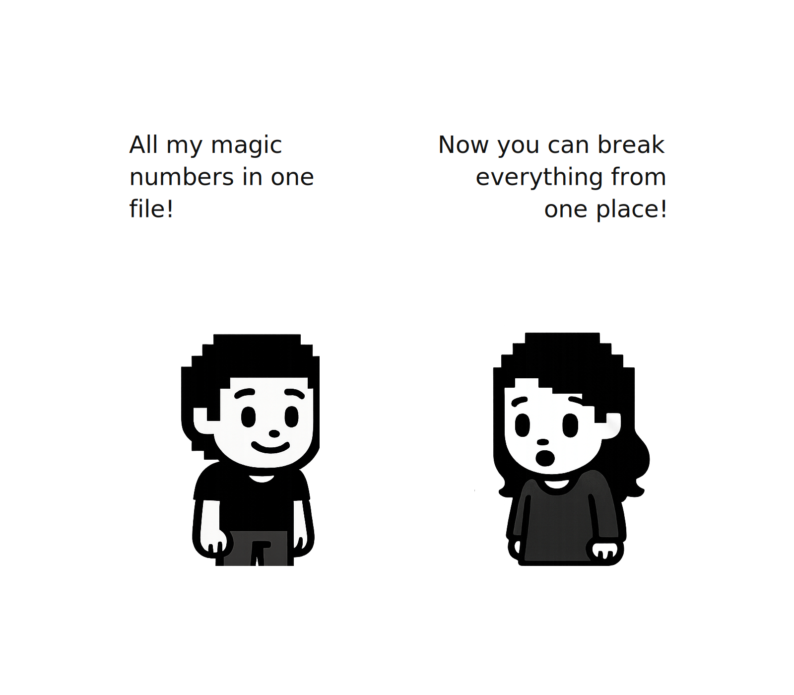

在`src/main.rs`中添加此模块：

```rust
// src/main.rs
mod config;  // Add this line
```

### 创建玩家碰撞体

现在我们需要一个表示玩家碰撞形状的组件。我们将使用一个以玩家中心为圆心的圆。

创建`src/characters/collider.rs`：

```rust
// src/characters/collider.rs
use bevy::prelude::*;

use crate::collision::CollisionMap;
use crate::characters::physics::Velocity;
use crate::config::player::{COLLIDER_RADIUS};

/// A circular collider for collision detection.
/// 
/// The collider position is offset from the entity's transform,
#[derive(Component, Debug, Clone)]
pub struct Collider {
    /// Radius of the circular collider in world units
    pub radius: f32,
    /// Offset from entity center
    pub offset: Vec2,
}

impl Default for Collider {
    fn default() -> Self {
        Self {
            radius: COLLIDER_RADIUS,
            offset: Vec2::ZERO,
        }
    }
}

impl Collider {
    /// Get the world position of this collider given an entity's transform.
    pub fn world_position(&self, transform: &Transform) -> Vec2 {
        transform.translation.truncate() + self.offset
    }
}
```

### 验证移动与碰撞

现在是关键系统：检查玩家是否真的可以移动到他们想去的地方。

```rust
// Append to src/characters/collider.rs

/// System that validates movement against the collision map.
/// 
/// Runs after input (which sets velocity) but before physics (which applies velocity).
/// Modifies velocity to prevent movement into unwalkable tiles.
pub fn validate_movement(
    map: Option<Res<CollisionMap>>,
    time: Res<Time>,
    mut query: Query<(&Transform, &mut Velocity, &Collider)>,
) {
    let Some(map) = map else { return };

    for (transform, mut velocity, collider) in query.iter_mut() {
        // Skip if not moving
        if !velocity.is_moving() {
            continue;
        }

        // Current collider position
        let current_pos = collider.world_position(transform);
        
        // Desired new position based on velocity
        let delta = velocity.0 * time.delta_secs();
        let desired_pos = current_pos + delta;

        // Use swept collision to find valid position
        let valid_pos = map.sweep_circle(current_pos, desired_pos, collider.radius);

        // Calculate what velocity would get us to valid_pos
        let actual_delta = valid_pos - current_pos;
        
        // Only update velocity if collision modified our path
        if (actual_delta - delta).length_squared() > 0.001 {
            // Convert position delta back to velocity
            let dt = time.delta_secs();
            if dt > 0.0 {
                velocity.0 = actual_delta / dt;
            }
        }
    }
}
```

**这是如何工作的：**

- 获取当前碰撞体位置
- 计算玩家*想要*去的地方（基于他们的速度）
- 使用`sweep_circle`找到沿该路径最远有效位置
- 如果碰撞阻挡了部分移动，相应调整速度

关键洞察：我们不会完全阻挡移动。如果玩家试图沿对角线走入墙壁，`sweep_circle`可能允许沿墙壁表面滑动。这比卡住的感觉好多了。

### 更新角色模块

在`src/characters/mod.rs`中添加碰撞体模块：

```rust
// src/characters/mod.rs - Add at the top
pub mod collider;  // Add this line
```

现在更新系统注册。我们需要`validate_movement`在输入设置速度**之后**、物理应用速度**之前**运行：

```rust
// src/characters/mod.rs - Update the system chain
.add_systems(Update, (
    // 1. Input determines state + velocity + facing
    input::handle_player_input,
    spawn::switch_character,
    input::update_jump_state,
    
    // 2. State changes trigger animation updates
    animation::on_state_change_update_animation,
    
    // 3. Collision validation adjusts velocity  
    collider::validate_movement,
    
    // 4. Physics applies velocity to transform
    physics::apply_velocity,
    
    // 5. Animation ticks frames
    animation::animations_playback,
).chain().run_if(in_state(GameState::Playing)));
```

### 将碰撞体附加到玩家

最后，更新`src/characters/spawn.rs`，在初始化玩家时附加`Collider`组件。

更新导入：

```rust
// src/characters/spawn.rs - Add import
use crate::characters::collider::Collider; // Line update alert!
use crate::config::player::{PLAYER_SCALE, PLAYER_Z_POSITION}; // Line update alert!
```

同时删除以下现有常量，因为我们正在从config中导入常量：

```rust
// Delete these lines
// const PLAYER_SCALE: f32 = 0.8;
// const PLAYER_Z_POSITION: f32 = 20.0;
```

然后在`initialize_player_character`中，将`Collider::default()`添加到组件包中：

```rust
// src/characters/spawn.rs - In initialize_player_character
commands.entity(entity).insert((
    AnimationController::default(),
    CharacterState::default(),
    Velocity::default(),
    Facing::default(),
    Collider::default(),  // Line update alert!
    AnimationTimer(Timer::from_seconds(DEFAULT_ANIMATION_FRAME_TIME, TimerMode::Repeating)),
    character_entry.clone(),
    sprite,
));
```

现在运行游戏：

```rust
cargo run
```

让你的角色四处走动。现在你应该会与树木、岩石和水域碰撞！角色会平滑地沿障碍物滑动而不是卡住。按F3切换调试覆盖层并查看可视化后的碰撞地图。

## 深度的错觉

还有一个问题。让你的角色走到树后面。注意到什么奇怪的吗？

玩家总是渲染在最上面。他们不会消失在树干后面。在俯视游戏中，屏幕上位置更高的物体（离你更远）应该出现在屏幕上位置更低的物体（离你更近）"后面"。当你的角色向上走并经过一棵树后面时，他们应该消失在树后面。

这就是**基于Y的深度排序**。概念很简单：Y位置较低的物体（靠近屏幕底部）在Y位置较高的物体"前面"。

在2D渲染中，Z决定绘制顺序。较高的Z绘制在上面。所以我们需要：

- **更高的Y**（屏幕顶部）→ **更低的Z**（先绘制，出现在后面）
- **更低的Y**（屏幕底部）→ **更高的Z**（最后绘制，出现在前面）

我们的图块地图生成器已经使用`with_z_offset_from_y(true)`对图块执行了这个操作。但玩家的Z位置是固定的！我们需要基于玩家的Y位置动态更新玩家的Z。

### 创建渲染模块

创建`src/characters/rendering.rs`：

```rust
// src/characters/rendering.rs
//! Rendering utilities for depth sorting.

use bevy::prelude::*;

use crate::characters::input::Player;
use crate::config::map::{GRID_Y, TILE_SIZE};
use crate::config::player::PLAYER_SCALE;

/// Z-depth constants for proper layering.
/// The tilemap uses `with_z_offset_from_y(true)` which assigns Z based on Y position.
/// We need to match this formula for the player.
const NODE_SIZE_Z: f32 = 1.0;  // Same as tilemap generator
const PLAYER_BASE_Z: f32 = 4.0;  // Match props layer Z range
const PLAYER_Z_OFFSET: f32 = 0.5;  // Small offset to stay above ground props
```

这些常量需要与图块地图生成器计算Z的方式匹配。`PLAYER_BASE_Z`将玩家定位在与道具（树木、岩石）相同的Z范围内。`PLAYER_Z_OFFSET`添加了一个微小的缓冲区，以防止玩家与地面装饰物产生Z冲突。

现在是深度排序系统。关键在于基于玩家的Y位置动态调整玩家的Z位置。当玩家向上移动（更高的Y）时，我们降低他们的Z，使他们渲染在物体后面。当他们向下移动（更低的Y）时，我们提高他们的Z，使他们渲染在前面。

但有一个微妙之处：我们使用玩家的**脚部位置**，而不是精灵中心，来进行深度计算。为什么？想象你的角色站在一棵树前面。精灵的中心在胸部高度，但在视觉上，重要的是他们的脚在哪里。如果我们使用中心，玩家的头可能会不正确地从他们正站在前面的树上方探出来。使用脚部位置使遮挡看起来自然。

```rust
// Append to src/rendering.rs

/// System to update player depth based on Y position.
/// 
/// Objects with lower Y (further down screen) get higher Z (rendered in front).
/// This creates proper occlusion when walking behind trees.
pub fn update_player_depth(
    mut player_query: Query<&mut Transform, (With<Player>, Changed<Transform>)>,
) {
    // Map dimensions for normalization
    let map_height = TILE_SIZE * GRID_Y as f32;
    let map_y0 = -TILE_SIZE * GRID_Y as f32 / 2.0;  // Map origin Y (centered)
    
    // Player sprite height for feet position calculation
    let player_sprite_height = 64.0 * PLAYER_SCALE;

    for mut transform in player_query.iter_mut() {
        let player_center_y = transform.translation.y;

        // Use player's FEET position for depth sorting (not center)
        let player_feet_y = player_center_y - (player_sprite_height / 2.0);

        // Normalize feet Y to [0, 1] across the grid height
        let t = ((player_feet_y - map_y0) / map_height).clamp(0.0, 1.0);

        // Y-to-Z formula:
        // Lower Y (bottom of screen) = higher t = lower Z offset = rendered in front
        // Higher Y (top of screen) = lower t = higher Z offset = rendered behind
        let player_z = PLAYER_BASE_Z + NODE_SIZE_Z * (1.0 - t) + PLAYER_Z_OFFSET;

        transform.translation.z = player_z;
    }
}
```

**`Changed<Transform>`是什么？**

这是一个Bevy查询过滤器，只匹配`Transform`在本帧被修改过的实体。这是一个性能优化：我们只在玩家实际移动时重新计算Z。如果他们站着不动，系统完全跳过他们。

### 集成深度排序

现在，你可以将其添加到`src/characters/mod.rs`中`physics::apply_velocity`之后的角色系统链中：

```rust
// src/characters/mod.rs

mod rendering; // Line update alert!

.add_systems(Update, (
    // ... existing systems ...
    physics::apply_velocity,
    rendering::update_player_depth,  // Add after physics , line update alert!
    animation::animations_playback,
).chain().run_if(in_state(GameState::Playing)));
```

### 调整水域生成

在运行游戏之前，做一个小调整，防止玩家在水中生成。打开`src/map/rules.rs`并找到水域层的权重：

```rust
// src/map/rules.rs - In build_water_layer function
const WATER_WEIGHT: f32 = 0.001;  // Reduce from 0.02 to 0.001
```

这减少了水域生成，降低了玩家生成在不可访问区域的可能性。

**生成故障排除：** 程序化生成有小概率将玩家放置在阻挡物体（树、岩石）上。如果游戏启动时你无法移动，只需重新启动以生成新的地图。这是随机生成的一个小问题，我们将在未来的章节中解决。

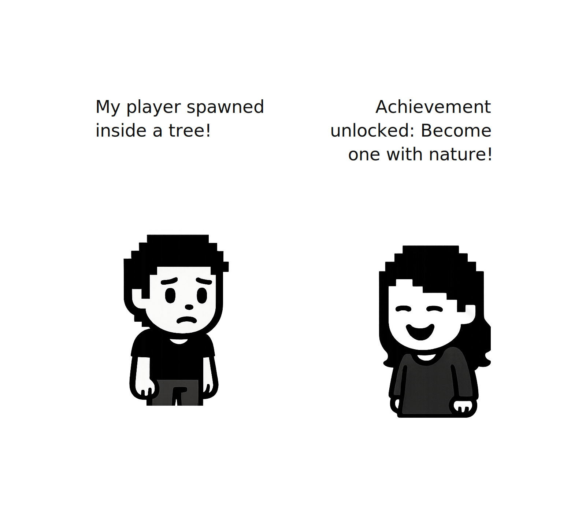

再次运行游戏：

```rust
cargo run
```

现在走到树后面。你的角色应该消失在树干后面！走下来，他们又出现了。深度的错觉使世界感觉三维，即使它全是2D精灵。


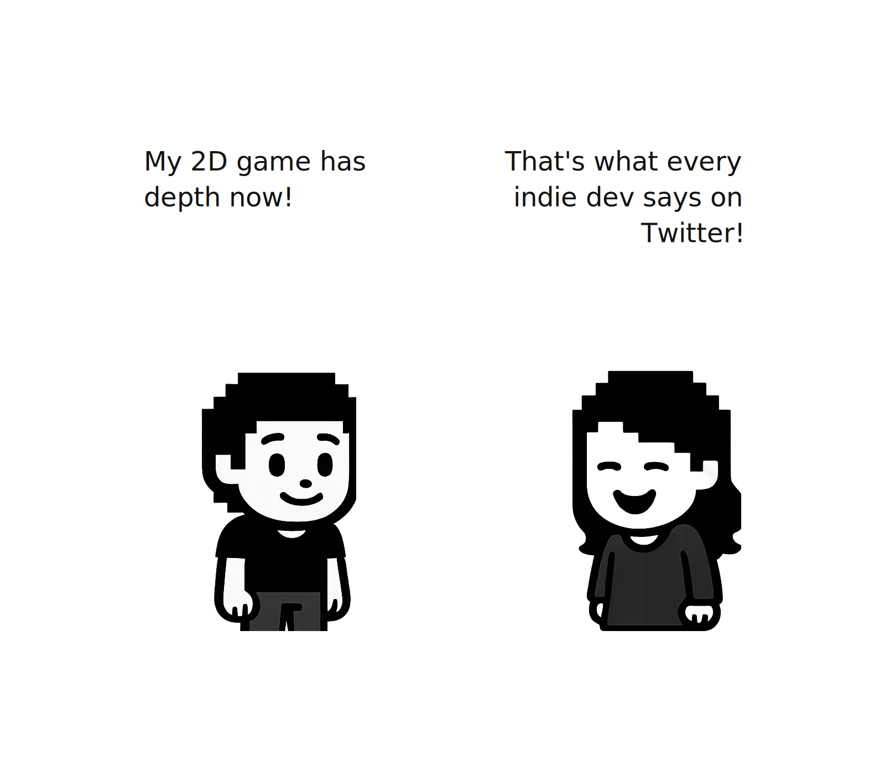

## 我们构建了什么

让我们退后一步，欣赏一下我们在本章中取得的成就：

- **游戏状态** - 使用Loading、Playing和Paused状态进行正确的生命周期管理。不再有轮询模式。
- **角色状态** - 基于枚举的状态机，防止不可能的状态并简化动画逻辑。
- **碰撞系统** - 基于图块的碰撞地图，带有圆形碰撞体、用于平滑墙壁滑动的扫描碰撞，以及水域边缘的海岸线检测。
- **调试可视化** - 按F3查看碰撞地图、玩家碰撞体和当前网格单元格。
- **深度排序** - 基于Y的渲染，创建在物体后面行走的错觉。

你的角色现在可以在程序化生成的世界中行走，真实地碰撞障碍物，绕角落滑动，并在树后消失。这是很多系统在协同工作！

在下一章中，我们将添加交互性：拾取物品和构建背包系统。在那之前，尝试调整碰撞参数，试试不同的碰撞体大小，看看调试可视化如何帮助你理解底层发生的事情。
---

## 📂 查看本章源码

完整源代码可在 GitHub 查看：
[https://github.com/jamesfebin/ImpatientProgrammerBevyRust/tree/main/chapter4](https://github.com/jamesfebin/ImpatientProgrammerBevyRust/tree/main/chapter4)
