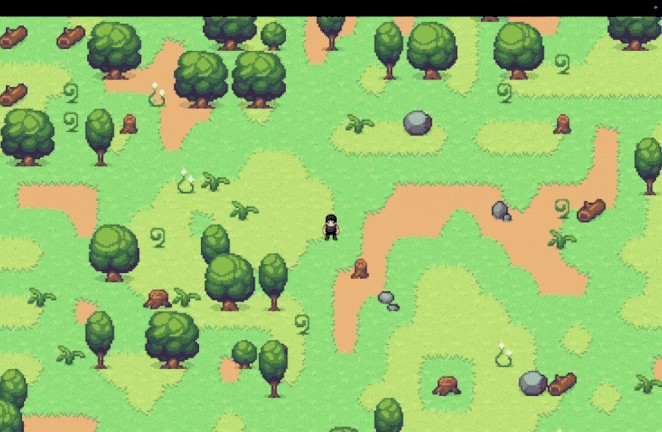
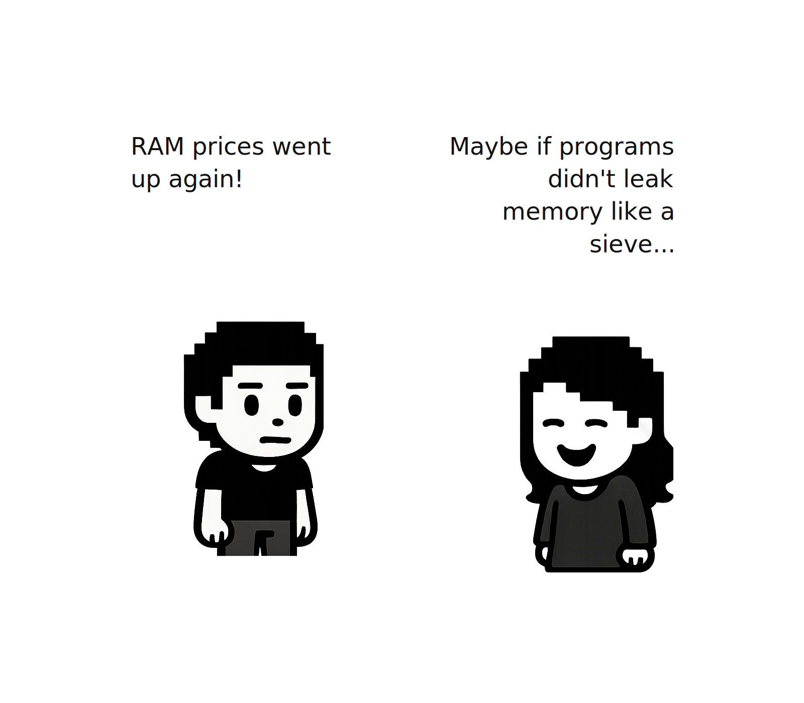
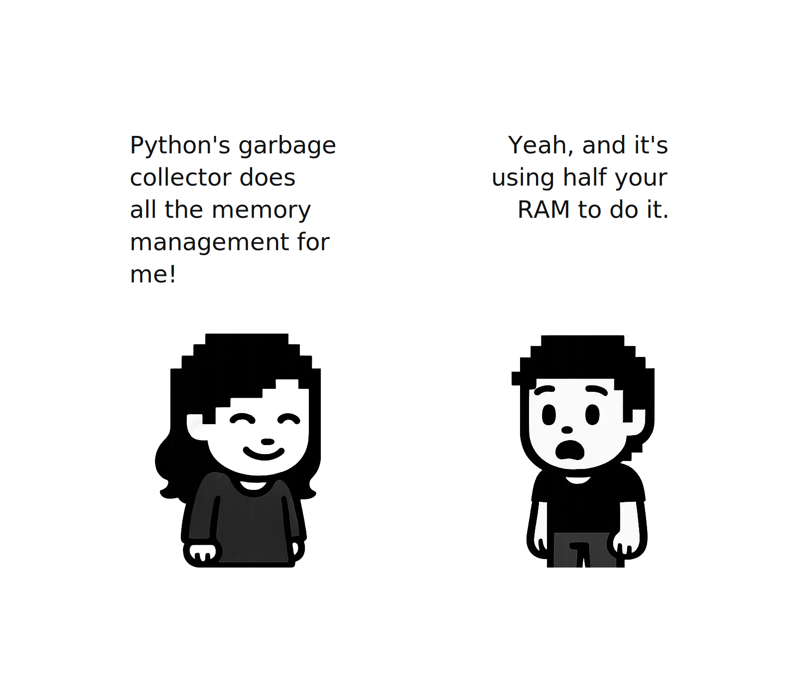
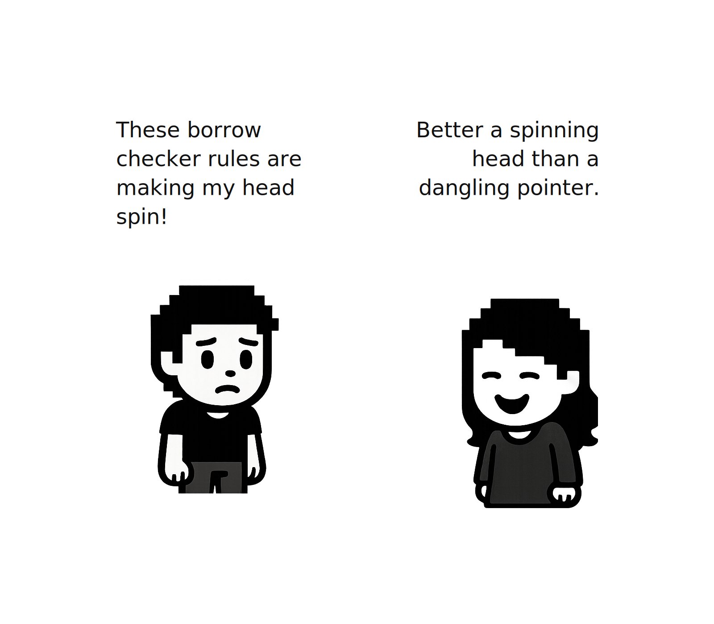
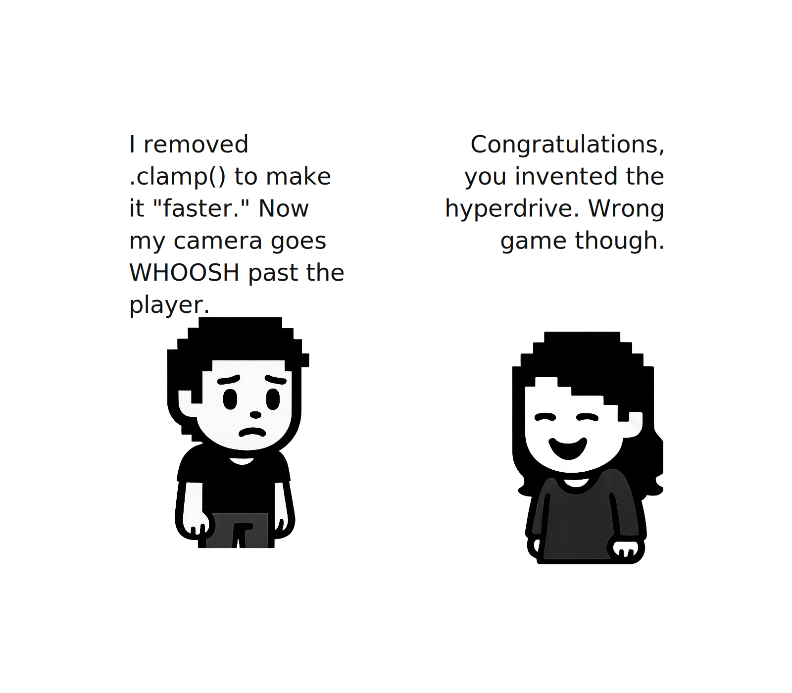

# 第五章：让拾取发生




2026 年 1 月 11 日

**关于 AI 辅助**
*是的，本章的编写使用了 AI 辅助。我负责结构、技术决策、方法、代码组织方式，并整理了学习者可能遇到的问题列表。AI 帮助扩展了结构和解释内容，我进行了全程编辑。总体而言，每章我花费了大约 20-25 小时，包括编码和写作。如果任何部分感觉不妥，请在 [Reddit](https://www.reddit.com/r/bevy/) 或 [Discord](https://discord.com/invite/cD9qEsSjUH) 上告诉我，我会进行修改。*

到本章结束时，你将拥有一个让玩家可以从世界中收集物品的背包系统，以及一个平滑跟随玩家的摄像机。走近植物或蘑菇，它会消失到你的背包里。在地图上移动时，摄像机会以丝滑流畅的运动让你始终保持在画面中央。

> **前置条件**：这是我们 Bevy 教程系列的第 5 章。[加入我们的社区](https://discord.com/invite/cD9qEsSjUH) 获取新版本更新。开始之前，请先完成[第 1 章：让玩家出现](/posts/bevy-rust-game-development-chapter-1/)、[第 2 章：让世界出现](/posts/bevy-rust-game-development-chapter-2/)、[第 3 章：让数据流动](/posts/bevy-rust-game-development-chapter-3/)和[第 4 章：让碰撞出现](/posts/bevy-rust-game-development-chapter-4/)，或从[此仓库](https://github.com/jamesfebin/ImpatientProgrammerBevyRust)克隆第 4 章的代码来继续学习。

**开始之前：** *我一直在努力改进本教程，让你的学习之旅更加愉快。你的反馈很重要——在 [Reddit](https://www.reddit.com/r/bevy/)/[Discord](https://discord.com/invite/cD9qEsSjUH)/[LinkedIn](https://www.linkedin.com/in/febinjohnjames) 上分享你的困惑、问题或建议。喜欢它？请告诉我哪些地方做得好！让我们一起让 Rust 和 Bevy 的游戏开发对每个人都更易上手。*

## 构建拾取系统

在第 4 章中，我们让固体物体阻挡玩家。现在让我们做相反的事情：让玩家可以穿过并收集物品。

### 拾取系统

想想你在游戏中玩过的拾取机制：

1.  **检测**："玩家离这个物品够近了吗？"
2.  **收集**："将物品从世界中移除"
3.  **存储**："记住收集了什么"

我们将分三部分构建：

-   一个 `Pickable` 组件，用于标记可收集的物品
-   一个 `handle_pickups` 系统，用于检测玩家何时靠近物品
-   一个 `Inventory` 资源，用于追踪已收集的内容


### 配置拾取半径

在构建背包之前，让我们先添加拾取检测的配置。我们在第 4 章中已经有了一个 `config.rs` 文件，集中了碰撞设置。让我们在那里添加拾取配置。

打开 `src/config.rs`，你会看到它按模块组织：`player`、`map`、`debug`。让我们添加一个 `pickup` 模块：

```rust
// src/config.rs - 在 player 模块之后添加此部分

/// 拾取/背包配置
pub mod pickup {
    /// 物品拾取检测的默认半径（以世界单位计）
    pub const DEFAULT_RADIUS: f32 = 40.0;
}
```

**什么是世界单位？**

在 Bevy 中，位置以世界单位计量。我们的瓦片宽 32 单位（来自 `map::TILE_SIZE`），因此 40 单位的半径意味着玩家可以从稍远于一个瓦片的位置拾取物品。不太远，也不太近。

## 构建背包系统

为我们的背包模块创建一个新文件夹 `src/inventory/`。

### 定义物品类型

玩家可以收集哪些类型的物品？在我们的游戏中，地图上散落着植物、蘑菇（或看起来像蘑菇的东西）。每个都需要一个唯一标识符。

创建 `src/inventory/inventory.rs`：

```rust
// src/inventory/inventory.rs
use bevy::prelude::*;
use std::collections::HashMap;
use std::fmt;

use crate::config::pickup::DEFAULT_RADIUS;

/// 可以收集的物品类型。
#[derive(Debug, Clone, Copy, PartialEq, Eq, Hash)]
pub enum ItemKind {
    Plant1,
    Plant2,
    Plant3,
    Plant4,
}
```

### 显示名称

玩家不想在背包中看到 "Plant1"。他们想要 "Herb" 或 "Flower"。让我们添加人类可读的名称：

```rust
// 追加到 src/inventory/inventory.rs

impl ItemKind {
    pub fn display_name(&self) -> &'static str {
        match self {
            ItemKind::Plant1 => "Herb",
            ItemKind::Plant2 => "Flower",
            ItemKind::Plant3 => "Mushroom",
            ItemKind::Plant4 => "Fern",
        }
    }
}

impl fmt::Display for ItemKind {
    fn fmt(&self, f: &mut fmt::Formatter<'_>) -> fmt::Result {
        f.write_str(self.display_name())
    }
}
```

**`fmt::Display` 有什么用？**

`fmt::Display` 就像是 Rust 与你的类型之间预先定义的契约。它相当于说："如果你实现了这个 trait，我就让你在打印语句中使用 `{}`。"

如果没有它，`println!("Collected: {}", item_kind)` 将无法编译。Rust 不知道如何将你的 `ItemKind::Plant1` 转换为文本进行显示。通过实现 `Display`，我们履行了契约，告诉 Rust"当你需要打印这个时，调用我写的这个 `fmt` 方法。"

### Pickable 组件

现在我们需要一个组件来标记实体为可收集。当我们在世界中生成一株植物时，我们将附加这个组件来表示"玩家可以拾取这个"。

```rust
// 追加到 src/inventory/inventory.rs

/// 标记实体为可收集的组件。
#[derive(Component, Debug)]
pub struct Pickable {
    pub kind: ItemKind,
    pub radius: f32,
}

impl Pickable {
    pub fn new(kind: ItemKind) -> Self {
        Self {
            kind,
            radius: DEFAULT_RADIUS,
        }
    }
}
```

**为什么每个物品存储 `radius`？**

大多数物品使用默认半径（40 单位），但也许你想要一个宝箱有更小的半径（必须紧挨着它）或一个发光球体有更大的半径（磁力吸引）。将其存储在组件中给了你灵活性。

### 背包资源

背包在整个游戏会话中持续存在，它不绑定到任何单个实体。这就是 Resource 的用途：任何系统都可以访问的全局游戏状态。

```rust
// 追加到 src/inventory/inventory.rs

/// 存储已收集物品的资源。
#[derive(Resource, Default, Debug)]
pub struct Inventory {
    items: HashMap<ItemKind, u32>,
}
```

**为什么用 `HashMap<ItemKind, u32>` 而不是 `Vec<ItemKind>`？**

`Vec` 会存储每个单独的物品：`[Plant1, Plant1, Plant2, Plant1...]`。要统计你有多少个 Plant1，你需要扫描整个列表。`HashMap` 直接存储计数：`{Plant1: 3, Plant2: 1}`。它还使查找更高效。

### 向背包添加物品

现在让我们实现向背包添加物品的逻辑：

```rust
// 追加到 src/inventory/inventory.rs

impl Inventory {
    /// 向背包添加一个物品，返回新计数。
    pub fn add(&mut self, kind: ItemKind) -> u32 {
        let entry = self.items.entry(kind).or_insert(0);
        *entry += 1;
        *entry
    }

    /// 获取背包内容的摘要字符串。
    pub fn summary(&self) -> String {
        if self.items.is_empty() {
            return "empty".to_string();
        }

        let mut parts: Vec<String> = self
            .items
            .iter()
            .map(|(kind, count)| format!("{}: {}", kind, count))
            .collect();
        parts.sort();
        parts.join(", ")
    }
}
```

**`.entry(kind).or_insert(0)` 在做什么？**

这是 HashMap 的"获取或创建"模式。如果 `kind` 存在于映射中，`.entry(kind)` 获取其值的可变引用。如果不存在，`.or_insert(0)` 以计数 0 创建它。然后我们递增并返回新的计数。

**为什么从 `add` 返回计数？**

这样拾取系统可以记录"Picked up Herb (total: 3)"。这是一个让调试更轻松的小便利功能。

**`summary` 方法是做什么的？**

它格式化背包内容用于显示："Herb: 3, Flower: 1, Wood: 2"。我们按字母顺序排序物品，使顺序保持一致。以后，你可以在 UI 面板或调试叠加层中显示它。

## 拾取检测系统

现在是实际检测玩家何时靠近物品的系统。创建 `src/inventory/systems.rs`：

```rust
// src/inventory/systems.rs
use bevy::prelude::*;

use crate::characters::input::Player;
use super::inventory::{Pickable, Inventory};

/// 检查并处理物品拾取的系统。
pub fn handle_pickups(
    mut commands: Commands,
    mut inventory: ResMut<Inventory>,
    player_query: Query<&Transform, With<Player>>,
    pickables: Query<(Entity, &GlobalTransform, &Pickable)>,
) {
    let Ok(player_transform) = player_query.single() else {
        return;
    };

    let player_pos = player_transform.translation.truncate();
    let mut collected = Vec::new();

    // 检查到每个可拾取物品的距离
    for (entity, global_transform, pickable) in pickables.iter() {
        let item_pos = global_transform.translation().truncate();
        let distance_sq = player_pos.distance_squared(item_pos);
        
        if distance_sq <= pickable.radius * pickable.radius {
            collected.push((entity, pickable.kind));
        }
    }

    // 处理已收集的物品
    for (entity, kind) in collected {
        commands.entity(entity).despawn();
        let count = inventory.add(kind);
        info!(
            " Picked up {} (total: {}) — inventory: {}",
            kind, count, inventory.summary()
        );
    }
}
```

让我们一步步分解。

### 获取玩家位置

我们像前几章那样查询玩家的位置。

**`.truncate()` 是什么？**

`Transform.translation` 是一个 `Vec3`（x, y, z）。我们在 2D 环境中，所以我们只关心 x 和 y。`.truncate()` 将 `Vec3` 转换为 `Vec2`，丢弃了 z 分量。

### 收集待处理的物品

在我们可以销毁已收集的物品之前，我们需要识别哪些物品在拾取范围内。

我们创建一个空的 `Vec` 并遍历所有可拾取的物品。对于每个在范围内的物品，我们将其实体 ID 和物品种类存储为元组 `(entity, pickable.kind)`。这给了我们一个玩家刚刚拾取的所有物品的列表。

**为什么用 `distance_squared` 而不是 `distance`？**

实际的距离公式是 `sqrt((x2-x1)² + (y2-y1)²)`。平方根计算代价高昂。但我们只是比较距离，所以我们可以比较*平方*距离：

-   `distance < radius` 等同于 `distance² < radius²`
-   不需要平方根，只需要乘法

这是一个常见的游戏开发优化。当每帧检查数百个物品时，这种优化效果显著。

### 处理已收集的物品

之后我们遍历收集到的物品并执行以下操作：

1.  **销毁实体**：将其从世界中移除（不再渲染，不再查询）
2.  **添加到背包**：更新 HashMap 中的计数
3.  **记录拾取**：打印到控制台用于调试

**为什么先把物品收集到 `Vec` 中，然后再销毁它们？**

你可能注意到我们使用了两步模式：先将物品收集到列表中，然后处理它们。在我们的 Bevy 代码中，我们实际上可以跳过这一步，直接在循环中销毁，但我们遵循这种模式，因为这是 Rust 的最佳实践，使代码更安全、更清晰。

让我们了解为什么存在这种模式：

### 借用检查器

还记得第 1 章中我们学到的，当我们声明一个想要改变的变量时，如果不加 `mut`，Rust 会生气吗？那只是开始。Rust 有更多关于如何访问和修改数据的规则，由一种叫做**借用检查器**的东西强制执行。

**什么是借用检查器？**

让我们从一个基本问题开始：何时应该释放内存？当你在大多数语言中创建一个变量时，它会分配内存。当你用完它时，那块内存应该被释放：




**像 Python 和 JavaScript 这样的语言：垃圾回收**

在 Python 或 JavaScript 中，你从不显式释放变量。一个*垃圾回收器*定期运行，检查哪些变量仍在使用：


这很方便，你不需要考虑内存。但它有代价：

-   **暂停时间**：垃圾回收器必须暂停你的程序来扫描内存
-   **开销**：它在运行时追踪每个变量，使用额外内存
-   **不可预测性**：你不知道暂停何时发生



**Rust 的方法：编译时检查**

Rust 采用了不同的方法。它在编译时检查你的代码是否遵循严格的规则。当编译器看到这些规则被遵守时，它就*确切地*知道每个变量的内存何时可以被释放，不需要运行时追踪：

```rust
// 伪代码，不要使用
fn example() {
    let items = vec![1, 2, 3];  // items 拥有这个 vector
    
    process(items);              // 所有权转移给 process()
                                 // items 不能再被使用
}  // 编译器在这里插入清理代码——没有垃圾回收器！
```

借用检查器强制执行让编译器能够计算出内存生命周期的规则。让我们来学习这些规则。

### 借用规则

**多个读取者 OR 一个写入者，不能同时存在**

你可以拥有多个不可变引用 OR 一个可变引用，但不能同时拥有两者。

*为什么？* 想象你正在阅读一张地图，同时有人在擦除并重画它。你可能会读到半旧半新的数据——数据损坏！这条规则防止了这种情况：


示例代码：

```rust
// 伪代码，不要使用
let mut inventory = vec!["Herb", "Flower"];

let reader1 = &inventory;  // ✓ 不可变借用
let reader2 = &inventory;  // ✓ 另一个不可变借用也没问题
println!("{:?}", reader1); // 两者都可以读取
println!("{:?}", reader2);

// 在不可变借用使用完毕后，我们可以创建一个可变借用：
let writer = &mut inventory;  // ✓ 现在这样可以了
writer.push("Mushroom");
```

关键洞察：借用在其最后一次使用时结束，而不是在它们离开作用域时。一旦 `reader1` 和 `reader2` 使用完毕（在 `println!` 调用之后），可变借用就允许了。

这段代码无法编译：

```rust
// 伪代码，不要使用
let mut inventory = vec!["Herb", "Flower"];

let reader = &inventory;
let writer = &mut inventory;  // ✗ 错误：在不可变借用期间不能可变借用

println!("{:?}", reader);  // reader 仍在此处使用
```

**引用必须始终有效（无悬垂指针）**

引用不能比它指向的数据存活得更久。

*为什么？* 在 C++ 中，你可以创建一个指向已释放内存的指针，留下一个"悬垂指针"。读取它会访问随机内存——崩溃或更糟，微妙的损坏。

这是一个编译通过但运行时崩溃的 C++ 示例：

```cpp
int* create_dangling_pointer() {
    int x = 5;           // x 分配在栈上
    int* ptr = &x;       // ptr 指向 x
    return ptr;          // 返回指向 x 的指针
}  // x 在这里离开作用域——内存被释放！

int main() {
    int* ptr = create_dangling_pointer();
    
    // ptr 现在指向已释放的内存（悬垂指针）
    std::cout << *ptr;   // 崩溃！读取已释放的内存
    
    return 0;
}
```

**发生了什么：**

1.  函数在栈上创建局部变量 `x`
2.  函数返回指向 `x` 的指针
3.  当函数退出时，`x` 被销毁，但 `ptr` 仍然持有它的地址
4.  回到 `main`，使用 `ptr` 读取已释放的内存
5.  结果：未定义行为（崩溃、垃圾数据或更糟）

Rust 在编译时防止了这种情况：

```rust
// 伪代码，不要使用
fn dangling() -> &String {
    let s = String::from("hello");
    &s  // ✗ 错误：`s` 的生命周期不够长
}  // s 在这里被丢弃，但我们正试图返回对它的引用！
```

编译器拒绝了这段代码。你必须要么返回拥有的值，要么确保引用比数据存活得更久。



**这对内存管理的帮助：**

当 Rust 看到代码遵循这些规则时，它可以在编译时证明：

-   没有变量在释放后仍被使用
-   没有变量在读取时被修改
-   当所有者离开作用域时，内存可以安全释放

编译器自动插入清理代码，知道它是安全的。不需要垃圾回收器！

**为什么这种模式在 Rust 中普遍存在**

在大多数 Rust 代码中（不同于 Bevy 的特殊 Commands），你不能在遍历集合的同时修改它。这里有一个无法编译的真实示例：

```rust
// 伪代码，不要使用
let mut items = vec![1, 2, 3, 4, 5];

for (index, item) in items.iter().enumerate() {  // ← 不可变借用开始
    if *item % 2 == 0 {
        items.remove(index);  // ✗ 错误：在不可变借用期间不能可变借用！
    }
}
```

Rust 拒绝了这段代码，并提示：*"cannot borrow as mutable because it is also borrowed as immutable."*

为什么？当 `.iter()` 正在遍历列表时，`.remove()` 试图修改它。就像试图阅读一本书的同时有人正在撕掉书页——你可能会读到已经不存在的页面！

**安全模式：先收集再处理**

```rust
// 伪代码，不要使用
let mut items = vec![1, 2, 3, 4, 5];
let mut to_remove = Vec::new();

// 第 1 步：只读取（不可变借用）
for (index, item) in items.iter().enumerate() {
    if *item % 2 == 0 {
        to_remove.push(index);
    }
}  // ← 不可变借用结束

// 第 2 步：现在我们可以修改了（可变借用）
for index in to_remove.iter().rev() {  // 从后往前删除
    items.remove(*index);  // ✓ 安全！没有冲突的借用
}
```

这种模式将读取与写入分离。借用检查器很高兴，我们避免了崩溃。

**在我们的 Bevy 代码中**

尽管 Bevy 的 Commands 并不严格要求这种模式（它是延迟执行的），我们还是使用它，因为：

1.  它使我们的意图清晰："找到符合条件的物品"然后"处理它们"
2.  它遵循 Rust 的最佳实践，在任何地方都适用
3.  如果我们以后需要使用非延迟执行的集合，这种模式仍然适用

### 将它们连接起来

创建 `src/inventory/mod.rs` 来将背包系统暴露为插件：

```rust
// src/inventory/mod.rs
use bevy::prelude::*;

use crate::state::GameState;

mod inventory;
mod systems;

pub use inventory::{ItemKind, Pickable, Inventory};
use systems::handle_pickups;

/// 背包和拾取功能的插件。
pub struct InventoryPlugin;

impl Plugin for InventoryPlugin {
    fn build(&self, app: &mut App) {
        app.init_resource::<Inventory>()
            .add_systems(
                Update,
                handle_pickups.run_if(in_state(GameState::Playing)),
            );
    }
}
```

**`.init_resource::<Inventory>()` 做了什么？**

它通过调用 `Default::default()`（创建一个空的 HashMap）创建 `Inventory` 资源，并将其注册到 Bevy。现在任何系统都可以使用 `Res<Inventory>` 或 `ResMut<Inventory>` 访问它。

### 集成插件

打开 `src/main.rs`，添加背包模块和插件：

```rust
// src/main.rs - 添加到模块声明中
mod inventory;
```

然后将插件添加到你的应用中：

```rust
// src/main.rs - 添加到插件链中
.add_plugins(state::StatePlugin)
.add_plugins(characters::CharactersPlugin)
.add_plugins(inventory::InventoryPlugin)  // 添加这一行
.add_plugins(collision::CollisionPlugin)
```

## 让物品可拾取

现在我们有了基础设施，但还没有可以拾取的物品！我们的程序化地图生成系统需要知道哪些装饰性对象应该是可拾取的。

### 更新资源生成器

打开 `src/map/assets.rs`。首先，在文件顶部添加背包相关的导入：

```rust
// src/map/assets.rs - 添加到导入部分
use crate::inventory::{ItemKind, Pickable};
```

现在为 `SpawnableAsset` 结构体添加一个方法，将资源标记为可拾取：

```rust
// src/map/assets.rs - 将此方法添加到 SpawnableAsset 的 impl 块中

// 在 impl SpawnableAsset { 内部

/// 将此资源设为可拾取的物品。
pub fn with_pickable(mut self, kind: ItemKind) -> Self {
    self.pickable = Some(kind);
    self
}
```

这个方法让我们在定义可生成资源时可以链式调用 `.with_pickable(ItemKind::Plant1)`。

接下来，更新 `SpawnableAsset` 结构体以存储可拾取的物品种类：

```rust
// src/map/assets.rs - 将此字段添加到 SpawnableAsset 结构体

#[derive(Clone)]
pub struct SpawnableAsset {
    sprite_name: &'static str,
    grid_offset: GridDelta,
    offset: Vec3,
    tile_type: Option<TileType>,
    pickable: Option<ItemKind>,  // 添加这一行
}
```

更新构造函数以初始化此字段：

```rust
// src/map/assets.rs - 更新 new() 方法

impl SpawnableAsset {
    pub fn new(sprite_name: &'static str) -> Self {
        Self {
            sprite_name,
            grid_offset: GridDelta::new(0, 0, 0),
            offset: Vec3::ZERO,
            tile_type: None,
            pickable: None,  // 添加这一行
        }
    }
    // ... 其余方法
```

**更新资源加载代码：**

由于我们向 `SpawnableAsset` 添加了一个新字段，我们需要更新 `load_assets` 函数中的解构模式：

```rust
// src/map/assets.rs - 更新 load_assets 函数中的解构

pub fn load_assets(
    tilemap_handles: &TilemapHandles,
    assets_definitions: Vec<Vec<SpawnableAsset>>,
) -> ModelsAssets<Sprite> {
    let mut models_assets = ModelsAssets::<Sprite>::new();
    
    for (model_index, assets) in assets_definitions.into_iter().enumerate() {
        for asset_def in assets {
            let SpawnableAsset {
                sprite_name,
                grid_offset,
                offset,
                tile_type,
                pickable, // 添加这一行
            } = asset_def;

            let Some(atlas_index) = TILEMAP.sprite_index(sprite_name) else {
                panic!("Unknown atlas sprite '{}'", sprite_name);
            };

            // 创建添加组件的生成器函数
            let spawner = create_spawner(tile_type, pickable); // 行更新提醒

            models_assets.add(
                model_index,
                ModelAsset {
                    assets_bundle: tilemap_handles.sprite(atlas_index),
                    grid_offset,
                    world_offset: offset,
                    spawn_commands: spawner,
                },
            );
        }
    }
    models_assets
}
```

### 让生成器附加组件

现在更新生成器函数，使其在创建实体时实际附加 `Pickable` 组件。在 `assets.rs` 中找到 `create_spawner` 函数，并为可拾取物品添加分支：

```rust
// src/map/assets.rs - 更新 create_spawner 函数以处理可拾取物

fn create_spawner(
    tile_type: Option<TileType>,
    pickable: Option<ItemKind>,
) -> fn(&mut EntityCommands) {
    match (tile_type, pickable) {
        // 无拾取的瓦片类型
        (Some(TileType::Dirt), None) => |e: &mut EntityCommands| {
            e.insert(TileMarker::new(TileType::Dirt));
        },
        (Some(TileType::Grass), None) => |e: &mut EntityCommands| {
            e.insert(TileMarker::new(TileType::Grass));
        },
        (Some(TileType::YellowGrass), None) => |e: &mut EntityCommands| {
            e.insert(TileMarker::new(TileType::YellowGrass));
        },
        (Some(TileType::Water), None) => |e: &mut EntityCommands| {
            e.insert(TileMarker::new(TileType::Water));
        },
        (Some(TileType::Shore), None) => |e: &mut EntityCommands| {
            e.insert(TileMarker::new(TileType::Shore));
        },
        (Some(TileType::Tree), None) => |e: &mut EntityCommands| {
            e.insert(TileMarker::new(TileType::Tree));
        },
        (Some(TileType::Rock), None) => |e: &mut EntityCommands| {
            e.insert(TileMarker::new(TileType::Rock));
        },
        (Some(TileType::Empty), None) => |e: &mut EntityCommands| {
            e.insert(TileMarker::new(TileType::Empty));
        },

        // 可拾取植物（带草地瓦片类型）
        (Some(TileType::Grass), Some(ItemKind::Plant1)) => |e: &mut EntityCommands| {
            e.insert((TileMarker::new(TileType::Grass), Pickable::new(ItemKind::Plant1)));
        },
        (Some(TileType::Grass), Some(ItemKind::Plant2)) => |e: &mut EntityCommands| {
            e.insert((TileMarker::new(TileType::Grass), Pickable::new(ItemKind::Plant2)));
        },
        (Some(TileType::Grass), Some(ItemKind::Plant3)) => |e: &mut EntityCommands| {
            e.insert((TileMarker::new(TileType::Grass), Pickable::new(ItemKind::Plant3)));
        },
        (Some(TileType::Grass), Some(ItemKind::Plant4)) => |e: &mut EntityCommands| {
            e.insert((TileMarker::new(TileType::Grass), Pickable::new(ItemKind::Plant4)));
        },

        // 默认：无组件
        _ => |_: &mut EntityCommands| {},
    }
}
```

### 将道具标记为可拾取

最后，打开 `src/map/rules.rs`。首先在顶部添加导入：

```rust
// src/map/rules.rs - 添加到导入部分
use crate::inventory::ItemKind;
```

现在找到 `build_props_layer` 函数。这里是定义植物等装饰性对象的地方。添加 `.with_pickable()` 使它们可收集：

```rust
// src/map/rules.rs - 更新 build_props_layer 中的植物部分

// 植物——让它们全部可拾取
terrain_model_builder.create_model(
    plant_prop.clone(), 
    vec![SpawnableAsset::new("plant_1")
        .with_tile_type(TileType::Grass)
        .with_pickable(ItemKind::Plant1)  // 添加这一行
    ]
);
terrain_model_builder.create_model(
    plant_prop.clone(), 
    vec![SpawnableAsset::new("plant_2")
        .with_tile_type(TileType::Grass)
        .with_pickable(ItemKind::Plant2)  // 添加这一行
    ]
);
terrain_model_builder.create_model(
    plant_prop.clone(), 
    vec![SpawnableAsset::new("plant_3")
        .with_tile_type(TileType::Grass)
        .with_pickable(ItemKind::Plant3)  // 添加这一行
    ]
);
terrain_model_builder.create_model(
    plant_prop.clone(), 
    vec![SpawnableAsset::new("plant_4")
        .with_tile_type(TileType::Grass)
        .with_pickable(ItemKind::Plant4)  // 添加这一行
    ]
);
```

**这里发生了什么？**

我们使用构建器模式来配置每个可生成的资源。`.with_tile_type(TileType::Grass)` 表示"出于碰撞目的，这是草地"，`.with_pickable(ItemKind::Plant1)` 表示"玩家可以将其作为 Plant1 物品收集。"

运行你的游戏：

```bash
cargo run
```

走近植物或蘑菇。它应该消失，你会看到一条日志消息：

```
 Picked up Herb (total: 1) — inventory: Herb: 1
 Picked up Flower (total: 1) — inventory: Flower: 1, Herb: 1
 Picked up Herb (total: 2) — inventory: Flower: 1, Herb: 2
```

**生成故障排除：** 程序化生成有小概率将玩家放在一个阻挡物体（树、岩石）上面。如果游戏开始时你无法移动，只需重新启动以生成一个新地图。这是随机生成的一个特殊情况，我们将在未来的章节中处理。

## 拉近镜头并跟随玩家

现在，我们的游戏窗口一次显示**整个地图**。虽然功能齐全，但这没有探索感。你可以一目了然地看到一切，消除了神秘感。

让我们**拉近镜头**，只显示地图的一部分，使一切都更大、更详细。但这产生了一个新问题：如果摄像机保持固定且只显示地图的一部分，玩家可以走出摄像机视野并消失！

所以我们需要**两个改变**：

1.  首先，放大世界（更大的瓦片和精灵）以获得拉近的视图
2.  然后，让摄像机平滑地跟随玩家，使其保持在屏幕上

我们需要三样东西：

1.  **更新的配置**——更大的瓦片、玩家缩放和摄像机设置
2.  **地图生成更新**——将精灵缩放 2 倍
3.  **摄像机系统**——平滑追踪玩家的逻辑

### 更新配置

我们的 `config.rs` 文件已经有 `player`、`pickup` 和 `map` 模块。让我们添加摄像机配置。

打开 `src/config.rs`，在 `map` 模块之后添加这个新模块：

```rust
// src/config.rs - 在 map 模块之后添加此部分

/// 摄像机配置
pub mod camera {
    /// 摄像机向玩家插值的速度（越高越灵敏）
    pub const CAMERA_LERP_SPEED: f32 = 6.0;
    
    /// 摄像机的 Z 位置（必须足够高才能看到所有层）
    pub const CAMERA_Z: f32 = 1000.0;
}
```

**为什么是这些值？**

`CAMERA_LERP_SPEED` 控制摄像机追上玩家的速度。值为 6.0 意味着摄像机每秒缩小 60% 的距离。更高的值使摄像机更灵敏（立即跟随），更低的值使其滞后（电影感）。

`CAMERA_Z` 必须足够高才能看到所有游戏层。我们的玩家大约在 Z=20，道具大约在 Z=4，我们需要摄像机在所有内容之上才能渲染场景。

**什么是"lerp"？**

"Lerp"是**线性插值**的简称。它是两个值之间的平滑过渡。不是从点 A 瞬间跳到点 B，lerp 随时间逐渐从 A 移动到 B。

可以这样理解：如果摄像机在位置 (0, 0)，玩家在 (100, 0)，lerp 因子为 0.6，摄像机在第一帧移动到 (60, 0)。下一帧，玩家仍在 (100, 0)，但摄像机在 (60, 0)，所以它移动剩余距离（40 单位）的 60% 到 (84, 0)。它持续平滑地缩小差距，直到追上。

我们还需要更新一些现有的值以获得更好的缩放效果。趁我们在 `config.rs` 中，让我们更新玩家和地图配置：

```rust
// src/config.rs - 更新 player 模块

/// 玩家相关配置
pub mod player {
    /// 玩家碰撞器的碰撞半径（以世界单位计）
    pub const COLLIDER_RADIUS: f32 = 24.0; // 行更新提醒
    
    /// 玩家渲染的 Z 位置（在地形之上，UI 之下）
    pub const PLAYER_Z_POSITION: f32 = 20.0;
    
    /// 玩家精灵的视觉缩放
    pub const PLAYER_SCALE: f32 = 1.2; // 行更新提醒（原来是 0.8）
}
```

现在更新 map 模块：

```rust
// src/config.rs - 更新 map 模块

/// 地图/地形配置
pub mod map {
    /// 单个瓦片的大小（以世界单位计）（64px 基准 * 1.0 缩放 = 64）
    /// 注意：这必须与 generate.rs 中的 TILE_SIZE 一致！
    pub const TILE_SIZE: f32 = 64.0; // 行更新提醒（原来是 32.0）
    
    /// 网格尺寸
    pub const GRID_X: u32 = 25;
    pub const GRID_Y: u32 = 18;
    
    /// 每层的 Z 高度（用于基于 Y 的深度排序）
    pub const NODE_SIZE_Z: f32 = 1.0; // 添加这一行
}
```

### 更新地图生成

现在我们需要更新 `src/map/generate.rs`，使用我们集中管理的配置值并放大精灵。

打开 `src/map/generate.rs` 并进行以下更改：

**1. 更新导入以使用配置值：**
我们现在从配置中导入 `GRID_X`、`GRID_Y`、`NODE_SIZE_Z` 和 `TILE_SIZE`，而不是在本地定义它们：

```rust
// src/map/generate.rs - 更新导入
use bevy_procedural_tilemaps::prelude::*;
use bevy::prelude::*;

use crate::config::map::{GRID_X, GRID_Y, NODE_SIZE_Z, TILE_SIZE}; // 行更新提醒
use crate::map::{
    assets::{load_assets, prepare_tilemap_handles},
    rules::build_world,
};
```

**2. 删除这些本地常量**（我们现在使用配置值）：

```rust
// src/map/generate.rs 
// 删除这些行：
// 删除  pub const GRID_X: u32 = 25;
// 删除  pub const GRID_Y: u32 = 18;
// 删除  pub const TILE_SIZE: f32 = 32.;
```

**3. 删除 `map_pixel_dimensions` 函数**（不再需要）：

```rust
// src/map/generate.rs 
// 删除整个函数：
// 删除 pub fn map_pixel_dimensions() -> Vec2 {
// 删除     Vec2::new(TILE_SIZE * GRID_X as f32, TILE_SIZE * GRID_Y as f32)
// 删除 }
```

**4. 更新 NODE_SIZE 以使用配置常量：**
使用来自配置的 `NODE_SIZE_Z` 以保持一致性：

```rust
// src/map/generate.rs 

// 修改前：
const NODE_SIZE: Vec3 = Vec3::new(TILE_SIZE, TILE_SIZE, 1.);

// 修改后：
const NODE_SIZE: Vec3 = Vec3::new(TILE_SIZE, TILE_SIZE, NODE_SIZE_Z); // 行更新提醒
```

**5. 将 ASSETS_SCALE 更新为 2 倍以获得更大的精灵：**

从 `Vec3::ONE` (1.0, 1.0, 1.0) 改为 `Vec3::new(2.0, 2.0, 1.0)`，将精灵放大 2 倍。

我们的瓦片图使用 32px 的精灵，但我们将它们渲染为 64px。`ASSETS_SCALE` 中的 2 倍缩放因子实现了这一点，创造了拉近的视图。

```rust
// src/map/generate.rs 

// 修改前：
const ASSETS_SCALE: Vec3 = Vec3::ONE;

// 修改后：
const ASSETS_SCALE: Vec3 = Vec3::new(2.0, 2.0, 1.0); // 行更新提醒
```

### 构建摄像机系统

创建一个新文件夹 `src/camera/`，并添加 `src/camera/camera.rs`：

```rust
// src/camera/camera.rs
use bevy::prelude::*;

use crate::characters::input::Player;
use crate::config::camera::{CAMERA_LERP_SPEED, CAMERA_Z};

/// 主游戏摄像机的标记组件。
#[derive(Component)]
pub struct MainCamera;

/// 生成主 2D 摄像机。
pub fn setup_camera(mut commands: Commands) {
    commands.spawn((Camera2d::default(), MainCamera));
}

/// 用摄像机平滑跟随玩家。
///
/// 使用线性插值实现平滑移动，并对齐到像素边界
/// 以防止亚像素渲染伪影（网格闪烁）。
pub fn follow_camera(
    time: Res<Time>,
    player_query: Query<&Transform, (With<Player>, Changed<Transform>)>,
    mut camera_query: Query<&mut Transform, (With<MainCamera>, Without<Player>)>,
) {
    // player_query 中的 Changed<Transform> 过滤意味着此系统仅在
    // 玩家移动时处理——Bevy 在查询级别进行过滤
    let Some(player_transform) = player_query.iter().next() else {
        return;
    };

    let Ok(mut camera_transform) = camera_query.single_mut() else {
        return;
    };

    let player_pos = player_transform.translation.truncate();
    let camera_pos = camera_transform.translation.truncate();

    // 如果摄像机已经非常近（在 0.5 像素内），提前退出
    let distance = player_pos.distance(camera_pos);
    if distance < 0.5 {
        return;
    }

    // 平滑插值到玩家位置
    let lerp_factor = (CAMERA_LERP_SPEED * time.delta_secs()).clamp(0.0, 1.0);
    let new_pos = camera_pos.lerp(player_pos, lerp_factor);

    // 对齐到像素边界以防止网格闪烁
    camera_transform.translation.x = new_pos.x.round();
    camera_transform.translation.y = new_pos.y.round();
    camera_transform.translation.z = CAMERA_Z;
}
```

**逐段解析：**

**MainCamera 标记**：就像我们用 `Player` 来标识玩家实体一样，我们用 `MainCamera` 来查找摄像机实体。

**setup_camera**：生成一个带有 `MainCamera` 标记的 2D 摄像机。这在启动时运行一次。

**follow_camera**：这是魔法发生的地方。让我们剖析一下：

1.  **Changed 过滤器**：查询定义中的 `Changed<Transform>` 意味着 Bevy 只在玩家变换发生变化时调用此系统。这是一个查询级别的优化——如果玩家没有移动，Bevy 甚至不会运行此函数。没有移动？没有浪费的 CPU 周期。
    
2.  **提前退出**：如果没有玩家或没有摄像机，提前退出。另外，如果摄像机已经在玩家 0.5 像素内，就不移动它。
    
3.  **Lerp 计算**：我们根据 `CAMERA_LERP_SPEED` 和自上一帧以来的时间（`time.delta_secs()`）计算移动量。这给了我们独立于帧率的平滑移动。
    
4.  **像素对齐**：`.round()` 将位置对齐到整数像素。没有这个，摄像机可能会落在分数像素坐标上（如 10.3），导致网格看起来抖动。对齐可以防止这种"闪烁"效果。
    

**为什么要 clamp lerp_factor？**

如果帧率非常慢（比如 2 FPS），`delta_secs()` 可能是 0.5 秒。乘以 `CAMERA_LERP_SPEED` (6.0) 得到 3.0，这会 overshoot。`.clamp(0.0, 1.0)` 确保我们在单帧中永远不会移动超过 100% 的距离。



### 摄像机模块

现在创建 `src/camera/mod.rs` 来暴露摄像机系统：

```rust
// src/camera/mod.rs
mod camera;

use bevy::prelude::*;
use crate::state::GameState;

// 重新导出公共项
pub use camera::MainCamera;

/// 摄像机系统的插件。
pub struct CameraPlugin;

impl Plugin for CameraPlugin {
    fn build(&self, app: &mut App) {
        app.add_systems(
                Startup,
                camera::setup_camera,
            )
            .add_systems(
                Update,
                camera::follow_camera.run_if(in_state(GameState::Playing)),
            );
    }
}
```

**发生了什么：**

CameraPlugin 将我们的摄像机系统打包在一起：

-   `setup_camera` 在启动时运行一次，生成摄像机
-   `follow_camera` 在 Update 期间每帧运行，但仅在 `GameState::Playing` 时

**为什么用 `GameState::Playing` 做门控？**

在 Loading 状态下，玩家实体可能还不存在。运行 `follow_camera` 会导致错误。通过使用 `.run_if(in_state(GameState::Playing))`，我们确保跟随系统只在游戏实际进行时运行。

### 集成摄像机

现在我们在 main.rs 中将所有内容连接起来。但首先，我们需要移除旧的摄像机设置。

打开 `src/main.rs`。找到并删除底部的 `setup_camera` 函数：

```rust
// src/main.rs - 删除整个函数
// 删除 fn setup_camera(mut commands: Commands) {
// 删除     commands.spawn(Camera2d);
// 删除 }
```

现在更新模块声明和导入：

```rust
// src/main.rs - 更新顶部的模块声明
mod map;
mod camera;  // 添加这一行
mod inventory; // 如果还没有添加
```

然后将摄像机插件添加到插件链中：

```rust
// src/main.rs - 添加到插件链
.add_plugins(state::StatePlugin)
.add_plugins(characters::CharactersPlugin)
.add_plugins(inventory::InventoryPlugin)
.add_plugins(camera::CameraPlugin)  // 添加这一行
.add_plugins(collision::CollisionPlugin)
```

### 运行游戏

现在运行你的游戏：

```bash
cargo run
```

你应该会看到：
1.  拉近的视图——瓦片和精灵现在更大了
2.  摄像机跟随玩家——当你移动时，摄像机平滑地跟随
3.  植物和蘑菇在被走近时消失并被收集
4.  控制台日志显示你的背包内容

## 总结

本章中，你学到了：

-   **拾取系统**：如何使用 `Pickable` 组件、`handle_pickups` 系统和 `Inventory` 资源构建物品收集机制
-   **借用检查器**：Rust 的内存管理规则，包括所有权、借用规则，以及为什么"先收集再处理"模式至关重要
-   **HashMap 用于背包存储**：为什么 `HashMap<ItemKind, u32>` 比 `Vec<ItemKind>` 更适合计数
-   **配置管理**：如何用模块化配置组织设置（`player`、`map`、`pickup`、`camera`）
-   **摄像机缩放**：如何通过增加瓦片大小和精灵缩放来放大世界
-   **平滑摄像机跟随**：如何使用带有 `lerp`（线性插值）的 `Changed<Transform>` 过滤器实现流畅的跟随摄像机
-   **像素对齐**：为什么使用 `.round()` 进行像素对齐可以防止网格闪烁

### 接下来是什么？

在第 6 章中，我们将为道具添加物理属性和交互，使世界更加生动和沉浸。你将学习如何实现推动物体、开关和更复杂的游戏机制。

与此同时，这里有一些你可以尝试的实验：

1.  **添加新物品**：在 `ItemKind` 中定义新的变体（如 `Berry`、`Crystal`），在地图规则中注册它们，并给它们唯一的精灵
2.  **调整拾取半径**：尝试 `DEFAULT_RADIUS` 的不同值。非常小的半径需要精确定位，大半径则像磁铁一样
3.  **调整摄像机速度**：更改 `CAMERA_LERP_SPEED`。非常高的值使摄像机跟随非常灵敏；低值使其产生更多的电影感延迟效果
---

## 📂 查看本章源码

完整源代码可在 GitHub 查看：
[https://github.com/jamesfebin/ImpatientProgrammerBevyRust/tree/main/chapter5](https://github.com/jamesfebin/ImpatientProgrammerBevyRust/tree/main/chapter5)
