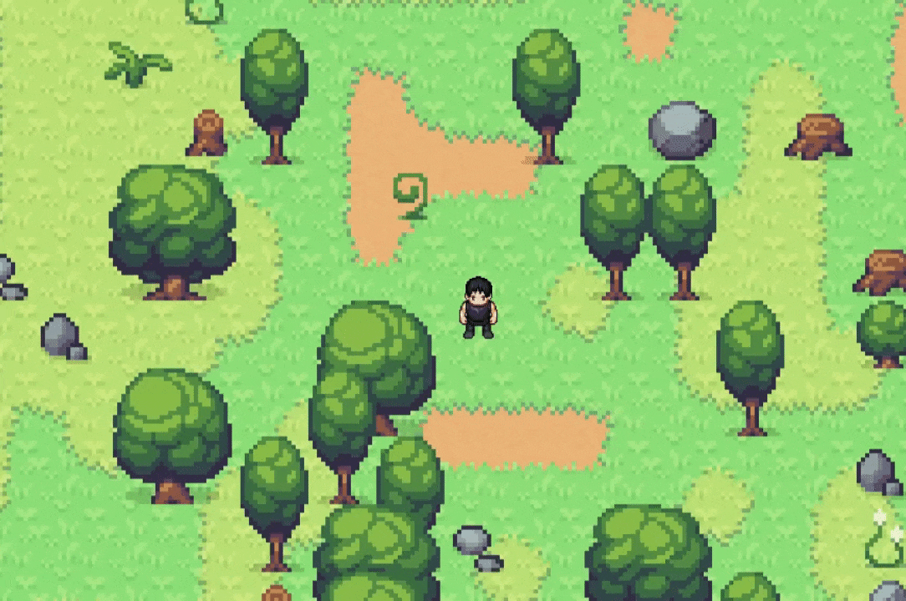
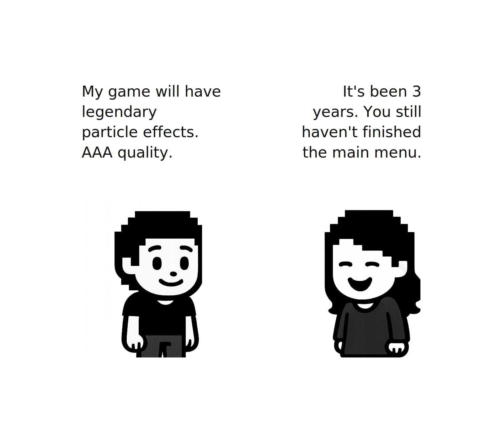
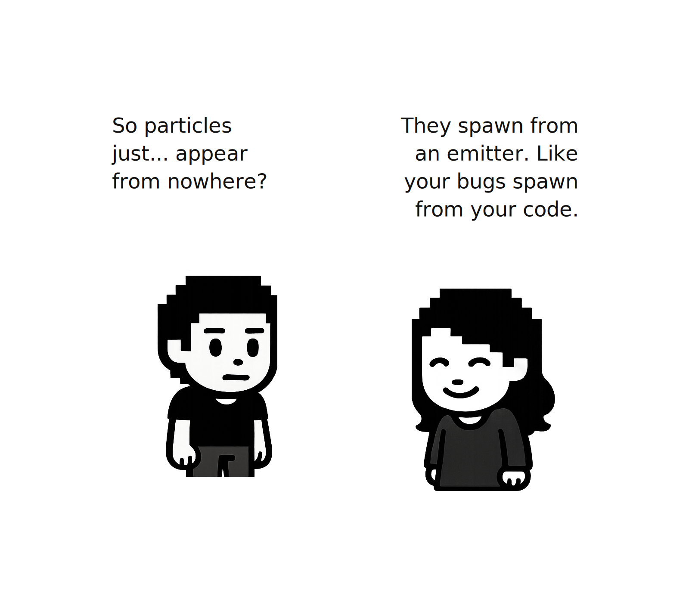
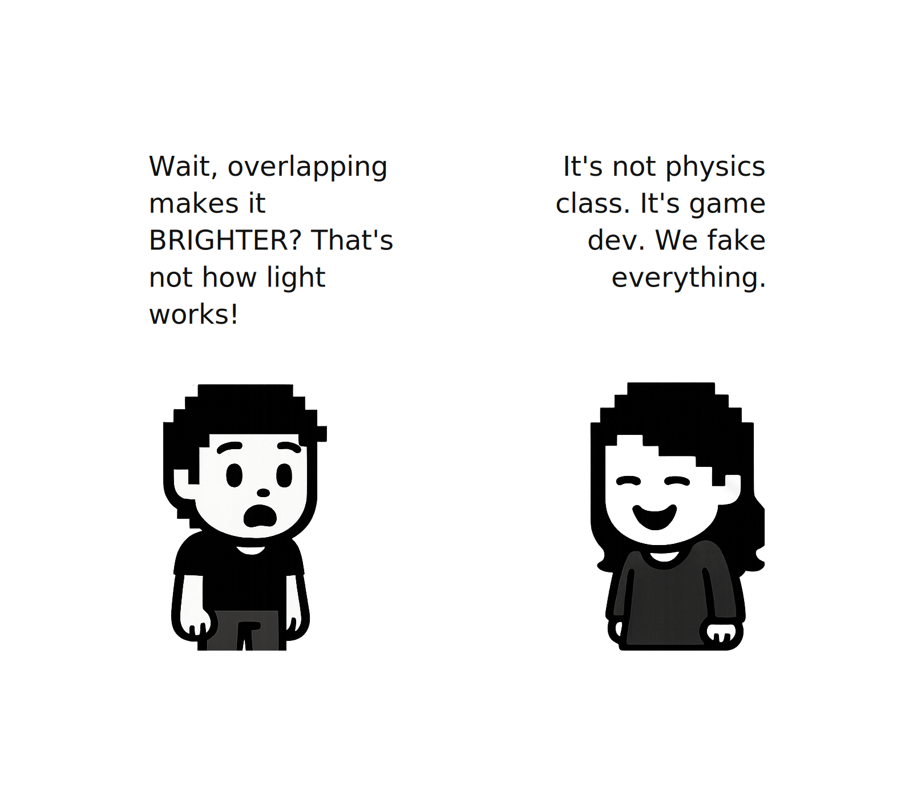
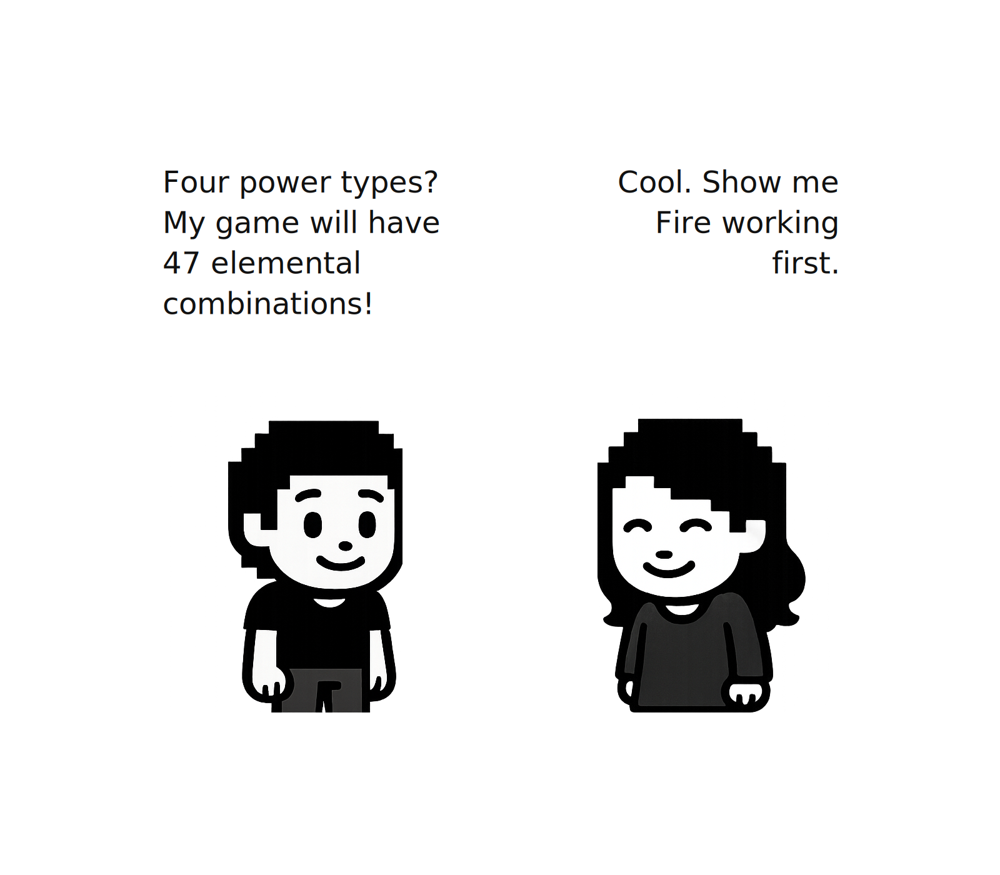
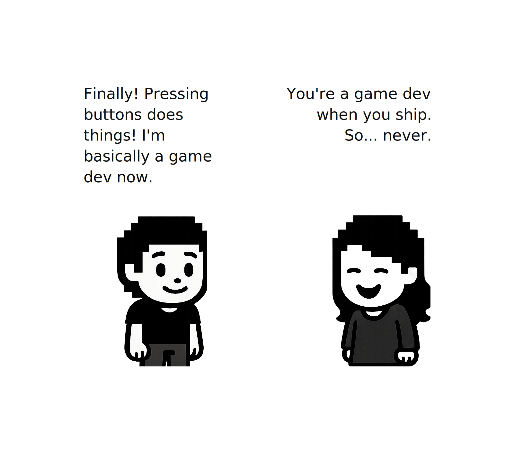
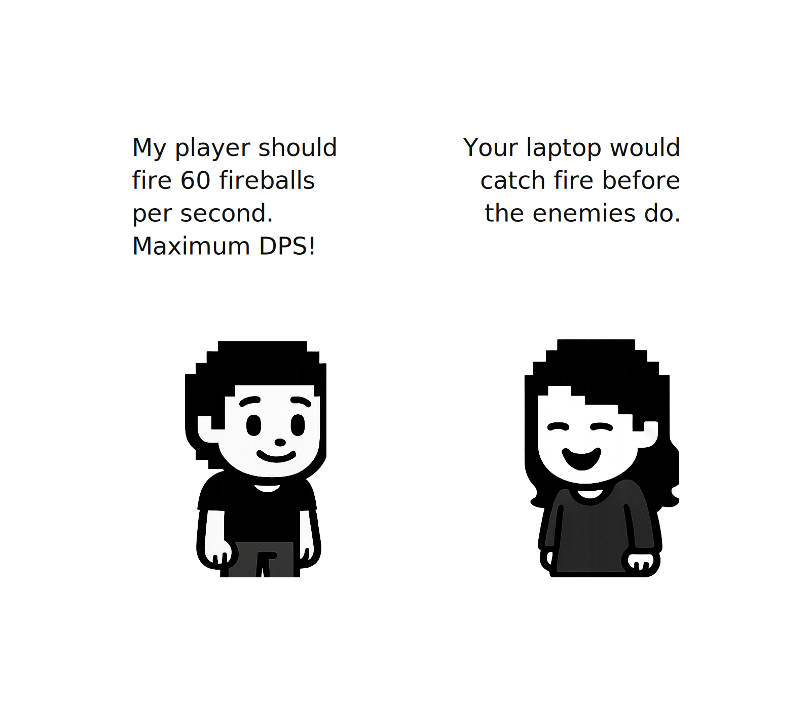

# 第六章：让粒子飞舞




2026年1月22日

**关于 AI 辅助**
*是的，本章的写作过程中使用了 AI 辅助。我负责结构设计、技术决策、代码组织方式，并整理了一份学习者可能会遇到的问题列表。AI 帮助扩展了结构和解释，我全程进行了编辑。总的来说，每章我花了大约 20–25 小时进行编码和写作。如果任何部分有不当之处，请通过 [Reddit](https://www.reddit.com/r/bevy/) 或 [Discord](https://discord.com/invite/cD9qEsSjUH) 告诉我，我会进行修改。*

到本章结束时，你将构建一个粒子系统，让魔法力量栩栩如生。你将创建四种独特的效果（火焰、奥术、暗影和毒药），每种效果都有发光的粒子在移动、旋转和淡出。你将学习如何创建粒子发射器、编写自定义着色器实现发光效果，以及使用叠加混合让粒子充满魔法感。

> **前置条件**：这是我们的 Bevy 教程系列的第六章。[加入我们的社区](https://discord.com/invite/cD9qEsSjUH) 以获取最新发布通知。在开始之前，请先完成[第一章：要有玩家](/posts/bevy-rust-game-development-chapter-1/)、[第二章：要有世界](/posts/bevy-rust-game-development-chapter-2/)、[第三章：让数据流动](/posts/bevy-rust-game-development-chapter-3/)、[第四章：要有碰撞](/posts/bevy-rust-game-development-chapter-4/) 和 [第五章：要有拾取物](/posts/bevy-rust-game-development-chapter-5/)，或者从[此仓库](https://github.com/jamesfebin/ImpatientProgrammerBevyRust)克隆第五章的代码来继续学习。

**开始之前：** *我一直在努力改进本教程，让你的学习之旅更加愉快。你的反馈很重要——请在 [Reddit](https://www.reddit.com/r/bevy/)/[Discord](https://discord.com/invite/cD9qEsSjUH)/[LinkedIn](https://www.linkedin.com/in/febinjohnjames) 上分享你的困惑、问题或建议。喜欢吗？请告诉我哪些地方做得好！让我们一起让 Rust 和 Bevy 的游戏开发对每个人都更易上手。*

## 给你的玩家魔法力量

到本章结束时，你将学到：

-   如何高效地生成和更新数千个粒子
-   添加差异度以获得有机、自然的效果
-   使用叠加混合的自定义着色器实现魔法光晕
-   构建一个易于扩展的灵活系统
-   赋予你的玩家魔法力量

### 理解粒子系统



粒子系统会生成许多小精灵，每个精灵：

1.  **从发射器生成**，带有初始属性（位置、速度、颜色、大小）
2.  **存在**一小段时间，移动和变化
3.  当其生命周期结束时**消亡**

**魔法在于数量**：生成足够多的粒子并带有细微变化，它们就会组合成复杂而美丽的效果。

### 构建粒子系统

每个粒子需要独立运动——自行移动、旋转、淡出和缩小。为了实现这一点，我们需要两种属性：**物理属性**（如何移动）和**视觉属性**（外观如何）。速度、加速度和角速度等物理属性赋予粒子真实的运动感。

**物理 + 视觉属性的实际效果**

观察粒子移动（速度）、旋转（角速度）、缩小（缩放曲线）和淡出（颜色曲线）

粒子不应永久存在。火焰粒子需要燃尽，魔法法术需要消散。但粒子在老化过程中还需要平滑的动画——它们应该逐渐淡出、缩小和改变颜色，而不是突然消失。

为了实现这一点，粒子需要追踪两件事：何时消亡以及在其生命周期中处于哪个阶段。这就是为什么我们使用倒计时和进度追踪配对的原因。

倒计时（`lifetime`）告诉我们应该何时删除粒子，但并不能告诉我们它的进度。一个还剩 0.5 秒的粒子可能已经完成了 25%（初始为 2.0 秒）或 99%（初始为 0.51 秒）。

我们需要两个值：

-   `lifetime` — 剩余时间
-   `max_lifetime` — 原始持续时间

然后：`progress = 1.0 - (lifetime / max_lifetime)`

现在我们就确切知道粒子处于什么位置：出生时为 0%，中点为 50%，消亡时为 100%。这个进度值驱动所有动画，如颜色、大小、不透明度。没有这两个值，粒子就只能闪烁开/关。有了它们，粒子就能平滑过渡。

**生命周期 vs 进度**

观察两个具有不同 max_lifetime 的粒子在不同时间消亡

### 粒子组件

现在我们已经理解了粒子需要哪些属性，接下来为粒子系统创建这些变量。我们将它们打包到一个 `Particle` 组件中，该组件追踪从物理到视觉的所有内容。

在 `src` 下创建 `particles` 文件夹，并添加 `src/particles/components.rs`：

```rust
// src/particles/components.rs
use bevy::prelude::*;

/// 粒子系统中的单个粒子
#[derive(Component, Clone)]
pub struct Particle {
    pub velocity: Vec3,           // 移动速度和方向（单位/秒）
    pub lifetime: f32,             // 消亡前的剩余时间（秒）
    pub max_lifetime: f32,         // 用于进度计算的原始生命周期
    pub scale: f32,                // 当前大小倍率
    pub angular_velocity: f32,     // 旋转速度（弧度/秒）
    pub acceleration: Vec3,        // 重力等作用力（单位/秒²）
    // 颜色曲线支持（起始 → 中间 → 结束）
    pub start_color: Color,        // 出生时的颜色（0% 生命周期）
    pub mid_color: Color,          // 中点处的颜色（50% 生命周期）
    pub end_color: Color,          // 消亡时的颜色（100% 生命周期）
    // 缩放曲线支持
    pub start_scale: f32,          // 出生时的大小
    pub end_scale: f32,            // 消亡时的大小（通常更小）
}
```

**为什么用三种颜色？**

我们使用**曲线**在粒子的生命周期内对颜色进行动画：

-   起始（亮）→ 中间（较暗）→ 结束（渐隐至黑色）

这样可以创建平滑的过渡。两种颜色之间的简单混合看起来线性而乏味。三个控制点为我们提供了更具表现力的淡出效果。

**粒子颜色曲线**

观察一个暗影粒子如何平滑地经过三个颜色关键帧进行过渡

`Particle` 结构体包含了所有数据，但我们还需要一些方法：

1.  **轻松创建粒子** — 一个设置合理默认值的构造函数
2.  **自定义粒子** — 用于覆盖特定属性的构建器方法
3.  **计算动画** — 根据生命周期进度计算当前颜色和大小的方法

没有这些方法，每个渲染粒子的系统都需要重复这些逻辑。通过在此集中实现，我们确保了代码的一致性并更易于维护。

接下来实现粒子的方法：

```rust
// 追加到 src/particles/components.rs

impl Particle {
    pub fn new(velocity: Vec3, lifetime: f32, scale: f32, start_color: Color) -> Self {
        Self {
            velocity,
            lifetime,
            max_lifetime: lifetime,
            scale,
            angular_velocity: 0.0,
            acceleration: Vec3::ZERO,
            start_color,
            mid_color: start_color,  // 默认使用相同颜色
            end_color: start_color,
            start_scale: scale,
            end_scale: scale * 0.5,  // 默认缩小为一半
        }
    }

    pub fn with_angular_velocity(mut self, angular_velocity: f32) -> Self {
        self.angular_velocity = angular_velocity;
        self
    }

    pub fn with_acceleration(mut self, acceleration: Vec3) -> Self {
        self.acceleration = acceleration;
        self
    }

    /// 设置颜色曲线以实现平滑颜色过渡
    pub fn with_color_curve(mut self, mid: Color, end: Color) -> Self {
        self.mid_color = mid;
        self.end_color = end;
        self
    }

    /// 设置缩放曲线
    pub fn with_scale_curve(mut self, end_scale: f32) -> Self {
        self.end_scale = end_scale;
        self
    }

    /// 返回归一化的生命周期进度（0.0 到 1.0）
    pub fn progress(&self) -> f32 {
        1.0 - (self.lifetime / self.max_lifetime)
    }
    
    /// 根据生命周期进度获取插值颜色
    pub fn current_color(&self) -> Color {
        let progress = self.progress();
        
        if progress < 0.5 {
            // 前半段：起始 → 中间
            let t = progress * 2.0;  // 将 0.0-0.5 重新映射到 0.0-1.0
            self.start_color.mix(&self.mid_color, t)
        } else {
            // 后半段：中间 → 结束
            let t = (progress - 0.5) * 2.0;  // 将 0.5-1.0 重新映射到 0.0-1.0
            self.mid_color.mix(&self.end_color, t)
        }
    }
    
    /// 根据生命周期进度获取插值缩放
    pub fn current_scale(&self) -> f32 {
        let progress = self.progress();
        self.start_scale.lerp(self.end_scale, progress)
    }
}
```

**构建器模式**

像 `with_angular_velocity()` 和 `with_color_curve()` 这样的方法使用了**构建器模式**，这是 Rust 中用于逐步构建复杂对象的一种惯用法。每个方法：

-   接受 `self`（粒子的所有权）
-   修改一个字段
-   返回 `self`

这样我们就可以链式调用：

```rust
// 伪代码，请勿使用
Particle::new(velocity, 1.0, 2.0, Color::RED)
    .with_angular_velocity(3.14)
    .with_color_curve(Color::ORANGE, Color::BLACK)
    .with_scale_curve(0.1)
```

简洁、可读且灵活。你只需指定需要自定义的部分，其他所有内容都使用 `new()` 的默认值。

**计算方法**

像 `progress()`、`current_color()` 和 `current_scale()` 这样的方法就是魔法发生的地方。它们根据粒子的当前状态**计算**值：

-   `progress()` — 将剩余生命周期转换为 0.0–1.0 的百分比，这样我们就确切知道粒子在其生命周期中的位置（刚出生时为 0%，中途为 50%，即将消亡时为 100%）
-   `current_color()` — 根据进度在三种颜色之间平滑混合，创造出魔法般的淡出效果——火焰粒子先发出亮橙色光，然后变暗至黑色，或者毒雾从病态的绿色转变为深紫色
-   `current_scale()` — 随着粒子老化，逐渐从完整大小缩小至微小，使效果更具动感，防止粒子突然消失

**`current_color()` 方法：**

1.  首先，它调用 `progress()` 获取一个介于 0.0（粒子刚生成）和 1.0（粒子即将消亡）之间的值
2.  然后将生命周期分为两半：
    -   **前半段（0% 到 50%）**：从 `start_color` 混合到 `mid_color`
    -   **后半段（50% 到 100%）**：从 `mid_color` 混合到 `end_color`

**什么是 `.mix()`？**

Bevy 的颜色插值方法。`color1.mix(&color2, 0.5)` 返回两种颜色的中间值（50%）。

**为什么用 `* 2.0`？**

`mix()` 函数需要输入 0.0 到 1.0 才能完成完整的混合。在生命周期的前半段，进度只达到 0.5。这不够，它只会混合一半。乘以 2 使得进度在中点处达到 1.0，从而为 `mix()` 提供它所需的完整范围。

**`current_scale()` 方法：**

你知道好的粒子效果不会突然消失，而是自然地缩小和淡出吗？这就是 `current_scale()` 所创造的。为了实现这一点，我们根据粒子的生命经过程度，将其大小从起始大小逐渐减小到微小的结束大小。

例如，想象一个粒子起始大小为 2.0，结束大小为 0.5：

-   进度 0%：大小为 2.0（完整大小，刚生成）
-   进度 50%：大小为 1.25（两者中间）
-   进度 100%：大小为 0.5（微小，即将消失）

粒子随时间平滑缩小，创造出令人满意的消散效果。

### 粒子发射器

现在我们需要一些东西来实际**创建**粒子。这就是 `ParticleEmitter` 组件的工作。把它想象成一个附加到实体（比如你的玩家角色）上的粒子工厂。



发射器需要追踪：

-   **何时生成** — 一个倒计时并触发粒子创建的计时器
-   **生成多少个** — 爆发量（例如，一次 5 个粒子）
-   **生成什么类型** — 创建粒子的模板
-   **是否激活** — 可以开启/关闭
-   **一次性 vs 持续** — 发射一次或持续发射

以下是发射器组件：

```rust
// 追加到 src/particles/components.rs

/// 粒子发射器的配置
#[derive(Component, Clone)]
pub struct ParticleEmitter {
    pub spawn_timer: Timer,
    pub particles_per_spawn: u32,
    pub particle_config: ParticleConfig,
    pub active: bool,
    pub one_shot: bool,
    pub has_spawned: bool,
}

impl ParticleEmitter {
    pub fn new(spawn_rate: f32, particles_per_spawn: u32, particle_config: ParticleConfig) -> Self {
        Self {
            spawn_timer: Timer::from_seconds(spawn_rate, TimerMode::Repeating),
            particles_per_spawn,
            particle_config,
            active: true,
            one_shot: false,
            has_spawned: false,
        }
    }

    pub fn one_shot(mut self) -> Self {
        self.one_shot = true;
        self
    }
}
```

**`one_shot` 是如何工作的？**

没有 `one_shot`，发射器会永远持续生成粒子（或者直到你手动设置 `active = false`）。这对于连续效果来说非常完美，比如火炬火焰或魔法光环。

设置了 `one_shot = true`，发射器会**一次性**生成粒子，然后自动停用。这对于一次性效果来说是理想的，比如施放法术或爆炸——你肯定不希望这些每帧都重复！

### 粒子配置

`ParticleConfig` 结构体是创建粒子的 DNA。它定义了每个粒子应具有的所有属性，但有一个特点：**差异度**。

**差异度**

无差异度（左）vs 有差异度（右）— 看看区别！

没有差异度，每个粒子都会完全相同（无聊！）。有了差异度，每个粒子都会获得略微随机化的值，从而创造出有机、自然的效果。对于每个属性，我们存储：

-   **基础值** — 目标值（例如，`lifetime: 1.0` 秒）
-   **差异度** — 随机化程度（例如，`lifetime_variance: 0.2` 表示 ±0.2 秒）

因此，一个粒子可能存活 0.8 秒，另一个 1.1 秒，再另一个 0.95 秒，全都略有不同，让效果感觉充满活力。

现在让我们创建保存所有粒子属性的结构体。这个 `ParticleConfig` 作为粒子发射器用于生成新粒子的模板。我们不硬编码值，而是在配置中定义一次然后重复使用。

以下是配置结构体：

```rust
// 追加到 src/particles/components.rs

/// 生成粒子的配置
#[derive(Clone)]
pub struct ParticleConfig {
    pub lifetime: f32,
    pub lifetime_variance: f32,
    pub speed: f32,
    pub speed_variance: f32,
    pub direction: Vec3,
    pub direction_variance: f32,  // 弧度制
    pub scale: f32,
    pub scale_variance: f32,
    pub color: Color,
    pub angular_velocity: f32,
    pub angular_velocity_variance: f32,
    pub acceleration: Vec3,
    pub emission_shape: EmissionShape,
}

impl Default for ParticleConfig {
    fn default() -> Self {
        Self {
            lifetime: 1.0,
            lifetime_variance: 0.1,
            speed: 100.0,
            speed_variance: 10.0,
            direction: Vec3::X,
            direction_variance: 0.1,
            scale: 1.0,
            scale_variance: 0.1,
            color: Color::WHITE,
            angular_velocity: 0.0,
            angular_velocity_variance: 0.0,
            acceleration: Vec3::ZERO,
            emission_shape: EmissionShape::Point,
        }
    }
}

#[derive(Clone)]
pub enum EmissionShape {
    Point,
    Circle { radius: f32 },
    Cone { angle: f32 },
}
```

**理解配置属性：**

-   `lifetime` / `lifetime_variance` — 粒子的存在时间（秒）
-   `speed` / `speed_variance` — 初始速度大小
-   `direction` / `direction_variance` — 粒子飞行的方向（direction_variance 以弧度为单位，产生扩散效果）
-   `scale` / `scale_variance` — 粒子的大小
-   `color` — 基础粒子色调（可以是超过 1.0 的 HDR 值）
-   `angular_velocity` / `angular_velocity_variance` — 粒子的旋转速度
-   `acceleration` — 施加的恒定作用力（如重力或风力）
-   `emission_shape` — 粒子的生成位置（Point、Circle 或 Cone）

### 粒子系统更新

到目前为止，我们已经定义了**数据结构**——粒子和发射器*是什么*。现在我们需要**系统**——实际上每一帧*做事情*的代码。

我们需要两个关键行为：

1.  **生成粒子** — 检查每个发射器的计时器，当它触发时，创建新的粒子实体
2.  **更新粒子** — 移动它们、旋转它们、淡出它们的颜色、缩小它们的大小，并在它们消亡时删除它们

没有这些系统，我们的组件就只是闲置在那里什么都不做。让我们从生成系统开始。创建 `src/particles/systems.rs`：

要生成粒子，我们需要两个协同工作的函数：

1.  **`update_emitters`** — 每帧运行，检查每个发射器的计时器，当计时器触发时，触发粒子创建
2.  **`spawn_particle`** — 一个辅助函数，用于创建具有随机化属性的单个粒子实体

```rust
// src/particles/systems.rs
use super::components::*;
use super::material::ParticleMaterial;
use bevy::prelude::*;
use rand::Rng;

/// 更新粒子发射器并生成新粒子的系统
pub fn update_emitters(
    mut commands: Commands,
    time: Res<Time>,
    mut emitters: Query<(Entity, &mut ParticleEmitter, &GlobalTransform)>,
    mut meshes: ResMut<Assets<Mesh>>,
    mut materials: ResMut<Assets<ParticleMaterial>>,
) {
    let mut rng = rand::thread_rng();

    for (entity, mut emitter, global_transform) in emitters.iter_mut() {
        if !emitter.active {
            continue;
        }

        // 处理一次性发射器
        if emitter.one_shot && emitter.has_spawned {
            emitter.active = false;
            continue;
        }

        emitter.spawn_timer.tick(time.delta());

        if emitter.spawn_timer.just_finished() {
            emitter.has_spawned = true;

            // 生成粒子
            for i in 0..emitter.particles_per_spawn {
                spawn_particle(
                    &mut commands,
                    &emitter.particle_config,
                    global_transform,
                    &mut rng,
                    &mut meshes,
                    &mut materials,
                    Some(entity),
                    i,
                );
            }

            if emitter.one_shot {
                emitter.active = false;
            }
        }
    }
}
```

**`update_emitters` 如何工作**

该系统每帧运行，管理游戏中的所有粒子发射器。流程如下：

1.  **设置** — 创建一个随机数生成器（我们需要它来实现差异度）
2.  **遍历所有发射器** — `Query` 为我们提供每个带有 `ParticleEmitter` 组件的实体
3.  **跳过非活跃发射器** — 如果 `active` 为 false，不生成任何东西
4.  **处理一次性逻辑** — 如果是一次性发射器且已经生成过，则停用它
5.  **滴答计时器** — 按帧的 delta 时间推进生成计时器
6.  **检查计时器是否结束** — 当年计时器完成时，就该生成了！
7.  **生成一批** — 使用 `spawn_particle` 辅助函数创建 `particles_per_spawn` 个粒子
8.  **停用一次性发射器** — 如果是一次性发射器，生成后将其关闭

发射器不会每帧都生成粒子，它们使用计时器来控制生成速率。0.1 秒的计时器意味着每秒 10 次爆发。

**什么是 `rand::thread_rng()`？**

为当前线程创建一个随机数生成器。我们使用它为粒子属性添加差异度——每个粒子获得的寿命、速度、方向等都略有不同。

现在来看粒子生成函数：

`update_emitters` 处理发射器的计时器并决定何时生成粒子。但它将实际的粒子创建委托给一个名为 `spawn_particle` 的辅助函数。这个函数接受发射器的配置，并创建一个具有随机化属性（生命周期、速度、方向等）、一个可视化网格和所有必要的 Bevy 组件的单个粒子实体。

```rust
// 追加到 src/particles/systems.rs

/// 生成单个粒子的辅助函数
pub fn spawn_particle(
    commands: &mut Commands,
    config: &ParticleConfig,
    global_transform: &GlobalTransform,
    rng: &mut rand::rngs::ThreadRng,
    meshes: &mut ResMut<Assets<Mesh>>,
    materials: &mut ResMut<Assets<ParticleMaterial>>,
    owner: Option<Entity>,
    _particle_index: u32,
) {
    // 计算随机化值
    let lifetime =
        config.lifetime + rng.gen_range(-config.lifetime_variance..config.lifetime_variance);
    let speed = config.speed + rng.gen_range(-config.speed_variance..config.speed_variance);
    let scale = config.scale + rng.gen_range(-config.scale_variance..config.scale_variance);
    let angular_velocity = config.angular_velocity
        + rng.gen_range(-config.angular_velocity_variance..config.angular_velocity_variance);

    // 计算带差异度的方向
    let base_direction = config.direction.normalize_or_zero();
    let direction = if config.direction_variance > 0.0 {
        apply_direction_variance(base_direction, config.direction_variance, rng)
    } else {
        base_direction
    };

    // 根据形状计算发射偏移
    let emission_offset = match config.emission_shape {
        EmissionShape::Point => Vec3::ZERO,
        EmissionShape::Circle { radius } => {
            let angle = rng.gen_range(0.0..std::f32::consts::TAU);
            let distance = rng.gen_range(0.0..radius);
            Vec3::new(angle.cos() * distance, angle.sin() * distance, 0.0)
        }
        EmissionShape::Cone { angle } => {
            let cone_angle = rng.gen_range(-angle..angle);
            let rotated = rotate_vector_2d(base_direction, cone_angle);
            rotated * rng.gen_range(0.0..1.0)
        }
    };

    let velocity = direction * speed;

    // 直接从 GlobalTransform 获取位置
    let emitter_position = global_transform.translation();
    let mut position = emitter_position + emission_offset;

    // 确保粒子在可见的 Z 层（玩家上方）
    position.z = 25.0;

    // 创建带颜色曲线的粒子
    let start_color = config.color;
    // 创建颜色曲线：亮 → 略微变暗 → 渐隐至黑色
    let mid_color = {
        let linear = config.color.to_linear();
        Color::LinearRgba(LinearRgba::new(
            linear.red * 0.7,
            linear.green * 0.7,
            linear.blue * 0.7,
            linear.alpha,
        ))
    };
    let end_color = Color::srgba(
        config.color.to_linear().red * 0.3,
        config.color.to_linear().green * 0.3,
        config.color.to_linear().blue * 0.3,
        0.0,
    ); // 渐隐至黑色

    let particle = Particle::new(velocity, lifetime, scale, start_color)
        .with_angular_velocity(angular_velocity)
        .with_acceleration(config.acceleration)
        .with_color_curve(mid_color, end_color)
        .with_scale_curve(scale * 0.2); // 缩小到 20%

    // 为粒子创建网格
    let size = 24.0 * scale;
    let mesh = meshes.add(Rectangle::new(size, size));
    let material = materials.add(ParticleMaterial::new(start_color));

    commands.spawn((
        particle,
        Mesh2d(mesh),
        MeshMaterial2d(material),
        Transform::from_translation(position),
    ));
}
```

**`spawn_particle` 如何工作**

这个函数创建一个具有随机化属性的粒子实体。

**步骤 1：为基本属性添加随机性**

-   我们不希望每个粒子都完全相同，那样看起来不自然
-   取基础值（它存活多久、移动多快、多大、旋转多快）
-   在差异度范围内添加随机量
-   现在每个粒子都是独一无二的！

**步骤 2：随机化方向**

-   粒子不应都朝完全相同的方向飞行
-   从基础方向开始（例如，"向右飞"）
-   如果存在方向差异度，则随机旋转一点，否则保持直线

**步骤 3：在发射器形状内选择生成位置**

-   `Point`：所有粒子在完全相同的位置生成（如激光束原点）
-   `Circle`：粒子在圆形区域内随机生成（如篝火）
-   `Cone`：粒子以锥形形状生成（如火焰喷射器）

**步骤 4：确定粒子的起始位置**

-   结合方向和速度得到速度向量（它每帧如何移动）
-   从发射器在世界中的位置开始
-   加上步骤 3 中的形状偏移量
-   将其放置在 Z = 25.0，使其显示在玩家上方

**步骤 5：设置颜色淡出动画**

-   粒子应该在消亡时淡出，而不是突然消失
-   起始：完全亮度（你配置的颜色）
-   中间：70% 亮度（逐渐变暗）
-   结束：30% 亮度且透明（渐隐至无）

**步骤 6：使用所有设置创建粒子**

-   使用构建器模式将所有属性链式连接
-   设置速度、生命周期、缩放、旋转速度、颜色曲线、缩放曲线
-   所有内容都已配置完毕

**步骤 7：为粒子创建一个可视化方形**

-   创建一个 24 像素的方形网格（按粒子大小缩放）
-   创建一个使用粒子起始颜色的材质
-   这就是你实际上在屏幕上看到的东西

**步骤 8：告诉 Bevy 创建粒子实体**

-   将所有内容打包在一起：粒子数据、网格、材质、位置
-   Bevy 使用所有这些组件生成一个新实体
-   粒子现在在游戏世界中存活！

**为什么用 `std::f32::consts::TAU`？**

TAU 是 2π（约 6.28），即弧度制下的一整圈。对于 `Circle` 发射形状，我们选择一个从 0 到 TAU 的随机角度，以获取圆上任意位置的点。

**什么是 `.normalize_or_zero()`？**

将向量转换为长度 1.0，使其成为纯粹的方向向量。如果向量为零（无方向），则返回 (0,0,0) 而不是 nan（非数字）。这比 `.normalize()` 更安全，后者在零向量上会 panic。

现在添加辅助函数：

这些是帮助 `spawn_particle` 进行数学运算的小型实用函数。它们处理粒子向不同方向扩散的几何计算，对于创建锥形和喷射效果而非直线效果至关重要。

```rust
// 追加到 src/particles/systems.rs

/// 对向量应用方向差异度
fn apply_direction_variance(
    direction: Vec3,
    variance: f32,
    rng: &mut rand::rngs::ThreadRng,
) -> Vec3 {
    let angle = rng.gen_range(-variance..variance);
    rotate_vector_2d(direction, angle)
}

/// 按角度（弧度制）旋转 2D 向量
fn rotate_vector_2d(vec: Vec3, angle: f32) -> Vec3 {
    let cos = angle.cos();
    let sin = angle.sin();
    Vec3::new(vec.x * cos - vec.y * sin, vec.x * sin + vec.y * cos, vec.z)
}
```

**这个旋转数学是什么？**

这是一个 2D 旋转矩阵。要将向量旋转一个角度：

-   新 X = 旧 X × cos(角度) - 旧 Y × sin(角度)
-   新 Y = 旧 X × sin(角度) + 旧 Y × cos(角度)

现在来看粒子更新系统：

我们已经创建了生成系统，但现在我们需要让粒子活起来。`update_particles` 系统每帧运行，处理粒子生命周期中发生的一切：移动它、旋转它、淡出它的颜色、缩小它的大小，并在它消亡时移除它。

```rust
// 追加到 src/particles/systems.rs

/// 更新粒子生命周期和属性的系统
pub fn update_particles(
    mut commands: Commands,
    time: Res<Time>,
    mut particles: Query<(
        Entity,
        &mut Particle,
        &mut Transform,
        &MeshMaterial2d<ParticleMaterial>,
    )>,
    mut materials: ResMut<Assets<ParticleMaterial>>,
) {
    for (entity, mut particle, mut transform, material_handle) in particles.iter_mut() {
        particle.lifetime -= time.delta_secs();

        if particle.lifetime <= 0.0 {
            commands.entity(entity).despawn();
            continue;
        }

        // 更新位置
        let acceleration = particle.acceleration;
        particle.velocity += acceleration * time.delta_secs();
        transform.translation += particle.velocity * time.delta_secs();

        // 更新旋转
        transform.rotate_z(particle.angular_velocity * time.delta_secs());

        // 应用颜色曲线插值
        let current_color = particle.current_color();

        // 应用缩放曲线插值
        let current_scale = particle.current_scale();
        transform.scale = Vec3::splat(current_scale);

        // 更新材质颜色
        if let Some(material) = materials.get_mut(&material_handle.0) {
            material.color = current_color.to_linear();
        }
    }
}
```

**分解说明：**

1.  **生命周期倒计时**：从粒子剩余生命中减去帧时间
2.  **移除死亡粒子**：当生命周期归零时，移除实体
3.  **应用加速度**：作用力随时间修改速度
4.  **更新位置**：每帧按速度移动
5.  **旋转**：基于角速度旋转粒子
6.  **更新颜色**：使用 `current_color()` 的曲线
7.  **更新缩放**：使用 `current_scale()` 缩小/放大
8.  **更新材质**：将新颜色推送到着色器

最后，添加发射器清理：

```rust
// 追加到 src/particles/systems.rs

/// 清理已完成的单次发射器系统
pub fn cleanup_finished_emitters(
    mut commands: Commands,
    emitters: Query<(Entity, &ParticleEmitter)>,
) {
    for (entity, emitter) in emitters.iter() {
        if emitter.one_shot && !emitter.active {
            commands.entity(entity).despawn();
        }
    }
}
```

这会移除那些在粒子生成完毕后的一次性发射器。持续发射器会一直存在，直到手动移除。

## 着色器

我们现在有了粒子在生成、移动和消亡。但它们看起来仍然像是扁平的彩色方块。要让它们像魔法能量一样发光，我们需要一个在 GPU 上运行的自定义着色器。

**什么是着色器？**

着色器是一个在你的 GPU（显卡）上为屏幕上每个像素运行的小程序。当我们的 Rust 代码在 CPU 上运行并管理游戏逻辑时，着色器在 GPU 上大规模并行运行以创建视觉效果。

**我们要实现什么？**

我们要创建一个径向光晕效果，其中每个粒子中心明亮而强烈，边缘平滑淡出至透明。这使得粒子看起来像是发光的能量球，而不是扁平的方块。

**着色器光晕效果对比**

无着色器（左）vs 径向渐变着色器（右）

**语言：**

这个着色器是用 **WGSL**（WebGPU 着色语言）编写的，这是 Bevy 的着色器语言。它在某些方面类似于 Rust，但专门为 GPU 编程设计。

在 `src/assets` 中创建 `shaders` 文件夹，并添加着色器文件 `particle_glow.wgsl`，最终路径应为 `src/assets/shaders/particle_glow.wgsl`。

```wgsl
// src/assets/shaders/particle_glow.wgsl
// 粒子自定义着色器
// 创建带有叠加混合的径向渐变光晕效果
#import bevy_sprite::mesh2d_vertex_output::VertexOutput

@group(#{MATERIAL_BIND_GROUP}) @binding(0) var<uniform> color: vec4<f32>;

@fragment
fn fragment(mesh: VertexOutput) -> @location(0) vec4<f32> {
    // 计算距中心的距离（UV 空间为 0-1）
    let center = vec2<f32>(0.5, 0.5);
    let dist = distance(mesh.uv, center) * 2.0; // *2 归一化到 0-1
    
    // 创建径向渐变
    // 亮中心 → 向边缘淡出
    let radial = 1.0 - smoothstep(0.0, 1.0, dist);
    
    // 在中心添加额外光晕
    let glow = pow(1.0 - dist, 3.0);
    
    // 结合径向渐变与中心光晕
    let intensity = radial * 0.7 + glow * 0.5;
    
    // 提升中心附近的亮度，产生炽热光晕效果
    let brightness = 1.0 + glow * 0.5;
    
    // 应用到颜色（支持 HDR — 值 > 1.0）
    let final_rgb = color.rgb * brightness;
    let final_alpha = color.a * intensity;
    
    return vec4<f32>(final_rgb, final_alpha);
}
```

**着色器如何创建光晕效果：**

**着色器接收的输入：**

-   `color` — 通过 `ParticleMaterial` 从 Rust 代码发送的粒子颜色（还记得 `#[uniform(0)]` 绑定吗）
-   `mesh.uv` — 粒子方块上像素的位置。当 Bevy 使用 `Material2d` 渲染精灵时，它会自动创建一个四边形（矩形）网格，并为每个角分配 UV 坐标：(0,0) 在左下角，(1,1) 在右上角。GPU 为中间的每个像素插值这些坐标。

**什么是网格，什么是 UV 坐标？**

**网格**是由三角形构成的 3D 形状。对于 2D 精灵，Bevy 创建一个简单的四边形（形成矩形的 2 个三角形）来显示图像。

**UV 坐标**就像一张地图，告诉着色器每个像素在矩形上的位置。把它想象成一个网格：

-   U 从左到右（0.0 = 左边缘，1.0 = 右边缘）
-   V 从下到上（0.0 = 下边缘，1.0 = 上边缘）
-   所以 (0.5, 0.5) 是粒子的正中心

当着色器运行时，每个像素都知道自己的 UV 位置。有了这些输入（颜色和 UV 坐标），着色器通过计算每个像素距粒子中心的距离来创建径向渐变。靠近中心的像素获得亮色，而边缘的像素淡出至透明。

以下是技术细节：

1.  **计算距离** — 测量这个像素距粒子中心的距离
2.  **创建平滑衰减** — 使用 `smoothstep` 从亮（中心）逐渐淡出到暗（边缘）
3.  **提升中心亮度** — 将中心像素乘以高于 1.0 的值，产生"炽热核心"效果
4.  **组合** — 将平滑淡出与亮中心混合，产生自然的光晕效果

没有着色器，粒子只是扁平的彩色方块。有了它，它们就变成了发光的能量球。

**什么是 `smoothstep`？**

一个创建平滑过渡的函数。`smoothstep(edge0, edge1, x)` 当 x 在 edge0 时返回 0，当 x 在 edge1 时返回 1，并在它们之间平滑过渡。与直线过渡不同，它开始时慢，中间加速，然后结尾减速，产生自然的淡出效果。

### 自定义着色器材质

现在我们已经理解了着色器，让我们创建使用着色器的 Rust 代码。`ParticleMaterial` 结构体是我们 Rust 代码和 GPU 着色器之间的桥梁——它保存粒子的颜色并告诉 Bevy 使用哪个着色器文件进行渲染。

创建 `src/particles/material.rs`：

```rust
// src/particles/material.rs
use bevy::{
    prelude::*,
    reflect::TypePath,
    render::render_resource::{
        AsBindGroup, BlendComponent, BlendFactor, BlendOperation, BlendState, ColorWrites,
        RenderPipelineDescriptor, SpecializedMeshPipelineError,
    },
    shader::ShaderRef,
    sprite_render::{AlphaMode2d, Material2d, Material2dKey},
    mesh::MeshVertexBufferLayoutRef,
};

/// 粒子的自定义材质，带径向渐变着色器和叠加混合
#[derive(Asset, TypePath, AsBindGroup, Debug, Clone)]
pub struct ParticleMaterial {
    #[uniform(0)]
    pub color: LinearRgba,
}

impl ParticleMaterial {
    pub fn new(color: Color) -> Self {
        Self {
            color: color.to_linear(),
        }
    }
}
```

**什么是 `AsBindGroup`？**

这个宏告诉 Bevy 如何将数据从你的 Rust 代码发送到 GPU 着色器。可以把它想象成打包一个要运送的盒子：`#[uniform(0)]` 标签说"将颜色值放入插槽 0，这样着色器就能找到它。"

**理解这些术语：**

-   **材质（Material）**：材质定义了表面渲染时的外观。它结合了着色器（渲染程序）和属性（如颜色）。我们的 `ParticleMaterial` 是专门用于粒子的自定义材质。

-   **片段着色器（Fragment shader）**：一个为每个被绘制的像素运行的着色器程序。它计算该像素的最终颜色。我们的片段着色器创建了径向光晕效果。

-   **Alpha 混合（Alpha blending）**：透明对象与背景对象的结合方式。普通的 alpha 混合使物体透明。叠加混合（我们使用的）将亮度值加在一起，产生发光效果。

-   **特化（Specialize）**：为此特定材质自定义渲染管线。我们用它来配置叠加混合而不是普通透明度。

现在实现 Material2d trait：

`Material2d` trait 告诉 Bevy 如何渲染我们的自定义材质。我们实现了三个方法：

-   `fragment_shader()` — 返回着色器文件的路径
-   `alpha_mode()` — 启用透明度混合
-   `specialize()` — 配置渲染管线以实现叠加混合

```rust
// 追加到 src/particles/material.rs

impl Material2d for ParticleMaterial {
    fn fragment_shader() -> ShaderRef {
        "shaders/particle_glow.wgsl".into()
    }

    fn alpha_mode(&self) -> AlphaMode2d {
        AlphaMode2d::Blend
    }

    fn specialize(
        descriptor: &mut RenderPipelineDescriptor,
        _layout: &MeshVertexBufferLayoutRef,
        _key: Material2dKey<Self>,
    ) -> Result<(), SpecializedMeshPipelineError> {
        // 为发光效果设置叠加混合
        if let Some(fragment) = &mut descriptor.fragment {
            if let Some(target) = fragment.targets.first_mut() {
                if let Some(target_state) = target.as_mut() {
                    target_state.blend = Some(BlendState {
                        color: BlendComponent {
                            src_factor: BlendFactor::SrcAlpha,
                            dst_factor: BlendFactor::One, // 叠加！
                            operation: BlendOperation::Add,
                        },
                        alpha: BlendComponent {
                            src_factor: BlendFactor::One,
                            dst_factor: BlendFactor::One,
                            operation: BlendOperation::Add,
                        },
                    });
                    target_state.write_mask = ColorWrites::ALL;
                }
            }
        }
        Ok(())
    }
}
```

`specialize` 函数为我们的粒子材质配置 GPU 的渲染管线。它告诉 GPU 如何将每个渲染的粒子与已经在屏幕上的内容混合。

**这对渲染粒子意味着什么：** 当粒子被绘制时，GPU 需要知道如何将其颜色与背景结合。普通透明度使重叠的粒子变暗。叠加混合使它们更亮、发光。这就是创造魔法火焰/魔法外观的原因。

以下是函数的作用：

1.  **访问管线描述符** — 获取此材质渲染方式的配置
2.  **查找颜色目标** — 定位颜色输出定义的位置
3.  **设置叠加混合** — 配置混合模式：
    -   `src_factor: SrcAlpha` — 将粒子颜色乘以其透明度
    -   `dst_factor: One` — 保持背景颜色完整强度（不使其变暗）
    -   `operation: Add` — 将它们相加

结果：重叠的粒子将它们的亮度加在一起，在重叠处产生强烈的光晕。十个重叠的火焰粒子会形成一个亮白炽热的中心！

**什么是叠加混合？**

普通 alpha 混合：`new_color = particle_color * alpha + background * (1 - alpha)`

叠加混合：`new_color = particle_color + background`

重叠的粒子将它们的亮度加在一起，产生强烈的发光效果。这就是火焰、魔法和爆炸获得那种魔法发光外观的原因。



### 粒子模块插件

创建 `src/particles/mod.rs`：

```rust
// src/particles/mod.rs
pub mod components;
pub mod material;
pub mod systems;

use crate::state::GameState;
use bevy::{prelude::*, sprite_render::Material2dPlugin};

pub use material::*;
pub use systems::*;

pub struct ParticlesPlugin;

impl Plugin for ParticlesPlugin {
    fn build(&self, app: &mut App) {
        info!("正在初始化 ParticlesPlugin");
        app.add_plugins(Material2dPlugin::<ParticleMaterial>::default())
            .add_systems(
                Update,
                (update_emitters, update_particles, cleanup_finished_emitters)
                    .chain()
                    .run_if(in_state(GameState::Playing)),
            );
        info!("ParticlesPlugin 初始化完成");
    }
}
```

**为什么用 `.chain()`？**

链中的系统按指定的顺序顺序执行。我们希望：

1.  `update_emitters` — 生成新粒子
2.  `update_particles` — 更新现有粒子
3.  `cleanup_finished_emitters` — 移除已完成的发射器

这可以防止发射器生成粒子然后立即被移除的边界情况。

## 创建战斗模块

现在我们已经有了粒子系统，接下来构建使用它的战斗系统！为战斗系统创建一个新文件夹 `src/combat/`。

### 力量类型

不同的力量需要不同的行为和视觉效果。让我们从定义每种力量的独特之处开始。



创建 `src/combat/power_type.rs`：

```rust
// src/combat/power_type.rs
use bevy::prelude::*;
use crate::particles::components::{EmissionShape, ParticleConfig};

/// 可用的不同魔法力量
#[derive(Debug, Clone, Copy, PartialEq, Eq, Default)]
pub enum PowerType {
    #[default]
    Fire,
    Arcane,
    Shadow,
    Poison,
}
```

现在定义每种力量的视觉配置。我们将视觉与行为分开（后续章节会添加伤害、碰撞等）：

```rust
// 追加到 src/combat/power_type.rs

/// 力量的视觉配置——与行为解耦
#[derive(Clone)]
pub struct PowerVisuals {
    pub primary: ParticleConfig,
    pub core: Option<ParticleConfig>,
    pub particles_per_spawn: u32,
    pub core_particles_per_spawn: u32,
}
```

**`primary` 和 `core` 有什么区别？**

许多效果有两个层次：

-   **Primary**：外部光晕/轨迹（大量粒子，不那么亮）
-   **Core**：明亮的中心（较少粒子，非常亮）

想象一个火球——核心是白炽的中心，主层是周围的橙色火焰。并非所有力量都需要核心，毒药只是一个绿色粒子的单层。

现在我们可以使用前面定义的 `ParticleConfig` 和 `EmissionShape` 类型！让我们为每种力量类型实现视觉配置：

现在我们将使用 `ParticleConfig` 结构体为每种力量配置外观和行为。每种力量都获得独特的视觉属性（颜色、速度、大小、差异度），这些属性定义了其特性。火焰获得 HDR 橙色和广泛的扩散，而暗影使用紧密的精度，带有许多快速粒子。

```rust
// 追加到 src/combat/power_type.rs

impl PowerType {
    /// 获取此力量的视觉配置
    pub fn visuals(&self, direction: Vec3) -> PowerVisuals {
        match self {
            PowerType::Fire => Self::fire_visuals(direction),
            PowerType::Arcane => Self::arcane_visuals(direction),
            PowerType::Shadow => Self::shadow_visuals(direction),
            PowerType::Poison => Self::poison_visuals(direction),
        }
    }

    fn fire_visuals(direction: Vec3) -> PowerVisuals {
        PowerVisuals {
            primary: ParticleConfig {
                lifetime: 1.0,
                lifetime_variance: 0.2,
                speed: 350.0,
                speed_variance: 40.0,
                direction,
                direction_variance: 0.12,
                scale: 1.5,
                scale_variance: 0.5,
                color: Color::srgb(3.0, 0.5, 0.1),  // 亮橙红色
                angular_velocity: 3.0,
                angular_velocity_variance: 2.0,
                acceleration: Vec3::ZERO,
                emission_shape: EmissionShape::Circle { radius: 10.0 },
            },
            core: Some(ParticleConfig {
                lifetime: 0.8,
                lifetime_variance: 0.2,
                speed: 350.0,
                speed_variance: 30.0,
                direction,
                direction_variance: 0.08,
                scale: 1.0,
                scale_variance: 0.3,
                color: Color::srgb(4.0, 1.0, 0.2),  // 非常亮的黄白色
                angular_velocity: 5.0,
                angular_velocity_variance: 2.0,
                acceleration: Vec3::ZERO,
                emission_shape: EmissionShape::Circle { radius: 5.0 },
            }),
            particles_per_spawn: 5,
            core_particles_per_spawn: 3,
        }
    }

    fn arcane_visuals(direction: Vec3) -> PowerVisuals {
        PowerVisuals {
            primary: ParticleConfig {
                lifetime: 1.2,
                lifetime_variance: 0.2,
                speed: 300.0,
                speed_variance: 30.0,
                direction,
                direction_variance: 0.05,  // 非常精确
                scale: 1.2,
                scale_variance: 0.3,
                color: Color::srgb(0.5, 0.8, 2.5),  // 蓝色奥术能量
                angular_velocity: 2.0,
                angular_velocity_variance: 1.0,
                acceleration: Vec3::ZERO,
                emission_shape: EmissionShape::Circle { radius: 6.0 },
            },
            core: Some(ParticleConfig {
                lifetime: 1.0,
                lifetime_variance: 0.1,
                speed: 300.0,
                speed_variance: 20.0,
                direction,
                direction_variance: 0.03,  // 甚至更精确
                scale: 0.8,
                scale_variance: 0.2,
                color: Color::srgb(0.9, 0.95, 3.0),  // 亮白蓝色
                angular_velocity: 0.5,
                angular_velocity_variance: 0.5,
                acceleration: Vec3::ZERO,
                emission_shape: EmissionShape::Point,
            }),
            particles_per_spawn: 4,
            core_particles_per_spawn: 2,
        }
    }

    fn shadow_visuals(direction: Vec3) -> PowerVisuals {
        PowerVisuals {
            primary: ParticleConfig {
                lifetime: 0.6,  // 短寿命
                lifetime_variance: 0.15,
                speed: 600.0,  // 非常快
                speed_variance: 100.0,
                direction,
                direction_variance: 0.04,
                scale: 1.0,
                scale_variance: 0.4,
                color: Color::srgb(0.6, 0.2, 1.2),  // 暗紫色
                angular_velocity: 8.0,  // 快速旋转
                angular_velocity_variance: 4.0,
                acceleration: Vec3::ZERO,
                emission_shape: EmissionShape::Point,
            },
            core: Some(ParticleConfig {
                lifetime: 0.5,
                lifetime_variance: 0.1,
                speed: 650.0,
                speed_variance: 80.0,
                direction,
                direction_variance: 0.02,
                scale: 1.3,
                scale_variance: 0.3,
                color: Color::srgb(1.0, 0.5, 1.8),  // 更亮的紫色核心
                angular_velocity: 12.0,
                angular_velocity_variance: 5.0,
                acceleration: Vec3::ZERO,
                emission_shape: EmissionShape::Point,
            }),
            particles_per_spawn: 7,  // 大量粒子
            core_particles_per_spawn: 3,
        }
    }

    fn poison_visuals(direction: Vec3) -> PowerVisuals {
        PowerVisuals {
            primary: ParticleConfig {
                lifetime: 1.5,  // 长寿命
                lifetime_variance: 0.4,
                speed: 200.0,  // 慢速
                speed_variance: 50.0,
                direction,
                direction_variance: 0.25,  // 广泛扩散
                scale: 1.8,  // 大粒子
                scale_variance: 0.6,
                color: Color::srgb(0.3, 2.0, 0.3),  // 有毒绿色
                angular_velocity: 1.0,
                angular_velocity_variance: 2.0,
                acceleration: Vec3::new(0.0, 20.0, 0.0),  // 略微上升
                emission_shape: EmissionShape::Circle { radius: 15.0 },
            },
            core: None,  // 无核心——只是一团云
            particles_per_spawn: 6,
            core_particles_per_spawn: 0,
        }
    }
}
```

这些配置数字定义了每种力量的独特特性。火焰具有高速度（350）、宽扩散（0.12 差异度）和 HDR 橙色。暗影具有非常高的速度（500）、紧密的光束（0.05 差异度）和暗紫色。

**为什么使用数值超过 1.0 的 `Color::srgb(3.0, 0.5, 0.1)`？**

超过 1.0 的值创建**HDR（高动态范围）颜色**，比普通颜色更亮。当与我们粒子着色器中的叠加混合结合时，这些颜色会产生魔法般的发光效果。就像把亮度调到 100% 以上，非常适合火焰和魔法。

**什么是 `direction_variance`？**

控制粒子的扩散程度。低差异度（奥术为 0.03）意味着粒子保持在紧密的光束中。高差异度（毒药为 0.25）创建广泛的扩散云。它以弧度为单位。



现在注意这里的设计模式：每种力量都通过数字表达出独特的**性格**：

| 力量   | 特性             | 速度   | 生命周期   | 扩散   | 粒子数 |
|--------|------------------|--------|------------|--------|--------|
| 火焰   | 炽热、混乱       | 中等   | 短         | 中等   | 中等   |
| 奥术   | 精确、魔法       | 中等   | 长         | 紧密   | 少     |
| 暗影   | 快速、致命       | 快     | 非常短     | 紧密   | 多     |
| 毒药   | 扩散、持久       | 慢     | 长         | 宽     | 中等   |

这种数据驱动的方法意味着添加一种新力量只需添加一个具有不同数字的新函数，无需更改代码逻辑。

### 玩家战斗组件

现在我们需要一个附加到玩家身上的组件，用于追踪玩家当前的技能并防止快速连续 spam。



我们使用一个倒计时 `Timer`，必须结束后才能进行下一次攻击。当玩家攻击时，我们检查计时器是否已结束。如果是，则生成粒子并将计时器重置为 0.5 秒。如果否，则忽略输入。这样就创建了一个平滑的攻击速率，无需复杂的冷却追踪。

创建 `src/combat/player_combat.rs`：

```rust
// src/combat/player_combat.rs
use super::power_type::PowerType;
use bevy::prelude::*;

/// 附加到任何可以使用力量的实体（玩家、NPC）
#[derive(Component)]
pub struct PlayerCombat {
    pub power_type: PowerType,
    pub cooldown: Timer,
}

impl Default for PlayerCombat {
    fn default() -> Self {
        Self {
            power_type: PowerType::Fire,
            cooldown: Timer::from_seconds(0.5, TimerMode::Once),
        }
    }
}

impl PlayerCombat {
    pub fn new(power_type: PowerType) -> Self {
        Self {
            power_type,
            cooldown: Timer::from_seconds(0.5, TimerMode::Once),
        }
    }

    pub fn with_cooldown(mut self, seconds: f32) -> Self {
        self.cooldown = Timer::from_seconds(seconds, TimerMode::Once);
        self
    }
}
```

**什么是 `TimerMode::Once`？**

Bevy 中的计时器可以是 `Once`（结束时停止）或 `Repeating`（自动重启）。对于冷却来说，我们需要 `Once`——计时器从 0.5 秒倒计时到 0，然后停止。当玩家攻击时，我们手动重置它。

**为什么是 0.5 秒？**

这创建了约每秒 2 次的攻击速率。太快会感觉像是 spam，太慢则感觉反应迟钝。你可以使用 `.with_cooldown()` 为不同武器或升级调整这个值。

### 战斗系统

现在来看处理玩家输入并生成投射物的系统。

创建 `src/combat/systems.rs`：

```rust
// src/combat/systems.rs
use super::player_combat::PlayerCombat;
use super::power_type::{PowerType, PowerVisuals};
use crate::characters::facing::Facing;
use crate::characters::input::Player;
use crate::particles::components::ParticleEmitter;
use bevy::prelude::*;

/// 投射物效果的标记
#[derive(Component)]
pub struct ProjectileEffect {
    pub power_type: PowerType,
}

pub fn handle_power_input(
    mut commands: Commands,
    input: Res<ButtonInput<KeyCode>>,
    time: Res<Time>,
    mut player_query: Query<(&GlobalTransform, &Facing, &mut PlayerCombat), With<Player>>,
) {
    let Ok((global_transform, facing, mut combat)) = player_query.single_mut() else {
        return;
    };

    combat.cooldown.tick(time.delta());

    let ctrl_pressed =
        input.just_pressed(KeyCode::ControlLeft) || input.just_pressed(KeyCode::ControlRight);

    if !ctrl_pressed {
        return;
    }

    // 仅在冷却已过的情况下发射
    if combat.cooldown.elapsed_secs() < combat.cooldown.duration().as_secs_f32() {
        return;
    }

    combat.cooldown.reset();

    let position: Vec3 = global_transform.translation();
    let direction = facing_to_vec3(facing);
    let spawn_position = position + direction * 5.0;

    // 从力量类型获取视觉效果
    let visuals = combat.power_type.visuals(direction);

    spawn_projectile(&mut commands, spawn_position, combat.power_type, &visuals);

    info!("{:?} 投射物已发射！", combat.power_type);
}
```

**分解说明：**

1.  **滴答冷却**：`combat.cooldown.tick(time.delta())` 按帧时间倒计时
2.  **检查输入**：仅在按下 Ctrl 时继续
3.  **检查冷却**：如果 `elapsed_secs() < duration()`，我们仍在冷却中
4.  **重置冷却**：`combat.cooldown.reset()` 重新开始计时器
5.  **计算生成位置**：在面向方向上从玩家位置略微偏移
6.  **获取视觉效果**：力量类型知道自己的视觉配置
7.  **生成投射物**：使用我们的粒子系统创建粒子发射器！

现在实现投射物生成系统。这就是我们将玩家输入转化为可见魔法效果的地方。

```rust
// 追加到 src/combat/systems.rs

fn spawn_projectile(
    commands: &mut Commands,
    position: Vec3,
    power_type: PowerType,
    visuals: &PowerVisuals,
) {
    // 主层粒子
    let primary_emitter =
        ParticleEmitter::new(0.016, visuals.particles_per_spawn, visuals.primary.clone())
            .one_shot();

    commands.spawn((
        primary_emitter,
        Transform::from_translation(position),
        GlobalTransform::from(Transform::from_translation(position)),
        ProjectileEffect { power_type },
    ));

    // 核心粒子（如果力量有核心的话）
    if let Some(ref core_config) = visuals.core {
        let core_emitter =
            ParticleEmitter::new(0.016, visuals.core_particles_per_spawn, core_config.clone())
                .one_shot();

        commands.spawn((
            core_emitter,
            Transform::from_translation(position),
            GlobalTransform::from(Transform::from_translation(position)),
            ProjectileEffect { power_type },
        ));
    }
}
```

**生成函数如何工作：**

1.  **创建主层发射器** — 使用配置的计数和设置生成主粒子层
2.  **标记为一次性** — 发射器生成一次然后停用（非常适合投射物）
3.  **定位** — 放置在指定位置
4.  **添加标记组件** — `ProjectileEffect` 将此标记为投射物，供其他系统使用
5.  **生成核心（如果存在）** — 某些力量有亮中心层

该函数接受视觉配置并将其转换为实际的粒子发射器。每个发射器都是自己的实体，带有 `ParticleEmitter` 组件。

现在添加将朝向转换为向量的辅助函数：

```rust
// 追加到 src/combat/systems.rs

fn facing_to_vec3(facing: &Facing) -> Vec3 {
    match facing {
        Facing::Right => Vec3::X,
        Facing::Left => Vec3::NEG_X,
        Facing::Up => Vec3::Y,
        Facing::Down => Vec3::NEG_Y,
    }
}
```

最后，添加一个调试系统，用于在测试中快速切换力量：

```rust
// 追加到 src/combat/systems.rs

/// 使用数字键切换力量（用于测试）
pub fn debug_switch_power(
    input: Res<ButtonInput<KeyCode>>,
    mut player_query: Query<&mut PlayerCombat, With<Player>>,
) {
    let Ok(mut combat) = player_query.single_mut() else {
        return;
    };

    let new_power = if input.just_pressed(KeyCode::Digit1) {
        Some(PowerType::Fire)
    } else if input.just_pressed(KeyCode::Digit2) {
        Some(PowerType::Arcane)
    } else if input.just_pressed(KeyCode::Digit3) {
        Some(PowerType::Shadow)
    } else if input.just_pressed(KeyCode::Digit4) {
        Some(PowerType::Poison)
    } else {
        None
    };

    if let Some(power) = new_power {
        combat.power_type = power;
        info!("已切换到 {:?}", power);
    }
}
```

这让你在游玩时按 1-4 即可即时切换力量。对于在无需重启游戏的情况下测试视觉特效至关重要。

### 战斗模块插件

创建 `src/combat/mod.rs`：

```rust
// src/combat/mod.rs
mod player_combat;
mod power_type;
mod systems;

pub use player_combat::PlayerCombat;
pub use power_type::{PowerType, PowerVisuals};
pub use systems::{ProjectileEffect, debug_switch_power, handle_power_input};

use bevy::prelude::*;

pub struct CombatPlugin;

impl Plugin for CombatPlugin {
    fn build(&self, app: &mut App) {
        app.add_systems(Update, (handle_power_input, debug_switch_power));
    }
}
```

完美！现在我们的战斗模块已经准备好使用粒子系统了。

## 整合到一起

现在让我们把一切连接起来！

首先，将 `rand` 添加到你的 `Cargo.toml`：

```toml
[dependencies]
bevy = "0.18"
bevy_procedural_tilemaps = "0.2.0"
bevy_common_assets = { version = "0.15.0-rc.1", features = ["ron"] }
serde = { version = "1.0", features = ["derive"] }
rand = "0.8"  # 添加此行
```

打开 `src/main.rs` 并添加模块：

```rust
// src/main.rs - 添加到模块声明中
mod combat;
mod particles;
```

然后添加插件：

```rust
// src/main.rs - 添加到插件链中
.add_plugins(combat::CombatPlugin)
.add_plugins(particles::ParticlesPlugin)
```

玩家需要 `PlayerCombat` 组件。打开 `src/characters/spawn.rs`：

```rust
// src/characters/spawn.rs - 添加导入
use crate::combat::PlayerCombat;
```

找到 `initialize_player_character` 系统，并在插入玩家时添加战斗组件：

```rust
// 在 initialize_player_character 函数中，将 PlayerCombat 添加到角色实体包中
commands.entity(entity).insert((
            AnimationController::default(),
            CharacterState::default(), 
            Velocity::default(),       
            Facing::default(),         
            Collider::default(),
            PlayerCombat::default(), // 添加此行
            AnimationTimer(Timer::from_seconds(
                DEFAULT_ANIMATION_FRAME_TIME,
                TimerMode::Repeating,
            )),
            character_entry.clone(),
            sprite,
        ));
```

运行你的游戏：

```bash
cargo run
```


**生成位置排查：** 存在少量概率，程序化生成将玩家放置在阻塞物体（树、岩石）的顶部。如果游戏开始时无法移动，只需重新启动以生成新地图。这是随机生成的特性，我们将在后续章节中解决。

**操作方式：**

-   **方向键**：移动
-   **Ctrl**：发射当前力量
-   **1-4**：切换力量（火焰、奥术、暗影、毒药）
---

## 📂 查看本章源码

完整源代码可在 GitHub 查看：
[https://github.com/jamesfebin/ImpatientProgrammerBevyRust/tree/main/chapter6](https://github.com/jamesfebin/ImpatientProgrammerBevyRust/tree/main/chapter6)
