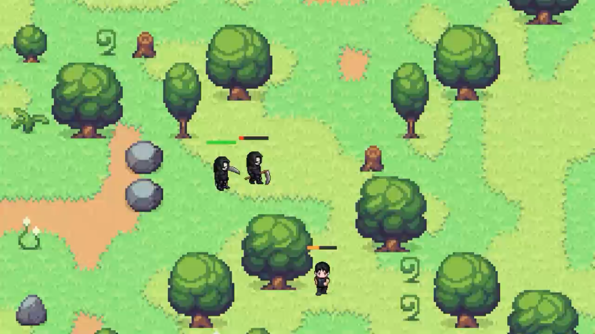

# 第八章：要有伤害




> **"人被杀，就会死。"**  
> —— 某种程度上，这确实是本 chapter 的核心。

在上一章里，我们构建了一个像模像样的战斗系统：四种法术元素（Fire、Arcane、Shadow、Poison），粒子特效炫酷十足，发射出去还能看到弹道飞行。但如果你仔细回想一下，会发现一个问题——

**这些法术打到敌人身上，啥也没发生。**

粒子特效确实很养眼，可敌人不痛不痒、活蹦乱跳。玩家和敌人之间这场"战斗"，本质上还是一场没有记分牌的烟花表演。

这一章，我们来解决这个问题。我们要给这个游戏世界引入真正的伤害机制：血条、死亡、Game Over，以及让整个战斗循环完整闭合的一切。

听起来有点残忍？别担心，你的像素小人只会感谢你给了它们一个体面的退场方式。

## 从零到一：Health 组件

在 Bevy 的 ECS 世界里，要表示"一个东西能挨多少打"，最自然的方式就是加一个组件。我们创建一个 `Health` 组件，让它带着当前生命值和最大生命值这两个基本信息：

```rust
// src/combat/health.rs
use bevy::prelude::*;

/// Health component for any damageable entity (player, enemies).
#[derive(Component)]
pub struct Health {
    pub current: f32,
    pub max: f32,
}

impl Health {
    pub fn new(max: f32) -> Self {
        Self { current: max, max }
    }

    pub fn is_alive(&self) -> bool {
        self.current > 0.0
    }

    /// Returns health as a ratio in [0, 1].
    pub fn ratio(&self) -> f32 {
        self.current / self.max
    }

    pub fn take_damage(
        &mut self,
        commands: &mut Commands,
        entity: Entity,
        amount: f32,
    ) {
        self.current = (self.current - amount).max(0.0);

        // Trigger death event when health reaches zero
        if !self.is_alive() {
            commands.trigger(super::events::EntityDeath { entity });
        }
    }
}
```

这个组件设计的精妙之处在于它的简洁性。`current` 表示当前生命值，`max` 表示上限。我们提供三个方法：

- `new(max)` — 创建一个满血的 Health 实例
- `is_alive()` — 检查是否还活着（`current > 0.0`）
- `ratio()` — 返回 0.0 到 1.0 之间的生命值比例，这对 UI 显示非常有帮助
- `take_damage()` — 造成伤害，如果生命归零则触发死亡事件

等等，这个方法签名里怎么多了 `commands` 和 `entity` 参数？我们往下看。

### 为什么 take_damage 要接收 commands？

这就涉及到一个重要的设计决策：**谁负责触发死亡事件？**

一种方案是让外部系统（比如一个 `damage_system`）在造成伤害后检查血量，然后触发事件。另一种方案是把触发逻辑封装在 `take_damage` 方法内部。

作者选择了后者，原因很务实——这样的话，任何造成伤害的地方都不用再重复写"检查死亡"的逻辑。你只需要调用 `health.take_damage(...)`，剩下的事它会帮你办妥。

不过这里有一个微妙的 Rust 所有权问题：`take_damage` 需要 `&mut self` 来修改血量，而 `commands.trigger(...)` 需要访问 `commands`。但因为 Rust 允许我们把 `&mut self` 和 `&mut commands` 作为分开的参数传递，所以这完全可行。**注意**，如果 `commands` 是 `self` 的一部分，那就不行了——好在它不是。

死亡事件的触发用的是 Bevy 的 `commands.trigger(...)`，这是我们接下来要深入探讨的机制。

## 事件的诞生：ProjectileHit 和 EntityDeath

在第七章里，我们直接用 `check_projectile_hits` 系统检测碰撞。那种做法在当时是合理的——我们只需要检测碰撞就够了。但现在我们要引入伤害、死亡等复杂逻辑，直接把所有事情塞进一个系统会很快变得不可维护。

解决方案是**事件驱动**。我们把碰撞检测的结果以事件的形式发出，让专门的处理器（Observer）来响应。为此我们定义两个事件：

```rust
// src/combat/events.rs
use super::power_type::PowerType;
use bevy::prelude::*;

/// Event triggered when a projectile hits a target entity.
#[derive(Event)]
pub struct ProjectileHit {
    pub target: Entity,
    pub damage: f32,
    pub power_type: PowerType,
}

/// Event triggered when an entity's health reaches zero.
#[derive(Event)]
pub struct EntityDeath {
    pub entity: Entity,
}
```

这两个事件结构体都使用了 Bevy 的 `#[derive(Event)]` 宏来标记为事件类型。

- **ProjectileHit**：当弹丸命中目标时触发，携带目标实体、伤害值和法术类型信息。保留 `power_type` 字段是为了方便未来做更多花样——比如根据法术类型触发不同的视觉效果或音效。
- **EntityDeath**：当实体血量归零时触发，携带要移除的实体 ID。

你可能会问，为什么 `ProjectileHit` 不直接在 `check_projectile_hits` 系统里处理伤害，而是多此一举地发个事件？答案藏在下一节。

## Bevy 的 Observer：声明式事件处理

Bevy 在 0.14 版本中引入了一种**观察者（Observer）**模式。如果你熟悉游戏开发中的观察者模式，那应该不会陌生——它是 ECS 版的"事件监听器"。

Observer 的工作原理是：你告诉 Bevy"当某个事件发生时，运行这个函数"，然后 Bevy 会在事件触发时自动调用它。这比传统的 `EventReader` + `EventWriter` 方案更简洁，因为它把"监听"变成了"声明"。

来看看我们的两个 Observer：

```rust
// src/combat/observers.rs
use super::events::{EntityDeath, ProjectileHit};
use super::health::Health;
use bevy::prelude::*;
use crate::characters::input::Player;
use crate::state::GameState;

/// Observer that handles projectile hits by applying damage to the target.
pub fn on_projectile_hit(
    hit: On<ProjectileHit>,
    mut healths: Query<&mut Health>,
    mut commands: Commands,
) {
    let Ok(mut health) = healths.get_mut(hit.target) else {
        return;
    };

    health.take_damage(&mut commands, hit.target, hit.damage);

    info!(
        "{:?} hit for {} damage! HP: {:.0}/{:.0}",
        hit.power_type, hit.damage, health.current, health.max
    );
}

/// Observer that handles entity death by despawning the entity.
pub fn on_entity_death(
    death: On<EntityDeath>,
    mut commands: Commands,
    players: Query<(), With<Player>>,
    mut next_state: ResMut<NextState<GameState>>,
) {
    let entity = death.entity;
    let is_player = players.get(entity).is_ok();

    info!("Entity {:?} defeated!", death.entity);
    commands.entity(death.entity).despawn();

    if is_player {
        info!("Player defeated! Game Over.");
        next_state.set(GameState::GameOver);
    }
}
```

注意到 Observer 函数的签名有什么特别之处吗？

第一个参数是 `On<ProjectileHit>` 或 `On<EntityDeath>`——这个 `On<T>` 包装类型告诉 Bevy"嘿，我想监听 T 类型的事件"。当事件触发时，Bevy 会把事件数据传进来，你通过 `hit.target`、`hit.damage` 等方式访问。

除此之外，Observer 函数的参数列表和普通系统几乎一样——你可以使用 `Query`、`Commands`、`Res`、`ResMut` 等参数，Bevy 会像注入系统依赖一样注入它们。这非常强大：一个 Observer 可以直接查询组件、修改资源、销毁实体，而不需要任何中间人。

### 注册 Observer

有了 Observer 函数，我们需要把它们注册到 App 里。这一步在 CombatPlugin 中完成：

```rust
// CombatPlugin 的核心注册代码
app
    .add_observer(observers::on_projectile_hit)
    .add_observer(observers::on_entity_death)
    // ... 其他系统
```

是的，就是这么简单。`add_observer` 函数接收一个函数指针，Bevy 会自动根据函数签名推断它监听的事件类型。

### 触发 Observer

Observer 通过 `commands.trigger(...)` 触发：

```rust
// 在 check_projectile_hits 系统中触发 ProjectileHit
commands.trigger(super::events::ProjectileHit {
    target,
    damage: proj.power_type.damage(),
    power_type: proj.power_type,
});

// 在 health.take_damage 中触发 EntityDeath
commands.trigger(super::events::EntityDeath { entity });
```

这里有个很棒的特性：`commands.trigger()` 是**立即执行**的。也就是说，当你调用 `trigger` 时，对应的 Observer 会立刻被调用，而不是等到系统执行周期的某个阶段。这对于处理"伤害 → 死亡 → 销毁"这种因果链来说非常自然。

## 给每个法术赋予伤害值

我们的四种法术在第七章只是视觉效果不同，现在它们需要真正的伤害数据了。回到 `power_type.rs`，我们用两个新方法给每个法术类型添加了伤害和碰撞体半径：

```rust
impl PowerType {
    pub fn damage(&self) -> f32 {
        match self {
            PowerType::Fire => 25.0,
            PowerType::Arcane => 35.0,
            PowerType::Shadow => 20.0,
            PowerType::Poison => 15.0,
        }
    }

    pub fn hitbox_radius(&self) -> f32 {
        match self {
            PowerType::Fire => 30.0,
            PowerType::Arcane => 18.0,
            PowerType::Shadow => 15.0,
            PowerType::Poison => 25.0,
        }
    }
}
```

**伤害值的哲学**：

- **Arcane（奥术，35 伤害）** — 伤害最高，但弹道狭窄（18 半径），需要精准命中。高回报，高风险。
- **Fire（火焰，25 伤害）** — 中规中矩。扩散范围大（30 半径），伤害适中，是全能型选择。
- **Shadow（暗影，20 伤害）** — 速度快但伤害偏低。弹道最窄（15 半径），适合偷袭。
- **Poison（毒素，15 伤害）** — 伤害最低，但弹道宽（25 半径）、飞行慢且粒子呈弥散状，适合覆盖范围。

这些数值设计让每种法术有不同的"手感"——你是追求奥术的一击必杀，还是火焰的稳扎稳打，抑或是毒素的范围压制？这为玩家提供了战术选择的空间。

## 让敌我双方都有血量

现在有了 Health 组件，我们需要把它挂载到玩家和敌人身上。

### 玩家血量

在 `characters/spawn.rs` 中，当生成玩家时，我们添加了 Health 组件，并使用角色配置中的 `max_health` 值：

```rust
// 在 spawn_player_at_valid_position 中
commands.spawn((
    Player,
    Transform::from_translation(Vec3::new(...)),
    // ... 其他组件
    PlayerCombat::default(),
    Health::new(character_entry.max_health),  // ← 新增
    // ...
));
```

### 敌人血量

同样地，在 `enemy/spawn.rs` 中：

```rust
// 在 spawn_enemy 中
commands.spawn((
    Enemy,
    // ... 其他组件
    EnemyCombat::default(),
    Health::new(character_entry.max_health),  // ← 新增
    AIBehavior::default(),
    // ...
));
```

这里有个值得注意的细节：玩家的生命值也在 `CharacterEntry` 中定义，这意味着你可以通过修改 RON 配置文件来调整不同角色的血量，而不需要改任何 Rust 代码。`CharacterEntry` 结构体在上一章已经添加了 `max_health` 字段：

```rust
#[derive(Component, Asset, TypePath, Debug, Clone, Serialize, Deserialize)]
pub struct CharacterEntry {
    pub name: String,
    pub max_health: f32,   // ← 就是这个字段
    pub base_move_speed: f32,
    pub run_speed_multiplier: f32,
    pub texture_path: String,
    pub tile_size: u32,
    pub atlas_columns: usize,
    pub animations: HashMap<AnimationType, AnimationDefinition>,
}
```

## 血条：让伤害可视化

伤害有了，死亡有了，但**玩家怎么知道自己打了多少血？**

如果你玩过一个没有血条的游戏，你就会知道那种感觉有多糟糕——你在那里疯狂按攻击键，但完全不确定自己是不是在做无用功。所以我们需要**血条**。

这是本章最复杂的 UI 相关代码。我们在 `combat/healthbar.rs` 中实现它：

```rust
use bevy::prelude::*;
use super::health::Health;

const HEALTHBAR_WIDTH: f32 = 50.0;
const HEALTHBAR_HEIGHT: f32 = 6.0;
const HEALTHBAR_Y_OFFSET: f32 = 43.0;
const HEALTHBAR_Z_OFFSET: f32 = 1.0;
/// Small z bump so the foreground always renders on top of the background.
const HEALTHBAR_FG_Z_BUMP: f32 = 0.01;

/// Marker: this entity is the colored fill of a healthbar.
#[derive(Component)]
pub struct HealthBarForeground;

/// Links a healthbar entity back to its owner character.
#[derive(Component)]
pub struct HealthBarOwner(pub Entity);
```

这里定义了血条的尺寸：宽 50 像素、高 6 像素，显示在角色上方 43 像素处。血条分为两层——背景（深灰色）和前景（根据血量变化颜色），前景通过 `HEALTHBAR_FG_Z_BUMP` 微小的 Z 偏移实现叠加。

`HealthBarOwner` 组件用于把血条实体和它的主人实体关联起来。当主人移动或死亡时，我们可以通过这个组件找到对应的血条。

### 生成血条：spawn_healthbars

```rust
/// Spawns a background + foreground healthbar pair for each entity that gains Health.
pub fn spawn_healthbars(
    mut commands: Commands,
    new_health: Query<(Entity, &GlobalTransform, &Health), Added<Health>>,
    mut meshes: ResMut<Assets<Mesh>>,
    mut materials: ResMut<Assets<ColorMaterial>>,
) {
    for (owner, transform, health) in &new_health {
        let pos = transform.translation();
        let bg_pos = Vec3::new(pos.x, pos.y + HEALTHBAR_Y_OFFSET, pos.z + HEALTHBAR_Z_OFFSET);
        let fg_pos = Vec3::new(pos.x, pos.y + HEALTHBAR_Y_OFFSET, pos.z + HEALTHBAR_Z_OFFSET + HEALTHBAR_FG_Z_BUMP);

        // Background: dark gray
        let bg_mesh = meshes.add(Rectangle::new(HEALTHBAR_WIDTH, HEALTHBAR_HEIGHT));
        let bg_mat = materials.add(ColorMaterial::from(Color::srgb(0.2, 0.2, 0.2)));
        commands.spawn((
            Mesh2d(bg_mesh),
            MeshMaterial2d(bg_mat),
            Transform::from_translation(bg_pos),
            HealthBarOwner(owner),
        ));

        // Foreground: color derived from actual health ratio
        let ratio = health.ratio();
        let fg_mesh = meshes.add(Rectangle::new(HEALTHBAR_WIDTH, HEALTHBAR_HEIGHT));
        let fg_mat = materials.add(ColorMaterial::from(health_color(ratio)));
        commands.spawn((
            Mesh2d(fg_mesh),
            MeshMaterial2d(fg_mat),
            Transform::from_translation(fg_pos)
                .with_scale(Vec3::new(ratio.max(0.001), 1.0, 1.0)),
            HealthBarOwner(owner),
            HealthBarForeground,
        ));
    }
}
```

这个系统使用 `Added<Health>` 作为查询过滤条件——它只会处理**刚刚添加了 Health 组件**的实体。这意味着当你生成一个带有 Health 的实体时，系统会自动为它创建血条，而且每个实体只会创建一次。

每个血条是两个独立的 2D 矩形 Mesh：背景是深灰色矩形，前景是彩色矩形。前景的 X 轴缩放根据血量比例动态调整——满血时完全展开，残血时缩窄。

### 更新血条：update_healthbars

```rust
/// Despawns bars whose owner no longer exists.
pub fn update_healthbars(
    mut commands: Commands,
    mut bars: Query<(
        Entity,
        &HealthBarOwner,
        &mut Transform,
        Has<HealthBarForeground>,
        &MeshMaterial2d<ColorMaterial>,
    )>,
    owners: Query<(&GlobalTransform, &Health)>,
    mut materials: ResMut<Assets<ColorMaterial>>,
) {
    for (bar_entity, owner_ref, mut transform, is_foreground, mat_handle) in bars.iter_mut() {
        let Ok((owner_transform, health)) = owners.get(owner_ref.0) else {
            // If the owner is gone (despawned), clean up the health bar
            commands.entity(bar_entity).despawn();
            continue;
        };

        let owner_pos = owner_transform.translation();
        let ratio = health.ratio();

        if is_foreground {
            // Scale foreground width to match health ratio
            transform.scale.x = ratio.max(0.001);

            // Reposition foreground to stay left-aligned as it shrinks
            transform.translation = Vec3::new(
                owner_pos.x - (HEALTHBAR_WIDTH * (1.0 - ratio) / 2.0),
                owner_pos.y + HEALTHBAR_Y_OFFSET,
                owner_pos.z + HEALTHBAR_Z_OFFSET + HEALTHBAR_FG_Z_BUMP,
            );

            // Update color (Green -> Yellow -> Red)
            if let Some(mat) = materials.get_mut(&mat_handle.0) {
                mat.color = health_color(ratio);
            }
        } else {
            // Background simply stays centered above the owner
            transform.translation = Vec3::new(
                owner_pos.x,
                owner_pos.y + HEALTHBAR_Y_OFFSET,
                owner_pos.z + HEALTHBAR_Z_OFFSET,
            );
        }
    }
}
```

这个系统每帧更新所有血条。它做了三件事：

1. **跟随主人**：每次更新都把血条定位到主人当前位置上方。
2. **动态缩放**：前景的 X 轴缩放反映血量比例。但这里有个陷阱——Bevy 的缩放是以实体中心为原点的，直接缩窄前景会让血条从中间向两边收缩，看起来像是两端都在缩短。为了让血条看起来是从右向左收缩（左对齐），我们需要同时调整位置：`owner_pos.x - (HEALTHBAR_WIDTH * (1.0 - ratio) / 2.0)`。
3. **颜色变化**：健康的绿色 → 半血的黄色 → 濒死的红色。

关于 `Has<HealthBarForeground>` 的用法值得一提——这是 Bevy 0.14 引入的查询语法，用于检查一个实体是否包含某个组件，而不需要实际获取该组件的数据。比起之前的 `Option<&HealthBarForeground>`，语义更加清晰。

### 配色方案：health_color

```rust
/// Green → Yellow → Red, continuous at ratio = 0.5.
fn health_color(ratio: f32) -> Color {
    if ratio >= 0.5 {
        let t = (ratio - 0.5) * 2.0; // 1.0 at full, 0.0 at half
        Color::srgb(1.0 - t * 0.8, 0.8, 0.2)
    } else {
        let t = ratio * 2.0; // 1.0 at half, 0.0 at empty
        Color::srgb(1.0, t * 0.8, 0.2)
    }
}
```

这个函数实现了从绿色（满血）到黄色（半血）再到红色（濒死）的平滑渐变。它在 `ratio = 0.5` 处做了分段处理，确保颜色过渡是连续的。

## 敌人还击：EnemyCombat 与 enemy_attack

在上一章，敌人只是傻站着让你打。这太不公平了——现在我们让它们学会还手。

### EnemyCombat 组件

```rust
// src/enemy/components.rs
/// Combat capabilities for enemies
#[derive(Component)]
pub struct EnemyCombat {
    pub power_type: PowerType,
    pub cooldown: Timer,
}

impl Default for EnemyCombat {
    fn default() -> Self {
        Self {
            power_type: PowerType::Shadow,
            cooldown: Timer::from_seconds(2.0, TimerMode::Once),
        }
    }
}
```

注意到敌人默认使用的是 Shadow（暗影）法术——这很符合"墓地收割者"的人设。2 秒的冷却时间比玩家的 0.5 秒慢得多，给玩家留出了反应和躲避的空间。

### 攻击系统：enemy_attack

```rust
// src/enemy/combat.rs
/// System that handles enemy attacks
pub fn enemy_attack(
    mut commands: Commands,
    time: Res<Time>,
    mut enemy_query: Query<(&GlobalTransform, &mut EnemyCombat, &AIBehavior), With<Enemy>>,
    player_query: Query<&Transform, With<Player>>,
) {
    let Ok(player_transform) = player_query.single() else {
        return;
    };

    for (enemy_transform, mut combat, ai) in enemy_query.iter_mut() {
        combat.cooldown.tick(time.delta());

        let enemy_pos = enemy_transform.translation();
        let player_pos = player_transform.translation;
        let distance = enemy_pos.distance(player_pos);

        // Attack if in range and cooldown is ready
        if distance <= ai.attack_range
            && combat.cooldown.elapsed() >= combat.cooldown.duration()
        {
            let to_player = (player_pos - enemy_pos).normalize();
            let spawn_position = enemy_pos + to_player * 5.0;

            // Get visuals from power type
            let visuals = combat.power_type.visuals(to_player);

            // Spawn projectile (reuse existing function!)
            spawn_projectile(
                &mut commands,
                spawn_position,
                combat.power_type,
                &visuals,
                ProjectileOwner::Enemy,
            );

            combat.cooldown.reset();
            info!("Enemy fired {:?} projectile at player!", combat.power_type);
        }
    }
}
```

这里最值得称道的是代码复用——`enemy_attack` 直接调用了之前在 `combat/systems.rs` 中定义的 `spawn_projectile` 函数。玩家射击和敌人射击使用的是同一个生成函数，区别仅在于 `ProjectileOwner::Enemy` 标签。

这种代码共享是 ECS 体系的一个优势：行为被分解为组件和函数，而不是绑死在特定的实体类型上。`spawn_projectile` 不关心谁发射了弹丸，它只关心参数。而 `ProjectileOwner` 标签则在碰撞检测阶段决定弹丸能伤害谁。

### 碰撞检测中的敌我识别

说到这个，让我们看看 `check_projectile_hits` 系统是如何利用 `ProjectileOwner` 来决定碰撞目标的：

```rust
pub fn check_projectile_hits(
    mut commands: Commands,
    projectiles: Query<(Entity, &Projectile, &Transform)>,
    players: Query<(Entity, &GlobalTransform), With<Player>>,
    enemies: Query<(Entity, &GlobalTransform), With<Enemy>>,
) {
    for (proj_entity, proj, proj_transform) in &projectiles {
        let proj_pos = proj_transform.translation;

        let hit_target = match proj.owner {
            ProjectileOwner::Player => enemies
                .iter()
                .find(|(_, t)| proj_pos.distance(t.translation()) <= proj.radius)
                .map(|(e, _)| e),
            ProjectileOwner::Enemy => players
                .iter()
                .find(|(_, t)| proj_pos.distance(t.translation()) <= proj.radius)
                .map(|(e, _)| e),
        };

        if let Some(target) = hit_target {
            // Trigger hit event instead of directly applying damage
            commands.trigger(super::events::ProjectileHit {
                target,
                damage: proj.power_type.damage(),
                power_type: proj.power_type,
            });
            commands.entity(proj_entity).despawn();
        }
    }
}
```

逻辑很清晰：玩家发射的弹丸检测敌人，敌人发射的弹丸检测玩家。找到目标后触发 `ProjectileHit` 事件，然后销毁弹丸本身（一次性的）。

## 死亡与 Game Over

当 `EntityDeath` 事件触发时，`on_entity_death` Observer 会处理后续事宜。但死亡只是开始——接下来会发生什么？

### Game Over 状态

我们在 `GameState` 枚举中添加了一个新的变体：

```rust
// src/state/game_state.rs
pub enum GameState {
    #[default]
    Loading,
    Playing,
    Paused,
    GameOver,  // ← 新增
}
```

### Game Over 画面

```rust
// src/state/game_over.rs
pub fn spawn_game_over_screen(mut commands: Commands) {
    commands
        .spawn((
            GameOverScreen,
            Node {
                width: Val::Percent(100.0),
                height: Val::Percent(100.0),
                justify_content: JustifyContent::Center,
                align_items: AlignItems::Center,
                ..default()
            },
            BackgroundColor(Color::srgba(0.0, 0.0, 0.0, 0.85)),
        ))
        .with_children(|parent| {
            parent.spawn((
                Text::new("GAME OVER\n\nPress R to restart"),
                TextFont {
                    font_size: 48.0,
                    ..default()
                },
                TextColor(Color::WHITE),
                TextLayout::new_with_justify(Justify::Center),
            ));
        });
}
```

这创建了一个铺满全屏的半透明黑色覆盖层，居中显示白色大字"GAME OVER"和重新开始提示。

### 重新开始：cleanup_game_world

当玩家按下 R 键重新开始时，我们需要做一件很重要的事——**清理旧世界**。否则玩家会发现上一局的所有实体（敌人、弹丸、粒子效果、血条）都还在：

```rust
pub fn cleanup_game_world(
    mut commands: Commands,
    enemies: Query<Entity, With<Enemy>>,
    projectiles: Query<Entity, With<Projectile>>,
    projectile_effects: Query<Entity, With<ProjectileEffect>>,
    emitters: Query<Entity, With<ParticleEmitter>>,
    particles: Query<Entity, With<Particle>>,
    healthbars: Query<Entity, With<HealthBarOwner>>,
    mut player_spawned: ResMut<PlayerSpawned>,
    mut enemies_spawned: ResMut<EnemiesSpawned>,
) {
    for entity in enemies.iter() {
        commands.entity(entity).despawn();
    }
    for entity in projectiles.iter() { /* ... */ }
    for entity in projectile_effects.iter() { /* ... */ }
    for entity in emitters.iter() { /* ... */ }
    for entity in particles.iter() { /* ... */ }
    for entity in healthbars.iter() { /* ... */ }

    player_spawned.0 = false;
    enemies_spawned.0 = false;
}
```

这里的关键在于重置 `PlayerSpawned` 和 `EnemiesSpawned` 资源。它们是控制生成系统是否执行的阀门——设为 `false` 后，当游戏回到 `Playing` 状态时，生成系统会再次执行，重新创建玩家和敌人。

## CombatPlugin：把所有拼图拼在一起

现在让我们看看 `CombatPlugin`——这个模块的入口和注册中心：

```rust
// src/combat/mod.rs
use bevy::prelude::*;
use crate::state::GameState;
use super::health::Health;
use super::healthbar::HealthBarOwner;

pub struct CombatPlugin;

impl Plugin for CombatPlugin {
    fn build(&self, app: &mut App) {
        app
            // Register observers for combat events
            .add_observer(observers::on_projectile_hit)
            .add_observer(observers::on_entity_death)
            .add_systems(
                Update,
                (
                    handle_power_input,
                    debug_switch_power,
                    systems::move_projectiles,
                    systems::check_projectile_hits,
                    healthbar::spawn_healthbars,
                    healthbar::update_healthbars,
                )
                    .chain()
                    .run_if(in_state(GameState::Playing)),
            );
    }
}
```

这里有两个值得注意的设计决策：

### 1. 系统链式执行（.chain()）

`.chain()` 确保这六个系统按顺序执行：

```
handle_power_input → debug_switch_power → move_projectiles → check_projectile_hits → spawn_healthbars → update_healthbars
```

顺序是有讲究的：先处理输入（玩家发射弹丸），再移动弹丸，检查碰撞，最后更新血条。如果 `check_projectile_hits` 在 `handle_power_input` 之前运行，那么新发射的弹丸在同一帧内就不会移动也不会产生碰撞——这在大多数情况下是可以接受的，但顺序执行消除了这种不确定性。

实际上 `.chain()` 并不会强制系统在同一线程运行——它只是确保系统之间不会并行执行，并且按照声明的顺序产生可预测的结果。Bevy 的调度器会尊重这种排序约束。

### 2. 状态守卫（run_if）

`run_if(in_state(GameState::Playing))` 是一个运行条件，确保这些系统只在游戏处于 Playing 状态时运行。当游戏暂停或处于 GameOver 状态时，所有战斗系统都不会执行。这是一个非常干净的逻辑隔离方式。

Observer 则不同——它们不受 `run_if` 的限制。这意味着即使游戏处于 GameOver 状态，如果有人触发了 `ProjectileHit` 事件，Observer 仍然会处理它。但在我们的设计中，游戏状态切换时所有实体都会被清理，所以实际上不会有事件在错误的状态下被触发。

## 配置文件中的新常量

为了让敌人也有合适的渲染层级和缩放比例，我们在 `config.rs` 中添加了新模块：

```rust
pub mod enemy {
    /// Z-position for enemy rendering (same as player for consistent layering)
    pub const ENEMY_Z_POSITION: f32 = 20.0;

    /// Visual scale of enemy sprites (same as player for consistency)
    pub const ENEMY_SCALE: f32 = 1.2;
}
```

这里没有什么特别复杂的东西——只是确保敌人在渲染层级上与玩家保持一致（`Z = 20.0`），并且有相同的缩放比例（`1.2`）。这样做的目的是为了让玩家和敌人在视觉上处于同一"平面"。

## 完整的 main.rs

最后，让我们看看整合了所有这些新系统的 main.rs：

```rust
mod map;
mod characters;
mod state;
mod collision;
mod config;
mod inventory;
mod camera;
mod combat;
mod particles;
mod enemy;

use bevy::{
    prelude::*,
    window::{MonitorSelection, Window, WindowMode, WindowPlugin},
};
use bevy_procedural_tilemaps::prelude::*;
use crate::camera::CameraPlugin;
use crate::map::generate::setup_generator;

fn main() {
    App::new()
        .insert_resource(ClearColor(Color::BLACK))
        .add_plugins(
            DefaultPlugins
                .set(AssetPlugin { file_path: "src/assets".into(), ..default() })
                .set(WindowPlugin {
                    primary_window: Some(Window {
                        title: "Bevy Game".into(),
                        mode: WindowMode::BorderlessFullscreen(MonitorSelection::Current),
                        ..default()
                    }),
                    ..default()
                })
                .set(ImagePlugin::default_nearest()),
        )
        .add_plugins(ProcGenSimplePlugin::<Cartesian3D, Sprite>::default())
        .add_plugins(state::StatePlugin)
        .add_plugins(CameraPlugin)
        .add_plugins(inventory::InventoryPlugin)
        .add_plugins(collision::CollisionPlugin)
        .add_plugins(characters::CharactersPlugin)
        .add_plugins(combat::CombatPlugin)       // ← 战斗系统（含本章新增内容）
        .add_plugins(enemy::EnemyPlugin)          // ← 敌人系统（含本章新增攻击行为）
        .add_plugins(particles::ParticlesPlugin)
        .add_systems(Startup, setup_generator)
        .run();
}
```

对于本章来说，main.rs 的改动其实不大——主要的变化在插件内部的实现细节中。`CombatPlugin` 和 `EnemyPlugin` 在上一章已经被添加，本章的内容都在它们内部。

不过有一个微妙的变化值得注意：**插件的注册顺序**。`EnemyPlugin` 现在依赖于 `CombatPlugin` 中定义的 `spawn_projectile` 函数——这是一个 Rust 层面的依赖，而不是 ECS 层面的。因为 `enemy/combat.rs` 中 `use crate::combat::systems::spawn_projectile`，所以只要模块被声明（即 `mod combat;` 出现在 `mod enemy;` 之前），就能正常编译。

## 流程总结

让我们从头到尾梳理一遍完整的伤害流程，感受一下整个系统是如何协同工作的：

1. **玩家按 Ctrl 键** → `handle_power_input` 系统检测到输入，调用 `spawn_projectile` 生成弹丸和粒子特效
2. **弹丸飞行** → `move_projectiles` 系统每帧更新弹丸位置
3. **弹丸命中敌人** → `check_projectile_hits` 检测到碰撞，触发 `ProjectileHit` 事件
4. **Observer 响应** → `on_projectile_hit` 被调用，通过 Query 获取目标的 Health 组件，调用 `take_damage`
5. **伤害计算** → `take_damage` 减去生命值，如果血量为 0 则触发 `EntityDeath` 事件
6. **Observer 响应死亡** → `on_entity_death` 被调用，销毁实体
7. **血条消失** → `update_healthbars` 检测到主人不存在，自动销毁对应血条
8. **如果是玩家死亡** → Observer 检测到死亡的是 Player，设置 `GameState::GameOver`
9. **Game Over 画面出现** → StatePlugin 响应 `OnEnter(GameState::GameOver)`，显示 Game Over UI
10. **玩家按 R 重新开始** → 清理旧世界，重置生成标志，进入 Playing 状态重新生成一切

这是一个完整的闭环——从输入到输出，从生到死，从战斗到重生。

## 平衡性调整建议

当前的法术伤害数值是：

| 法术类型 | 伤害 | 碰撞半径 | 冷却时间 | 特点 |
|---------|------|---------|---------|------|
| Fire    | 25   | 30      | 0.5s    | 平衡型 |
| Arcane  | 35   | 18      | 0.5s    | 高伤精准 |
| Shadow  | 20   | 15      | 0.5s    | 快速偷袭 |
| Poison  | 15   | 25      | 0.5s    | 范围压制 |

而敌人的默认设置是：
- 攻击范围：150 单位
- 冷却时间：2 秒
- 暗影法术伤害：20

你可以尝试调整这些数值来改变游戏体验。比如把敌人伤害调高到 30，游戏会变得更具挑战性；把敌人冷却时间降到 1 秒，战斗会变得更加激烈。

## 本章小结

让我们回顾一下本章学到的东西：

| 概念 | 实现 |
|------|------|
| ❤️ 生命值系统 | `Health` 组件 + `take_damage()` 方法 |
| 📢 事件驱动 | `ProjectileHit` 和 `EntityDeath` 事件 |
| 👀 Observer 模式 | `On<T>` 参数 + `add_observer()` 注册 |
| 📊 血条 UI | 双层 2D Mesh + 动态缩放 + 颜色渐变 |
| ⚔️ 敌人战斗 | `EnemyCombat` + 复用 `spawn_projectile` |
| 💀 死亡机制 | 实体销毁 + Game Over 状态切换 |
| 🔄 重新开始 | 世界清理 + 重置生成标志 |

更重要的是，你学会了 Bevy 中 Observer 模式的核心思想：**事件触发是"声明式"的，而事件处理是"依赖注入式"的**。Observer 让代码的关注点分离变得更加自然——碰撞检测系统只关心"是否碰撞"，而伤害处理系统只关心"扣多少血"。

这也呼应了 ECS 的根本理念：数据和逻辑分离，组件和系统分离。在这一章里，我们进一步把"系统内部的逻辑"和"系统之间的通信"也分离了——通过事件。

下一章，我们将继续扩展这个世界……

---

*等等，你说敌人太弱了想调强一点？那就去 `power_type.rs` 里改 `damage()` 的返回值吧。一个数值调整，就能让墓地收割者变成真正的噩梦。不过别说我没提醒你。*
---

## 📂 查看本章源码

完整源代码可在 GitHub 查看：
[https://github.com/jamesfebin/ImpatientProgrammerBevyRust/tree/main/chapter8](https://github.com/jamesfebin/ImpatientProgrammerBevyRust/tree/main/chapter8)
