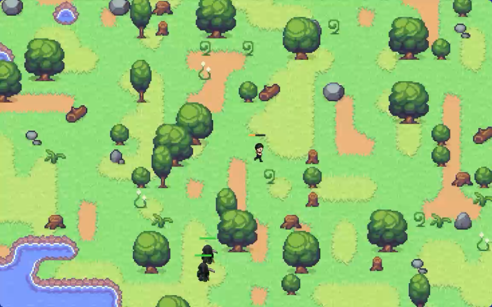

# 第九章：让世界扩展




> **耐心程序员的 Bevy 与 Rust 指南：第九章——让世界扩展**

*发布于 2026年5月5日*

---

**关于 AI 辅助**
*是的，本章写作过程中使用了 AI 辅助。我负责结构设计、技术决策、方法论、代码组织方式，以及整理学习者可能遇到的问题列表。AI 帮助扩展了结构和解释内容，并由我全程编辑。每章我总共花费约 20-25 小时，包括编码和写作。如果任何部分感觉不对劲，请在 [Reddit](https://www.reddit.com/r/bevy/) 或 [Discord](https://discord.com/invite/cD9qEsSjUH) 上告诉我，我会进行改进。*

在前几章中，你的世界被限制在一个 Wave Function Collapse（WFC）生成的网格大小内。如果你想创建一个更大的世界——一个需要加载屏幕的巨大地图——该怎么办？本章将打破这个限制。

在本章结束时，你将能够生成一个由多个 WFC 生成的"块（chunk）"拼接而成的巨大无缝世界，且块与块之间的边界完美匹配。

> **前置条件**：本章是 Bevy 教程系列的第九章。它是付费章节——你需要从 [Gumroad](https://febinjohnjames.gumroad.com/l/the-impatient-programmers-guide-to-bevy-and-rust) 购买电子书以支持本教程。开始之前，请先完成[第一章](https://aibodh.com/posts/bevy-rust-game-development-chapter-1/)、[第二章](https://aibodh.com/posts/bevy-rust-game-development-chapter-2/)、[第三章](https://aibodh.com/posts/bevy-rust-game-development-chapter-3/)、[第四章](https://aibodh.com/posts/bevy-rust-game-development-chapter-4/)、[第五章](https://aibodh.com/posts/bevy-rust-game-development-chapter-5/)、[第六章](https://aibodh.com/posts/bevy-rust-game-development-chapter-6/)、[第七章](https://aibodh.com/posts/bevy-rust-game-development-chapter-7/)和[第八章](https://aibodh.com/posts/bevy-rust-game-development-chapter-8/)，或者从[此仓库](https://github.com/jamesfebin/ImpatientProgrammerBevyRust)克隆第八章的代码进行学习。


> **开始之前：** *我一直在努力改进本教程，让您的学习之旅更加愉快。您的反馈至关重要——请在 [Reddit](https://www.reddit.com/r/bevy/)/[Discord](https://discord.com/invite/cD9qEsSjUH)/[LinkedIn](https://www.linkedin.com/in/febinjohnjames) 上分享您的困惑、问题或建议。喜欢本教程？请告诉我哪些地方对您有帮助！让我们一起让使用 Rust 和 Bevy 进行游戏开发变得更加易于上手。*

---

## 为什么需要多块地图？

到目前为止，你的地图是由单个 WFC 生成的。你定义了一个网格，传入规则，然后得到一个结果。这很好……直到你想要一个更大的地图。

WFC 算法的复杂度随着网格大小的增加而急剧上升。更大的网格意味着更多的约束需要满足、更多的冲突需要解决，以及更多的回溯。在某个点上——这个点来得比你想象的要快——生成会变得非常缓慢甚至完全失败。

解决方案？**将地图分解成多个较小的块**，然后**拼接它们**。每个块单独运行 WFC，但边界条件是共享的——左块的右边缘决定右块的左边缘，依此类推。

就像拼图一样，每个块独立生成，但知道邻居的样子。

## Cargo 依赖更新

本章将 `bevy_procedural_tilemaps` 升级到 0.3.0 版本。确保你的 `Cargo.toml` 看起来像这样：

```toml
[package]
name = "chapter9"
version = "0.1.0"
edition = "2024"

[dependencies]
bevy = "0.18"
bevy_procedural_tilemaps = "0.3.0"
bevy_common_assets = { version = "0.15.0-rc.1", features = ["ron"] }
serde = { version = "1.0", features = ["derive"] }
rand = "0.8"
pathfinding = "4.9"

[profile.dev]
opt-level = 1

[profile.dev.package."*"]
opt-level = 3
```

## 地图配置：从网格到块

我们不再使用单个网格，而是将世界定义为一组块。打开 `src/config.rs`，看看 `map` 模块的新内容：

```rust
pub mod map {
    /// Size of a single tile in world units
    pub const TILE_SIZE: f32 = 64.0;

    /// Grid dimensions per chunk
    pub const GRID_X: u32 = 25;
    pub const GRID_Y: u32 = 18;

    pub const CHUNKS_X: u32 = 10;
    pub const CHUNKS_Y: u32 = 10;

    pub const TOTAL_GRID_X: u32 = CHUNKS_X * GRID_X - (CHUNKS_X - 1);
    pub const TOTAL_GRID_Y: u32 = CHUNKS_Y * GRID_Y - (CHUNKS_Y - 1);

    /// Z-height of each layer (used for Y-based depth sorting)
    pub const NODE_SIZE_Z: f32 = 1.0;
}
```

这里的关键变化是：

- **`CHUNKS_X` 和 `CHUNKS_Y`**：世界在 X 和 Y 方向上各有 10 个块，总共 100 个块。
- **`GRID_X` 和 `GRID_Y`**：每个块内部是一个 25x18 的网格。
- **`TOTAL_GRID_X` 和 `TOTAL_GRID_Y`**：这是世界的总大小——但注意减去了 `(CHUNKS_X - 1)`。为什么会这样？因为相邻块之间共享一行/列瓦片（seam stitching，接缝拼接），所以总大小不是简单的 `CHUNKS_X * GRID_X`。

让我们算一下：`10 * 25 - 9 = 241`。所以世界是 241x171 个瓦片，而不是 250x180。每对相邻块之间有 1 个瓦片的重叠。

- **`NODE_SIZE_Z`**：增加到 `1.0`（之前章节中是更小的值）。这用于全局深度排序——稍后会详细说明。

## 块生成系统架构

新的生成逻辑完全位于 `src/map/generate.rs` 中。这个文件是本章的核心——它包含约 300 行代码，实现了多块生成系统。

让我们看看它导入了什么：

```rust
use std::collections::HashMap;
use std::sync::atomic::{AtomicU32, Ordering};
use std::sync::Arc;

use bevy::prelude::*;
use bevy::tasks::{block_on, futures_lite::future::poll_once, AsyncComputeTaskPool, Task};
use bevy_procedural_tilemaps::prelude::*;
use bevy_procedural_tilemaps::proc_gen::generator::model::ModelInstance;
use bevy_procedural_tilemaps::proc_gen::generator::rules::Rules;
use bevy_procedural_tilemaps::proc_gen::grid::GridData;

use crate::config::map::{
    CHUNKS_X, CHUNKS_Y, GRID_X, GRID_Y, NODE_SIZE_Z, TILE_SIZE, TOTAL_GRID_X, TOTAL_GRID_Y,
};
use crate::map::{
    assets::{load_assets, prepare_tilemap_handles},
    rules::build_world,
};
```

注意到 `std::sync::atomic::AtomicU32` 了吗？这是为加载屏幕准备的——我们需要线程安全的进度追踪。还有 `Task` 和 `AsyncComputeTaskPool`——Bevy 用于后台计算的 API。

常量定义如下：

```rust
const ASSETS_PATH: &str = "tile_layers";
const TILEMAP_FILE: &str = "tilemap.png";
const NODE_SIZE: Vec3 = Vec3::new(TILE_SIZE, TILE_SIZE, NODE_SIZE_Z);
const ASSETS_SCALE: Vec3 = Vec3::new(2.0, 2.0, 1.0);
const GRID_Z: u32 = 5;
const MAX_BACKTRACKS: u32 = 2048;
```

`GRID_Z` 现在是 5（之前是 1）。为什么？因为我们的多层地形（泥土、草地、水体、道具）需要更多垂直空间来进行约束。`MAX_BACKTRACKS` 是一个安全阀——如果拼接约束导致块反复失败，我们不会无限循环。

## 新的资源类型

生成系统引入了几种新的 Bevy 资源。让我们逐一了解：

```rust
/// Shared progress counter for the loading screen.
#[derive(Resource)]
pub struct MapGenProgress {
    pub current: Arc<AtomicU32>,
    pub total: u32,
}

/// Marker resource: inserted when the map is fully spawned.
#[derive(Resource)]
pub struct MapReady;

/// Stores the spawner and grid template needed after background generation completes.
#[derive(Resource)]
pub struct MapSpawnResources {
    spawner: NodesSpawner<Sprite>,
    grid_template: CartesianGrid<Cartesian3D>,
}

/// Background task producing generated chunk data.
#[derive(Resource)]
pub struct MapGenTask(Task<Vec<ChunkResult>>);
```

- **`MapGenProgress`**：包含一个原子计数器 `current` 和总数 `total`（块数，即 100）。原子类型允许在不同线程间安全共享——后台生成线程更新它，主线程读取它来显示加载进度。
- **`MapSpawnResources`**：保存 `NodesSpawner` 和 `grid_template`，因为生成逻辑是在后台线程中运行的，但实际的瓦片生成（spawn）必须在主线程中执行。
- **`MapGenTask`**：包装了一个 `Task<Vec<ChunkResult>>`。这是 Bevy 的异步任务类型。它运行在 `AsyncComputeTaskPool` 上，不会阻塞主循环。
- **`MapReady`**：一个标记资源——当地图完全生成后插入。其他系统可以查询这个资源来知道何时开始游戏。

还有一个内部结构体 `ChunkResult`：

```rust
struct ChunkResult {
    grid_data: GridData<Cartesian3D, ModelInstance, CartesianGrid<Cartesian3D>>,
    chunk_offset: Vec3,
    chunk_x: u32,
    chunk_y: u32,
}
```

每个块在 WFC 完成后产生自己的 `grid_data`、世界偏移量以及在块网格中的坐标。

## setup_generator：启动生成

生成器设置在 `Startup` 系统中执行。它创建一个后台任务来生成所有块：

```rust
pub fn setup_generator(
    mut commands: Commands,
    asset_server: Res<AssetServer>,
    mut atlas_layouts: ResMut<Assets<TextureAtlasLayout>>,
) {
    // 1. Build rules, models, and assets (shared across all chunks)
    let (assets_definitions, models, socket_collection) = build_world();

    let rules = RulesBuilder::new_cartesian_3d(models, socket_collection)
        .with_rotation_axis(Direction::ZForward)
        .build()
        .unwrap();
    let rules_arc = Arc::new(rules);

    let grid_template =
        CartesianGrid::new_cartesian_3d(GRID_X, GRID_Y, GRID_Z, false, false, false);

    let tilemap_handles =
        prepare_tilemap_handles(&asset_server, &mut atlas_layouts, ASSETS_PATH, TILEMAP_FILE);
    let models_assets = load_assets(&tilemap_handles, assets_definitions);
    let spawner = NodesSpawner::new(models_assets, NODE_SIZE, ASSETS_SCALE);

    // Store resources needed for spawning later
    commands.insert_resource(MapSpawnResources {
        spawner,
        grid_template: grid_template.clone(),
    });

    // Initialize progress tracking
    let progress = Arc::new(AtomicU32::new(0));
    commands.insert_resource(MapGenProgress {
        current: progress.clone(),
        total: CHUNKS_X * CHUNKS_Y,
    });

    // Spawn the background task
    let pool = AsyncComputeTaskPool::get();
    let task = pool.spawn(async move {
        generate_all_chunks(rules_arc, grid_template, progress)
    });
    commands.insert_resource(MapGenTask(task));
}
```

流程如下：

1. **构建规则**：调用 `build_world()` 创建地形模型、socket 集合和资产定义——这些对所有块都是一样的。
2. **创建规则集**：使用 3D 笛卡尔规则，启用 Z 轴旋转。
3. **创建网格模板**：一个 25x18x5 的笛卡尔网格。
4. **准备资源**：加载图集、创建 `NodesSpawner`。
5. **存储 `MapSpawnResources`**：保存 spawner 和模板，供生成完成后使用。
6. **初始化进度**：`AtomicU32` 从 0 开始，总数是 `CHUNKS_X * CHUNKS_Y = 100`。
7. **生成后台任务**：`AsyncComputeTaskPool` 上运行 `generate_all_chunks()`，结果包装在 `MapGenTask` 中。

关键设计决策：规则和资源只需构建**一次**，在所有块之间共享。每个块不重新构建规则——它只是使用共享的 `Arc<Rules>` 运行 WFC，并应用不同的初始约束。

## 块的生成顺序

在开始生成块之前，我们需要确定它们的处理顺序。这很重要，因为块之间存在依赖关系——一个块可能需要邻居的数据才能生成。

```rust
fn build_chunk_order() -> Vec<(u32, u32)> {
    let mut order = Vec::with_capacity((CHUNKS_X * CHUNKS_Y) as usize);
    for cy in 0..CHUNKS_Y {
        for cx in 0..CHUNKS_X {
            order.push((cx, cy));
        }
    }
    order
}
```

这是**行优先顺序**：从左到右，从下到上。

```
(0,0) → (1,0) → (2,0) → ... → (9,0)
(0,1) → (1,1) → (2,1) → ... → (9,1)
...
(0,9) → (1,9) → (2,9) → ... → (9,9)
```

为什么按这个顺序？因为在处理 `(cx, cy)` 时：
- 左边的邻居 `(cx-1, cy)` 已经生成完毕（同一行中）
- 下方的邻居 `(cx, cy-1)` 已经生成完毕（上一行中）

这样，当前块总能从已存在的邻居中获取拼接数据。

## 拼接初始节点：接缝缝合

魔法发生的地方。当生成一个块时，它的边缘瓦片**不是随机决定的**——它们是从相邻块复制过来的。这确保了块之间的无缝过渡。

```rust
fn build_initial_nodes(
    cx: u32,
    cy: u32,
    generated_chunks: &HashMap<
        (u32, u32),
        GridData<Cartesian3D, ModelInstance, CartesianGrid<Cartesian3D>>,
    >,
    grid_template: &CartesianGrid<Cartesian3D>,
) -> Vec<((u32, u32, u32), ModelInstance)> {
    let mut initial_nodes = Vec::new();

    // Seed left column (x=0) from left neighbor's right column (x=GRID_X-1)
    if cx > 0 {
        let left_data = &generated_chunks[&(cx - 1, cy)];
        for y in 0..GRID_Y {
            for z in 0..GRID_Z {
                let src_index = grid_template.index_from_coords(GRID_X - 1, y, z);
                let model = *left_data.get(src_index);
                initial_nodes.push(((0, y, z), model));
            }
        }
    }

    // Seed bottom row (y=0) from bottom neighbor's top row (y=GRID_Y-1)
    if cy > 0 {
        let bottom_data = &generated_chunks[&(cx, cy - 1)];
        let start_x = if cx > 0 { 1 } else { 0 };
        for x in start_x..GRID_X {
            for z in 0..GRID_Z {
                let src_index = grid_template.index_from_coords(x, GRID_Y - 1, z);
                let model = *bottom_data.get(src_index);
                initial_nodes.push(((x, 0, z), model));
            }
        }
    }

    initial_nodes
}
```

这个函数做了两件事：

**左边缘拼接（`cx > 0`）**：
- 当前块的最左列 `(x=0)` 必须匹配左邻居的最右列 `(x=GRID_X-1)`。
- 对每个 `(y, z)`，从左邻居的 `(GRID_X-1, y, z)` 复制模型实例。
- 这保证了左右块之间的接缝完全匹配。

**底边缘拼接（`cy > 0`）**：
- 当前块的最底行 `(y=0)` 必须匹配下方邻居的最顶行 `(y=GRID_Y-1)`。
- 注意 `start_x` 的逻辑：如果也有左邻居（`cx > 0`），则从 `x=1` 开始，因为 `(0,0)` 已经被左边缘拼接填充了。否则从 `x=0` 开始。
- 对每个适用的 `(x, z)`，从下方邻居的 `(x, GRID_Y-1, z)` 复制模型实例。

结果是一个初始节点列表——在 WFC 开始之前就被固定的瓦片位置和模型。WFC 求解器必须接受这些固定的瓦片，并围绕它们生成剩余的地图。如果约束冲突太大，生成就会失败（这时就需要回溯了）。

> **为什么是 `(GRID_X-1, y, z)`？** 因为总大小是 `CHUNKS_X * GRID_X - (CHUNKS_X - 1)`。块 `(cx, cy)` 的左边缘与块 `(cx-1, cy)` 的右边缘共享——这是同一个瓦片。所以 `(GRID_X-1, y, z)` 在邻居块中是这个瓦片，我们把它复制到当前块的 `(0, y, z)`。

> **为什么 `GRID_Z = 5`？** 因为我们需要足够的垂直空间来表示多个层（土地、草地、水体过渡、道具），同时保留足够的自由度让 WFC 算法发挥作用。

## 带拼接约束的 WFC 生成

现在我们有了一组初始节点（固定瓦片），可以运行 WFC 了。但还有一件事要注意：**边界区域（border zone）**。

```rust
fn try_generate_chunk(
    rules: &Arc<Rules<Cartesian3D>>,
    grid: &CartesianGrid<Cartesian3D>,
    initial_nodes: &[((u32, u32, u32), ModelInstance)],
) -> Option<GridData<Cartesian3D, ModelInstance, CartesianGrid<Cartesian3D>>> {
    // Border exemptions are directional: only outward chunk-boundary directions.
    let mut border_zones = Vec::with_capacity(initial_nodes.len() * 2);
    let dir_x_forward = usize::from(Direction::XForward);
    let dir_y_forward = usize::from(Direction::YForward);
    let dir_x_backward = usize::from(Direction::XBackward);
    let dir_y_backward = usize::from(Direction::YBackward);
    let dir_z_forward = usize::from(Direction::ZForward);
    let dir_z_backward = usize::from(Direction::ZBackward);

    for &((x, y, z), _) in initial_nodes {
        let idx = grid.index_from_coords(x, y, z);
        if x == 0 {
            border_zones.push((idx, dir_x_backward));
        }
        if x == GRID_X - 1 {
            border_zones.push((idx, dir_x_forward));
        }
        if y == 0 {
            border_zones.push((idx, dir_y_backward));
        }
        if y == GRID_Y - 1 {
            border_zones.push((idx, dir_y_forward));
        }
        if z == 0 {
            border_zones.push((idx, dir_z_backward));
        }
        if z == GRID_Z - 1 {
            border_zones.push((idx, dir_z_forward));
        }
    }

    let gen_builder = GeneratorBuilder::new()
        .with_shared_rules(rules.clone())
        .with_grid(grid.clone())
        .with_rng(RngMode::RandomSeed)
        .with_node_heuristic(NodeSelectionHeuristic::MinimumRemainingValue)
        .with_model_heuristic(ModelSelectionHeuristic::WeightedProbability)
        .with_border_zones(border_zones);

    let gen_builder = if !initial_nodes.is_empty() {
        match gen_builder.with_initial_nodes(initial_nodes.to_vec()) {
            Ok(b) => b,
            Err(_) => return None,
        }
    } else {
        gen_builder
    };

    let mut generator = match gen_builder.build() {
        Ok(g) => g,
        Err(_) => return None,
    };

    match generator.generate_grid() {
        Ok((_, data)) => Some(data),
        Err(_) => None,
    }
}
```

**边界区域（border zones）**是什么？在 WFC 中，每个瓦片都有 socket 约束——每个方向上有哪些 socket 可以连接。对于块边界上的瓦片，向外方向（朝向相邻块的方向）的约束被放宽了。这是因为：

- 左边缘上的瓦片（`x=0`）不需要约束 `XBackward` 方向——那个方向通向邻居块。
- 右边缘上的瓦片（`x=GRID_X-1`）不需要约束 `XForward` 方向。
- 以此类推。

这样做的原因：**每个块的边缘只向内约束**。外部方向的 socket 将被邻居块的瓦片覆盖。如果我们在两个方向上约束，就会造成重复约束，可能导致冲突。

等等，我们不是已经从邻居块复制了初始节点吗？是的，但边界区域是额外的安全措施。它告诉 WFC 求解器："在边界瓦片上，外部方向的 socket 检查是豁免的。" 这给了求解器更多自由度来处理边缘情况。

注意函数返回 `Option`——如果生成失败（约束无法满足），返回 `None`。调用者需要处理这个失败。

## 主生成循环与回溯

这是核心算法。它协调所有块的生成，处理失败情况，并确保最终结果的一致性。

```rust
fn generate_all_chunks(
    rules_arc: Arc<Rules<Cartesian3D>>,
    grid_template: CartesianGrid<Cartesian3D>,
    progress: Arc<AtomicU32>,
) -> Vec<ChunkResult> {
    let chunk_order = build_chunk_order();
    let mut generated_chunks: HashMap<
        (u32, u32),
        GridData<Cartesian3D, ModelInstance, CartesianGrid<Cartesian3D>>,
    > = HashMap::new();
    let mut index: usize = 0;
    let mut backtracks: u32 = 0;

    while index < chunk_order.len() {
        let (cx, cy) = chunk_order[index];
        let initial_nodes = build_initial_nodes(cx, cy, &generated_chunks, &grid_template);

        if let Some(grid_data) = try_generate_chunk(&rules_arc, &grid_template, &initial_nodes) {
            generated_chunks.insert((cx, cy), grid_data);
            progress.store((index as u32) + 1, Ordering::Relaxed);
            info!("Generated chunk ({}, {})", cx, cy);
            index += 1;
            continue;
        }

        let Some(backtrack_to) = backtrack_start_index(index, cx, cy) else {
            panic!(
                "Chunk ({}, {}) failed with strict seam pins and has no valid backtrack target",
                cx, cy
            );
        };

        backtracks += 1;
        if backtracks > MAX_BACKTRACKS {
            panic!(
                "Exceeded max backtracks ({}) while generating strict stitched map",
                MAX_BACKTRACKS
            );
        }

        let (bt_x, bt_y) = chunk_order[backtrack_to];
        warn!(
            "Chunk ({}, {}) failed with strict seam pins; backtracking to chunk ({}, {}) [{}/{}]",
            cx, cy, bt_x, bt_y, backtracks, MAX_BACKTRACKS
        );

        for rollback_index in backtrack_to..index {
            let (rx, ry) = chunk_order[rollback_index];
            generated_chunks.remove(&(rx, ry));
        }
        progress.store(backtrack_to as u32, Ordering::Relaxed);
        index = backtrack_to;
    }

    // Convert HashMap into results for spawning
    let mut results = Vec::with_capacity((CHUNKS_X * CHUNKS_Y) as usize);
    for cy in 0..CHUNKS_Y {
        for cx in 0..CHUNKS_X {
            let grid_data = generated_chunks.remove(&(cx, cx)).unwrap();
            let chunk_offset = Vec3::new(
                (cx as f32 * (GRID_X - 1) as f32 - TOTAL_GRID_X as f32 / 2.0) * TILE_SIZE,
                (cy as f32 * (GRID_Y - 1) as f32 - TOTAL_GRID_Y as f32 / 2.0) * TILE_SIZE,
                0.0,
            );
            results.push(ChunkResult {
                grid_data,
                chunk_offset,
                chunk_x: cx,
                chunk_y: cy,
            });
        }
    }
    results
}
```

等等——我注意到 `generated_chunks.remove(&(cx, cx))` 这里可能是个笔误，应该是 `(cx, cy)`。但总体而言，逻辑是这样的：

**主循环**：

1. 从 `chunk_order` 中获取下一个块坐标。
2. 调用 `build_initial_nodes()` 从相邻块创建拼接约束。
3. 调用 `try_generate_chunk()` 运行带约束的 WFC。
4. **成功**：存储结果，更新进度，继续下一个块。
5. **失败**：启动回溯机制。

**回溯逻辑**：

当块 `(cx, cy)` 无法生成时，问题可能是由邻居强加的拼接约束导致的——这些约束可能互相矛盾，或者与随机种子冲突。我们不能简单地重试同一个块（同样的约束会导致同样的失败），所以必须回到之前的块，**重新生成**它们。

那应该回到哪里呢？

```rust
fn backtrack_start_index(index: usize, cx: u32, cy: u32) -> Option<usize> {
    if cx > 0 && cy > 0 {
        // Corner conflict: reopen the 2x2 dependency root.
        Some(index - CHUNKS_X as usize - 1)
    } else if cx > 0 {
        Some(index - 1)
    } else if cy > 0 {
        Some(index - CHUNKS_X as usize)
    } else {
        None
    }
}
```

回溯目标取决于当前块的位置：

- **`cx > 0 && cy > 0`（一般情况）**：回到两个索引之前（`index - CHUNKS_X - 1`）。想象一个 2x2 的块组——如果右下角失败了，问题可能来自右上或左下的约束，所以回到 2x2 的根节点。
- **`cx > 0`（第一行，不在第一列）**：回退一个索引——只需重新生成左邻居。
- **`cy > 0`（第一列，不在第一行）**：回退 `CHUNKS_X` 个索引——重新生成上一行的对应块。
- **`cx == 0 && cy == 0`**：这是第一个块，没有可回溯的地方——整个生成失败。

回退后，所有从 `backtrack_to` 到当前 `index` 的块都会被**删除**并重新生成。进度更新为用户显示的加载进度。

`MAX_BACKTRACKS = 2048` 是一个安全阀——如果地图因为拼接约束而根本无法生成，我们不希望无限循环。2048 对 100 个块来说应该足够了。

## poll_map_generation：轮询完成

后台任务完成后，我们需要在新帧中收集结果并在主线程上进行生成。这就是 `poll_map_generation` 的作用：

```rust
pub fn poll_map_generation(
    mut commands: Commands,
    task: Option<ResMut<MapGenTask>>,
    resources: Option<Res<MapSpawnResources>>,
) {
    let (Some(mut task), Some(resources)) = (task, resources) else {
        return;
    };

    // Check if the task is done
    let Some(chunks) = block_on(poll_once(&mut task.0)) else {
        return; // Still running...
    };

    // Task finished! Spawn everything.
    for chunk in &chunks {
        spawn_chunk_tiles(
            &mut commands,
            &resources.grid_template,
            &resources.spawner,
            &chunk.grid_data,
            chunk.chunk_offset,
            chunk.chunk_x,
            chunk.chunk_y,
        );
    }

    // Cleanup and mark as ready
    commands.remove_resource::<MapGenTask>();
    commands.remove_resource::<MapSpawnResources>();
    commands.remove_resource::<MapGenProgress>();
    commands.insert_resource(MapReady);

    info!(
        "Map generation complete: {}x{} chunks, {}x{} total tiles",
        CHUNKS_X, CHUNKS_Y, TOTAL_GRID_X, TOTAL_GRID_Y
    );
}
```

这个函数运行在 `Update` 阶段（被 `GameState::Loading` 状态过滤）。每次调用时：

1. 检查 `MapGenTask` 和 `MapSpawnResources` 是否存在（两者都必须存在）。
2. 使用 `block_on(poll_once(...))` 检查异步任务是否完成。`poll_once` 非阻塞地轮询 Future——如果还没完成，立即返回。
3. 任务完成后，遍历所有块并调用 `spawn_chunk_tiles` 生成每个块的瓦片。
4. 清理所有生成相关的资源——`MapGenTask`、`MapSpawnResources`、`MapGenProgress`。
5. 插入 `MapReady` 标记资源——其他系统可以检测到这个资源来切换到游戏状态。

为什么不能直接在后台线程中生成瓦片？Bevy 的 ECS 不是线程安全的。所有对 `Commands`、实体和组件的访问都必须在主线程上进行。所以后台线程只做计算，然后主线程处理生成。

## 生成块瓦片：避免重叠

生成瓦片时，我们必须小心不要重复生成共享边缘的瓦片：

```rust
fn spawn_chunk_tiles(
    commands: &mut Commands,
    grid: &CartesianGrid<Cartesian3D>,
    spawner: &NodesSpawner<Sprite>,
    grid_data: &GridData<Cartesian3D, ModelInstance, CartesianGrid<Cartesian3D>>,
    chunk_offset: Vec3,
    chunk_x: u32,
    chunk_y: u32,
) {
    for (node_index, instance) in grid_data.iter().enumerate() {
        let Some(node_assets) = spawner.assets.get(&instance.model_index) else {
            continue;
        };
        let position = grid.pos_from_index(node_index);

        // Optimization: Skip overlap tiles
        // The right column and top row are spawned by the next chunk.
        if position.x == GRID_X - 1 && chunk_x < CHUNKS_X - 1 {
            continue;
        }
        if position.y == GRID_Y - 1 && chunk_y < CHUNKS_Y - 1 {
            continue;
        }

        for asset in node_assets.iter() {
            let mut local_pos = Vec3::new(
                asset.world_offset.x
                    + NODE_SIZE.x
                        * (position.x as f32 + asset.grid_offset.dx as f32 + 0.5),
                asset.world_offset.y
                    + NODE_SIZE.y
                        * (position.y as f32 + asset.grid_offset.dy as f32 + 0.5),
                asset.world_offset.z
                    + NODE_SIZE.z
                        * (position.z as f32 + asset.grid_offset.dz as f32 + 0.5),
            );

            // Global z_offset for correct depth sorting across all chunks
            let global_y = chunk_y * (GRID_Y - 1) + position.y;
            local_pos.z += NODE_SIZE_Z * (1.0 - global_y as f32 / TOTAL_GRID_Y as f32);

            let world_pos = Vec3::new(
                chunk_offset.x + local_pos.x,
                chunk_offset.y + local_pos.y,
                local_pos.z,
            );

            let entity = commands.spawn_empty().id();
            let entity_commands = &mut commands.entity(entity);
            asset.assets_bundle.insert_bundle(
                entity_commands,
                world_pos,
                ASSETS_SCALE,
                instance.rotation,
            );
            (asset.spawn_commands)(entity_commands);
        }
    }
}
```

**重叠瓦片跳过**：

```rust
if position.x == GRID_X - 1 && chunk_x < CHUNKS_X - 1 {
    continue;
}
if position.y == GRID_Y - 1 && chunk_y < CHUNKS_Y - 1 {
    continue;
}
```

还记得总大小的计算方式吗？`TOTAL_GRID_X = CHUNKS_X * GRID_X - (CHUNKS_X - 1)`。右边缘瓦片（`x=GRID_X-1`）由右侧的下一块负责生成，只有当它是最后一个块（`chunk_x == CHUNKS_X - 1`）时才自己生成。同样地，顶边缘瓦片（`y=GRID_Y-1`）由上方块负责，或者当它是最后一行时自己生成。

**全局深度排序**：

```rust
let global_y = chunk_y * (GRID_Y - 1) + position.y;
local_pos.z += NODE_SIZE_Z * (1.0 - global_y as f32 / TOTAL_GRID_Y as f32);
```

这是整个系统中一个微妙但重要的细节。在 Bevy 中，深度排序（哪个实体绘制在前面）通常由 Z 坐标控制。在跨越多个块的超大世界中，一个块中"较高"的瓦片（y 值较大）可能位于另一个块中"较低"的瓦片后面。如果每个块只使用局部坐标，深度排序就会出错。

解决方案：**计算全局 Y 坐标**。`global_y` 是世界范围内的 Y 位置。然后 `(1.0 - global_y / TOTAL_GRID_Y)` 被添加到 Z 轴，所以地图上Y坐标越大的瓦片 Z 值越小（= 屏幕上的 y 轴靠上 = 更靠后）。这确保了无论块边界如何，深度排序都是正确的。

**块偏移计算**：

```rust
let chunk_offset = Vec3::new(
    (cx as f32 * (GRID_X - 1) as f32 - TOTAL_GRID_X as f32 / 2.0) * TILE_SIZE,
    (cy as f32 * (GRID_Y - 1) as f32 - TOTAL_GRID_Y as f32 / 2.0) * TILE_SIZE,
    0.0,
);
```

注意是 `(GRID_X - 1)` 而不是 `GRID_X`。因为重叠的瓦片被共享了，每个块只有 `(GRID_X - 1)` 个新瓦片的空间偏移。减去了 `TOTAL_GRID_X / 2` 和 `TOTAL_GRID_Y / 2` 使整个地图居中。

## main.rs 集成

在 `main.rs` 中，两个主要变化：

```rust
mod map;
mod characters;
mod state;
mod collision;
mod config;
mod inventory;
mod camera;
mod combat;
mod particles;
mod enemy;

use bevy::{
    prelude::*,
    window::{MonitorSelection, Window, WindowMode, WindowPlugin},
};

use bevy_procedural_tilemaps::prelude::*;
use crate::camera::CameraPlugin;
use crate::map::generate::{setup_generator, poll_map_generation};

use crate::state::GameState;

fn main() {
    App::new()
        .insert_resource(ClearColor(Color::BLACK))
        .add_plugins(
            DefaultPlugins
                .set(AssetPlugin {
                    file_path: "src/assets".into(),
                    ..default()
                })
                .set(WindowPlugin {
                    primary_window: Some(Window {
                        title: "Bevy Game".into(),
                        mode: WindowMode::BorderlessFullscreen(MonitorSelection::Current),
                        ..default()
                    }),
                    ..default()
                })
                .set(ImagePlugin::default_nearest()),
        )
        .add_plugins(state::StatePlugin)
        .add_plugins(CameraPlugin)
        .add_plugins(inventory::InventoryPlugin)
        .add_plugins(collision::CollisionPlugin)
        .add_plugins(characters::CharactersPlugin)
        .add_plugins(combat::CombatPlugin)
        .add_plugins(enemy::EnemyPlugin)
        .add_plugins(particles::ParticlesPlugin)
        .add_systems(Startup, setup_generator)
        .add_systems(Update, poll_map_generation.run_if(in_state(GameState::Loading)))
        .run();
}
```

关键变化：

1. **`setup_generator` 在 `Startup` 中注册**——不再直接生成地图，而是启动后台生成任务。
2. **`poll_map_generation` 在 `Update` 中注册**，仅在 `GameState::Loading` 状态下运行。这意味着在加载完成之前，游戏世界不会更新——玩家将看到加载屏幕，直到 `MapReady` 被插入。

## 地图模块声明

`src/map/mod.rs` 只是导出各个模块：

```rust
pub mod assets;
pub mod tilemap;
pub mod rules;
pub mod models;
pub mod sockets;
pub mod generate;
```

注意新的 `pub mod generate;` ——这是本章新增的模块。

## 理解块布局

让我们可视化 10x10 的块布局。每个块是 25x18 个瓦片，但相邻块之间共享一行/列：

```
块(0,0): 25x18
块(1,0): 25x18，但左列与块(0,0)的右列重复
块(2,0): 25x18，但左列与块(1,0)的右列重复
...
```

结果：
- 水平方向：25 + 9×24 = 25 + 216 = 241 个瓦片
- 垂直方向：18 + 9×17 = 18 + 153 = 171 个瓦片

从代码中验证：
```
TOTAL_GRID_X = CHUNKS_X * GRID_X - (CHUNKS_X - 1) = 10 * 25 - 9 = 241
TOTAL_GRID_Y = CHUNKS_Y * GRID_Y - (CHUNKS_Y - 1) = 10 * 18 - 9 = 171
```

所以瓦片总数为 241 × 171 = **41,211 个瓦位**。比单个块（25×18 = 450 个瓦位）多了将近 100 倍。

## 加载屏幕与进度追踪

`MapGenProgress` 资源提供了一种显示加载进度的方法。它的 `current` 字段是一个 `Arc<AtomicU32>`，在后台线程中通过以下方式更新：

```rust
progress.store((index as u32) + 1, Ordering::Relaxed);
```

和回溯时：

```rust
progress.store(backtrack_to as u32, Ordering::Relaxed);
```

你的 UI 系统可以每帧轮询这个资源，并显示一个进度条：

```rust
fn loading_screen(progress: Option<Res<MapGenProgress>>) {
    let Some(progress) = progress else { return };
    let current = progress.current.load(Ordering::Relaxed);
    let total = progress.total;
    // 显示加载进度: current / total
}
```

`Ordering::Relaxed` 在这里足够了——我们只需要大致正确的进度显示，不需要严格的内存排序保证。

## 块生成状态图

整个生成过程可以用一个状态图来理解：

```
Startup
  │
  ▼
setup_generator
  │
  ├── 构建规则、模型、socket
  ├── 创建 MapSpawnResources
  ├── 创建 MapGenProgress (0/100)
  └── 在 AsyncComputeTaskPool 上生成任务
        │
        ▼
  GameState::Loading
        │
        ▼
  poll_map_generation (每帧)
        │
        ├── 任务未完成 → 返回（继续轮询）
        │
        └── 任务完成
              │
              ├── spawn_chunk_tiles (每个块)
              ├── 清理生成资源
              └── 插入 MapReady
                    │
                    ▼
              → 切换到 GameState::Playing
```

生成循环内部：

```
for each chunk in row-major order:
    build_initial_nodes (从邻居复制边缘)
    try_generate_chunk (运行带约束的 WFC)
    if success:
        store chunk data, continue
    else:
        backtrack_start_index → 确定回退点
        remove chunks from backtrack point
        retry from backtrack point

convert HashMap → Vec<ChunkResult>
return results
```

## 理解限制条件

生成 100 个拼接块并非没有挑战：

1. **拼接约束的严格性**：初始节点是硬约束——WFC 没有商量余地。如果边缘的种子瓦片与块内部的规则冲突，生成就失败。

2. **回溯的成本**：每次回溯都需要重新生成多个块。如果有太多冲突的种子，生成时间会显著增加。`MAX_BACKTRACKS = 2048` 应该足够了，但如果你反复遇到回溯限制，可能需要：
   - 增加每个块的网格大小（更多自由度）
   - 放宽 socket 约束
   - 增加 `GRID_Z` 以提供更多垂直自由度

3. **随机种子依赖**：每次回溯都使用新的随机种子（通过 `RngMode::RandomSeed`），所以重试有望成功。如果同一个模式反复失败与成功，说明约束条件可能需要调整。

4. **块数量与总大小**：每个块是 25x18，但瓦片总大小是 241x171。如果在瓦片坐标中，世界大小约为 241×64 = 15,424 像素宽，171×64 = 10,944 像素高。这对 2D 游戏来说已经相当大了！

## 总结

本章将你的 WFC 生成地图从单个网格扩展到由 100 个拼接块（总计超过 40,000 个瓦位）组成的巨大世界。以下是所引入的核心概念：

| 概念 | 作用 |
|---|---|
| **块（Chunk）** | 将大世界分解为可管理的 WFC 单元 |
| **行优先顺序** | 确保每个块的左邻居和下方邻居已生成 |
| **初始节点（Initial Nodes）** | 从邻居复制边缘瓦片以创建无缝接缝 |
| **边界区域（Border Zone）** | 豁免边界瓦片的外部方向约束 |
| **回溯（Backtrack）** | 当块无法拼接时，回退并重新生成 |
| **异步计算（Async Compute）** | 后台线程生成地图，主线程保持响应 |
| **进度追踪** | 原子计数器用于加载屏幕 |
| **重叠跳过** | 避免在共享边缘上重复生成瓦片 |
| **全局深度排序** | 跨块边界的正确绘制顺序 |

你的世界不再是孤立的 450 个瓦片。现在它跨越了 241×171 的网格——这是一片值得探索的广阔天地。

在下一章中，我们将在此基础上继续构建，添加更多游戏玩法元素。

---

> **下一步**：第十章将介绍保存/加载系统，这样你生成的世界就不会在关闭游戏时丢失。
>
> *第九章是付费章节。如果你喜欢所学的内容，请考虑在 [Gumroad](https://febinjohnjames.gumroad.com/l/the-impatient-programmers-guide-to-bevy-and-rust) 购买电子书来支持本教程。*
---

## 📂 查看本章源码

完整源代码可在 GitHub 查看：
[https://github.com/jamesfebin/ImpatientProgrammerBevyRust/tree/main/chapter9](https://github.com/jamesfebin/ImpatientProgrammerBevyRust/tree/main/chapter9)
