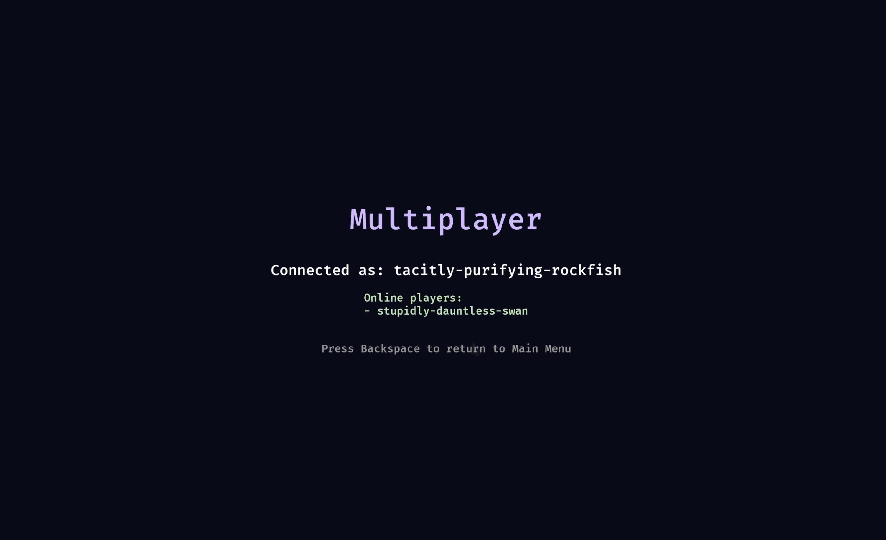

# 第十二章：让联网实现




2026年4月21日

**关于AI辅助**
*是的，本章写作过程中使用了AI辅助。我负责结构设计、技术决策、代码组织方式，并整理了学习者可能遇到的问题列表。AI帮助扩展了结构和解释内容，我全程进行了编辑。每章我大约花费20-25小时进行编码和写作。如果任何部分感觉不妥，请在[Reddit](https://www.reddit.com/r/bevy/)或[Discord](https://discord.com/invite/cD9qEsSjUH)上告诉我，我会进行改进。*

**先决条件**：这是我们的Bevy教程系列的第12章。[加入我们的社区](https://discord.com/invite/cD9qEsSjUH)获取新版本更新。开始之前，请先完成[第11章：让声音降临](https://febinjohnjames.gumroad.com/l/the-impatient-programmers-guide-to-bevy-and-rust)，或从[此仓库](https://github.com/jamesfebin/ImpatientProgrammerBevyRust)克隆第12章的起始代码以便跟随学习。

**开始之前：** *我一直在努力改进本教程，让您的学习之旅更加愉快。您的反馈很重要——请在[Reddit](https://www.reddit.com/r/bevy/)/[Discord](https://discord.com/invite/cD9qEsSjUH)/[LinkedIn](https://www.linkedin.com/in/febinjohnjames)上分享您的困惑、问题或建议。喜欢它？请告诉我哪些地方对您有帮助！让我们一起让Rust和Bevy的游戏开发对每个人都更加友好。*

## 用系统思维看待多人游戏

那时我12岁，也许是13岁。我和弟弟想一起玩《帝国时代》。我花了一整个下午跟调制解调器设置、局域网线缆、各种莫名其妙的配置文件搏斗。然后，他的电脑出现在了多人游戏画面上。我至今记得那种感觉。现在，是时候用代码来实现它了。

在第1章中，我们问过：*"我们需要什么来构建一个让玩家能够移动的游戏？"* 我们将其分解为两个系统——设置系统和更新系统——然后Bevy突然变得合理了。

让我们对多人游戏做同样的事情。忽略服务器、数据库、WebSocket。从玩家的体验出发，问一问：这需要哪些系统？

以下是我们想要构建的，假设每个玩家都连接到同一个共享游戏世界：

| 行为 | 结果 |
| --- | --- |
| John启动游戏 | John出现在共享世界中，显示他的名字 |
| Sara启动游戏 | Sara出现在同一个世界中；John可以看到Sara |
| Sara向左走 | John实时看到Sara向左移动 |
| Sara关闭游戏 | Sara从John的屏幕上消失 |
| Sara重新启动游戏 | Sara以相同名字出现在她最后的位置 |

够简单了。现在让我们思考一下，要实现这一切，实际需要哪些系统。

### 系统1：玩家识别（身份与认证）

当John启动游戏时，服务器需要知道：*这是一个新玩家还是老玩家？*

在Web应用中，你需要构建登录页面、哈希密码、签发JWT令牌、管理会话。在编写任何游戏逻辑之前，这已经是数周的工作。

对于我们的游戏，我们想要更简单的东西：第一次启动时，你获得一个唯一ID。之后每次，你都自动以相同ID回来。无需登录，无需注册。

标准做法：一个令牌。服务器在第一次连接时生成的唯一字符串，就像递给你一把钥匙。你的游戏将其保存到磁盘。之后每次启动，你出现，出示令牌，服务器就说"啊，是John"，没有密码，没有邮箱，没有账户。


自己构建这个意味着要写三个独立的东西：一个分发令牌的服务器，一个将令牌保存到磁盘的客户端，以及一个在每次连接时检查令牌的守卫。还要处理边缘情况，比如令牌过期、重新安装导致存档文件被清除。

### 系统2：存储玩家状态（持久化）

当John连接时，我们保存他的名字和位置，这样明天他可以从离开的地方继续。

在传统设置中，保存一条玩家记录需要四个独立的部分协同工作：


**Bevy游戏**发送HTTP请求到**Actix Web服务器**。服务器将数据传递给**ORM**，然后写入**PostgreSQL**。响应沿相同路径返回。

需要设置、保持同步和调试四个部分。数据库、ORM、服务器，全部连接在一起，每次模式变更都会影响全部。

### 系统3：实时更新（状态同步）

Sara移动了，John的屏幕如何更新？

你可以轮询：John每秒问服务器30次"大家都在哪里？"。慢、昂贵、且不可扩展。

正确的方式是基于推送的：服务器在Sara移动的那一刻告诉John。但在传统设置中，你需要自己构建那个架构：


困难之处在于，你的游戏代码和网络代码最终成为两个必须保持同步的独立部分。每次你添加新内容——一扇可开的门，一个可捡起的物品——你都必须更新两者。一次更新遗漏，你就会调试数小时。

### 系统4：游戏逻辑验证（服务器权威）

谁来决定移动是否有效？如果由玩家的计算机决定，作弊者只需编辑内存就能瞬移。或者直接向你的服务器发送伪造消息。客户端不可信任。由服务器来决定。

在传统设置中，这意味着要为每个动作编写检查。移动？检查目标是否可达。捡起物品？检查它是否确实在那里。每新增一个机制，就要新增一个检查。如果中途任何一步失败，你还需要代码来撤销部分变更。


### SpacetimeDB

总结一下，以下是需要从头构建的所有内容：

| 系统 | 功能 |
| --- | --- |
| 身份 | 认证服务器、令牌生成、客户端存储、中间件 |
| 持久化 | PostgreSQL、迁移、ORM配置、连接池 |
| 实时 | WebSocket服务器、连接池、广播逻辑 |
| 验证 | 端点验证器、回滚逻辑、一致性规则 |

而这些系统没有一个是独立存在的。你的WebSocket服务器需要与数据库通信。你的移动检查需要在任何数据保存之前运行。你的令牌系统需要在上述任何事情发生之前验证说话者的身份。每个系统相互接触的地方，都是可能静默出问题的地方。

所有这些发生在两个玩家在屏幕上看到彼此移动之前。

工作量巨大。

*但如果你不需要构建其中的任何部分呢？*

如果有一个东西能处理所有事情——数据库、WebSocket服务器、认证、游戏逻辑——呢？

这个东西就是 **SpacetimeDB**。

不再需要四个独立的系统拼接在一起，你只需编写一个在*数据库引擎内部*运行的Rust模块。该模块将你的数据定义为Rust结构体（表），将你的逻辑定义为Rust函数（reducers）。SpacetimeDB处理其他所有事情：

- **身份**：SpacetimeDB内置了认证。每个玩家在连接的那一刻就获得一个永久ID，无需登录系统、无需令牌管理、无需构建认证服务器。
- **持久化**：用`#[spacetimedb::table]`标记一个Rust结构体，它就变成了数据库表。无需安装PostgreSQL，无需配置ORM，无需手动数据连接。
- **实时**：将表标记为`public`，SpacetimeDB会自动将行级变更推送给每个订阅的客户端。无需编写WebSocket代码。
- **验证**：reducers作为原子事务运行。如果你的逻辑返回错误，整个事务将回滚，有保障。

曾经需要四个独立系统来构建、部署和维护的内容，现在都装进了一个Rust模块——一个要写的东西，一个要发布的东西，一个在出错时查看的地方。现在让我们来设置它。

## 安装SpacetimeDB

让我们设置工具。SpacetimeDB的CLI处理所有事情：创建模块、构建、本地运行、部署。

### 安装CLI

在macOS和Linux上：

```
curl -sSf https://install.spacetimedb.com | sh
```

在其他平台上，请遵循[官方安装指南](https://spacetimedb.com/install)。

验证是否安装正确：

```
spacetime version list
```

### 升级到v2

SpacetimeDB正在积极开发中。本章需要 **v2.1.0或更新版本**。检查你默认运行的版本，如果你在v1.x上，安装并切换到v2：

```
# 安装v2.1.0
spacetime version install 2.1.0

# 设置为默认版本
spacetime version use 2.1.0

# 确认
spacetime version list
# 应该显示: 2.1.0 (current)
```

### 升级Rust

SpacetimeDB v2.0需要Rust **1.93.0或更新版本**。检查你的版本并按需更新：

```
rustc --version
rustup update stable
```

### 启动本地服务器

打开一个新的终端窗口并启动本地SpacetimeDB实例。在工作时保持其运行：

```
spacetime start
```

这会在`http://127.0.0.1:3000`提供一个本地服务器。就像你在开发时可能会运行本地Postgres数据库一样，只不过SpacetimeDB同时也是一个WebSocket服务器。

## 创建服务器模块

我们游戏的服务器端代码存在于与Bevy游戏并行的`server/`目录中。这是一个独立的Rust crate，编译为WebAssembly并上传到SpacetimeDB。

从你的`chapter12/`项目根目录创建目录：

```
mkdir -p server/src
```

创建`server/Cargo.toml`：

```
[package]
name = "bevy-game-server"
version = "0.1.0"
edition = "2024"

[lib]
crate-type = ["cdylib"]

[dependencies]
spacetimedb = "2.0"
log = "0.4"
petname = { version = "2.0", default-features = false, features = ["default-words"] }
getrandom = { version = "0.2", features = ["custom"] }
```

让我们逐一分析这里的每个决定。

`crate-type = ["cdylib"]` 告诉Cargo生成一个SpacetimeDB可以作为WASM二进制文件加载的库。

`spacetimedb = "2.0"` 是SDK。它提供了表和reducers，这是你在本章中将会使用的两个核心概念。

`petname` 生成可读的随机名称，如`"brave-purple-fox"`，用于自动分配用户名。我们禁用默认功能，只引入`default-words`，因为petname的默认RNG在WASM中无法工作。

`getrandom = { version = "0.2", features = ["custom"] }` 这修复了一个构建问题。Petname内部使用了getrandom，它通常向操作系统请求随机种子，但在WASM内部没有操作系统。`custom`功能使其转而使用SpacetimeDB自己的RNG。在你的`Cargo.toml`中声明此项会强制整个构建使用该版本。没有这一行，编译会失败。

### SpacetimeDB的构建块

你在本章中将使用的两个概念是 **表（tables）** 和 **reducers**。

**表** 是一个带有`#[spacetimedb::table]`标记的Rust结构体。SpacetimeDB会为你创建和管理实际的存储，无需`CREATE TABLE`，无需SQL。结构体的字段成为列。以下是我们稍后将定义的`Player`表：

```
// 伪代码，请勿使用
#[spacetimedb::table(accessor = player, public)]
pub struct Player {
    #[primary_key]
    identity: Identity,
    #[unique]
    username: String,
    position_x: f32,
    position_y: f32,
    is_online: bool,
}
```

读取一行看起来像`ctx.db.player().identity().find(sender)`。写入一行看起来像`ctx.db.player().insert(...)`。`public`标志意味着订阅的客户端会实时收到该表的每次变更。

Reducer是一个用`#[spacetimedb::reducer]`标记的Rust函数。当客户端调用它时，它作为全有或全无的事务在服务器上运行——要么全部成功并保存，要么失败且不写入任何内容。这是最简单的例子：

```
// 伪代码，请勿使用
#[spacetimedb::reducer(init)]
pub fn init(_ctx: &ReducerContext) {
    log::info!("Server module initialized");
}
```

为了理解全有或全无为什么重要，想象一个进行两次数据库变更而第二次失败的reducer。考虑这个`pick_up_item` reducer：

```
// 伪代码，请勿使用
#[spacetimedb::reducer]
pub fn pick_up_item(ctx: &ReducerContext, item_id: u64) -> Result<(), String> {
    // 第1步：从世界中移除物品
    ctx.db.world_item().id().delete(item_id);

    // 第2步：检查玩家背包是否有空间
    let player = ctx.db.player().identity().find(ctx.sender())
        .ok_or("Player not found")?;

    if player.inventory_count >= 10 {
        // 背包已满 — 返回错误。
        // SpacetimeDB自动回滚第1步：
        // 物品重新出现在世界中，就像什么都没发生过。
        return Err("Inventory is full".to_string());
    }

    // 第3步：将物品添加到玩家背包
    ctx.db.inventory().insert(InventoryItem { owner: ctx.sender(), item_id });

    Ok(())
}
```

首先我们从世界中删除了物品。然而，如果后来发现背包已满，SpacetimeDB会撤销初始的删除操作，物品重新出现，就像从未被碰过一样。你无需为失败情况编写清理代码；原子事务保证了这一点。

### 定义Player表

现在让我们实际构建模块。它需要处理以下情况：

| 事件 | 操作 |
| --- | --- |
| John第一次连接 | 我们为他创建一条记录，生成名字，分配位置，标记为在线 |
| John再次连接 | 我们找到他的现有记录并标记为在线，名字和位置与他离开时完全相同 |
| John断开连接 | 我们标记他为离线 |
| John想要自定义名字 | 我们调用一个reducer；服务器验证并更新他的名字 |

一切都通过一个`Player`表和几个reducers来完成。让我们先定义表。

创建`server/src/lib.rs`并从表定义开始：

```
// server/src/lib.rs
use petname::Generator;
use spacetimedb::{Identity, ReducerContext, Table};

// 地图尺寸：241瓦片 × 169瓦片 × 64px每瓦片
const SPAWN_X: f32 = 7712.0; // 世界中心
const SPAWN_Y: f32 = 5408.0;

#[spacetimedb::table(accessor = player, public)]
pub struct Player {
    #[primary_key]
    identity: Identity,
    #[unique]
    username: String,
    position_x: f32,
    position_y: f32,
    is_online: bool,
}
```

`#[spacetimedb::table(accessor = player, public)]`

这个宏将`Player`结构体转换为一个**数据库表**。SpacetimeDB会创建一个具有这些确切列的持久化表。结构体中的每个字段都成为一列。

`accessor = player`参数为表指定了一个名称。在reducers内部，你可以通过`ctx.db.player()`来访问它，这有助于查询和修改此表。

`public`标志意味着客户端被允许**订阅**此表。当客户端订阅时（我们将在下一章实现），SpacetimeDB会立即可将每一行推送给它们，然后实时推送未来的任何变更。没有`public`，只有服务器端的reducer代码才能看到数据。

`#[primary_key] identity: Identity`

`Identity`是SpacetimeDB的内置类型，一个256位的唯一标识符，由服务器自动分配给每个客户端连接。它在会话间持久存在：从同一设备连接的同一玩家将始终拥有相同的`Identity`。

**那么Identity是基于用户设备的吗？**

不完全是设备，而是设备上的令牌文件。当客户端第一次连接时，SpacetimeDB的SDK会生成一个加密密钥并将其作为令牌文件保存到磁盘。Identity是从该密钥派生而来的。只要该令牌文件在同一台机器上存在，每次未来的连接都会产生相同的Identity。

如果John删除了令牌文件、重新安装了游戏、或从不同计算机连接，SpacetimeDB会看到一个新令牌并创建一个新的Identity。

`#[unique] username: String` — `#[unique]`属性告诉SpacetimeDB在此字段上创建索引，并强制没有两行共享相同的值。它还会生成一个`.username()`访问器，因此你可以直接用`ctx.db.player().username().find(&name)`按名称查找玩家——这是一种快速的索引查找，而不是全表扫描。

`position_x`和`position_y`将存储玩家在世界中站立的位置。我们将其初始化为地图中心（`SPAWN_X`，`SPAWN_Y`），这是根据我们的世界尺寸计算得出的：241瓦片 × 64像素宽，169瓦片 × 64像素高。

`is_online`跟踪玩家当前是否已连接。这是我们区分"此玩家存在但已离开"和"此玩家正在活跃游戏中"的方式。

### 生成人类可读的用户名

在编写reducers之前，让我们先构建用户名生成器。理想情况下，玩家会自己输入名字，但这需要在游戏开始之前设置名称输入界面、输入处理和表单提交。通过在首次连接时自动生成名字，我们可以保持简单。

```
// server/src/lib.rs (续)

fn generate_username(ctx: &ReducerContext) -> String {
    let mut rng = ctx.rng();
    let petnames = petname::Petnames::default();
    petnames
        .generate(&mut rng, 3, "-")
        .unwrap_or_else(|| format!("player-{}", ctx.timestamp.to_micros_since_unix_epoch()))
}
```

普通的随机数生成器每次运行时会产生不同的结果。但SpacetimeDB要求reducers是*确定性的*：给定相同的输入，它们必须始终产生相同的结果。这使得SpacetimeDB能够安全地重放或审计事务。

`ctx.rng()`满足这一要求。它从事务的时间戳中播种，因此对于给定的事务它产生相同的序列，但对于不同的事务产生不同的序列。我们将`&mut rng`与`3`（三个词）和`"-"`作为分隔符一起传递给`petnames.generate()`。结果是一个像`"brave-purple-fox"`或`"calm-dancing-hawk"`这样的名字。

**那么如果相同的输入产生相同的结果，岂不是所有玩家都会得到相同的名字？**

不会，每个连接都是一个具有不同时间戳的独立事务。"相同输入"指的是同一个事务，而不是所有事务。两个在不同时刻连接的玩家具有不同的时间戳，获得不同的RNG种子，因此获得不同的名字。确定性保证是针对每个事务的，而不是跨事务的。

SpacetimeDB还按顺序处理事务，每个事务完成之后下一个才开始。因此，即使两个玩家在完全相同的瞬间连接，他们也会被排队并依次执行，每个都按顺序接收一个不同的时间戳。没有两个事务会共享相同的时间戳。

你还会注意到导入中增加了`use petname::Generator;`。`generate()`方法位于`Generator`*trait*上，而不是直接在`Petnames`结构体上。在Rust中，trait必须在作用域内才能调用其方法。没有这个导入，即使方法就在那里实现了，编译器也会告诉你方法不存在。

## 编写Reducers

现在进入我们服务器模块的核心——reducers。

**等等，为什么它们被称为reducers？**

这个名称来自函数式编程。"reduce"操作接受一些现有状态和一个输入，并产生新状态。Redux，这个流行的JavaScript状态管理库，使这种模式成为主流：reducer是一个形式为`(currentState, action) => newState`的函数。

SpacetimeDB使用了相同的理念。Reducer接受数据库的当前状态和一个传入的动作（来自客户端的调用），并产生一个新的数据库状态。关键特性是，给定相同的起始状态和相同的输入，reducer总是产生相同的结果。这种确定性使其作为事务运行是安全的：SpacetimeDB可以应用它、回滚它或重放它，结果始终是可预测的。

现在回到编写reducers。我们需要四个。

### 模块启动

SpacetimeDB调用的第一个reducer是`init`。它只运行一次，在你首次发布模块时。把它看作一个设置钩子：在玩家开始连接之前运行一次性初始化的地方。在后面的章节中，我们将在这里用生成点或地图配置来初始化世界。现在，我们只记录它已运行，以便确认发布成功。

```
// server/src/lib.rs (续)

#[spacetimedb::reducer(init)]
pub fn init(_ctx: &ReducerContext) {
    log::info!("Server module initialized");
}
```

### 客户端连接

每次客户端打开连接时，无论是John第一次连接还是离开一周后回来，SpacetimeDB都会自动调用`client_connected` reducer。我们自己不调用它；SpacetimeDB在连接建立的那一刻就会触发它，在客户端接收任何数据之前。

这个reducer有两个任务，取决于谁在连接：

- **首次玩家**：创建一条新记录，使用生成的名字，并将他们放置在世界出生点。
- **回归玩家**：找到他们现有的记录并标记为在线，他们上一会话的名字和最后位置已经保存。

```
// server/src/lib.rs (续)

#[spacetimedb::reducer(client_connected)]
pub fn identity_connected(ctx: &ReducerContext) {
    let sender = ctx.sender();
    if let Some(player) = ctx.db.player().identity().find(sender) {
        // 回归玩家 — 标记为在线
        log::info!("Player '{}' reconnected", player.username);
        ctx.db.player().identity().update(Player {
            is_online: true,
            ..player
        });
    } else {
        // 新玩家 — 创建记录
        let username = generate_username(ctx);
        log::info!("New player '{}' joined", username);
        ctx.db.player().insert(Player {
            identity: sender,
            username,
            position_x: SPAWN_X,
            position_y: SPAWN_Y,
            is_online: true,
        });
    }
}
```

`ctx.sender()`给了我们刚刚连接者的Identity。然后我们调用`.identity().find(sender)`来查找`Player`表中的现有行。

**如果找到一行**，说明John之前连接过，我们只需将`is_online`更新为`true`。`..player`语法是Rust的结构体更新简写：意思是"复制`player`中所有未在此列出的字段保持不变。"因此John的用户名、位置和其他所有内容都保持原样。

**如果没有找到行**，说明John是新玩家，我们调用`generate_username(ctx)`来生成一个随机名字，并在世界出生坐标（`SPAWN_X`、`SPAWN_Y`）处插入一个全新的行。

### 客户端断开连接

当连接关闭时，无论是John退出游戏、失去网络连接还是游戏崩溃，SpacetimeDB都会自动调用`client_disconnected` reducer。

目标很简单：找到John的记录并标记为离线。我们不删除该行。这是有意为之——他的位置会保存在数据库中，这样下次他连接时，会从他离开的地方重新出现。

```
// server/src/lib.rs (续)

#[spacetimedb::reducer(client_disconnected)]
pub fn identity_disconnected(ctx: &ReducerContext) {
    let sender = ctx.sender();
    if let Some(player) = ctx.db.player().identity().find(sender) {
        log::info!("Player '{}' disconnected", player.username);
        ctx.db.player().identity().update(Player {
            is_online: false,
            ..player
        });
    } else {
        log::warn!("Disconnect for unknown identity: {:?}", sender);
    }
}
```

我们用`ctx.sender()`查找断开连接的玩家的行。如果找到，将`is_online`翻转为`false`，和之前一样使用`..player`结构体更新模式，复制其他所有未变字段。

`else`分支处理一个没有对应记录的Identity的断开连接。在正常操作中不应该发生这种情况——每次断开连接都应在连接之后——但网络边缘情况确实存在。与其让服务器崩溃，我们记录一个警告并继续。可以安全地忽略它，但如果发生了意外情况，日志中会可见。

### 选择自定义名称

上述三个reducer都是生命周期reducer，由SpacetimeDB自动调用。`register_player`则不同：它是一个常规reducer，由客户端有意调用。现在它也很有用，可以作为手动测试代码是否正常工作的方式——我们可以从CLI调用它，然后检查数据库以确认变更已生效。

```
// server/src/lib.rs (续)

#[spacetimedb::reducer]
pub fn register_player(ctx: &ReducerContext, username: String) -> Result<(), String> {
    if username.is_empty() {
        return Err("Username must not be empty".to_string());
    }
    if username.len() > 32 {
        return Err("Username must be 32 characters or less".to_string());
    }

    let sender = ctx.sender();

    // 检查该用户名是否已被其他玩家占用
    if ctx.db.player().username().find(&username)
        .is_some_and(|p| p.identity != sender)
    {
        return Err(format!("'{}' is already taken", username));
    }

    if let Some(player) = ctx.db.player().identity().find(sender) {
        log::info!("Player '{}' renamed to '{}'", player.username, username);
        ctx.db.player().identity().update(Player {
            username,
            ..player
        });
        Ok(())
    } else {
        Err("Cannot rename: player not found. Connect first.".to_string())
    }
}
```

该函数在写入任何内容之前进行三项检查。首先，基本验证：名称不能为空或超过32个字符。其次，唯一性：`ctx.db.player().username().find(&username)`使用`#[unique]`创建的索引查找任何具有该名称的现有行，这是一种直接查找而非扫描每一行。`.is_some_and(|p| p.identity != sender)`检查仅在名称被*不同*玩家占用时返回`true`，因此玩家可以重新提交自己的当前名称而不会出错。如果名称已被占用，我们返回`Err`且不写入任何内容。

如果所有检查都通过，我们用`ctx.sender()`找到调用者的记录，更新`username`字段，并返回`Ok(())`。`log::info!`记录了旧名称和新名称，这在阅读服务器日志时很有用。

## 构建模块

我们不使用`cargo build`来构建SpacetimeDB模块。我们使用`spacetime build`，它会编译为`wasm32-unknown-unknown`（WebAssembly目标）并正确打包结果。

从`server/`目录内：

```
cd server
spacetime build
```

你应该看到Cargo编译所有依赖项，然后显示：

```
Build finished successfully.
```

*你可能还会看到关于找不到`wasm-opt`的警告。这是一个可选优化器，可以缩小编译后的WASM文件以加快上传速度。你可以在开发时安全地忽略它，或者用`brew install binaryen`安装它来消除这个警告。*

### 发布到本地服务器

确保`spacetime start`仍在它的终端中运行，然后发布模块：

```
spacetime publish --server http://127.0.0.1:3000 bevy-game
```

你应该看到：

```
Build finished successfully.
Uploading to http://127.0.0.1:3000 ...
Publishing module...
Updated database bevy-game
```

模块现在正在你的本地SpacetimeDB实例中运行。

### 查看日志

打开另一个终端并查看服务器日志：

```
spacetime logs --server http://127.0.0.1:3000 bevy-game -f
```

你应该看到`Server module initialized`——这是你的`init` reducer确认它已运行。

### 用SQL测试

SpacetimeDB支持直接对你的表进行SQL查询。让我们验证模式是否正确创建：

```
spacetime sql --server http://127.0.0.1:3000 bevy-game "SELECT * FROM player"
```

你会看到一个带有列标题的空表——这完全正确！

```
 identity | username | position_x | position_y | is_online
----------+----------+------------+------------+-----------
```

表是空的，因为`Player`行只有在客户端**连接**时才会创建。还没有客户端连接过，我们的Bevy游戏还没有连接代码。但模式已经存在且正确。

### 从CLI测试Reducers

我们不需要构建Bevy客户端来测试我们的reducers。`spacetime call`命令让我们可以直接从终端调用任何reducer，这对于隔离验证你的服务器逻辑非常有用。

```
# 这样可行
spacetime call --server http://127.0.0.1:3000 bevy-game register_player '"TestPlayer"'
```

当你运行`spacetime call`时，幕后会发生一些有趣的事情。CLI不仅仅是孤立地触发reducer，它会使用自己的身份打开一个到SpacetimeDB的真实WebSocket连接。这意味着我们的`identity_connected`生命周期reducer首先触发，创建一个带有生成名称的新玩家行。然后`register_player`运行，找到该行，并将其重命名为`"TestPlayer"`。最后，CLI连接关闭，`identity_disconnected`触发，将`is_online`设置为`false`。

你可以通过立即查询表来看到所有这些：

```
spacetime sql --server http://127.0.0.1:3000 bevy-game "SELECT * FROM player"
```

```
 identity | username     | position_x | position_y | is_online
----------+--------------+------------+------------+-----------
 0x.....  | "TestPlayer" | 7712       | 5408       | false
```

有三点值得注意：

- **`identity`** 是一个长的十六进制值，这是CLI正在使用的256位Identity。与会话cookie不同，此身份持久存储在你机器的CLI配置中。你从此机器发出的每次`spacetime call`都重用相同的令牌，因此也重用相同的身份。
- **`position_x`和`position_y`** 是`7712`和`5408`，正是我们的`SPAWN_X`和`SPAWN_Y`常量。`identity_connected`自动将玩家放置在了世界中心。
- **`is_online`是`false`**，CLI连接在reducer返回后立即关闭，因此`identity_disconnected`触发并将玩家标记为离线。这是正确的行为。当我们的Bevy客户端连接并保持打开时，此字段在整个会话期间都将为`true`。

**为什么再次调用`register_player`会更新同一行而不是创建新玩家？**

因为CLI的行为与你的游戏客户端完全相同。它在你机器上存储了一个令牌文件。每次`spacetime call`都重用那个令牌 → 相同的Identity → `identity_connected`找到你现有的行并标记为在线，而不是创建新行。你在这台机器上始终是同一个玩家。

这正是预期的行为。当John在他的电脑上安装游戏而Sara在她的电脑上安装时，他们各自拥有不同的令牌文件、不同的身份和不同的行。CLI完全反映了这一点。

**要从终端模拟第二个玩家**，获取一个新的服务器颁发的身份：

```
# 首先保存当前令牌以便之后恢复
spacetime login show --token

# 注销，然后从本地服务器获取新身份
spacetime logout
spacetime login --server-issued-login http://127.0.0.1:3000
```

现在下一次`spacetime call`将使用全新的身份连接——`identity_connected`找不到现有行并插入一个新玩家。运行SQL查询，你会看到两行。

要恢复你原来的身份：

```
spacetime login --token <your-original-token>
```

以下是我们将要实现的内容：点击主菜单上的**Multiplayer**会将游戏连接到本地SpacetimeDB服务器，显示实时连接状态屏幕，并使用保存的令牌在每次后续重连时识别同一玩家。我们将保持单人游戏不变。

## 连接Bevy客户端

服务器已经准备好了。现在让我们把游戏连接上去。

在这个架构中，我们的Bevy游戏是**客户端**，即在玩家机器上运行的程序。它的工作是显示游戏世界、响应玩家输入并与服务器通信。它不对什么是有效的或什么需要保存做出决定；它只是发送请求并对服务器返回的内容做出反应。

到目前为止我们构建的所有内容——地图、角色、战斗——都完全在玩家的机器上运行。在单人游戏中，这就是它需要做的全部。在多人游戏中，客户端还需要与服务器保持同步：其他玩家的位置、谁在线、你离开时发生了什么变化。

现在，我们添加那层连接层。它只在玩家点击**Multiplayer**时激活，单人游戏完全不受影响。

`spacetimedb-sdk`是Rust客户端库。它处理WebSocket连接、认证、消息解析以及订阅表行的客户端缓存。我们不需要自己构建任何这些功能。

打开你的`chapter_12/`根目录中的`Cargo.toml`并添加一行：

```
[dependencies]
bevy = { version = "0.18", features = ["mp3", "wav"] }
bevy_procedural_tilemaps = "0.3"
# ... 其他依赖 ...
spacetimedb-sdk = "2.1.0"   # ← 添加这一行
```

### 生成客户端绑定

如果你用过GraphQL，这会感觉很熟悉。GraphQL模式描述了你的服务器暴露什么数据，而Apollo或codegen等工具会从中生成类型化的客户端代码，因此你的前端可以获得自动补全和编译器错误，而不是手写的fetch调用。

绑定在这里的工作方式相同：SpacetimeDB CLI读取你编译的服务器模块，并为你的游戏客户端生成类型化的Rust代码——类似于`conn.db.player()`和`ctx.db.player().identity().find(...)`的方法，它们直接映射到你定义的表和reducers。更改你的服务器模式并重新生成，客户端代码会随之更新。

从`server/`目录内运行此命令：

确保将`{ADD_FULL_PATH_TO_CHAPTER12}`替换为你的`chapter12`文件夹路径

```
cd server
spacetime generate --lang rust \
  --out-dir {ADD_FULL_PATH_TO_CHAPTER12}/src/module_bindings \
  --module-path .
```

你会看到：

```
Writing file src/module_bindings/player_table.rs
Writing file src/module_bindings/player_type.rs
Writing file src/module_bindings/register_player_reducer.rs
Writing file src/module_bindings/mod.rs
Generate finished successfully.
```

这些文件是生成的代码，不要手动编辑它们。任何时候你更改了服务器模式（添加字段、重命名reducer、添加新表），重新运行`spacetime generate`，它们就会被自动重新生成。

#### 跟踪游戏模式

`GameMode`帮助我们跟踪用户选择的是单人游戏还是多人游戏。

将其添加到`src/state/game_state.rs`中，紧接在`GameState`枚举下方：

```
// src/state/game_state.rs

use bevy::prelude::*;

#[derive(States, Default, Debug, Clone, Copy, PartialEq, Eq, Hash)]
pub enum GameState {
    #[default]
    MainMenu,
    Loading,
    Playing,
    Paused,
    GameOver,
}

// ↓ 添加这些
#[derive(Resource, Debug, Clone, PartialEq, Eq)]
pub enum GameMode {
    SinglePlayer,
    Multiplayer,
}

pub fn in_multiplayer(mode: Option<Res<GameMode>>) -> bool {
    mode.is_some_and(|m| *m == GameMode::Multiplayer)
}
```

`GameMode`是一个用`#[derive(Resource)]`装饰的普通Rust枚举。这就是Bevy将其视为全局资源所需的全部——不是组件，不是实体，只是一个附加到世界的值。

`in_multiplayer`是一个**运行条件**，一个Bevy在运行系统之前评估的函数。如果返回`false`，系统被完全跳过。我们在此处的状态模块（而不是网络模块）中定义它，以便`main.rs`和加载屏幕也可以使用它来门控非网络系统（如地图生成）。

#### 更新主菜单

现在我们将`GameMode`连接到按钮。对`src/state/main_menu.rs`进行三项更改：

导入`GameMode`：

```
use super::{GameState, GameMode};  // 之前: use super::GameState;
```

将`Multiplayer`变体添加到按钮枚举：

```
#[derive(Component)]
pub enum MainMenuButton {
    NewGame,
    LoadGame,
    Multiplayer,  // ← 添加这一项
    Quit,
}
```

将按钮添加到列表并处理新的点击：

```
let buttons = [
    (MainMenuButton::NewGame, "New Game"),
    (MainMenuButton::LoadGame, "Load Game"),
    (MainMenuButton::Multiplayer, "Multiplayer"),  // ← 添加这一项
    (MainMenuButton::Quit, "Quit"),
];
```

在按钮处理程序中，更新`match`以为每个相关按钮设置模式：

```
match button {
    MainMenuButton::NewGame => {
        commands.insert_resource(GameMode::SinglePlayer);  // ← 添加这一行
        next_state.set(GameState::Loading);
    }
    MainMenuButton::LoadGame => {
        ui_state.active = true;
        ui_state.mode = SaveLoadMode::Load;
    }
    MainMenuButton::Multiplayer => {                        // ← 添加这个分支
        commands.insert_resource(GameMode::Multiplayer);
        next_state.set(GameState::Loading);
    }
    MainMenuButton::Quit => {
        exit.write(AppExit::Success);
    }
}
```

#### 在StatePlugin中初始化GameMode

我们设置一个默认值，以便`GameMode`始终存在于世界中，即使在按下任何按钮之前。

在`src/state/mod.rs`中，添加三行：

```
pub use game_state::GameState;
pub use game_state::GameMode;        // ← 重新导出，以便其他模块可以使用它
pub use game_state::in_multiplayer;  // ← 重新导出运行条件

impl Plugin for StatePlugin {
    fn build(&self, app: &mut App) {
        app
            .insert_resource(GameMode::SinglePlayer)  // ← 添加默认值
            .init_state::<GameState>()
            // 门控加载屏幕：多人游戏显示自己的连接屏幕
            .add_systems(OnEnter(GameState::Loading),
                // 更新下面这一行
                loading::spawn_loading_screen.run_if(not(in_multiplayer)))
            // ... 其余部分不变
    }
}
```

我们将加载屏幕门控在`not(in_multiplayer)`后面。当玩家点击Multiplayer时，我们显示自己的连接状态屏幕，而不是单人游戏的地图加载过程。

### 创建NetworkPlugin

所有部件都已就位：SDK已安装、绑定已生成、模式已跟踪、菜单已设置。现在我们需要实现基本的网络功能。

我们将创建`NetworkPlugin`，它拥有所有与网络相关的内容：打开连接、每帧处理传入消息、显示连接状态屏幕以及在玩家离开时进行清理。

我们将其分为两个文件：`mod.rs`用于插件定义，`connection.rs`用于其他所有内容。

在`src`目录内创建`network`文件夹，以及`src/network/mod.rs`：

```
// src/network/mod.rs

mod connection;

use bevy::prelude::*;

use crate::module_bindings::DbConnection;
use crate::state::{in_multiplayer, GameState};

use connection::{
    cleanup_network, connect_to_spacetimedb, despawn_multiplayer_screen,
    handle_multiplayer_back, process_spacetimedb_messages, spawn_multiplayer_screen,
    update_multiplayer_screen,
};

#[derive(Resource)]
pub struct SpacetimeConnection {
    pub conn: DbConnection,
}

pub struct NetworkPlugin;

impl Plugin for NetworkPlugin {
    fn build(&self, app: &mut App) {
        app.add_systems(
            OnEnter(GameState::Loading),
            (connect_to_spacetimedb, spawn_multiplayer_screen).run_if(in_multiplayer),
        )
        .add_systems(
            Update,
            (
                process_spacetimedb_messages
                    .run_if(resource_exists::<SpacetimeConnection>),
                update_multiplayer_screen.run_if(in_state(GameState::Loading)),
                handle_multiplayer_back.run_if(in_state(GameState::Loading)),
            )
            .run_if(in_multiplayer),
        )
        .add_systems(
            OnExit(GameState::Loading),
            despawn_multiplayer_screen,
        )
        .add_systems(
            OnEnter(GameState::MainMenu),
            cleanup_network.run_if(resource_exists::<SpacetimeConnection>),
        );
    }
}
```

`.run_if(...)`条件确保系统只在需要时运行。`in_multiplayer`是顶级的门控——在单人游戏中，这些系统完全不会运行。

当状态进入loading时，我们初始化和spacetimedb服务器的连接并生成多人游戏屏幕。

之后，如果连接成功，我们处理来自服务器的消息。我们还使用状态更新多人游戏屏幕，并允许用户返回主菜单。

现在让我们实现这个。创建`src/network/connection.rs`：

这包含五个微型系统：打开连接、每帧处理传入消息、显示状态屏幕、更新状态文本以及在玩家离开时清理。让我们逐个过一遍。

### 微型系统1：连接

`connect_to_spacetimedb`在多人游戏加载开始时运行一次。它的工作是：从磁盘加载已保存的身份、打开到服务器的WebSocket连接、注册连接事件的回调、订阅`Player`表，并将实时连接存储为Bevy资源，以便其他系统可以使用。

回调`on_connect`、`on_connect_error`、`on_disconnect`是你在构建时注册的闭包。当相应事件通过网络到达时，SDK会触发它们。

```
// src/network/connection.rs

use std::path::PathBuf;

use bevy::prelude::*;
use spacetimedb_sdk::{DbContext, Table};

use crate::module_bindings::player_table::{playerQueryTableAccess, PlayerTableAccess};
use crate::module_bindings::DbConnection;
use crate::state::{GameMode, GameState};
use super::SpacetimeConnection;

const SPACETIMEDB_URI: &str = "http://127.0.0.1:3000";
const DATABASE_NAME: &str = "bevy-game";
const TOKEN_FILENAME: &str = "spacetimedb_token";

fn token_path() -> Option<PathBuf> {
    let exe = std::env::current_exe().ok()?;
    Some(exe.parent()?.join(TOKEN_FILENAME))
}

fn load_token() -> Option<String> {
    let path = token_path()?;
    let contents = std::fs::read_to_string(&path).ok()?;
    let trimmed = contents.trim();
    if trimmed.is_empty() { None } else { Some(trimmed.to_string()) }
}

fn save_token(token: &str) -> std::io::Result<()> {
    let path = token_path().ok_or_else(|| {
        std::io::Error::new(std::io::ErrorKind::Other, "could not determine executable path")
    })?;
    std::fs::write(path, token)
}

pub fn connect_to_spacetimedb(mut commands: Commands) {
    let token = load_token();

    let conn = DbConnection::builder()
        .with_uri(SPACETIMEDB_URI)
        .with_database_name(DATABASE_NAME)
        .with_token(token)
        .on_connect(|ctx, _identity, token| {
            if let Err(e) = save_token(token) {
                error!("Failed to save SpacetimeDB token: {e}");
            }
            info!("Connected to SpacetimeDB");
            ctx.subscription_builder()
                .on_applied(|ctx| {
                    if let Some(identity) = ctx.try_identity() {
                        if let Some(player) = ctx.db.player().identity().find(&identity) {
                            info!("Playing as: {}", player.username);
                            return;
                        }
                    }
                    info!("Player subscription applied");
                })
                .on_error(|_ctx, err| {
                    error!("Subscription error: {err}");
                })
                .add_query(|q| q.from.player())
                .subscribe();
        })
        .on_connect_error(|_ctx, err| {
            error!("SpacetimeDB connection error: {err}");
        })
        .on_disconnect(|_ctx, err| {
            if let Some(e) = err {
                warn!("Disconnected from SpacetimeDB with error: {e}");
            } else {
                info!("Disconnected from SpacetimeDB");
            }
        })
        .build();

    match conn {
        Ok(conn) => {
            info!("SpacetimeDB connection initiated");
            commands.insert_resource(SpacetimeConnection { conn });
        }
        Err(e) => {
            error!("Failed to initiate SpacetimeDB connection: {e}");
        }
    }
}
```

注意来自生成的绑定的两个导入：`PlayerTableAccess`引入了用于查询客户端缓存的`.player()`方法；`playerQueryTableAccess`引入了用于构建订阅查询的`.player()`方法。两者都是需要的，两者都来自`spacetime generate`。我们还从SDK导入了`Table`，该trait提供了我们稍后将用于列出在线玩家的`.iter()`方法。

该系统在进入`GameState::Loading`时运行一次，但仅在多人游戏模式下。

`token_path()`使用`std::env::current_exe()`找到正在运行的可执行文件，并将令牌文件放置在其旁边——开发时为`target/debug/spacetimedb_token`，发布构建时在二进制文件旁边。`load_token()`读取并修剪该文件，在首次启动时返回`None`。`save_token()`写入原始令牌字符串。当令牌为`None`时，SpacetimeDB创建一个新身份；当为`Some`时，你以同一玩家身份重新连接。

**构建器。** `DbConnection::builder()`是一个流畅的API。我们链式调用：

- `.with_uri(...)` — 服务器地址
- `.with_database_name(...)` — 要连接的数据库（你在`spacetime publish`中使用的名称）
- `.with_token(token)` — 保存的身份（如果有）
- `.on_connect(...)` — WebSocket建立时触发的回调
- `.on_connect_error(...)` — 服务器不可达时的回调
- `.on_disconnect(...)` — 连接关闭时的回调

**在`on_connect`内部。** 我们做的第一件事是保存服务器刚刚颁发的令牌——这就是使同一身份在会话间持久化的原因。然后我们订阅`Player`表。`on_applied`回调在SpacetimeDB推送了所有初始行后触发，此时我们按身份查找玩家行并记录其用户名。

**`.build()`是非阻塞的。** 它立即返回`Ok(conn)`或`Err(...)`。连接在后台进行；回调在消息到达时触发。成功后，我们将`SpacetimeConnection`作为Bevy资源插入——这是向游戏其他部分发出存在活动连接的信号。

### 微型系统2：每帧处理消息

```
// src/network/connection.rs (续)

pub fn process_spacetimedb_messages(connection: Res<SpacetimeConnection>) {
    if let Err(e) = connection.conn.frame_tick() {
        error!("SpacetimeDB frame_tick error: {e}");
    }
}
```

`frame_tick()`处理自上次调用以来到达的所有WebSocket消息，并触发相应的回调。每帧调用一次，你的客户端就能与服务器上发生的所有事情保持同步。

当你第一次连接时，服务器运行`identity_connected`并插入一个新的`Player`行。该插入被封装为一条消息并通过WebSocket发送回来。下一次`frame_tick()`运行时，它会接收该消息并将新行写入**客户端缓存**——SDK自动维护的订阅表行的内存副本。一旦进入缓存，你就可以用`ctx.db.player().identity().find(...)`立即读取，无需网络往返。

未来的里程碑将添加更多消息：其他玩家位置的更新、聊天消息的到达、世界状态的同步。所有这些都是通过同一次调用处理的。

`resource_exists::<SpacetimeConnection>`保护着它：如果我们尚未连接或已经清理，系统会被跳过。

**但是`process_spacetimedb_messages`除了检查错误什么也没做，所以它并没有存储任何东西，对吗？**

看起来是这样，但存储发生在`frame_tick()`内部。当消息到达时——比如插入了一个新的`Player`行——SDK会处理它并自动将行写入客户端缓存。你不需要为此编写任何代码；它内置于SDK中。`frame_tick()`是让SDK完成其工作的触发器。`if let Err(e)`只是为了暴露任何问题。在未来的里程碑中，你还会注册行回调（`on_insert`、`on_update`），它们会在你需要对特定变更做出反应时（比如为新加入的玩家生成一个Bevy实体）在这个调用期间触发。

**为什么使用`frame_tick()`而不是在自己的线程上运行SDK？**

SDK提供了`run_threaded()`作为替代方案，它会生成一个后台线程自动处理消息。但回调会在那个线程上触发，而不是Bevy的主线程——这使得从回调内部访问Bevy资源或实体变得不安全。

`frame_tick()`将所有内容保持在主线程上。回调在本次调用期间触发，与其他所有内容在同一帧中。在未来的里程碑中，当玩家移动并且我们需要更新其Bevy transform组件时，回调将能够直接做到这一点。无需同步开销，无需`Arc<Mutex<...>>`包装。

### 微型系统3：多人游戏连接屏幕

在连接建立期间，我们显示一个全屏叠加层，包含三条信息：你是谁、正在以谁的身份连接、以及当前还有谁在线。

为了每帧独立更新这些信息，我们需要一种方法来找到特定的实体。这就是下面三个标记组件的作用——每个组件标记UI树中的一个节点，以便`update_multiplayer_screen`可以查询和更新它们而无接触其余部分：

- `MultiplayerScreen`标记根节点，以便在加载结束时可以通过一次查询销毁整个屏幕
- `ConnectionStatusText`标记显示你自身连接状态的行
- `OnlinePlayersText`标记列出当前在线的其他玩家的行

```
// src/network/connection.rs (续)

#[derive(Component)]
pub struct MultiplayerScreen;

#[derive(Component)]
pub struct ConnectionStatusText;

#[derive(Component)]
pub struct OnlinePlayersText;

pub fn spawn_multiplayer_screen(mut commands: Commands) {
    commands
        .spawn((
            MultiplayerScreen,
            Node {
                width: Val::Percent(100.0),
                height: Val::Percent(100.0),
                justify_content: JustifyContent::Center,
                align_items: AlignItems::Center,
                flex_direction: FlexDirection::Column,
                ..default()
            },
            BackgroundColor(Color::srgb(0.05, 0.05, 0.1)),
        ))
        .with_children(|parent| {
            parent.spawn((
                Text::new("Multiplayer"),
                TextFont { font_size: 48.0, ..default() },
                TextColor(Color::srgb(0.8, 0.7, 1.0)),
                Node { margin: UiRect::bottom(Val::Px(40.0)), ..default() },
            ));
            parent.spawn((
                ConnectionStatusText,
                Text::new("Connecting..."),
                TextFont { font_size: 24.0, ..default() },
                TextColor(Color::WHITE),
                Node { margin: UiRect::bottom(Val::Px(20.0)), ..default() },
            ));
            parent.spawn((
                OnlinePlayersText,
                Text::new(""),
                TextFont { font_size: 18.0, ..default() },
                TextColor(Color::srgb(0.7, 0.9, 0.7)),
                Node { margin: UiRect::bottom(Val::Px(40.0)), ..default() },
            ));
            parent.spawn((
                Text::new("Press Backspace to return to Main Menu"),
                TextFont { font_size: 18.0, ..default() },
                TextColor(Color::srgba(0.6, 0.6, 0.6, 0.8)),
            ));
        });
}
```

`spawn_multiplayer_screen`构建一个全屏flex列：一个标题、你的连接状态、一个绿色色调的在线玩家列表，以及底部的提示文字。`OnlinePlayersText`节点初始为空——在连接建立并在本地缓存中找到其他玩家之前，它不会显示任何内容。

现在我们需要一个系统来每帧更新这两个文本节点：

```
// src/network/connection.rs (续)

pub fn update_multiplayer_screen(
    connection: Option<Res<SpacetimeConnection>>,
    mut status_query: Query<
        &mut Text,
        (With<ConnectionStatusText>, Without<OnlinePlayersText>),
    >,
    mut online_query: Query<
        &mut Text,
        (With<OnlinePlayersText>, Without<ConnectionStatusText>),
    >,
) {
    let local_identity = connection.as_ref().and_then(|c| c.conn.try_identity());

    let status = if let Some(conn) = &connection {
        if let Some(identity) = local_identity {
            if let Some(player) = conn.conn.db.player().identity().find(&identity) {
                format!("Connected as: {}", player.username)
            } else {
                "Connected, waiting for player data...".to_string()
            }
        } else {
            "Authenticating...".to_string()
        }
    } else {
        "Connecting...".to_string()
    };

    let online_list = if let Some(conn) = &connection {
        let mut others: Vec<String> = conn
            .conn
            .db
            .player()
            .iter()
            .filter(|p| p.is_online && Some(p.identity) != local_identity)
            .map(|p| p.username)
            .collect();
        others.sort();

        if others.is_empty() {
            "No other players online".to_string()
        } else {
            let mut s = String::from("Online players:");
            for name in others {
                s.push_str("\n- ");
                s.push_str(&name);
            }
            s
        }
    } else {
        String::new()
    };

    for mut text in status_query.iter_mut() {
        text.0 = status.clone();
    }
    for mut text in online_query.iter_mut() {
        text.0 = online_list.clone();
    }
}
```

该函数更新两个独立的文本节点，因此它声明了两个查询。两者都请求`&mut Text`，这让Bevy感到紧张——它无法一眼判断同一个实体是否可能同时匹配两者，从而导致同一可变引用被借用两次。每个查询上的`Without<>`是我们安抚它的方式：`status_query`只匹配具有`ConnectionStatusText`但没有`OnlinePlayersText`的实体，反之亦然。它们保证是不同的实体，因此两个查询同时运行是安全的。

**但为什么`With<>`过滤器使用不同的标签`ConnectionStatusText`和`OnlinePlayersText`还不够？**

因为Bevy在调度构建时检查冲突，那时你的游戏还没有生成任何实体。在那时它只看查询类型签名，而不是你实际创建的内容。它看到两个查询都请求`&mut Text`，然后问：是否*可能*存在一个实体同时满足两个过滤器？`With<ConnectionStatusText>`只说明了实体必须有什么，并没有说明它不能有什么。因此，一个携带`Text + ConnectionStatusText + OnlinePlayersText`的实体可能同时匹配两个查询，从而对同一个`Text`组件产生两个可变引用。Bevy仅从类型签名无法排除这种可能性，所以它会恐慌。

`Without<>`弥补了这个缺口。查询A要求`Without<OnlinePlayersText>`，查询B要求`With<OnlinePlayersText>`。这两个条件在同一个实体上永远不可能同时为真——这是一个Bevy可以从类型签名验证的逻辑不可能性。这是它允许两个查询在同一个系统中运行所需的证明。

状态字符串按照下表所示的连接阶段逐步构建。在线列表迭代客户端缓存中的所有行，只保留`is_online`为true且身份不是你自己的行，按名称排序，然后连接成列表。如果没有其他人在线，则显示"No other players online"而不是留空。

每次会话的状态会经历三个阶段：

| 显示的状态 | 含义 |
| --- | --- |
| Connecting... | SpacetimeConnection资源尚未插入，连接仍在构建中 |
| Authenticating... | WebSocket已打开，等待服务器确认身份 |
| Connected as: brave-purple-fox | 身份已确认，在客户端缓存中找到玩家行 |

### 微型系统4：返回主菜单

```
// src/network/connection.rs (续)

pub fn handle_multiplayer_back(
    input: Res<ButtonInput<KeyCode>>,
    mut next_state: ResMut<NextState<GameState>>,
) {
    if input.just_pressed(KeyCode::Backspace) {
        next_state.set(GameState::MainMenu);
    }
}
```

按下Backspace键会转换回`GameState::MainMenu`，这触发了`cleanup_network`。当`Loading`状态退出时，屏幕被移除：

```
// src/network/connection.rs (续)

pub fn despawn_multiplayer_screen(
    mut commands: Commands,
    query: Query<Entity, With<MultiplayerScreen>>,
) {
    for entity in query.iter() {
        commands.entity(entity).despawn();
    }
}
```

### 微型系统5：返回菜单时清理

```
// src/network/connection.rs (续)

pub fn cleanup_network(mut commands: Commands, connection: Res<SpacetimeConnection>) {
    let _ = connection.conn.disconnect();
    commands.remove_resource::<SpacetimeConnection>();
    commands.insert_resource(GameMode::SinglePlayer);
    info!("Network cleaned up");
}
```

这在从多人游戏会话进入`GameState::MainMenu`时运行。它会：

- 干净地断开连接（服务器的`identity_disconnected` reducer触发，将玩家标记为离线）
- 从世界中移除`SpacetimeConnection`，使`process_spacetimedb_messages`不再运行
- 将`GameMode`重置回`SinglePlayer`，以便之后"New Game"正常工作

## 连接起来

对`src/main.rs`进行四项更改：

```
// src/main.rs

mod map;
mod characters;
mod state;
mod collision;
mod config;
mod inventory;
mod camera;
mod combat;
mod particles;
mod enemy;
mod save;
mod audio;
mod module_bindings;  // ← 添加这一行
mod network;          // ← 添加这一行

// ...

fn main() {
    App::new()
        // ... 已有插件 ...
        .add_plugins(audio::AudioManagerPlugin)
        .add_plugins(network::NetworkPlugin)   // ← 添加这一行
        .add_systems(Startup, prepare_tilemap_handles_resource)
        // 门控地图生成：仅在单人游戏中运行
        .add_systems(OnEnter(GameState::Loading),
            setup_generator.run_if(not(state::in_multiplayer)))    // ← 添加run_if
        .add_systems(Update,
            poll_map_generation
                .run_if(in_state(GameState::Loading))
                .run_if(not(state::in_multiplayer)))                // ← 添加run_if
        .run();
}
```

在多人游戏模式下，地图尚不存在。我们将在后续章节构建共享世界时对此进行处理。

让我们运行它，分别在debug和release模式下，这样你可以看到两个玩家连接到服务器。确保两者都点击多人游戏。

```
cargo run
```

```
cargo run --release
```


在下一章中，我们将看到如何创建共享的多人游戏世界并同步玩家移动。

敬请关注更多章节，包括多人游戏、AI驱动的NPC……
---

## 📂 查看本章源码

完整源代码可在 GitHub 查看：
[https://github.com/jamesfebin/ImpatientProgrammerBevyRust/tree/main/chapter12](https://github.com/jamesfebin/ImpatientProgrammerBevyRust/tree/main/chapter12)
