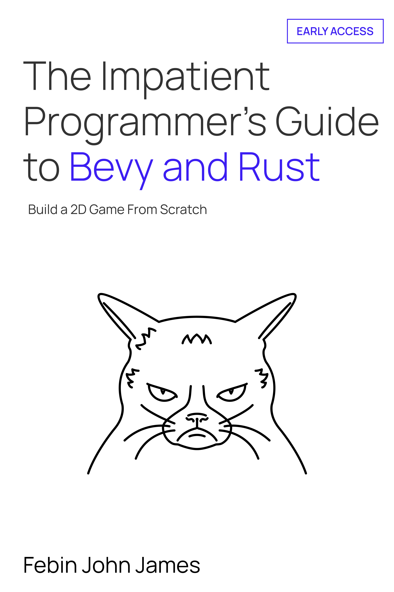

# 急不可耐程序员的 Bevy 与 Rust 指南：从零开始构建 2D 游戏

> 原文：[The Impatient Programmer's Guide to Bevy and Rust](https://aibodh.com/books/the-impatient-programmers-guide-to-bevy-and-rust/)
> 作者：Febin John James

学习使用 Bevy 和 Rust 进行游戏开发。从设置玩家角色并看着它在屏幕上移动开始。构建一个程序化生成的世界。加入碰撞检测、背包系统和通过自定义着色器渲染的法术。为敌人添加寻路功能，实现生命值和伤害系统，加入音效，保存游戏状态，以及实现多人联网功能。无需 Rust 前置知识。

## 章节（中文翻译版）

| 章节 | 标题 | 说明 |
|------|------|------|
| [第 1 章](chapter-01.md) | 让玩家诞生 | 设置游戏世界、创建玩家角色、实现移动和动画 |
| [第 2 章](chapter-02.md) | 让世界诞生 | 使用波函数坍缩算法学习程序化世界生成 |
| [第 3 章](chapter-03.md) | 让数据流动 | 构建数据驱动的角色系统，RON 配置文件，通用动画引擎 |
| [第 4 章](chapter-04.md) | 让碰撞发生 | 游戏状态管理、CharacterState 模式、物理与碰撞系统 |
| [第 5 章](chapter-05.md) | 让拾取发生 | 构建背包系统，缩放视角并实现平滑摄像机跟随 |
| [第 6 章](chapter-06.md) | 让粒子飞舞 | 粒子系统、WGSL 自定义着色器、法术系统 |
| [第 7 章](chapter-07.md) | 让敌人出现 | A\* 寻路、AI 系统、敌人战斗 |
| [第 8 章](chapter-08.md) | 要有伤害 | 生命值与伤害系统、战斗事件、血条 UI |
| [第 9 章](chapter-09.md) | 让世界扩展 | 多区块拼接地图、异步生成、突破 WFC 大小限制 |
| [第 10 章](chapter-10.md) | 要有存档 | 游戏存档/读档系统、bincode 序列化、存档槽 UI |
| [第 11 章](chapter-11.md) | 要有声音 | 背景音乐与音效、Bevy 音频系统、状态驱动音乐切换 |
| [第 12 章](chapter-12.md) | 让联网实现 | 使用 SpacetimeDB 构建多人联网 |

> **注**：第 8-11 章基于公开的 [GitHub 源码](https://github.com/jamesfebin/ImpatientProgrammerBevyRust)重构编写，非原书付费章节的逐字翻译。第 1-7 章和第 12 章为原文翻译。
>
> 本书中文版为社区翻译，仅供学习参考。

## 关于本书

"我做软件工程师已经超过 30 年了，如果这始终是你的水准，你应该靠写书和文档获得丰厚报酬。这本书与（暴露年龄了）经典的 Dr. C Wacko 系列和 David H Ahl 比肩。主题布局合理，嵌套标题使用得当，对话式行文引人入胜，代码图表和截图的搭配恰到好处。"

—— Reddit 用户，第 2 章，r/learnrust

"基本上，无论你了解多少，你都能学到东西——除非你已经精通 Rust、游戏开发、ECS 和 Bevy 这四个领域。不是完美的东西，但是……天哪，考虑到我所看到的内容，它真的非常棒。"

—— Reddit 用户，第 6 章，r/learnrust

---

© 2026 AIBodh. 版权所有。中文翻译仅供学习参考。
